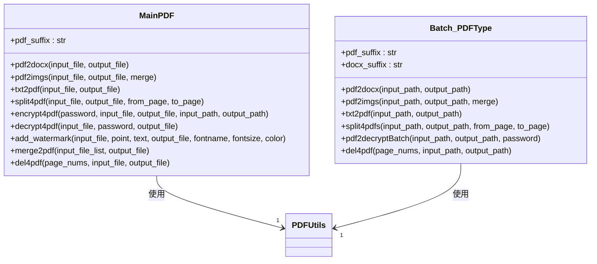
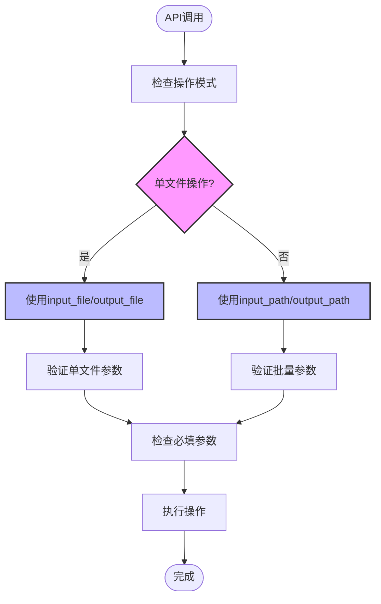
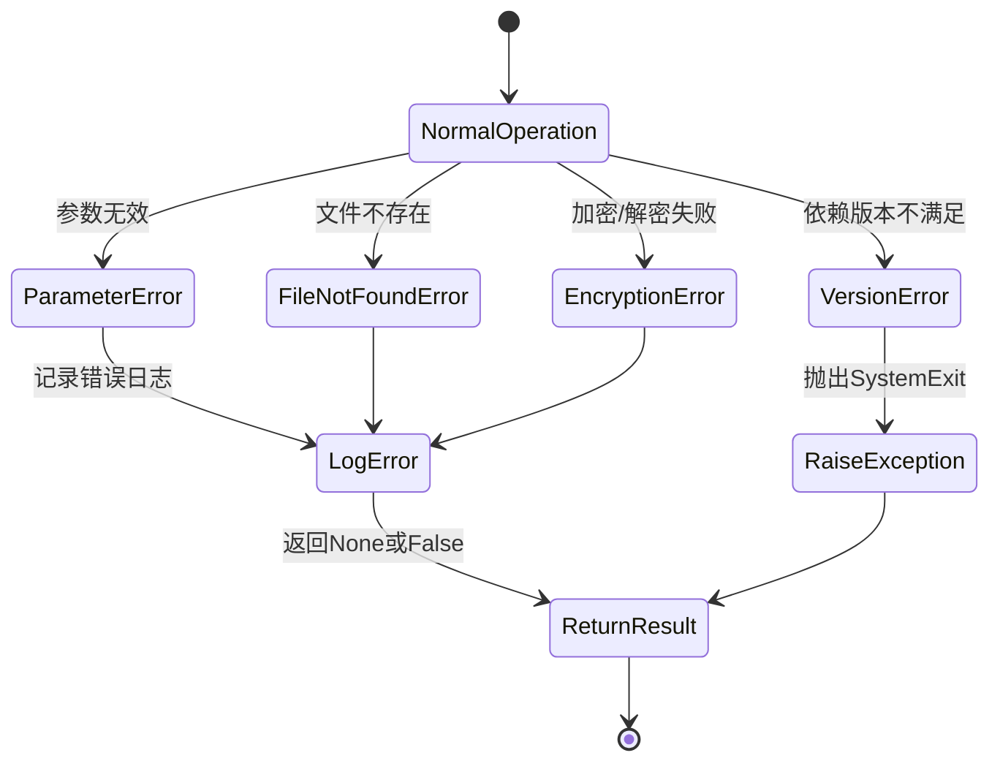

# API参考

<cite>
**本文档中引用的文件**   
- [MainPDF](file://popdf/core/PDFType.py)
- [Batch_PDFType](file://popdf/core/Batch_PDFType.py)
- [pdf.py](file://popdf/api/pdf.py)
- [pdf2docx_utils.py](file://popdf/lib/pdf2docx_utils.py)
- [pdf2imgs_utils.py](file://popdf/lib/pdf2imgs_utils.py)
- [split4pdf_utils.py](file://popdf/lib/split4pdf_utils.py)
- [encrypt4pdf_utils.py](file://popdf/lib/encrypt4pdf_utils.py)
- [del4pdf_utils.py](file://popdf/lib/del4pdf_utils.py)
- [add_watermark_service.py](file://popdf/lib/pdf/add_watermark_service.py)
</cite>

## 目录
1. [简介](#简介)
2. [核心类概述](#核心类概述)
3. [MainPDF类API](#mainpdf类api)
4. [Batch_PDFType类API](#batch_pdftype类api)
5. [高级功能与参数关系](#高级功能与参数关系)
6. [异常处理](#异常处理)

## 简介
popdf库提供了一套完整的PDF处理功能，支持PDF与Word文档的转换、PDF与图片的相互转换、文本转PDF、PDF分割、加密解密、添加水印、合并和删除页面等操作。本API参考文档详细说明了所有公共接口的使用方法。

## 核心类概述
popdf库主要包含两个核心类：`MainPDF`用于处理单个文件操作，`Batch_PDFType`用于批量处理多个文件。这些类的方法通过`popdf.api.pdf`模块暴露为顶层函数，便于直接调用。



**图示来源**
- [MainPDF](file://popdf/core/PDFType.py#L19-L179)
- [Batch_PDFType](file://popdf/core/Batch_PDFType.py#L16-L142)

## MainPDF类API

### pdf2docx
将单个PDF文件转换为Word文档。

**函数签名**
```python
def pdf2docx(input_file, output_file)
```

**参数说明**
- `input_file`: 输入PDF文件的路径，字符串类型，必填
- `output_file`: 输出Word文件的路径，需包含.docx后缀，字符串类型，必填

**返回值**
无返回值

**异常情况**
- 如果输入文件不存在，会记录错误日志
- 如果输入文件不是PDF格式，会记录错误日志
- 如果输出文件路径无效，会记录错误日志

**调用示例**
```python
popdf.pdf2docx(
    input_file=r'path/to/input.pdf',
    output_file=r'path/to/output.docx'
)
```

**节来源**
- [MainPDF.pdf2docx](file://popdf/core/PDFType.py#L23-L27)
- [pdf2docx_utils.py](file://popdf/lib/pdf2docx_utils.py#L7-L23)

### pdf2imgs
将PDF文件转换为图片。

**函数签名**
```python
def pdf2imgs(input_file: str = None, output_file: str = None, merge: bool = False) -> None
```

**参数说明**
- `input_file`: 输入PDF文件的路径，字符串类型，可选
- `output_file`: 输出图片的路径，字符串类型，可选
- `merge`: 是否将所有页面合并为一张图片，布尔类型，默认为False

**返回值**
无返回值

**异常情况**
- 如果输入文件不存在，会记录错误信息
- 如果输出路径无效，会自动创建目录

**调用示例**
```python
# 转换为多张图片
popdf.pdf2imgs(
    input_file=r'path/to/input.pdf',
    output_file=r'path/to/output/'
)

# 合并为单张图片
popdf.pdf2imgs(
    input_file=r'path/to/input.pdf',
    output_file=r'path/to/output.jpg',
    merge=True
)
```

**节来源**
- [MainPDF.pdf2imgs](file://popdf/core/PDFType.py#L28-L34)
- [pdf2imgs_utils.py](file://popdf/lib/pdf2imgs_utils.py#L10-L62)

### txt2pdf
将文本文件转换为PDF文件。

**函数签名**
```python
def txt2pdf(input_file, output_file='file2pdf.pdf')
```

**参数说明**
- `input_file`: 输入文本文件的路径，字符串类型，必填
- `output_file`: 输出PDF文件的路径，字符串类型，默认值为'file2pdf.pdf'

**返回值**
无返回值

**异常情况**
- 需要PyMuPDF v1.14.0或更高版本，否则会抛出SystemExit异常
- 如果输入文件路径无效，会记录错误日志

**调用示例**
```python
popdf.txt2pdf(
    input_file=r'path/to/input.txt',
    output_file=r'path/to/output.pdf'
)
```

**节来源**
- [MainPDF.txt2pdf](file://popdf/core/PDFType.py#L36-L79)
- [pdf2imgs_utils.py](file://popdf/lib/pdf2imgs_utils.py#L10-L62)

### split4pdf
截取PDF文件的指定页面范围。

**函数签名**
```python
def split4pdf(input_file, output_file, from_page, to_page)
```

**参数说明**
- `input_file`: 输入PDF文件的路径，字符串类型，必填
- `output_file`: 输出分割后PDF文件的路径，字符串类型，必填
- `from_page`: 起始页码，整数类型，从1开始计数，必填
- `to_page`: 结束页码，整数类型，从1开始计数，可选，默认为None（表示到最后一页）

**返回值**
成功返回True，失败返回False

**异常情况**
- 如果起始页码小于1，会记录错误日志
- 如果结束页码大于PDF总页数，会记录错误日志
- 如果输入文件路径无效，会记录错误日志

**调用示例**
```python
# 截取第1到第3页
popdf.split4pdf(
    input_file=r'path/to/input.pdf',
    output_file=r'path/to/output.pdf',
    from_page=1,
    to_page=3
)

# 截取第1页（单页）
popdf.split4pdf(
    input_file=r'path/to/input.pdf',
    output_file=r'path/to/output.pdf',
    from_page=1
)
```

**节来源**
- [MainPDF.split4pdf](file://popdf/core/PDFType.py#L81-L97)
- [split4pdf_utils.py](file://popdf/lib/split4pdf_utils.py#L8-L38)

### encrypt4pdf
加密PDF文件。

**函数签名**
```python
def encrypt4pdf(password, suffix='.pdf', input_file=None, output_file=None, input_path=None, output_path=None)
```

**参数说明**
- `password`: 加密密码，字符串类型，必填
- `input_file`: 单个输入PDF文件的路径，字符串类型，可选
- `output_file`: 单个输出加密PDF文件的路径，字符串类型，可选
- `input_path`: 批量输入PDF文件的目录路径，字符串类型，可选
- `output_path`: 批量输出加密PDF文件的目录路径，字符串类型，可选

**返回值**
无返回值

**异常情况**
- 必须提供input_file或input_path，否则会记录错误日志
- 如果输出文件路径未指定，会记录错误日志

**调用示例**
```python
# 加密单个文件
popdf.encrypt4pdf(
    input_file=r'path/to/input.pdf',
    output_file=r'path/to/encrypted.pdf',
    password='123456'
)

# 批量加密文件
popdf.encrypt4pdf(
    input_path=r'path/to/input/directory',
    output_path=r'path/to/output/directory',
    password='123456'
)
```

**节来源**
- [MainPDF.encrypt4pdf](file://popdf/core/PDFType.py#L99-L108)
- [encrypt4pdf_utils.py](file://popdf/lib/encrypt4pdf_utils.py#L54-L83)

### decrypt4pdf
解密PDF文件。

**函数签名**
```python
def decrypt4pdf(input_file, password, output_file='decrypt.pdf')
```

**参数说明**
- `input_file`: 输入加密PDF文件的路径，字符串类型，必填
- `password`: 解密密码，字符串类型，必填
- `output_file`: 输出解密后PDF文件的路径，字符串类型，默认值为'decrypt.pdf'

**返回值**
无返回值

**异常情况**
- 如果输入文件无法用提供的密码解密，会记录错误信息
- 如果输入文件不是加密PDF，可能会抛出异常

**调用示例**
```python
popdf.decrypt4pdf(
    input_file=r'path/to/encrypted.pdf',
    password='123456',
    output_file=r'path/to/decrypted.pdf'
)
```

**节来源**
- [MainPDF.decrypt4pdf](file://popdf/core/PDFType.py#L110-L125)

### add_watermark
在PDF文档中添加文本水印。

**函数签名**
```python
def add_watermark(input_file, point, text='程序员晚枫', output_file='./pdf_watermark.pdf', fontname="Helvetica", fontsize=12, color=(1, 0, 0))
```

**参数说明**
- `input_file`: 输入PDF文件的路径，字符串类型，必填
- `point`: 水印文本的位置坐标(x, y)，元组类型，必填
- `text`: 水印文本内容，字符串类型，默认值为'程序员晚枫'
- `output_file`: 输出添加水印后PDF文件的路径，字符串类型，默认值为'./pdf_watermark.pdf'
- `fontname`: 字体名称，字符串类型，默认值为"Helvetica"
- `fontsize`: 字体大小，整数类型，默认值为12
- `color`: 字体颜色(R,G,B)格式，元组类型，默认值为(1, 0, 0)（红色）

**返回值**
无返回值

**异常情况**
- 如果输入文件路径无效，会记录错误日志
- 如果输出路径无法创建，会记录错误日志

**调用示例**
```python
popdf.add_text_watermark(
    input_file=r'path/to/input.pdf',
    point=(100, 100),
    text='机密文件',
    output_file=r'path/to/output.pdf',
    fontname="Times-Roman",
    fontsize=24,
    color=(0.5, 0.5, 0.5)
)
```

**节来源**
- [MainPDF.add_watermark](file://popdf/core/PDFType.py#L162-L174)

### merge2pdf
合并多个PDF文件为一个文件。

**函数签名**
```python
def merge2pdf(input_file_list, output_file)
```

**参数说明**
- `input_file_list`: 输入PDF文件路径的列表，列表类型，必填
- `output_file`: 输出合并后PDF文件的路径，字符串类型，必填

**返回值**
无返回值

**异常情况**
- 如果输入文件列表为空，不会执行任何操作
- 如果某个输入文件不存在，会跳过该文件

**调用示例**
```python
popdf.merge2pdf(
    input_file_list=[
        r'path/to/file1.pdf',
        r'path/to/file2.pdf',
        r'path/to/file3.pdf'
    ],
    output_file=r'path/to/merged.pdf'
)
```

**节来源**
- [MainPDF.merge2pdf](file://popdf/core/PDFType.py#L130-L147)

### del4pdf
删除PDF文件中的指定页面。

**函数签名**
```python
def del4pdf(page_nums: list[int], input_file: str = None, output_file: str = None)
```

**参数说明**
- `page_nums`: 需要删除的页面编号列表，基于1索引，整数列表类型，必填
- `input_file`: 输入PDF文件的路径，字符串类型，必填
- `output_file`: 输出（修改后）PDF文件的路径，字符串类型，必填

**返回值**
无返回值

**异常情况**
- 如果页面编号超出范围，会跳过该编号
- 如果输入文件路径无效，会记录错误日志

**调用示例**
```python
# 删除第1页和第3页
popdf.del4pdf(
    page_nums=[1, 3],
    input_file=r'path/to/input.pdf',
    output_file=r'path/to/output.pdf'
)
```

**节来源**
- [MainPDF.del4pdf](file://popdf/core/PDFType.py#L149-L161)
- [del4pdf_utils.py](file://popdf/lib/del4pdf_utils.py#L7-L20)

## Batch_PDFType类API

### pdf2docx
批量将PDF文件转换为Word文档。

**函数签名**
```python
def pdf2docx(input_path=None, output_path=None)
```

**参数说明**
- `input_path`: 输入PDF文件的目录路径，字符串类型，必填
- `output_path`: 输出Word文件的目录路径，字符串类型，必填

**返回值**
无返回值

**异常情况**
- 如果输入或输出路径无效，会记录错误日志
- 如果目录中没有PDF文件，会记录错误日志

**调用示例**
```python
popdf.pdf2docx(
    input_path=r'path/to/input/directory',
    output_path=r'path/to/output/directory'
)
```

**节来源**
- [Batch_PDFType.pdf2docx](file://popdf/core/Batch_PDFType.py#L21-L31)

### split4pdfs
批量截取PDF文件的指定页面范围。

**函数签名**
```python
def split4pdfs(input_path, output_path, from_page, to_page)
```

**参数说明**
- `input_path`: 输入PDF文件的目录路径，字符串类型，必填
- `output_path`: 输出分割后PDF文件的目录路径，字符串类型，必填
- `from_page`: 起始页码，整数类型，从1开始计数，必填
- `to_page`: 结束页码，整数类型，从1开始计数，可选，默认为None（表示到最后一页）

**返回值**
成功返回True，失败返回False

**异常情况**
- 如果输入或输出路径无效，会记录错误日志
- 如果目录中没有PDF文件，会记录错误日志
- 如果处理过程中发生异常，会记录错误日志并返回False

**调用示例**
```python
popdf.split4pdf(
    input_path=r'path/to/input/directory',
    output_path=r'path/to/output/directory',
    from_page=1,
    to_page=3
)
```

**节来源**
- [Batch_PDFType.split4pdfs](file://popdf/core/Batch_PDFType.py#L32-L52)

### pdf2decryptBatch
批量解密PDF文件。

**函数签名**
```python
def pdf2decryptBatch(input_path=None, output_path=None, password=None)
```

**参数说明**
- `input_path`: 输入加密PDF文件的目录路径，字符串类型，必填
- `output_path`: 输出解密后PDF文件的目录路径，字符串类型，必填
- `password`: 解密密码，字符串类型，必填

**返回值**
无返回值

**异常情况**
- 如果输入、输出路径或密码未提供，会记录错误日志
- 如果文件不是PDF格式，会跳过该文件

**调用示例**
```python
popdf.decrypt4pdf(
    input_path=r'path/to/encrypted/directory',
    output_path=r'path/to/decrypted/directory',
    password='123456'
)
```

**节来源**
- [Batch_PDFType.pdf2decryptBatch](file://popdf/core/Batch_PDFType.py#L56-L67)

### pdf2imgs
批量将PDF文件转换为图片。

**函数签名**
```python
def pdf2imgs(input_path: str, output_path=None, merge: bool = False) -> None
```

**参数说明**
- `input_path`: 输入PDF文件的目录路径，字符串类型，必填
- `output_path`: 输出图片的目录路径，字符串类型，可选
- `merge`: 是否将每个PDF的所有页面合并为一张图片，布尔类型，默认为False

**返回值**
无返回值

**异常情况**
- 如果输入路径无效，会记录错误日志
- 如果输出路径未指定，会使用默认路径

**调用示例**
```python
# 批量转换为多张图片
popdf.pdf2imgs(
    input_path=r'path/to/input/directory',
    output_path=r'path/to/output/directory'
)

# 批量合并为单张图片
popdf.pdf2imgs(
    input_path=r'path/to/input/directory',
    output_path=r'path/to/output/directory',
    merge=True
)
```

**节来源**
- [Batch_PDFType.pdf2imgs](file://popdf/core/Batch_PDFType.py#L68-L79)

### txt2pdf
批量将文本文件转换为PDF文件。

**函数签名**
```python
def txt2pdf(input_path=None, output_path=None)
```

**参数说明**
- `input_path`: 输入文本文件的目录路径，字符串类型，必填
- `output_path`: 输出PDF文件的目录路径，字符串类型，必填

**返回值**
无返回值

**异常情况**
- 需要PyMuPDF v1.14.0或更高版本，否则会抛出SystemExit异常
- 如果输入或输出路径无效，会记录错误日志

**调用示例**
```python
popdf.txt2pdf(
    input_path=r'path/to/input/directory',
    output_path=r'path/to/output/directory'
)
```

**节来源**
- [Batch_PDFType.txt2pdf](file://popdf/core/Batch_PDFType.py#L80-L125)

### del4pdf
批量删除PDF文件中的指定页面。

**函数签名**
```python
def del4pdf(page_nums, input_path=None, output_path=None)
```

**参数说明**
- `page_nums`: 需要删除的页面编号列表，基于1索引，整数列表类型，必填
- `input_path`: 输入PDF文件的目录路径，字符串类型，必填
- `output_path`: 输出（修改后）PDF文件的目录路径，字符串类型，必填

**返回值**
无返回值

**异常情况**
- 如果输入或输出路径无效，会记录错误日志
- 如果目录中没有PDF文件，会跳过处理

**调用示例**
```python
popdf.del4pdf(
    page_nums=[1, 3],
    input_path=r'path/to/input/directory',
    output_path=r'path/to/output/directory'
)
```

**节来源**
- [Batch_PDFType.del4pdf](file://popdf/core/Batch_PDFType.py#L128-L142)

## 高级功能与参数关系

### 参数互斥与约束
popdf库的API设计遵循清晰的参数约束规则，确保用户不会误用参数：



**图示来源**
- [pdf.py](file://popdf/api/pdf.py#L17-L235)

### 参数关系说明
1. **单文件与批量模式互斥**：大多数API支持两种模式，但不能同时使用。例如，`pdf2docx`函数中，如果同时提供了`input_file`和`input_path`，优先使用单文件模式。
2. **必填参数依赖**：在单文件模式下，`input_file`和`output_file`通常都是必填的；在批量模式下，`input_path`和`output_path`都是必填的。
3. **默认值策略**：一些参数有合理的默认值，如`add_watermark`中的`text`默认为"程序员晚枫"，`output_file`默认为"./pdf_watermark.pdf"。
4. **布尔参数控制**：`merge`参数在`pdf2imgs`中控制输出模式，当为True时将PDF所有页面合并为一张图片，为False时生成多张图片。

## 异常处理
popdf库采用统一的异常处理策略，主要使用loguru库记录错误信息，而不是抛出异常中断程序执行。



**图示来源**
- [MainPDF](file://popdf/core/PDFType.py)
- [Batch_PDFType](file://popdf/core/Batch_PDFType.py)

### 异常类型
1. **参数错误**：当必要参数缺失或参数值无效时，会记录错误日志并返回None或False。
2. **文件错误**：当输入文件不存在或路径无效时，会记录错误日志。
3. **版本依赖错误**：当依赖库版本不满足要求时（如PyMuPDF版本），会抛出SystemExit异常。
4. **加密解密错误**：当密码错误或文件格式不支持时，会记录相应错误信息。

所有错误信息都通过loguru库记录，用户可以在控制台或日志文件中查看详细的错误信息。

**节来源**
- [MainPDF](file://popdf/core/PDFType.py)
- [Batch_PDFType](file://popdf/core/Batch_PDFType.py)
- [pdf.py](file://popdf/api/pdf.py)