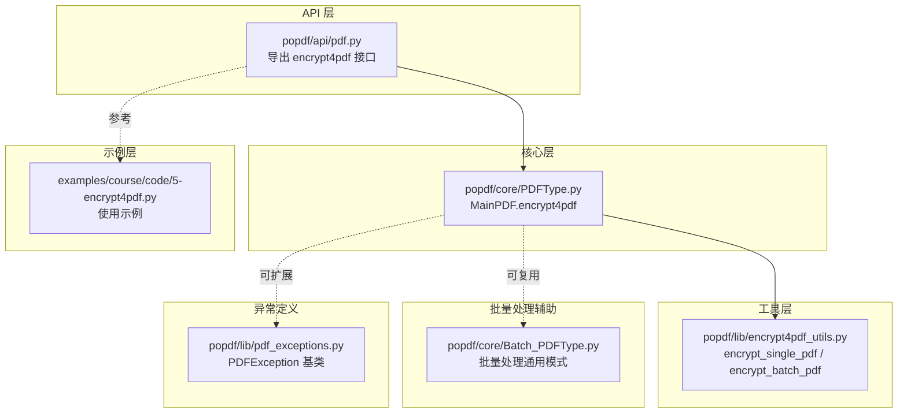
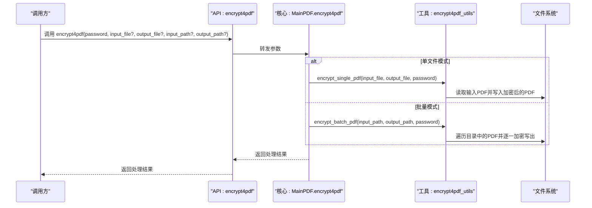
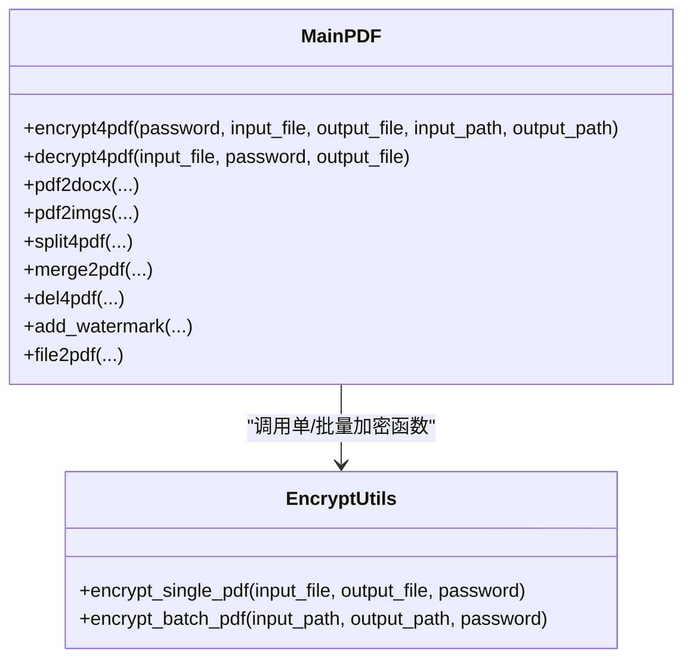
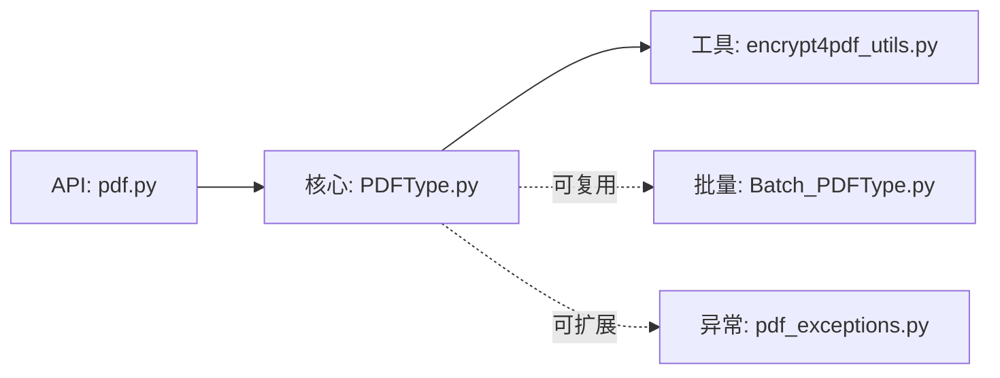

# PDF加密

<cite>
**本文引用的文件**
- [popdf/lib/encrypt4pdf_utils.py](file://popdf/lib/encrypt4pdf_utils.py)
- [popdf/api/pdf.py](file://popdf/api/pdf.py)
- [popdf/core/PDFType.py](file://popdf/core/PDFType.py)
- [examples/course/code/5-encrypt4pdf.py](file://examples/course/code/5-encrypt4pdf.py)
- [popdf/lib/pdf_exceptions.py](file://popdf/lib/pdf_exceptions.py)
- [popdf/core/Batch_PDFType.py](file://popdf/core/Batch_PDFType.py)
- [README.md](file://README.md)
</cite>

## 目录
1. [简介](#简介)
2. [项目结构](#项目结构)
3. [核心组件](#核心组件)
4. [架构总览](#架构总览)
5. [组件详解](#组件详解)
6. [依赖关系分析](#依赖关系分析)
7. [性能与优化](#性能与优化)
8. [故障排查指南](#故障排查指南)
9. [结论](#结论)
10. [附录](#附录)

## 简介
本文件围绕 popdf 的 PDF 加密能力展开，聚焦于 encrypt4pdf API 的使用方式与实现机制。文档详细说明：
- MainPDF 类中的 encrypt4pdf 方法如何支持“单文件”和“批量”两种处理模式；
- password 参数的安全要求与最佳实践；
- 单文件处理时 input_file/output_file 的工作流；
- 批量处理时 input_path/output_path 的工作流；
- 错误处理策略（无效路径、空密码、输出目录不可写等）；
- 性能优化建议与常见问题排查。

## 项目结构
与加密功能直接相关的模块分布如下：
- API 层：对外暴露 encrypt4pdf 接口，负责参数分发与日志记录
- 核心层：MainPDF 提供 encrypt4pdf 的具体实现逻辑
- 工具层：encrypt4pdf_utils 提供单文件与批量加密的具体实现
- 示例层：examples 中提供使用示例
- 批量处理辅助：Batch_PDFType 提供批量转换/处理的通用模式
- 异常定义：pdf_exceptions 提供统一异常基类

图表来源
- [popdf/api/pdf.py](file://popdf/api/pdf.py#L117-L124)
- [popdf/core/PDFType.py](file://popdf/core/PDFType.py#L99-L108)
- [popdf/lib/encrypt4pdf_utils.py](file://popdf/lib/encrypt4pdf_utils.py#L16-L83)
- [examples/course/code/5-encrypt4pdf.py](file://examples/course/code/5-encrypt4pdf.py#L1-L28)
- [popdf/core/Batch_PDFType.py](file://popdf/core/Batch_PDFType.py#L1-L142)
- [popdf/lib/pdf_exceptions.py](file://popdf/lib/pdf_exceptions.py#L1-L25)

章节来源
- [README.md](file://README.md#L56-L72)

## 核心组件
- API 层接口：通过 popdf.api.pdf.encrypt4pdf 将调用转发给 MainPDF.encrypt4pdf
- 核心实现：MainPDF.encrypt4pdf 根据是否传入 input_file 或 input_path 决定调用单文件或批量加密函数
- 工具函数：
  - encrypt_single_pdf(input_file, output_file, password)：单文件加密
  - encrypt_batch_pdf(input_path, output_path, password)：批量加密
- 示例：examples/course/code/5-encrypt4pdf.py 展示了单文件调用方式

章节来源
- [popdf/api/pdf.py](file://popdf/api/pdf.py#L117-L124)
- [popdf/core/PDFType.py](file://popdf/core/PDFType.py#L99-L108)
- [popdf/lib/encrypt4pdf_utils.py](file://popdf/lib/encrypt4pdf_utils.py#L16-L83)
- [examples/course/code/5-encrypt4pdf.py](file://examples/course/code/5-encrypt4pdf.py#L1-L28)

## 架构总览
下图展示了从 API 到核心再到工具函数的调用链路，以及两种处理模式的分流逻辑。

图表来源
- [popdf/api/pdf.py](file://popdf/api/pdf.py#L117-L124)
- [popdf/core/PDFType.py](file://popdf/core/PDFType.py#L99-L108)
- [popdf/lib/encrypt4pdf_utils.py](file://popdf/lib/encrypt4pdf_utils.py#L16-L83)

## 组件详解

### API 层：encrypt4pdf 接口
- 作用：对外提供统一入口，接收多种参数组合，内部将调用 MainPDF.encrypt4pdf
- 参数要点：
  - password：必填，作为加密密码
  - input_file/output_file：单文件模式使用
  - input_path/output_path：批量模式使用
- 行为：仅做参数转发与日志提示；实际逻辑由核心层实现

章节来源
- [popdf/api/pdf.py](file://popdf/api/pdf.py#L117-L124)

### 核心层：MainPDF.encrypt4pdf
- 作用：根据传参决定调用路径
- 分支逻辑：
  - 若传入 input_file：调用 encrypt_single_pdf
  - 若传入 input_path：调用 encrypt_batch_pdf
  - 否则：记录错误日志
- 与批量处理的协同：MainPDF 未内置批量实现，但其设计可复用 Batch_PDFType 的批量模式（如需扩展）

章节来源
- [popdf/core/PDFType.py](file://popdf/core/PDFType.py#L99-L108)

### 工具层：encrypt4pdf_utils
- encrypt_single_pdf(input_file, output_file, password)
  - 读取输入 PDF，逐页复制到 writer，设置密码后写入 output_file
  - 若未提供 output_file，记录错误日志
- encrypt_batch_pdf(input_path, output_path, password)
  - 获取目录下所有 .pdf 文件，确保输出目录存在，逐个加密并写入同名文件到输出目录
  - 若未找到 PDF 文件，记录错误日志；若未提供 output_path，默认使用 input_path

章节来源
- [popdf/lib/encrypt4pdf_utils.py](file://popdf/lib/encrypt4pdf_utils.py#L16-L83)

### 示例：单文件加密
- 示例文件展示了如何以单文件模式调用 encrypt4pdf，传入 input_file、password、output_file
- 适合快速验证与演示

章节来源
- [examples/course/code/5-encrypt4pdf.py](file://examples/course/code/5-encrypt4pdf.py#L1-L28)

### 批量处理模式（扩展思路）
- 当前 encrypt4pdf 仅在核心层对 input_file/input_path 进行分支判断
- 若需批量处理，可在业务侧参考 Batch_PDFType 的批量模式，或直接调用 encrypt_batch_pdf 实现
- Batch_PDFType 提供了批量遍历、目录创建、进度提示等通用能力，便于扩展

章节来源
- [popdf/core/Batch_PDFType.py](file://popdf/core/Batch_PDFType.py#L1-L142)

### 类关系图（代码级）

图表来源
- [popdf/core/PDFType.py](file://popdf/core/PDFType.py#L99-L108)
- [popdf/lib/encrypt4pdf_utils.py](file://popdf/lib/encrypt4pdf_utils.py#L16-L83)

## 依赖关系分析
- API 层依赖核心层 MainPDF
- 核心层依赖工具层 encrypt4pdf_utils
- 工具层依赖第三方库（PyPDF2、loguru、pofile 等）
- 批量处理可复用 Batch_PDFType 的批量模式
- 异常定义位于 pdf_exceptions，便于统一异常处理

图表来源
- [popdf/api/pdf.py](file://popdf/api/pdf.py#L117-L124)
- [popdf/core/PDFType.py](file://popdf/core/PDFType.py#L99-L108)
- [popdf/lib/encrypt4pdf_utils.py](file://popdf/lib/encrypt4pdf_utils.py#L16-L83)
- [popdf/core/Batch_PDFType.py](file://popdf/core/Batch_PDFType.py#L1-L142)
- [popdf/lib/pdf_exceptions.py](file://popdf/lib/pdf_exceptions.py#L1-L25)

## 性能与优化
- 单文件加密
  - 采用逐页复制的方式，内存占用与 PDF 页数线性相关
  - 建议：对超大文件加密时，确保磁盘空间充足，避免频繁 IO
- 批量加密
  - 建议：在业务侧增加进度提示与并发控制（如多进程/多线程），减少串行等待
  - 输出目录提前创建，避免运行时反复创建目录导致的性能抖动
- 日志与异常
  - 使用 loguru 记录关键事件，便于定位性能瓶颈
  - 对异常进行捕获与分类，避免因单个文件异常影响整体流程

[本节为通用性能建议，无需特定文件来源]

## 故障排查指南
- 无效文件路径
  - 现象：找不到 PDF 文件或无法读取输入文件
  - 处理：确认 input_file/input_path 是否存在且可读；检查权限
  - 参考：工具层在未找到 PDF 时会记录错误日志
- 空密码输入
  - 现象：加密失败或生成的 PDF 无法打开
  - 处理：确保 password 非空；遵循强密码策略（见“安全要求与最佳实践”）
- 输出目录不可写
  - 现象：写入失败或抛出异常
  - 处理：确保 output_file/output_path 存在且具备写权限；必要时提前创建目录
- 批量处理无文件
  - 现象：未找到 .pdf 文件
  - 处理：确认 input_path 下确实包含 .pdf 文件；检查文件后缀与过滤条件
- 异常统一处理
  - 建议：在业务层捕获异常并记录详细上下文，结合 pdf_exceptions 基类进行分类处理

章节来源
- [popdf/lib/encrypt4pdf_utils.py](file://popdf/lib/encrypt4pdf_utils.py#L16-L83)
- [popdf/lib/pdf_exceptions.py](file://popdf/lib/pdf_exceptions.py#L1-L25)

## 结论
- encrypt4pdf API 提供了简洁一致的调用入口，内部通过 MainPDF.encrypt4pdf 将请求分发至单文件或批量加密实现
- 单文件模式使用 input_file/output_file，批量模式使用 input_path/output_path
- 工具层封装了具体的加密逻辑，具备良好的可维护性与扩展性
- 建议在生产环境中配合日志与异常处理，关注路径合法性与权限问题，并根据文件规模选择合适的批量处理策略

[本节为总结性内容，无需特定文件来源]

## 附录

### 使用示例（路径指引）
- 单文件加密示例
  - 参考路径：[examples/course/code/5-encrypt4pdf.py](file://examples/course/code/5-encrypt4pdf.py#L1-L28)
- 批量加密示例（扩展思路）
  - 可参考 Batch_PDFType 的批量处理模式，或直接调用 encrypt_batch_pdf
  - 参考路径：[popdf/core/Batch_PDFType.py](file://popdf/core/Batch_PDFType.py#L1-L142)

### 安全要求与最佳实践
- 密码强度
  - 建议使用至少 8 位字符，包含字母、数字与特殊字符的组合
  - 避免使用生日、姓名等易被猜测的信息
- 密钥管理
  - 不要在代码中硬编码密码；通过配置文件或环境变量注入
  - 对外传输或存储时，采用安全渠道与加密存储
- 权限控制
  - 仅授予最小必要权限；避免泄露密码
- 合规与审计
  - 记录加密操作的日志，便于审计与回溯

[本节为通用安全建议，无需特定文件来源]