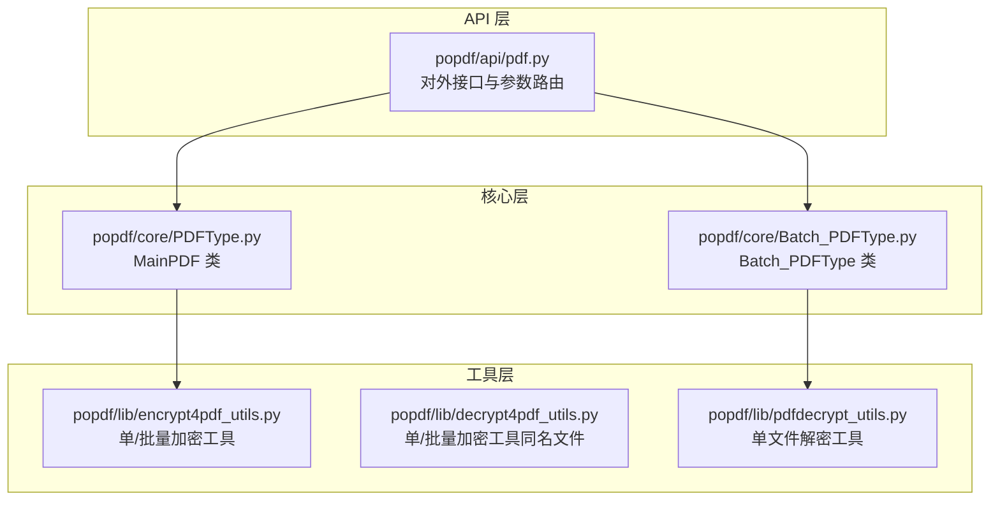
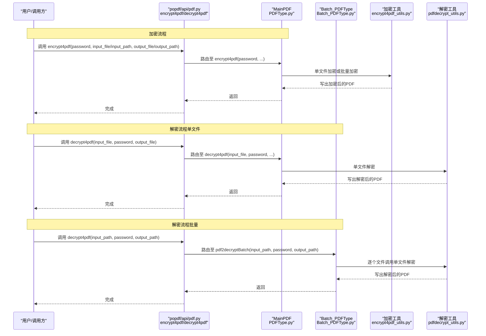
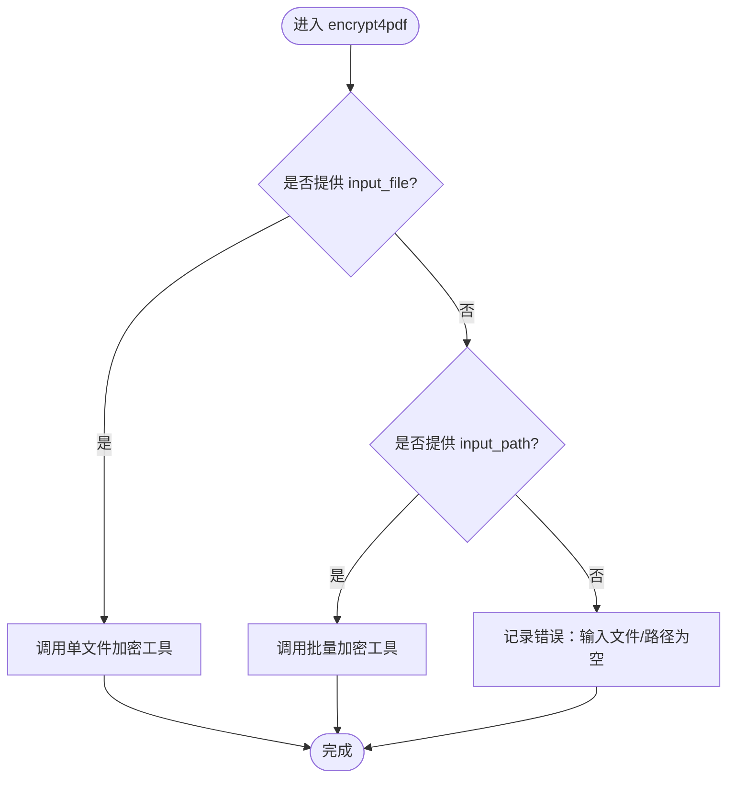
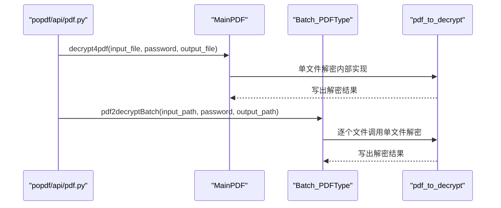
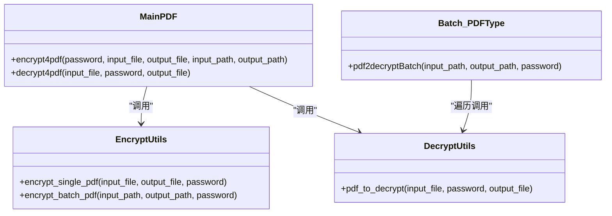
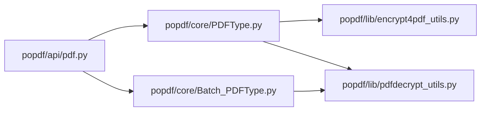

# PDF安全API

<cite>
**本文引用的文件**
- [README.md](file://README.md)
- [popdf/api/pdf.py](file://popdf/api/pdf.py)
- [popdf/core/PDFType.py](file://popdf/core/PDFType.py)
- [popdf/core/Batch_PDFType.py](file://popdf/core/Batch_PDFType.py)
- [popdf/lib/encrypt4pdf_utils.py](file://popdf/lib/encrypt4pdf_utils.py)
- [popdf/lib/decrypt4pdf_utils.py](file://popdf/lib/decrypt4pdf_utils.py)
- [popdf/lib/pdfdecrypt_utils.py](file://popdf/lib/pdfdecrypt_utils.py)
- [examples/course/code/5-encrypt4pdf.py](file://examples/course/code/5-encrypt4pdf.py)
- [examples/course/code/6-decrypt4pdf.py](file://examples/course/code/6-decrypt4pdf.py)
</cite>

## 目录
1. [简介](#简介)
2. [项目结构](#项目结构)
3. [核心组件](#核心组件)
4. [架构总览](#架构总览)
5. [详细组件分析](#详细组件分析)
6. [依赖关系分析](#依赖关系分析)
7. [性能与安全性考量](#性能与安全性考量)
8. [故障排查指南](#故障排查指南)
9. [结论](#结论)
10. [附录](#附录)

## 简介
本文件面向开发者与使用者，系统化梳理 popdf 的 PDF 安全能力，重点围绕两个核心接口：
- encrypt4pdf：对单个或批量 PDF 进行加密，支持设置密码。
- decrypt4pdf：对单个或批量 PDF 进行解密，要求提供正确的密码。

文档覆盖以下要点：
- MainPDF 类中 encrypt4pdf 的单文件与批量处理双模式及参数约束。
- decrypt4pdf 的密码参数必要性与错误密码处理策略。
- 批量解密依赖 Batch_PDFType 类的 pdf2decryptBatch 方法。
- 错误处理指南：输入路径无效、损坏加密文件等常见问题定位与修复建议。
- 提供清晰的调用示例路径，便于快速集成与验证。

## 项目结构
popdf 采用分层组织方式：
- api 层：对外暴露统一 API（如 encrypt4pdf、decrypt4pdf），负责参数校验与路由到具体实现。
- core 层：封装业务核心类（如 MainPDF、Batch_PDFType），协调底层工具模块。
- lib 层：提供具体功能的工具函数（如加密/解密工具、异常定义等）。

图表来源
- [popdf/api/pdf.py](file://popdf/api/pdf.py#L117-L152)
- [popdf/core/PDFType.py](file://popdf/core/PDFType.py#L99-L125)
- [popdf/core/Batch_PDFType.py](file://popdf/core/Batch_PDFType.py#L56-L67)
- [popdf/lib/encrypt4pdf_utils.py](file://popdf/lib/encrypt4pdf_utils.py#L16-L83)
- [popdf/lib/decrypt4pdf_utils.py](file://popdf/lib/decrypt4pdf_utils.py#L16-L83)
- [popdf/lib/pdfdecrypt_utils.py](file://popdf/lib/pdfdecrypt_utils.py#L7-L27)

章节来源
- [README.md](file://README.md#L56-L72)
- [popdf/api/pdf.py](file://popdf/api/pdf.py#L117-L152)

## 核心组件
- MainPDF.encrypt4pdf：根据是否传入单文件或批量路径，分别调用单文件加密或批量加密工具。
- MainPDF.decrypt4pdf：以密码驱动解密流程，逐页复制到新文档并写出。
- Batch_PDFType.pdf2decryptBatch：批量扫描目录，逐个调用单文件解密工具。
- 工具模块：
  - encrypt4pdf_utils.encrypt_single_pdf / encrypt_batch_pdf：单/批量加密实现。
  - pdfdecrypt_utils.pdf_to_decrypt：单文件解密实现。
  - decrypt4pdf_utils.encrypt_single_pdf / encrypt_batch_pdf：批量加密工具（命名与用途存在重复，建议后续修正）。

章节来源
- [popdf/core/PDFType.py](file://popdf/core/PDFType.py#L99-L125)
- [popdf/core/Batch_PDFType.py](file://popdf/core/Batch_PDFType.py#L56-L67)
- [popdf/lib/encrypt4pdf_utils.py](file://popdf/lib/encrypt4pdf_utils.py#L16-L83)
- [popdf/lib/pdfdecrypt_utils.py](file://popdf/lib/pdfdecrypt_utils.py#L7-L27)
- [popdf/lib/decrypt4pdf_utils.py](file://popdf/lib/decrypt4pdf_utils.py#L16-L83)

## 架构总览
下图展示了 encrypt4pdf 与 decrypt4pdf 的端到端调用链路与数据流。

图表来源
- [popdf/api/pdf.py](file://popdf/api/pdf.py#L117-L152)
- [popdf/core/PDFType.py](file://popdf/core/PDFType.py#L99-L125)
- [popdf/core/Batch_PDFType.py](file://popdf/core/Batch_PDFType.py#L56-L67)
- [popdf/lib/encrypt4pdf_utils.py](file://popdf/lib/encrypt4pdf_utils.py#L16-L83)
- [popdf/lib/pdfdecrypt_utils.py](file://popdf/lib/pdfdecrypt_utils.py#L7-L27)

## 详细组件分析

### encrypt4pdf 接口
- 功能概述
  - 支持单文件加密与批量加密两种模式。
  - 密码参数 password 为必填项；未提供时会记录错误日志。
- 参数与行为
  - 单文件：当 input_file 存在且 output_file 指定，调用单文件加密工具。
  - 批量：当 input_path 存在且 output_path 指定，调用批量加密工具。
  - 未满足上述任一条件时，记录“输入文件/路径为空”的错误。
- 实现要点
  - MainPDF.encrypt4pdf 作为入口，内部委托 encrypt4pdf_utils.encrypt_single_pdf 或 encrypt_batch_pdf。
  - 工具函数负责读取原 PDF、创建写入器、逐页复制并应用密码，最后写出新文件。

图表来源
- [popdf/core/PDFType.py](file://popdf/core/PDFType.py#L99-L108)
- [popdf/lib/encrypt4pdf_utils.py](file://popdf/lib/encrypt4pdf_utils.py#L16-L83)

章节来源
- [popdf/core/PDFType.py](file://popdf/core/PDFType.py#L99-L108)
- [popdf/lib/encrypt4pdf_utils.py](file://popdf/lib/encrypt4pdf_utils.py#L16-L83)

### decrypt4pdf 接口
- 功能概述
  - 支持单文件解密与批量解密两种模式。
  - password 参数为必需项；若密码错误或文件损坏，底层异常会被抛出或记录。
- 参数与行为
  - 单文件：当 input_file 与 output_file 存在时，调用 MainPDF.decrypt4pdf。
  - 批量：当 input_path 与 output_path 存在时，调用 Batch_PDFType.pdf2decryptBatch，后者内部逐个调用单文件解密工具。
- 实现要点
  - MainPDF.decrypt4pdf 使用密码初始化 PdfReader，逐页复制到 PdfWriter 并写出。
  - Batch_PDFType.pdf2decryptBatch 遍历目录，过滤 .pdf 文件并调用 pdfdecrypt_utils.pdf_to_decrypt。
  - pdfdecrypt_utils.pdf_to_decrypt 同样使用密码初始化 PdfReader，逐页复制并写出。

图表来源
- [popdf/api/pdf.py](file://popdf/api/pdf.py#L126-L152)
- [popdf/core/PDFType.py](file://popdf/core/PDFType.py#L110-L125)
- [popdf/core/Batch_PDFType.py](file://popdf/core/Batch_PDFType.py#L56-L67)
- [popdf/lib/pdfdecrypt_utils.py](file://popdf/lib/pdfdecrypt_utils.py#L7-L27)

章节来源
- [popdf/api/pdf.py](file://popdf/api/pdf.py#L126-L152)
- [popdf/core/PDFType.py](file://popdf/core/PDFType.py#L110-L125)
- [popdf/core/Batch_PDFType.py](file://popdf/core/Batch_PDFType.py#L56-L67)
- [popdf/lib/pdfdecrypt_utils.py](file://popdf/lib/pdfdecrypt_utils.py#L7-L27)

### 类关系与职责

图表来源
- [popdf/core/PDFType.py](file://popdf/core/PDFType.py#L99-L125)
- [popdf/core/Batch_PDFType.py](file://popdf/core/Batch_PDFType.py#L56-L67)
- [popdf/lib/encrypt4pdf_utils.py](file://popdf/lib/encrypt4pdf_utils.py#L16-L83)
- [popdf/lib/pdfdecrypt_utils.py](file://popdf/lib/pdfdecrypt_utils.py#L7-L27)

章节来源
- [popdf/core/PDFType.py](file://popdf/core/PDFType.py#L99-L125)
- [popdf/core/Batch_PDFType.py](file://popdf/core/Batch_PDFType.py#L56-L67)
- [popdf/lib/encrypt4pdf_utils.py](file://popdf/lib/encrypt4pdf_utils.py#L16-L83)
- [popdf/lib/pdfdecrypt_utils.py](file://popdf/lib/pdfdecrypt_utils.py#L7-L27)

## 依赖关系分析
- API 层依赖核心层与工具层，负责参数校验与路由。
- MainPDF 依赖工具层的加密/解密实现。
- Batch_PDFType 依赖工具层的单文件解密实现。
- 工具层依赖第三方库（如 PyPDF2）与通用工具（如 pofile、loguru）。

图表来源
- [popdf/api/pdf.py](file://popdf/api/pdf.py#L117-L152)
- [popdf/core/PDFType.py](file://popdf/core/PDFType.py#L99-L125)
- [popdf/core/Batch_PDFType.py](file://popdf/core/Batch_PDFType.py#L56-L67)
- [popdf/lib/encrypt4pdf_utils.py](file://popdf/lib/encrypt4pdf_utils.py#L16-L83)
- [popdf/lib/pdfdecrypt_utils.py](file://popdf/lib/pdfdecrypt_utils.py#L7-L27)

章节来源
- [popdf/api/pdf.py](file://popdf/api/pdf.py#L117-L152)
- [popdf/core/PDFType.py](file://popdf/core/PDFType.py#L99-L125)
- [popdf/core/Batch_PDFType.py](file://popdf/core/Batch_PDFType.py#L56-L67)
- [popdf/lib/encrypt4pdf_utils.py](file://popdf/lib/encrypt4pdf_utils.py#L16-L83)
- [popdf/lib/pdfdecrypt_utils.py](file://popdf/lib/pdfdecrypt_utils.py#L7-L27)

## 性能与安全性考量
- 性能
  - 批量处理时，逐文件读取与写入，I/O 成本较高；建议在磁盘空间充足时一次性生成目标目录，减少多次目录创建。
  - 逐页复制的复杂度与页数线性相关；大文件建议分批处理或在更高性能的存储介质上执行。
- 安全性
  - 密码参数 password 为强依赖，未提供或错误会导致失败；请确保密码传递与存储安全。
  - 批量解密时，建议对输入路径与文件类型进行严格校验，避免误处理非 PDF 文件。
  - 对于可能被损坏的加密文件，建议在调用前进行预检查（如尝试只读打开），并在捕获异常后给出明确提示。

[本节为通用指导，无需列出章节来源]

## 故障排查指南
- 常见错误与定位
  - 输入路径无效：当 input_file/input_path 为空时，会记录错误日志。请确认路径是否存在且可读。
  - 密码错误：解密阶段若密码不正确，底层会抛出异常或返回失败。请核对密码是否与加密时一致。
  - 批量处理未生效：检查 input_path 是否包含 .pdf 文件，output_path 是否可写。
  - 工具函数命名冲突：decrypt4pdf_utils 中的批量加密函数与用途不符，建议在后续版本中更正命名，避免混淆。
- 建议的处理流程
  - 单文件解密失败：先尝试用不同密码重试；若仍失败，确认原文件是否被损坏或已被二次加密。
  - 批量解密失败：逐个检查失败文件，排除损坏或权限问题；确认 output_path 权限与磁盘空间。
  - 日志与异常：关注 API 层与工具层的日志输出，结合异常堆栈定位具体环节。

章节来源
- [popdf/api/pdf.py](file://popdf/api/pdf.py#L117-L152)
- [popdf/core/PDFType.py](file://popdf/core/PDFType.py#L99-L125)
- [popdf/core/Batch_PDFType.py](file://popdf/core/Batch_PDFType.py#L56-L67)
- [popdf/lib/pdfdecrypt_utils.py](file://popdf/lib/pdfdecrypt_utils.py#L7-L27)
- [popdf/lib/decrypt4pdf_utils.py](file://popdf/lib/decrypt4pdf_utils.py#L16-L83)

## 结论
- encrypt4pdf 与 decrypt4pdf 提供了完整的单/批量 PDF 安全能力，参数设计简洁、职责清晰。
- MainPDF 与 Batch_PDFType 分别承担单文件与批量处理职责，工具层实现稳定可靠。
- 建议在实际使用中：
  - 明确区分单/批量参数组合，避免空值导致的错误。
  - 重视密码管理与文件完整性校验，提升安全性与稳定性。
  - 关注工具层命名一致性，减少理解成本。

[本节为总结性内容，无需列出章节来源]

## 附录

### 函数调用示例（路径）
- 设置密码保护（单文件）
  - 示例路径：[examples/course/code/5-encrypt4pdf.py](file://examples/course/code/5-encrypt4pdf.py#L12-L16)
- 通过正确密码解密受保护文件（单文件）
  - 示例路径：[examples/course/code/6-decrypt4pdf.py](file://examples/course/code/6-decrypt4pdf.py#L12-L16)
- 批量解密（依赖 Batch_PDFType.pdf2decryptBatch）
  - 路由入口：[popdf/api/pdf.py](file://popdf/api/pdf.py#L146-L149)
  - 批量实现：[popdf/core/Batch_PDFType.py](file://popdf/core/Batch_PDFType.py#L56-L67)
  - 单文件解密工具：[popdf/lib/pdfdecrypt_utils.py](file://popdf/lib/pdfdecrypt_utils.py#L7-L27)

### 参数与行为速查
- encrypt4pdf
  - 单文件：password 必填；input_file 与 output_file 必填。
  - 批量：password 必填；input_path 与 output_path 必填。
- decrypt4pdf
  - 单文件：password 必填；input_file、output_file 必填。
  - 批量：password 必填；input_path、output_path 必填。

章节来源
- [popdf/api/pdf.py](file://popdf/api/pdf.py#L117-L152)
- [popdf/core/PDFType.py](file://popdf/core/PDFType.py#L99-L125)
- [popdf/core/Batch_PDFType.py](file://popdf/core/Batch_PDFType.py#L56-L67)
- [popdf/lib/pdfdecrypt_utils.py](file://popdf/lib/pdfdecrypt_utils.py#L7-L27)
- [examples/course/code/5-encrypt4pdf.py](file://examples/course/code/5-encrypt4pdf.py#L12-L16)
- [examples/course/code/6-decrypt4pdf.py](file://examples/course/code/6-decrypt4pdf.py#L12-L16)