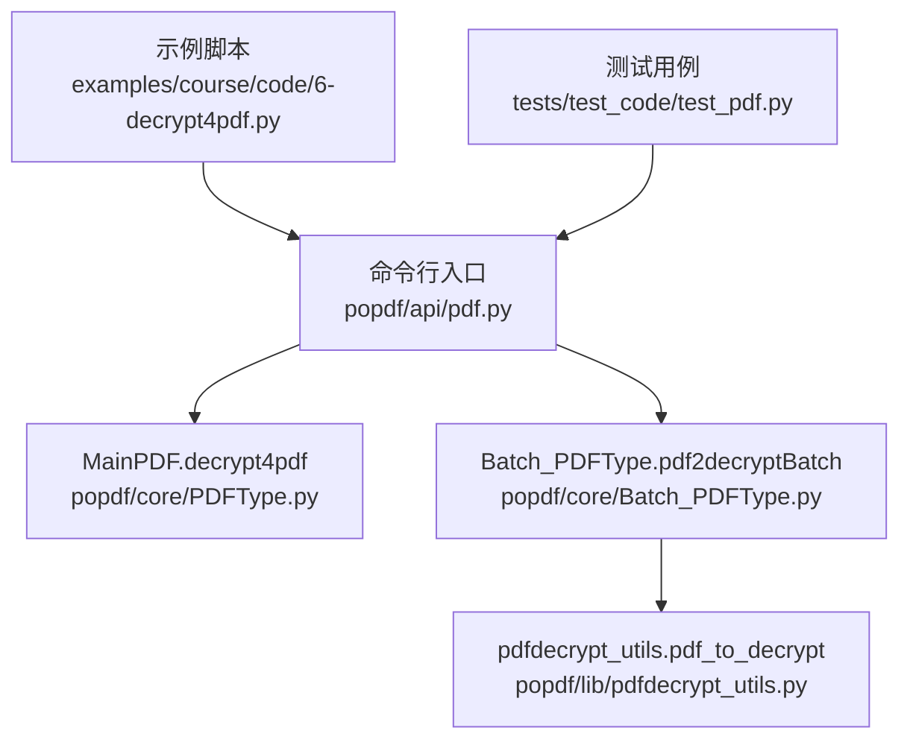
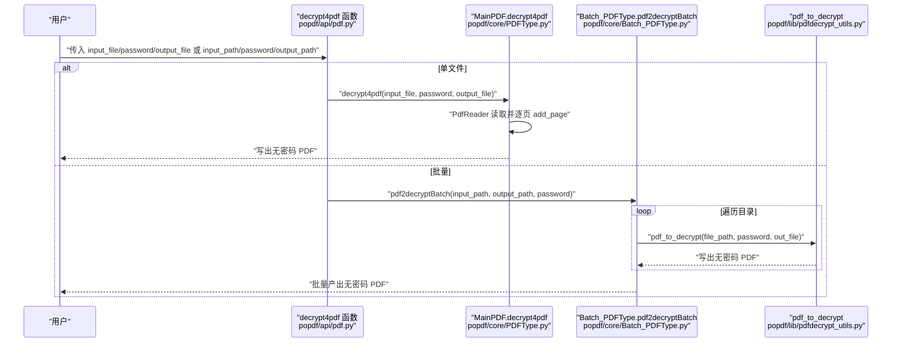
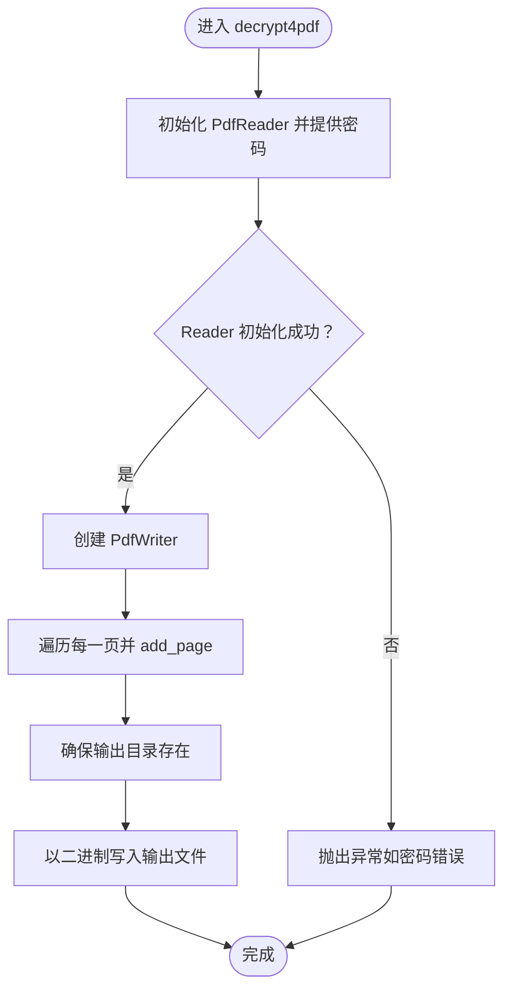
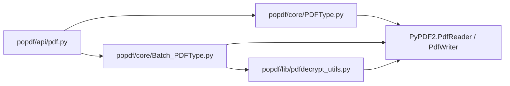

# PDF解密

<cite>
**本文引用的文件**
- [popdf/api/pdf.py](file://popdf/api/pdf.py)
- [popdf/core/PDFType.py](file://popdf/core/PDFType.py)
- [popdf/core/Batch_PDFType.py](file://popdf/core/Batch_PDFType.py)
- [popdf/lib/pdfdecrypt_utils.py](file://popdf/lib/pdfdecrypt_utils.py)
- [examples/course/code/6-decrypt4pdf.py](file://examples/course/code/6-decrypt4pdf.py)
- [tests/test_code/test_pdf.py](file://tests/test_code/test_pdf.py)
- [README.md](file://README.md)
</cite>

## 目录
1. [简介](#简介)
2. [项目结构](#项目结构)
3. [核心组件](#核心组件)
4. [架构总览](#架构总览)
5. [详细组件分析](#详细组件分析)
6. [依赖关系分析](#依赖关系分析)
7. [性能与可靠性](#性能与可靠性)
8. [故障排查指南](#故障排查指南)
9. [结论](#结论)
10. [附录](#附录)

## 简介
本文件围绕 popdf 的 decrypt4pdf API 实现机制展开，系统性说明 MainPDF 类中的 decrypt4pdf 方法如何借助 PyPDF2 的 PdfReader 和 PdfWriter 进行单文件解密；强调 password 参数的必要性与错误密码处理；梳理单文件解密工作流（从创建 PdfReader 到逐页读取并写入新文件）；解释批量解密在 api/pdf.py 中通过 Batch_PDFType.pdf2decryptBatch 的实现方式；提供实用示例路径与常见问题解决方案，并给出安全建议。

## 项目结构
- API 层：对外暴露命令行与函数式接口，负责参数校验与路由到具体实现。
- 核心层：MainPDF 提供单文件解密能力；Batch_PDFType 提供批量解密能力。
- 工具层：pdfdecrypt_utils 提供通用解密工具函数，便于复用。
- 示例与测试：examples 与 tests 展示使用方式与验证行为。

图表来源
- [popdf/api/pdf.py](file://popdf/api/pdf.py#L126-L152)
- [popdf/core/PDFType.py](file://popdf/core/PDFType.py#L110-L125)
- [popdf/core/Batch_PDFType.py](file://popdf/core/Batch_PDFType.py#L56-L67)
- [popdf/lib/pdfdecrypt_utils.py](file://popdf/lib/pdfdecrypt_utils.py#L1-L27)
- [examples/course/code/6-decrypt4pdf.py](file://examples/course/code/6-decrypt4pdf.py#L1-L30)
- [tests/test_code/test_pdf.py](file://tests/test_code/test_pdf.py#L113-L139)

章节来源
- [README.md](file://README.md#L56-L72)
- [popdf/api/pdf.py](file://popdf/api/pdf.py#L126-L152)

## 核心组件
- decrypt4pdf 函数：对外 API，负责参数校验与分发至单文件或批量解密。
- MainPDF.decrypt4pdf：单文件解密核心逻辑，使用 PdfReader 读取并用 PdfWriter 写出。
- Batch_PDFType.pdf2decryptBatch：批量解密入口，遍历目录并对每个 PDF 调用 pdf_to_decrypt。
- pdf_to_decrypt：通用解密工具函数，封装 PdfReader/PdfWriter 的基本流程。

章节来源
- [popdf/api/pdf.py](file://popdf/api/pdf.py#L126-L152)
- [popdf/core/PDFType.py](file://popdf/core/PDFType.py#L110-L125)
- [popdf/core/Batch_PDFType.py](file://popdf/core/Batch_PDFType.py#L56-L67)
- [popdf/lib/pdfdecrypt_utils.py](file://popdf/lib/pdfdecrypt_utils.py#L1-L27)

## 架构总览
decrypt4pdf 的调用链路如下：
- CLI 层接收用户输入，根据是否提供 input_file/input_path 分支。
- 单文件：调用 MainPDF.decrypt4pdf，内部使用 PdfReader 与 PdfWriter 完成解密。
- 批量：调用 Batch_PDFType.pdf2decryptBatch，遍历目录并逐个调用 pdf_to_decrypt。

图表来源
- [popdf/api/pdf.py](file://popdf/api/pdf.py#L126-L152)
- [popdf/core/PDFType.py](file://popdf/core/PDFType.py#L110-L125)
- [popdf/core/Batch_PDFType.py](file://popdf/core/Batch_PDFType.py#L56-L67)
- [popdf/lib/pdfdecrypt_utils.py](file://popdf/lib/pdfdecrypt_utils.py#L1-L27)

## 详细组件分析

### decrypt4pdf 函数（API 入口）
- 职责：接收用户参数，判断单文件或批量模式，分别调用 MainPDF.decrypt4pdf 或 Batch_PDFType.pdf2decryptBatch。
- 参数要点：
  - 单文件：input_file、password、output_file。
  - 批量：input_path、password、output_path。
  - 若参数不完整，记录错误日志并返回。
- 返回值：单文件流程返回布尔值；批量流程内部处理并返回布尔值。

章节来源
- [popdf/api/pdf.py](file://popdf/api/pdf.py#L126-L152)

### MainPDF.decrypt4pdf（单文件解密）
- 流程概述：
  - 使用 PdfReader 以 password 初始化，尝试打开受保护的 PDF。
  - 创建 PdfWriter，遍历原 PDF 的每一页，逐页 add_page。
  - 确保输出目录存在，以二进制写入方式写出新文件。
- 错误处理：
  - 未显式捕获异常，交由上层处理。
  - 若密码错误，PdfReader 初始化阶段可能抛出异常（见“故障排查”）。
- 性能特征：
  - 时间复杂度 O(N)，N 为页数。
  - 空间复杂度 O(1)（仅缓存当前页）。

图表来源
- [popdf/core/PDFType.py](file://popdf/core/PDFType.py#L110-L125)

章节来源
- [popdf/core/PDFType.py](file://popdf/core/PDFType.py#L110-L125)

### Batch_PDFType.pdf2decryptBatch（批量解密）
- 流程概述：
  - 校验 input_path、output_path、password 是否齐全。
  - 遍历目录，过滤 .pdf 文件，逐个调用 pdf_to_decrypt。
  - 对非 PDF 文件跳过并记录日志。
- 错误处理：
  - 参数缺失时记录错误日志。
  - 子文件解密异常由 pdf_to_decrypt 抛出，需由上层捕获与处理。

章节来源
- [popdf/core/Batch_PDFType.py](file://popdf/core/Batch_PDFType.py#L56-L67)

### pdf_to_decrypt（通用解密工具）
- 流程概述：
  - 校验 input_file、password、output_file 是否齐全。
  - 使用 PdfReader 以 password 初始化，创建 PdfWriter，逐页 add_page，最后写入输出文件。
- 错误处理：
  - 参数不全直接提示。
  - 异常向上抛出，便于上层统一处理。

章节来源
- [popdf/lib/pdfdecrypt_utils.py](file://popdf/lib/pdfdecrypt_utils.py#L1-L27)

### 示例与测试
- 示例脚本展示了单文件解密的基本用法，包含 input_file、password、output_file 的传递。
- 测试用例覆盖：
  - 单文件解密：提供正确的输入、密码与输出路径。
  - 批量解密：提供 input_path、password、output_path。
  - 参数异常：传入 None 或不完整参数，触发错误日志。

章节来源
- [examples/course/code/6-decrypt4pdf.py](file://examples/course/code/6-decrypt4pdf.py#L1-L30)
- [tests/test_code/test_pdf.py](file://tests/test_code/test_pdf.py#L113-L139)

## 依赖关系分析
- decrypt4pdf 函数依赖 MainPDF 与 Batch_PDFType。
- Batch_PDFType 依赖 pdf_to_decrypt。
- MainPDF 与 pdf_to_decrypt 依赖 PyPDF2 的 PdfReader 与 PdfWriter。
- 日志记录使用 loguru。

图表来源
- [popdf/api/pdf.py](file://popdf/api/pdf.py#L126-L152)
- [popdf/core/PDFType.py](file://popdf/core/PDFType.py#L110-L125)
- [popdf/core/Batch_PDFType.py](file://popdf/core/Batch_PDFType.py#L56-L67)
- [popdf/lib/pdfdecrypt_utils.py](file://popdf/lib/pdfdecrypt_utils.py#L1-L27)

## 性能与可靠性
- 单文件解密：O(N) 时间，逐页读取与写入，内存占用低。
- 批量解密：对每个 PDF 重复上述流程，整体 O(K·N)，K 为 PDF 数量。
- 可靠性：
  - 建议在调用前检查文件是否存在与可读。
  - 建议在调用前检查输出目录可写。
  - 建议在上层捕获异常并记录详细日志以便定位问题。

[本节为通用指导，无需列出具体文件来源]

## 故障排查指南
- 密码错误
  - 现象：PdfReader 初始化阶段抛出异常。
  - 排查：确认密码是否正确；确认 PDF 是否为受保护状态。
  - 建议：在上层捕获异常并提示用户重新输入密码。
- 输入路径无效
  - 现象：日志记录参数错误或文件不存在。
  - 排查：确认 input_file/input_path 是否存在且可读。
  - 建议：在调用前进行路径有效性检查。
- 输出路径无效
  - 现象：无法创建输出文件或目录。
  - 排查：确认输出目录存在且可写。
  - 廎议：在调用前确保输出目录存在或自动创建。
- 批量处理跳过非 PDF 文件
  - 现象：日志提示跳过某些文件。
  - 排查：确认目录中仅包含 PDF 文件或忽略非 PDF 文件。
- 损坏的加密文件
  - 现象：解密过程中抛出异常。
  - 排查：确认 PDF 文件未被损坏；确认加密算法与密码匹配。
  - 建议：尝试使用其他工具验证文件完整性后再进行解密。

章节来源
- [popdf/api/pdf.py](file://popdf/api/pdf.py#L146-L151)
- [popdf/core/Batch_PDFType.py](file://popdf/core/Batch_PDFType.py#L66-L67)
- [popdf/lib/pdfdecrypt_utils.py](file://popdf/lib/pdfdecrypt_utils.py#L1-L27)

## 结论
decrypt4pdf API 通过清晰的分层设计实现了单文件与批量 PDF 解密能力。单文件解密由 MainPDF.decrypt4pdf 完成，批量解密由 Batch_PDFType.pdf2decryptBatch 驱动，底层工具函数 pdf_to_decrypt 提供通用实现。password 参数是解密的关键，错误密码会导致初始化阶段异常。建议在上层做好参数校验与异常处理，并遵循安全最佳实践。

[本节为总结性内容，无需列出具体文件来源]

## 附录

### 实用示例（示例路径）
- 单文件解密示例：参见 [examples/course/code/6-decrypt4pdf.py](file://examples/course/code/6-decrypt4pdf.py#L1-L30)
- 测试用例（单文件/批量/参数异常）：参见 [tests/test_code/test_pdf.py](file://tests/test_code/test_pdf.py#L113-L139)

### API 行为与参数对照
- decrypt4pdf(input_file=None, password=None, output_file='decrypt.pdf', input_path=None, output_path=None)
  - 单文件：提供 input_file 与 output_file，必填 password。
  - 批量：提供 input_path 与 output_path，必填 password。
  - 参数不完整：记录错误日志并返回。

章节来源
- [popdf/api/pdf.py](file://popdf/api/pdf.py#L126-L152)

### 安全建议
- 密码管理
  - 不要在代码中硬编码密码，优先通过环境变量或交互式输入传递。
  - 使用一次性或临时密码，避免长期保存明文密码。
- 文件与目录权限
  - 确保输出目录权限最小化，避免敏感信息泄露。
- 合规使用
  - 仅在拥有合法权限的情况下解密受保护的 PDF 文件，遵守版权与隐私法规。

[本节为通用指导，无需列出具体文件来源]