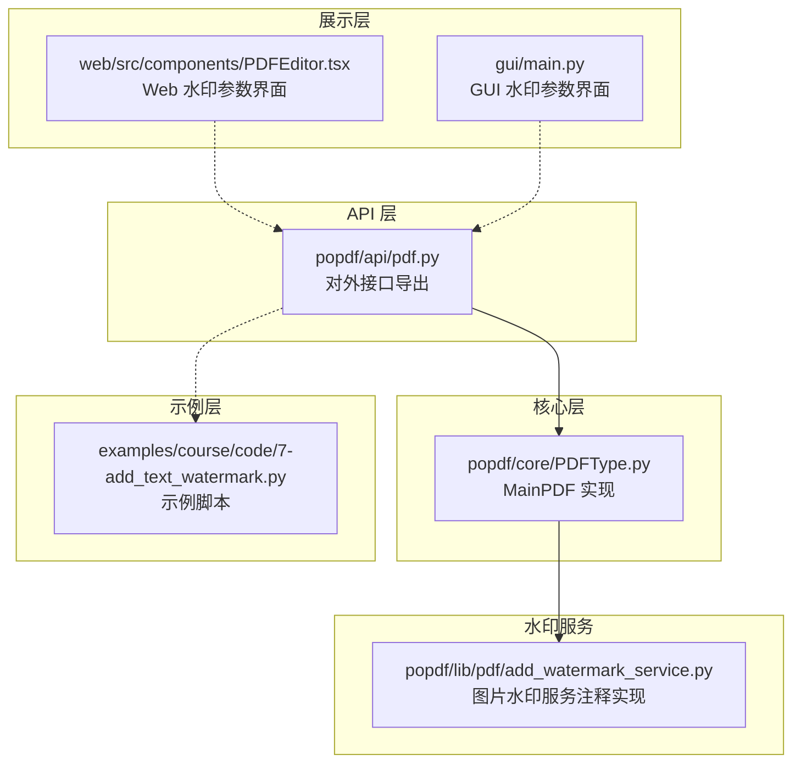
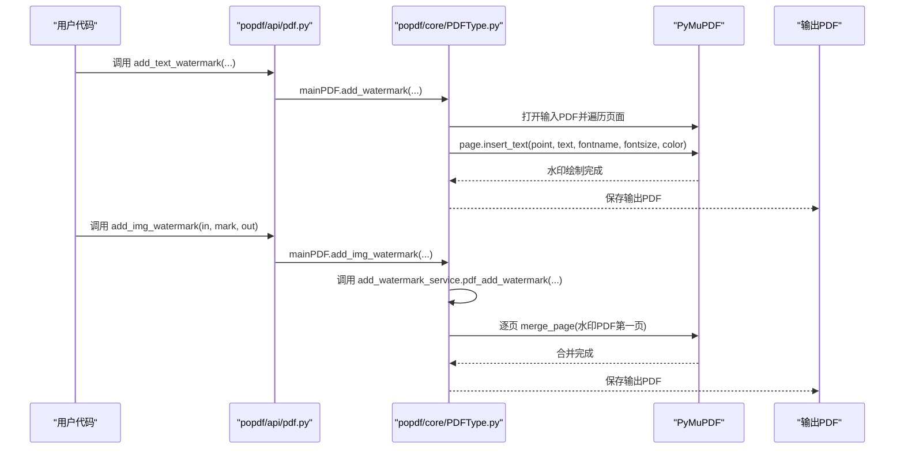
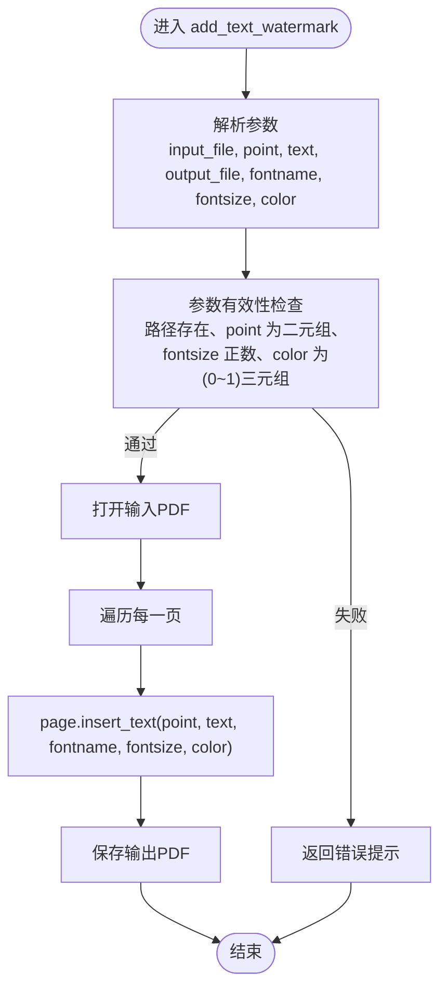
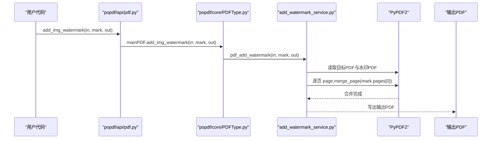
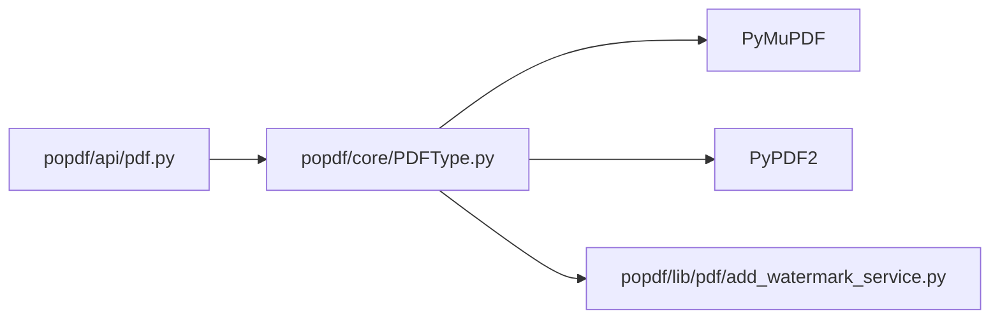

# PDF水印API

<cite>
**本文引用的文件**
- [README.md](file://README.md)
- [popdf/api/pdf.py](file://popdf/api/pdf.py)
- [popdf/core/PDFType.py](file://popdf/core/PDFType.py)
- [popdf/lib/pdf/add_watermark_service.py](file://popdf/lib/pdf/add_watermark_service.py)
- [examples/course/code/7-add_text_watermark.py](file://examples/course/code/7-add_text_watermark.py)
- [web/src/components/PDFEditor.tsx](file://web/src/components/PDFEditor.tsx)
- [gui/main.py](file://gui/main.py)
</cite>

## 目录
1. [简介](#简介)
2. [项目结构](#项目结构)
3. [核心组件](#核心组件)
4. [架构总览](#架构总览)
5. [详细组件分析](#详细组件分析)
6. [依赖关系分析](#依赖关系分析)
7. [性能与使用建议](#性能与使用建议)
8. [故障排查指南](#故障排查指南)
9. [结论](#结论)
10. [附录](#附录)

## 简介
本文件面向使用 popdf 的开发者，系统化梳理 PDF 文本水印与图片水印的现代 API，重点覆盖以下内容：
- add_text_watermark 接口的参数语义与约束：point 坐标定位机制、text 内容限制、fontname 字体支持、fontsize 大小范围、color 颜色格式要求。
- add_img_watermark 如何将一个 PDF 作为水印叠加到另一个 PDF 上。
- 高级使用技巧：半透明水印、全页重复水印的实现思路。
- 旧版接口 add_watermark_by_parameters 的废弃状态与迁移指引。
- 实际应用场景示例：版权信息、公司 Logo 添加。

## 项目结构
围绕“水印”能力，涉及的模块与文件如下：
- API 层：对外暴露 add_text_watermark、add_img_water 等接口，负责参数校验与转发。
- 核心层：MainPDF 类封装具体实现，如文本水印 insert_text、图片水印合并。
- 示例层：课程示例演示 add_text_watermark 的基本用法。
- Web/GUI 展示层：提供水印参数交互界面，辅助理解透明度、旋转、位置等高级配置。

图表来源
- [popdf/api/pdf.py](file://popdf/api/pdf.py#L154-L235)
- [popdf/core/PDFType.py](file://popdf/core/PDFType.py#L126-L175)
- [popdf/lib/pdf/add_watermark_service.py](file://popdf/lib/pdf/add_watermark_service.py#L1-L59)
- [examples/course/code/7-add_text_watermark.py](file://examples/course/code/7-add_text_watermark.py#L1-L26)
- [web/src/components/PDFEditor.tsx](file://web/src/components/PDFEditor.tsx#L68-L163)
- [gui/main.py](file://gui/main.py#L599-L637)

章节来源
- [README.md](file://README.md#L56-L72)
- [popdf/api/pdf.py](file://popdf/api/pdf.py#L154-L235)
- [popdf/core/PDFType.py](file://popdf/core/PDFType.py#L126-L175)
- [popdf/lib/pdf/add_watermark_service.py](file://popdf/lib/pdf/add_watermark_service.py#L1-L59)
- [examples/course/code/7-add_text_watermark.py](file://examples/course/code/7-add_text_watermark.py#L1-L26)
- [web/src/components/PDFEditor.tsx](file://web/src/components/PDFEditor.tsx#L68-L163)
- [gui/main.py](file://gui/main.py#L599-L637)

## 核心组件
- add_text_watermark：在 PDF 指定位置插入文本水印，支持字体、字号、颜色等参数。
- add_img_watermark：将一个 PDF 作为水印模板，逐页叠加到目标 PDF。
- MainPDF.add_watermark：底层实现文本水印插入。
- MainPDF.add_img_watermark：底层实现图片水印合并。
- add_watermark_by_parameters：旧版接口，已废弃，建议迁移至现代接口。

章节来源
- [popdf/api/pdf.py](file://popdf/api/pdf.py#L154-L235)
- [popdf/core/PDFType.py](file://popdf/core/PDFType.py#L126-L175)

## 架构总览
下图展示了 add_text_watermark 与 add_img_watermark 的调用链路与数据流。

图表来源
- [popdf/api/pdf.py](file://popdf/api/pdf.py#L154-L235)
- [popdf/core/PDFType.py](file://popdf/core/PDFType.py#L126-L175)
- [popdf/lib/pdf/add_watermark_service.py](file://popdf/lib/pdf/add_watermark_service.py#L31-L59)

## 详细组件分析

### add_text_watermark 参数详解与定位机制
- 输入参数
  - input_file：要添加水印的 PDF 路径。
  - point：二元组 (x, y)，表示水印文本在页面上的定位坐标。
  - text：水印文本字符串。
  - output_file：输出 PDF 路径。
  - fontname：字体名称字符串。
  - fontsize：整型字号。
  - color：三元组 (R, G, B)，取值范围通常为 0~1 的浮点数。
- 定位机制
  - point 的坐标以 PDF 页面坐标系为准，原点位于页面左下角；x 向右增大，y 向上增大。
  - 坐标单位为点（1/72 英寸），具体布局需结合页面尺寸与目标位置计算。
- 文本内容限制
  - text 为普通字符串，建议避免包含不可见控制字符；特殊字符请确保编码正确。
- 字体支持
  - 由底层 PyMuPDF 提供字体支持，常见可用字体包括 Helvetica、Times-Roman、Courier 等。
  - 若需自定义字体，需确保字体已注册且可用。
- 字号范围
  - fontsize 为正整数；过小可能影响可读性，过大可能遮挡正文。
- 颜色格式
  - color 为 (R, G, B) 浮点三元组，取值范围通常为 0~1；超出范围可能导致渲染异常。

图表来源
- [popdf/api/pdf.py](file://popdf/api/pdf.py#L154-L173)
- [popdf/core/PDFType.py](file://popdf/core/PDFType.py#L162-L174)

章节来源
- [popdf/api/pdf.py](file://popdf/api/pdf.py#L154-L173)
- [popdf/core/PDFType.py](file://popdf/core/PDFType.py#L162-L174)
- [examples/course/code/7-add_text_watermark.py](file://examples/course/code/7-add_text_watermark.py#L12-L13)

### add_img_watermark：将一个PDF作为水印叠加到另一个PDF
- 功能说明
  - 将“水印PDF”的第一页作为模板，逐页叠加到目标 PDF 的对应页面上。
  - 适合全页重复水印、半透明水印等场景。
- 调用流程
  - 用户调用 add_img_watermark(in, mark, out)。
  - API 层转发至 MainPDF.add_img_watermark(...)。
  - 核心层调用 add_watermark_service.pdf_add_watermark(...)。
  - 逐页执行 merge_page，最终保存输出 PDF。

图表来源
- [popdf/api/pdf.py](file://popdf/api/pdf.py#L204-L210)
- [popdf/core/PDFType.py](file://popdf/core/PDFType.py#L126-L128)
- [popdf/lib/pdf/add_watermark_service.py](file://popdf/lib/pdf/add_watermark_service.py#L31-L59)

章节来源
- [popdf/api/pdf.py](file://popdf/api/pdf.py#L204-L210)
- [popdf/core/PDFType.py](file://popdf/core/PDFType.py#L126-L128)
- [popdf/lib/pdf/add_watermark_service.py](file://popdf/lib/pdf/add_watermark_service.py#L31-L59)

### 高级使用技巧
- 半透明水印
  - 方法一：在生成水印 PDF 时设置透明度（alpha），再使用 add_img_watermark 叠加。
  - 方法二：在 Web/GUI 展示层通过透明度控件调整预览，实际处理由底层库完成。
- 全页重复水印
  - 使用 add_img_watermark 将“全页水印PDF”作为模板叠加到目标 PDF，实现整页覆盖。
- 位置与旋转
  - Web/GUI 展示层提供了位置选择（居中、四角）与旋转角度控件，便于预览与调试。

章节来源
- [web/src/components/PDFEditor.tsx](file://web/src/components/PDFEditor.tsx#L68-L163)
- [gui/main.py](file://gui/main.py#L599-L637)

### 旧版接口废弃与迁移指引
- 已废弃接口
  - add_watermark_by_parameters：存在两个同名重定义，已不再维护。
- 迁移建议
  - 文本水印：使用 add_text_watermark，明确传入 point、text、fontname、fontsize、color。
  - 图片水印：使用 add_img_watermark，传入目标PDF、水印PDF与输出路径。
- 日志提示
  - API 层对旧接口保留了警告日志，提示用户改用新接口。

章节来源
- [popdf/api/pdf.py](file://popdf/api/pdf.py#L196-L235)

## 依赖关系分析
- API 层依赖核心层 MainPDF，核心层依赖底层 PDF 库（PyMuPDF、PyPDF2）。
- add_img_watermark 的实现依赖 add_watermark_service.py 中的 pdf_add_watermark 函数（当前为注释实现，实际由核心层调用）。

图表来源
- [popdf/api/pdf.py](file://popdf/api/pdf.py#L154-L235)
- [popdf/core/PDFType.py](file://popdf/core/PDFType.py#L1-L180)
- [popdf/lib/pdf/add_watermark_service.py](file://popdf/lib/pdf/add_watermark_service.py#L1-L59)

章节来源
- [popdf/api/pdf.py](file://popdf/api/pdf.py#L154-L235)
- [popdf/core/PDFType.py](file://popdf/core/PDFType.py#L1-L180)
- [popdf/lib/pdf/add_watermark_service.py](file://popdf/lib/pdf/add_watermark_service.py#L1-L59)

## 性能与使用建议
- 文本水印
  - 建议合理设置 fontsize，避免过大导致页面拥挤。
  - 颜色采用 0~1 区间的浮点值，保证渲染一致性。
- 图片水印
  - 水印PDF尽量简洁，减少压缩与透明通道复杂度，提升合并速度。
  - 对大文件建议分批处理，避免内存峰值过高。
- 透明度与旋转
  - Web/GUI 展示层提供透明度与旋转预览，便于快速迭代效果。

[本节为通用建议，不直接分析具体文件]

## 故障排查指南
- 常见问题
  - 参数类型错误：point 非二元组、color 非(0~1)三元组、fontsize 非正整数。
  - 字体不可用：fontname 未注册或缺失，建议使用系统常见字体。
  - 输出路径权限不足：确认输出目录存在且具备写权限。
  - 图片水印合并失败：检查水印PDF是否损坏或加密。
- 日志与提示
  - API 层对旧接口提供警告日志，提示改用新接口。
  - 核心层对文件路径与页面遍历过程进行日志记录，便于定位问题。

章节来源
- [popdf/api/pdf.py](file://popdf/api/pdf.py#L196-L235)
- [popdf/core/PDFType.py](file://popdf/core/PDFType.py#L1-L180)

## 结论
- 新版接口 add_text_watermark 与 add_img_watermark 提供清晰、稳定的水印能力。
- 文本水印强调坐标、字体、字号与颜色的规范输入；图片水印强调模板PDF的复用与全页叠加。
- 旧版 add_watermark_by_parameters 已废弃，应迁移到现代接口。
- 结合 Web/GUI 展示层，可高效预览透明度、旋转与位置，快速达成业务需求。

[本节为总结性内容，不直接分析具体文件]

## 附录

### API 定义与参数对照表
- add_text_watermark
  - 参数
    - input_file：输入 PDF 路径
    - point：(x, y) 坐标
    - text：水印文本
    - output_file：输出 PDF 路径
    - fontname：字体名称
    - fontsize：字号（整数）
    - color：(R, G, B)，0~1 浮点
  - 返回：无（副作用写入输出文件）

- add_img_watermark
  - 参数
    - pdf_file_in：目标 PDF
    - pdf_file_mark：水印 PDF
    - pdf_file_out：输出 PDF
  - 返回：无（副作用写入输出文件）

章节来源
- [popdf/api/pdf.py](file://popdf/api/pdf.py#L154-L210)
- [popdf/core/PDFType.py](file://popdf/core/PDFType.py#L126-L175)

### 实际应用场景示例
- 版权信息
  - 使用 add_text_watermark，在页面右下角添加“版权所有 © 年份 公司名”，字号适中，颜色浅灰，提高可读性同时降低视觉干扰。
- 公司 Logo
  - 使用 add_img_watermark，将公司 Logo 制作成 PDF 模板，设置半透明与合适尺寸，全页重复叠加，形成统一品牌水印。
- 临时状态标识
  - 使用 add_text_watermark 添加“草稿”、“内部使用”等文字，置于页面中心或四角，配合旋转角度与透明度增强辨识度。

[本节为概念性示例，不直接分析具体文件]