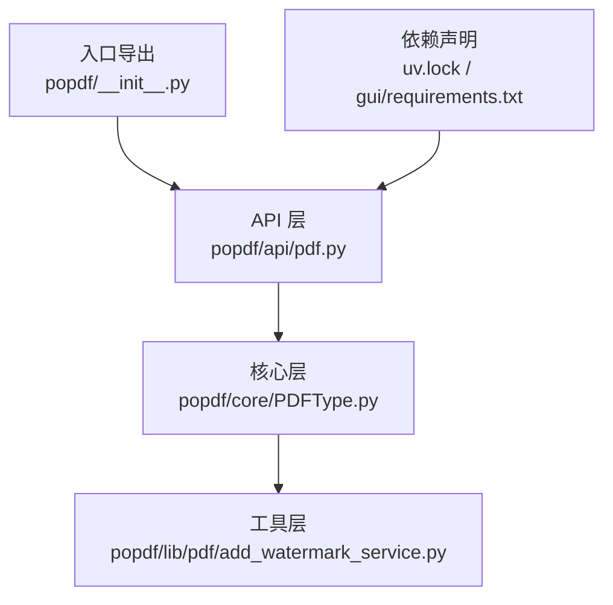
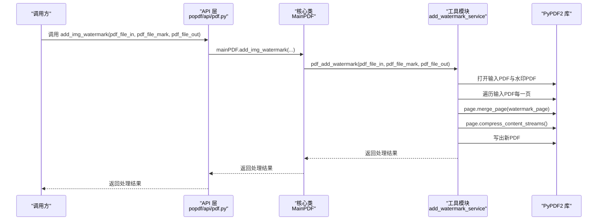
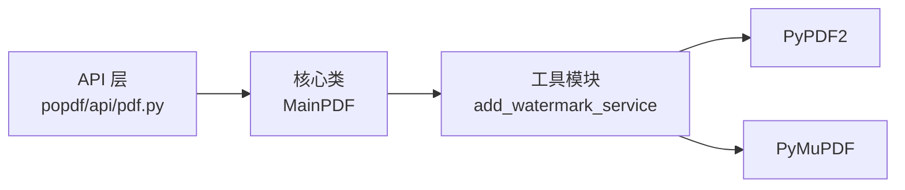

# 图片水印API

<cite>
**本文引用的文件**
- [popdf/api/pdf.py](file://popdf/api/pdf.py)
- [popdf/core/PDFType.py](file://popdf/core/PDFType.py)
- [popdf/lib/pdf/add_watermark_service.py](file://popdf/lib/pdf/add_watermark_service.py)
- [popdf/__init__.py](file://popdf/__init__.py)
- [README.md](file://README.md)
- [uv.lock](file://uv.lock)
- [gui/requirements.txt](file://gui/requirements.txt)
</cite>

## 目录
1. [简介](#简介)
2. [项目结构](#项目结构)
3. [核心组件](#核心组件)
4. [架构总览](#架构总览)
5. [详细组件分析](#详细组件分析)
6. [依赖关系分析](#依赖关系分析)
7. [性能考量](#性能考量)
8. [故障排查指南](#故障排查指南)
9. [结论](#结论)
10. [附录](#附录)

## 简介
本文件面向希望在PDF文档中叠加图片水印的开发者，系统性说明 add_img_watermark 接口的工作原理与使用方法。重点涵盖：
- 如何将一张PDF作为水印模板叠加到目标PDF的每一页
- 水印PDF页面尺寸适配机制
- 透明度处理方式
- 旋转与缩放等几何变换的实现原理
- 依赖 PyPDF2 的页面合并（merge_page）功能
- 叠加过程中的图层顺序与内容流压缩优化策略
- 使用示例：创建含公司Logo的水印PDF并应用到多个报告文档
- 旧版别名 add_img_water 的废弃提示与迁移指引

## 项目结构
本项目采用“API层-核心层-工具层”的分层组织方式，图片水印能力由API层对外暴露，核心逻辑封装在核心类中，底层工具模块负责具体实现。

图表来源
- [popdf/api/pdf.py](file://popdf/api/pdf.py#L1-L235)
- [popdf/core/PDFType.py](file://popdf/core/PDFType.py#L1-L178)
- [popdf/lib/pdf/add_watermark_service.py](file://popdf/lib/pdf/add_watermark_service.py#L1-L59)
- [popdf/__init__.py](file://popdf/__init__.py#L1-L6)
- [uv.lock](file://uv.lock#L1636-L1648)
- [gui/requirements.txt](file://gui/requirements.txt#L1-L7)

章节来源
- [popdf/api/pdf.py](file://popdf/api/pdf.py#L1-L235)
- [popdf/core/PDFType.py](file://popdf/core/PDFType.py#L1-L178)
- [popdf/lib/pdf/add_watermark_service.py](file://popdf/lib/pdf/add_watermark_service.py#L1-L59)
- [popdf/__init__.py](file://popdf/__init__.py#L1-L6)
- [README.md](file://README.md#L56-L72)
- [uv.lock](file://uv.lock#L1636-L1648)
- [gui/requirements.txt](file://gui/requirements.txt#L1-L7)

## 核心组件
- API 层对外接口：提供 add_img_watermark 的高层调用入口，统一参数校验与日志记录。
- 核心类 MainPDF：封装 add_img_watermark 的业务流程，协调底层工具模块。
- 工具模块 add_watermark_service：实现具体的页面合并、内容流压缩等细节。
- 依赖管理：通过 uv.lock 与 requirements.txt 明确 PyPDF2、PyMuPDF 等库版本约束。

章节来源
- [popdf/api/pdf.py](file://popdf/api/pdf.py#L1-L235)
- [popdf/core/PDFType.py](file://popdf/core/PDFType.py#L120-L130)
- [popdf/lib/pdf/add_watermark_service.py](file://popdf/lib/pdf/add_watermark_service.py#L31-L59)
- [uv.lock](file://uv.lock#L1636-L1648)
- [gui/requirements.txt](file://gui/requirements.txt#L1-L7)

## 架构总览
下面的序列图展示了 add_img_watermark 的端到端调用链路与关键步骤。

图表来源
- [popdf/api/pdf.py](file://popdf/api/pdf.py#L196-L210)
- [popdf/core/PDFType.py](file://popdf/core/PDFType.py#L120-L130)
- [popdf/lib/pdf/add_watermark_service.py](file://popdf/lib/pdf/add_watermark_service.py#L31-L59)

## 详细组件分析

### add_img_watermark 接口工作原理
- 入口与转发
  - API 层提供 add_img_watermark 包装函数，内部委托给 MainPDF 实例的 add_img_watermark 方法。
  - 该方法再调用工具模块 add_watermark_service 的 pdf_add_watermark 函数执行实际处理。
- 页面合并与叠加
  - 工具模块对输入PDF与水印PDF分别进行读取。
  - 对输入PDF的每一页，调用 merge_page 将水印PDF的第一页叠加到当前页。
  - 合并后立即对当前页的内容流进行压缩，减少输出PDF体积。
- 图层顺序
  - merge_page 的行为决定了水印位于底层内容之上，形成“覆盖式”水印效果。
  - 若需调整视觉层次，可在生成水印PDF时预先设置其内容顺序。
- 内容流压缩优化
  - 在每页合并后调用 compress_content_streams，有助于降低输出文件大小。
- 错误处理与返回值
  - 工具模块在处理过程中会返回布尔值表示成功与否；API层与核心类据此向上抛出或记录日志。

章节来源
- [popdf/api/pdf.py](file://popdf/api/pdf.py#L196-L210)
- [popdf/core/PDFType.py](file://popdf/core/PDFType.py#L120-L130)
- [popdf/lib/pdf/add_watermark_service.py](file://popdf/lib/pdf/add_watermark_service.py#L31-L59)

### 页面尺寸适配机制
- 水印PDF的尺寸与目标PDF页面尺寸不一致时，merge_page 会将水印内容映射到目标页的坐标系中。
- 由于 merge_page 不改变水印PDF自身的几何属性，因此建议在生成水印PDF时，先根据目标页面尺寸设置合适的画布尺寸与布局，从而获得更佳的适配效果。
- 若需要对水印进行缩放或旋转，应在生成水印PDF时完成，而非在叠加阶段动态计算。

章节来源
- [popdf/lib/pdf/add_watermark_service.py](file://popdf/lib/pdf/add_watermark_service.py#L31-L59)

### 透明度处理方式
- 透明度通常由水印PDF的图形内容决定。若水印为半透明PNG或矢量图形，叠加后会呈现预期的透明效果。
- 若需要统一调节透明度，可在生成水印PDF时设置填充/描边的透明度参数，或在水印模板中使用透明通道。
- 注意：透明度叠加可能影响最终PDF体积与渲染性能，建议结合压缩策略使用。

章节来源
- [popdf/lib/pdf/add_watermark_service.py](file://popdf/lib/pdf/add_watermark_service.py#L31-L59)

### 旋转与缩放等几何变换
- 旋转与缩放属于水印PDF的绘制阶段操作。建议在生成水印PDF时完成这些几何变换，确保叠加时无需额外计算。
- 若必须在叠加阶段进行变换，需在生成水印模板时预留足够的画布空间与变换中心点，避免裁剪或偏移。

章节来源
- [popdf/lib/pdf/add_watermark_service.py](file://popdf/lib/pdf/add_watermark_service.py#L31-L59)

### 依赖 PyPDF2 的页面合并
- merge_page 是 PyPDF2 提供的关键能力，用于将一个页面的内容合并到另一个页面。
- 该模块通过 PdfReader 读取输入与水印PDF，通过 PdfWriter 写出新PDF。
- 依赖版本在 uv.lock 中明确为 pypdf2>=3.0.1，在 GUI 依赖清单中也要求 PyPDF2>=3.0.0。

章节来源
- [popdf/lib/pdf/add_watermark_service.py](file://popdf/lib/pdf/add_watermark_service.py#L31-L59)
- [uv.lock](file://uv.lock#L1636-L1648)
- [gui/requirements.txt](file://gui/requirements.txt#L1-L7)

### 图层顺序与内容流压缩策略
- 图层顺序：merge_page 将水印内容叠加到目标页的顶层，形成覆盖式水印。
- 内容流压缩：每页合并后调用 compress_content_streams，减少输出PDF体积。
- 建议：在生成水印PDF时尽量简化内容，避免冗余资源，以提升整体性能。

章节来源
- [popdf/lib/pdf/add_watermark_service.py](file://popdf/lib/pdf/add_watermark_service.py#L31-L59)

### 使用示例：创建含公司Logo的水印PDF并应用到多个报告
- 步骤概览
  1) 使用绘图库（如 ReportLab 或 PyMuPDF）生成一张包含公司Logo的PDF作为水印模板，设置合适的尺寸、透明度、旋转与缩放。
  2) 准备多个报告PDF文档。
  3) 调用 add_img_watermark，将水印模板应用到每个报告的每一页。
- 代码片段路径
  - 调用入口：参见 [popdf/api/pdf.py](file://popdf/api/pdf.py#L196-L210)
  - 核心实现：参见 [popdf/core/PDFType.py](file://popdf/core/PDFType.py#L120-L130)
  - 工具实现：参见 [popdf/lib/pdf/add_watermark_service.py](file://popdf/lib/pdf/add_watermark_service.py#L31-L59)

章节来源
- [popdf/api/pdf.py](file://popdf/api/pdf.py#L196-L210)
- [popdf/core/PDFType.py](file://popdf/core/PDFType.py#L120-L130)
- [popdf/lib/pdf/add_watermark_service.py](file://popdf/lib/pdf/add_watermark_service.py#L31-L59)

### 旧版别名 add_img_water 的废弃状态与迁移指引
- 废弃状态
  - API 层提供了 add_img_water 的包装函数，但其内部仅调用 add_img_watermark，并在日志中提示该接口已更新为 add_img_watermark。
- 迁移建议
  - 请停止使用 add_img_water，改用 add_img_watermark。
  - 保持参数与调用方式一致，即可无缝迁移。

章节来源
- [popdf/api/pdf.py](file://popdf/api/pdf.py#L196-L210)

## 依赖关系分析
- 外部库
  - PyPDF2：页面读取、写入与合并的核心依赖。
  - PyMuPDF：项目中用于其他PDF处理场景（如文本水印、图片导出等），与水印叠加功能互补。
- 版本约束
  - uv.lock 指定 pypdf2>=3.0.1。
  - GUI 依赖清单要求 PyPDF2>=3.0.0。
- 内部耦合
  - API 层仅做薄薄的转发，核心逻辑集中在 MainPDF 与工具模块之间，耦合度低、职责清晰。

图表来源
- [popdf/api/pdf.py](file://popdf/api/pdf.py#L1-L235)
- [popdf/core/PDFType.py](file://popdf/core/PDFType.py#L1-L178)
- [popdf/lib/pdf/add_watermark_service.py](file://popdf/lib/pdf/add_watermark_service.py#L1-L59)
- [uv.lock](file://uv.lock#L1636-L1648)
- [gui/requirements.txt](file://gui/requirements.txt#L1-L7)

章节来源
- [popdf/api/pdf.py](file://popdf/api/pdf.py#L1-L235)
- [popdf/core/PDFType.py](file://popdf/core/PDFType.py#L1-L178)
- [popdf/lib/pdf/add_watermark_service.py](file://popdf/lib/pdf/add_watermark_service.py#L1-L59)
- [uv.lock](file://uv.lock#L1636-L1648)
- [gui/requirements.txt](file://gui/requirements.txt#L1-L7)

## 性能考量
- 合并策略
  - 使用 merge_page 对每页进行叠加，避免重复读写与多次遍历。
- 内容流压缩
  - 在每页合并后调用 compress_content_streams，有效降低输出PDF体积。
- 水印模板优化
  - 在生成水印PDF时尽量简化图形与资源，减少透明度与复杂滤镜，有助于提升渲染效率。
- 批量处理
  - 对多份报告进行批量叠加时，建议复用同一水印模板，避免重复生成。

章节来源
- [popdf/lib/pdf/add_watermark_service.py](file://popdf/lib/pdf/add_watermark_service.py#L31-L59)

## 故障排查指南
- 常见问题
  - 水印位置偏移或被裁剪：检查水印PDF的画布尺寸与布局，确保包含完整Logo区域。
  - 透明度异常：确认水印PDF中透明度设置是否正确，必要时在生成阶段统一调整。
  - PDF过大：启用内容流压缩与简化水印模板资源。
  - 依赖缺失：确保已安装 PyPDF2>=3.0.0 与 PyMuPDF>=1.23.0。
- 日志与返回值
  - 工具模块返回布尔值指示处理成功与否；API 层与核心类据此记录日志或抛出异常。

章节来源
- [popdf/lib/pdf/add_watermark_service.py](file://popdf/lib/pdf/add_watermark_service.py#L31-L59)
- [uv.lock](file://uv.lock#L1636-L1648)
- [gui/requirements.txt](file://gui/requirements.txt#L1-L7)

## 结论
add_img_watermark 通过 PyPDF2 的页面合并能力，实现了将一张PDF水印模板叠加到目标PDF每一页的功能。其核心优势在于：
- 简洁的调用接口与清晰的分层设计
- 合并后即时压缩内容流，兼顾质量与体积
- 通过在生成水印PDF阶段完成尺寸、透明度、旋转与缩放等变换，确保叠加效果稳定可控

对于需要批量处理多个报告的场景，建议统一维护一套高质量的水印模板，并在生成阶段完成所有几何与视觉配置，以获得最佳的性能与一致性。

## 附录
- 安装与依赖
  - 项目提供安装说明与功能清单，可参考 README 中的安装与功能列表。
  - 依赖 PyPDF2 与 PyMuPDF，版本要求见 uv.lock 与 GUI 依赖清单。

章节来源
- [README.md](file://README.md#L56-L72)
- [uv.lock](file://uv.lock#L1636-L1648)
- [gui/requirements.txt](file://gui/requirements.txt#L1-L7)