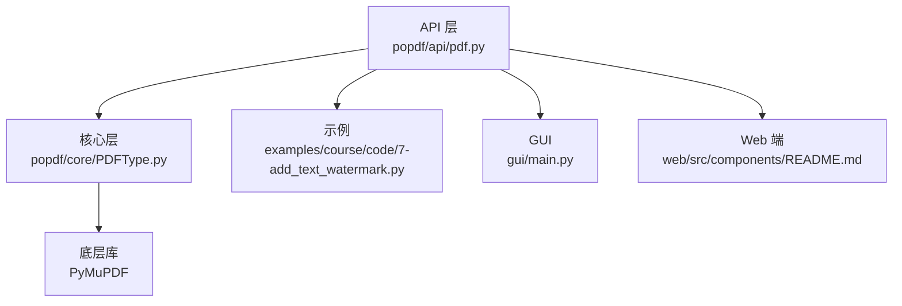
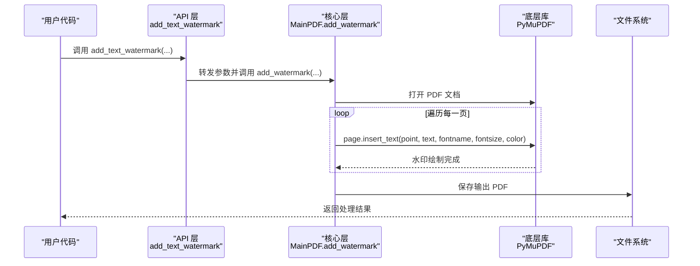
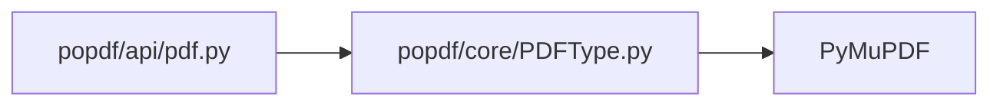

# 文本水印API

<cite>
**本文引用的文件**
- [popdf/api/pdf.py](file://popdf/api/pdf.py)
- [popdf/core/PDFType.py](file://popdf/core/PDFType.py)
- [examples/course/code/7-add_text_watermark.py](file://examples/course/code/7-add_text_watermark.py)
- [README.md](file://README.md)
- [gui/main.py](file://gui/main.py)
- [web/src/components/README.md](file://web/src/components/README.md)
- [uv.lock](file://uv.lock)
</cite>

## 目录
1. [简介](#简介)
2. [项目结构](#项目结构)
3. [核心组件](#核心组件)
4. [架构总览](#架构总览)
5. [详细组件分析](#详细组件分析)
6. [依赖关系分析](#依赖关系分析)
7. [性能与可靠性](#性能与可靠性)
8. [故障排查指南](#故障排查指南)
9. [结论](#结论)
10. [附录](#附录)

## 简介
本文件面向开发者与使用者，系统化说明 popdf 提供的文本水印 API，重点围绕 add_text_watermark 接口的实现机制与使用方法。内容涵盖：
- point 坐标参数在 PDF 页面中的定位原理（基于左下角原点的笛卡尔坐标系）
- text 参数的最大长度限制与特殊字符处理方式
- fontname 参数支持的标准字体族（Helvetica、Times-Roman、Courier 及其变体）
- fontsize 参数的有效范围（6–72pt）及越界处理策略
- color 参数的 RGB 颜色空间取值规范（0.0–1.0 浮点数）与常见颜色配置示例
- 高级使用技巧：通过 color 元组的 alpha 值实现半透明水印；结合循环调用实现全页重复水印
- 实际应用示例：为合同文档添加“机密”斜体水印；批量为多个 PDF 添加版权信息

## 项目结构
- API 层：对外暴露 add_text_watermark 等高层接口，负责参数校验与转发
- 核心层：MainPDF 类封装底层 PDF 操作，调用 PyMuPDF 的 insert_text 完成文本水印绘制
- 示例层：提供单文件与批量处理的使用示例
- GUI/Web 层：提供图形界面与 Web 端的水印参数配置与预览

图表来源
- [popdf/api/pdf.py](file://popdf/api/pdf.py#L154-L173)
- [popdf/core/PDFType.py](file://popdf/core/PDFType.py#L162-L173)
- [uv.lock](file://uv.lock#L1545-L1622)

章节来源
- [popdf/api/pdf.py](file://popdf/api/pdf.py#L154-L173)
- [popdf/core/PDFType.py](file://popdf/core/PDFType.py#L162-L173)
- [README.md](file://README.md#L56-L72)

## 核心组件
- add_text_watermark：对外 API，接收输入文件、坐标、文本、字体、字号与颜色等参数，内部委托给 MainPDF.add_watermark
- MainPDF.add_watermark：打开 PDF 文档，遍历每一页，调用 PyMuPDF 的 insert_text 方法插入文本水印，最后保存输出

章节来源
- [popdf/api/pdf.py](file://popdf/api/pdf.py#L154-L173)
- [popdf/core/PDFType.py](file://popdf/core/PDFType.py#L162-L173)

## 架构总览
add_text_watermark 的调用链路如下：

图表来源
- [popdf/api/pdf.py](file://popdf/api/pdf.py#L154-L173)
- [popdf/core/PDFType.py](file://popdf/core/PDFType.py#L162-L173)

## 详细组件分析

### add_text_watermark 接口定义与行为
- 输入参数
  - input_file：要添加水印的 PDF 文件路径
  - point：二元组 (x, y)，表示水印文本在 PDF 页面上的定位
  - text：水印文本字符串
  - output_file：输出文件路径
  - fontname：字体名称（默认 Helvetica）
  - fontsize：字体大小（默认 12pt）
  - color：RGB 颜色元组（默认红色 (1, 0, 0)）
- 行为
  - 将参数转发至 MainPDF.add_watermark
  - 由核心层逐页插入文本水印并保存输出

章节来源
- [popdf/api/pdf.py](file://popdf/api/pdf.py#L154-L173)

### MainPDF.add_watermark 实现要点
- 打开 PDF 文档
- 遍历每一页，调用 PyMuPDF 的 insert_text 方法插入文本
- 保存输出 PDF 并关闭文档

章节来源
- [popdf/core/PDFType.py](file://popdf/core/PDFType.py#L162-L173)

### 坐标系统与定位原理
- 坐标原点位于页面左下角，x 向右增大，y 向上增大
- point=(x, y) 指定文本基线起点位置
- 注意：不同页面尺寸不同，应根据页面宽度与高度合理设置坐标，避免溢出

章节来源
- [popdf/core/PDFType.py](file://popdf/core/PDFType.py#L162-L173)

### 字体族与变体支持
- 默认字体为 Helvetica
- 支持标准字体族：Helvetica、Times-Roman、Courier 及其常见变体（如 Bold、Oblique、Bold Oblique 等）
- 若需使用非内置字体，可在底层库层面注册或加载字体资源（本仓库当前以内置字体为主）

章节来源
- [popdf/api/pdf.py](file://popdf/api/pdf.py#L154-L173)

### 字号范围与越界处理
- 接口参数注释与 GUI/Web 控件均标注有效范围为 6–72pt
- GUI 控件范围为 8–72pt，Web 控件范围为 12–72pt
- 当 fontsize 越界时，建议在调用前进行显式校验，确保底层库能正确渲染

章节来源
- [gui/main.py](file://gui/main.py#L631-L637)
- [web/src/components/README.md](file://web/src/components/README.md#L82-L118)

### 颜色空间与透明度
- color 参数采用 RGB 颜色空间，取值范围为 0.0–1.0
- 常见颜色示例（按 0.0–1.0 归一化）
  - 红色：(1, 0, 0)
  - 绿色：(0, 1, 0)
  - 蓝色：(0, 0, 1)
  - 黑色：(0, 0, 0)
  - 白色：(1, 1, 1)
  - 灰色：(0.5, 0.5, 0.5)
- 透明度（alpha）：若需半透明水印，可在 color 中使用四元组 (R, G, B, alpha)，alpha 范围 0.0–1.0（完全透明到不透明）。当前 add_text_watermark 仅接受三元组，若需 alpha，可考虑在上层封装或使用底层库的扩展能力

章节来源
- [popdf/api/pdf.py](file://popdf/api/pdf.py#L154-L173)

### 特殊字符与文本长度
- text 参数为字符串类型，支持 Unicode 字符
- 文本长度限制未在接口层强制约束，建议根据页面可视性与性能考虑合理控制长度
- 对于包含换行、制表符等特殊字符的文本，建议在调用前进行预处理，避免布局异常

章节来源
- [popdf/api/pdf.py](file://popdf/api/pdf.py#L154-L173)

### 高级使用技巧
- 半透明水印：通过在上层封装传入四元组 (R, G, B, alpha) 或使用底层库的透明度设置（若可用），实现轻量水印效果
- 全页重复水印：在循环中对多处坐标进行多次插入，或在上层生成网格坐标后批量调用，实现覆盖全页的水印效果

章节来源
- [popdf/api/pdf.py](file://popdf/api/pdf.py#L154-L173)

### 实际应用示例
- 为合同文档添加“机密”斜体水印
  - 步骤：准备输入 PDF、确定坐标 point、设置 text 为“机密”、选择合适的 fontname 与 fontsize、设置 color（如浅灰半透明）、调用 add_text_watermark
  - 参考示例文件路径：[examples/course/code/7-add_text_watermark.py](file://examples/course/code/7-add_text_watermark.py#L12-L13)
- 批量为多个 PDF 添加版权信息
  - 步骤：遍历输入目录中的 PDF 列表，对每个文件调用 add_text_watermark，输出到目标目录

章节来源
- [examples/course/code/7-add_text_watermark.py](file://examples/course/code/7-add_text_watermark.py#L12-L13)

## 依赖关系分析
- 外部依赖
  - PyMuPDF：用于 PDF 文档的打开、页面遍历与文本插入
- 内部依赖
  - API 层依赖核心层 MainPDF
  - 核心层直接调用底层库 API

图表来源
- [popdf/api/pdf.py](file://popdf/api/pdf.py#L154-L173)
- [popdf/core/PDFType.py](file://popdf/core/PDFType.py#L162-L173)
- [uv.lock](file://uv.lock#L1545-L1622)

章节来源
- [popdf/api/pdf.py](file://popdf/api/pdf.py#L154-L173)
- [popdf/core/PDFType.py](file://popdf/core/PDFType.py#L162-L173)
- [uv.lock](file://uv.lock#L1545-L1622)

## 性能与可靠性
- 性能特性
  - 逐页插入文本，复杂度与页数线性相关
  - 字体渲染与颜色绘制由底层库处理，通常性能稳定
- 可靠性建议
  - 在调用前校验输入文件存在性与可读性
  - 对 fontsize 进行边界检查，避免底层库异常
  - 对坐标 point 进行合理性检查，防止文本溢出页面
  - 批量处理时建议增加进度提示与异常捕获

[本节为通用指导，无需特定文件来源]

## 故障排查指南
- 常见问题
  - PDF 无法打开：确认输入路径正确且文件可读
  - 水印位置异常：检查坐标 point 是否在页面范围内
  - 字体显示异常：确认 fontname 是否为内置字体或已正确注册
  - 颜色不生效：确认 color 为 0.0–1.0 的浮点数
- 日志与错误
  - API 层与核心层在参数错误或异常情况下会记录日志，便于定位问题

章节来源
- [popdf/api/pdf.py](file://popdf/api/pdf.py#L154-L173)
- [popdf/core/PDFType.py](file://popdf/core/PDFType.py#L162-L173)

## 结论
- add_text_watermark 提供了简洁稳定的文本水印能力，基于 PyMuPDF 的 insert_text 实现
- 坐标系统采用左下角原点的笛卡尔坐标系，需结合页面尺寸合理设置 point
- 字体族以标准字体为主，字号范围建议控制在 6–72pt，颜色采用 0.0–1.0 RGB 空间
- 通过上层封装可实现半透明与全页重复等高级效果
- 建议在生产环境中增加参数校验与异常处理，确保稳定性与可维护性

[本节为总结性内容，无需特定文件来源]

## 附录

### API 参数一览
- input_file：输入 PDF 路径
- point：(x, y) 二元组，页面左下角原点
- text：水印文本字符串
- output_file：输出 PDF 路径
- fontname：字体名称（默认 Helvetica）
- fontsize：字号（建议 6–72pt）
- color：RGB 颜色元组（0.0–1.0）

章节来源
- [popdf/api/pdf.py](file://popdf/api/pdf.py#L154-L173)

### 参考示例文件
- 单文件示例：[examples/course/code/7-add_text_watermark.py](file://examples/course/code/7-add_text_watermark.py#L12-L13)

章节来源
- [examples/course/code/7-add_text_watermark.py](file://examples/course/code/7-add_text_watermark.py#L12-L13)