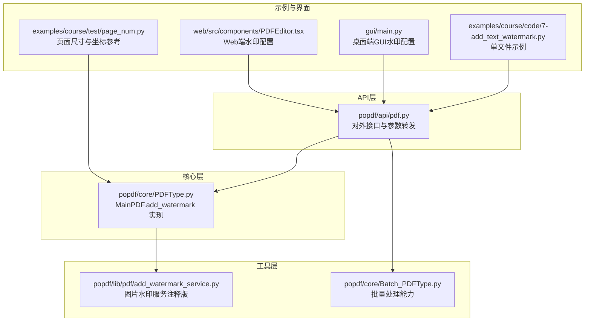
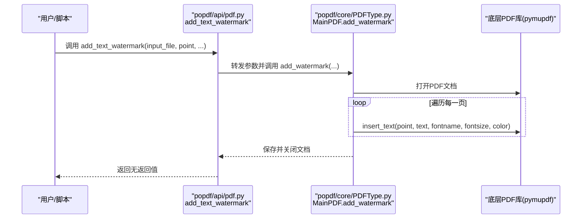
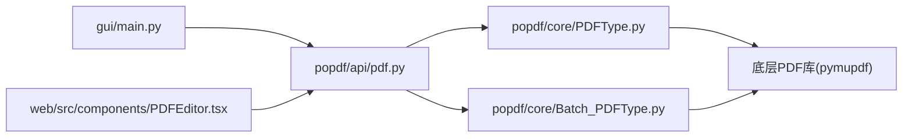

# 文本水印使用示例

<cite>
**本文引用的文件**
- [README.md](file://README.md)
- [7-add_text_watermark.py](file://examples/course/code/7-add_text_watermark.py)
- [pdf.py](file://popdf/api/pdf.py)
- [PDFType.py](file://popdf/core/PDFType.py)
- [Batch_PDFType.py](file://popdf/core/Batch_PDFType.py)
- [add_watermark_service.py](file://popdf/lib/pdf/add_watermark_service.py)
- [main.py](file://gui/main.py)
- [PDFEditor.tsx](file://web/src/components/PDFEditor.tsx)
- [page_num.py](file://examples/course/test/page_num.py)
</cite>

## 目录
1. [简介](#简介)
2. [项目结构](#项目结构)
3. [核心组件](#核心组件)
4. [架构总览](#架构总览)
5. [详细组件分析](#详细组件分析)
6. [依赖关系分析](#依赖关系分析)
7. [性能与实践建议](#性能与实践建议)
8. [故障排查指南](#故障排查指南)
9. [结论](#结论)
10. [附录：示例清单与路径](#附录示例清单与路径)

## 简介
本文件面向不同技术背景的用户，提供“文本水印”的多场景使用示例与最佳实践，覆盖：
- 基础用法：为单个PDF文件添加静态文本水印
- 进阶用法：批量为多个合同文件添加“机密”红色斜体水印
- 高级技巧：通过循环调用在页面上创建全屏重复的轻量级版权水印
- 特殊场景：为财务报表添加包含当前日期和用户名的动态水印

所有示例均以仓库现有API与实现为基础，给出可直接定位到源码的路径指引，避免直接粘贴代码，便于读者对照理解内部机制与参数含义。

## 项目结构
围绕“文本水印”，本仓库的关键文件与职责如下：
- API层：对外暴露统一入口，封装参数校验与调用转发
- 核心层：具体实现文本水印插入逻辑
- 工具层：批量处理、水印服务等辅助能力
- 示例与界面：演示与交互入口

图表来源
- [pdf.py](file://popdf/api/pdf.py#L154-L173)
- [PDFType.py](file://popdf/core/PDFType.py#L162-L174)
- [add_watermark_service.py](file://popdf/lib/pdf/add_watermark_service.py#L1-L59)
- [Batch_PDFType.py](file://popdf/core/Batch_PDFType.py#L1-L142)
- [7-add_text_watermark.py](file://examples/course/code/7-add_text_watermark.py#L1-L26)
- [main.py](file://gui/main.py#L599-L648)
- [PDFEditor.tsx](file://web/src/components/PDFEditor.tsx#L1-L86)

章节来源
- [README.md](file://README.md#L56-L72)
- [pdf.py](file://popdf/api/pdf.py#L154-L173)
- [PDFType.py](file://popdf/core/PDFType.py#L162-L174)

## 核心组件
- 文本水印接口：对外提供便捷方法，负责参数解析与调用核心实现
- 核心实现：基于底层PDF库对每页插入文本，支持字体、字号、颜色等
- 批量处理：遍历文件集合，按相同策略处理
- GUI/Web配置：提供可视化参数（文本、位置、字号、透明度、旋转、位置预设）

章节来源
- [pdf.py](file://popdf/api/pdf.py#L154-L173)
- [PDFType.py](file://popdf/core/PDFType.py#L162-L174)
- [Batch_PDFType.py](file://popdf/core/Batch_PDFType.py#L1-L142)
- [main.py](file://gui/main.py#L599-L648)
- [PDFEditor.tsx](file://web/src/components/PDFEditor.tsx#L1-L86)

## 架构总览
下面的序列图展示了“添加文本水印”的典型调用链路，从API到核心实现再到底层PDF库。

图表来源
- [pdf.py](file://popdf/api/pdf.py#L154-L173)
- [PDFType.py](file://popdf/core/PDFType.py#L162-L174)

## 详细组件分析

### 基础用法：为单个PDF文件添加静态文本水印
- 目标：快速为单个PDF添加固定文本水印，适合一次性处理
- 关键点：
  - 使用API提供的便捷方法
  - 指定坐标、文本、字体、字号、颜色
  - 输出文件路径可自定义
- 参考路径
  - 单文件示例脚本：[7-add_text_watermark.py](file://examples/course/code/7-add_text_watermark.py#L1-L26)
  - 接口定义与参数说明：[pdf.py](file://popdf/api/pdf.py#L154-L173)
  - 核心实现（每页插入文本）：[PDFType.py](file://popdf/core/PDFType.py#L162-L174)

预期输出效果
- 新生成的PDF在每一页上叠加指定文本水印，颜色、字号、字体可调

常见问题与解决
- 坐标偏移：确认传入的point为(x,y)且单位为PDF坐标系；可参考页面尺寸与坐标示例：[page_num.py](file://examples/course/test/page_num.py#L1-L34)
- 字体显示异常：确保系统可用对应字体；若需特定字体，可在底层库中注册或调整fontname

章节来源
- [7-add_text_watermark.py](file://examples/course/code/7-add_text_watermark.py#L1-L26)
- [pdf.py](file://popdf/api/pdf.py#L154-L173)
- [PDFType.py](file://popdf/core/PDFType.py#L162-L174)
- [page_num.py](file://examples/course/test/page_num.py#L1-L34)

### 进阶用法：批量为多个合同文件添加“机密”红色斜体水印
- 目标：对一批合同PDF统一添加“机密”红色斜体水印
- 关键点：
  - 使用批量处理类遍历文件集合
  - 统一设置文本、颜色、字号、字体风格
  - 输出目录与命名策略可自定义
- 参考路径
  - 批量处理类（通用框架）：[Batch_PDFType.py](file://popdf/core/Batch_PDFType.py#L1-L142)
  - 文本水印接口：[pdf.py](file://popdf/api/pdf.py#L154-L173)
  - 核心实现：[PDFType.py](file://popdf/core/PDFType.py#L162-L174)

预期输出效果
- 每份合同PDF在每页叠加“机密”红色斜体水印，便于识别敏感性

常见问题与解决
- 批量文件未被识别：检查输入路径与文件后缀是否符合约定
- 水印重叠或遮挡：调整字号、透明度、位置或旋转角度

章节来源
- [Batch_PDFType.py](file://popdf/core/Batch_PDFType.py#L1-L142)
- [pdf.py](file://popdf/api/pdf.py#L154-L173)
- [PDFType.py](file://popdf/core/PDFType.py#L162-L174)

### 高级技巧：通过循环调用在页面上创建全屏重复的轻量级版权水印
- 目标：在页面上以网格方式重复放置轻量水印，形成全屏覆盖但不影响阅读体验
- 关键点：
  - 计算页面宽高与水印间距，循环插入
  - 控制透明度与字号，使水印“轻量”
  - 可结合旋转角度提升视觉层次
- 参考路径
  - 页面尺寸与坐标参考：[page_num.py](file://examples/course/test/page_num.py#L1-L34)
  - 文本水印接口与核心实现：[pdf.py](file://popdf/api/pdf.py#L154-L173)、[PDFType.py](file://popdf/core/PDFType.py#L162-L174)

预期输出效果
- 页面上呈现密集但透明的版权水印网格，适合大范围防泄密

常见问题与解决
- 水印过于显眼：降低透明度、增大间距、减小字号
- 性能问题：减少循环次数或采用更高效的布局策略

章节来源
- [page_num.py](file://examples/course/test/page_num.py#L1-L34)
- [pdf.py](file://popdf/api/pdf.py#L154-L173)
- [PDFType.py](file://popdf/core/PDFType.py#L162-L174)

### 特殊场景：为财务报表添加包含当前日期和用户名的动态水印
- 目标：在财务报表上添加“动态”水印，包含当前日期与用户名，增强追溯性
- 关键点：
  - 在调用前拼接动态文本（日期+用户名）
  - 使用统一的坐标、字号、颜色与透明度
  - 可结合GUI/Web界面参数进行可视化配置
- 参考路径
  - GUI水印配置项（文本、透明度、旋转、位置）：[main.py](file://gui/main.py#L599-L648)
  - Web端水印配置项（文本、透明度、旋转、位置）：[PDFEditor.tsx](file://web/src/components/PDFEditor.tsx#L1-L86)
  - 文本水印接口与核心实现：[pdf.py](file://popdf/api/pdf.py#L154-L173)、[PDFType.py](file://popdf/core/PDFType.py#L162-L174)

预期输出效果
- 每页出现包含日期与用户名的水印，便于审计与溯源

常见问题与解决
- 日期格式不一致：统一strftime格式，确保跨平台一致性
- 用户名为空：在调用前进行非空校验与默认值填充

章节来源
- [main.py](file://gui/main.py#L599-L648)
- [PDFEditor.tsx](file://web/src/components/PDFEditor.tsx#L1-L86)
- [pdf.py](file://popdf/api/pdf.py#L154-L173)
- [PDFType.py](file://popdf/core/PDFType.py#L162-L174)

## 依赖关系分析
- API层依赖核心层实现，核心层依赖底层PDF库
- 批量处理类提供文件扫描与遍历能力
- GUI/Web提供参数可视化与交互入口

图表来源
- [pdf.py](file://popdf/api/pdf.py#L1-L235)
- [PDFType.py](file://popdf/core/PDFType.py#L1-L180)
- [Batch_PDFType.py](file://popdf/core/Batch_PDFType.py#L1-L142)
- [main.py](file://gui/main.py#L599-L648)
- [PDFEditor.tsx](file://web/src/components/PDFEditor.tsx#L1-L86)

## 性能与实践建议
- 字体与渲染：尽量使用系统常用字体，避免频繁加载字体文件
- 透明度与层级：低透明度与合理字号可显著降低渲染开销
- 批量处理：使用批量类统一调度，减少重复IO
- 坐标与布局：先计算页面尺寸再插入，避免多次重绘

## 故障排查指南
- 坐标偏移
  - 现象：水印出现在页面外或位置不正确
  - 排查：确认point为(x,y)且符合PDF坐标系；参考页面尺寸与坐标示例：[page_num.py](file://examples/course/test/page_num.py#L1-L34)
- 字体显示异常
  - 现象：中文乱码或字体缺失
  - 排查：确保系统存在对应字体；必要时调整fontname或在底层库中注册字体
- 批量处理失败
  - 现象：部分文件未处理或报错
  - 排查：检查输入路径、权限与文件后缀；参考批量框架：[Batch_PDFType.py](file://popdf/core/Batch_PDFType.py#L1-L142)
- GUI/Web参数无效
  - 现象：界面参数未生效
  - 排查：确认参数绑定与事件触发；参考GUI参数控件：[main.py](file://gui/main.py#L599-L648)、Web参数控件：[PDFEditor.tsx](file://web/src/components/PDFEditor.tsx#L1-L86)

章节来源
- [page_num.py](file://examples/course/test/page_num.py#L1-L34)
- [Batch_PDFType.py](file://popdf/core/Batch_PDFType.py#L1-L142)
- [main.py](file://gui/main.py#L599-L648)
- [PDFEditor.tsx](file://web/src/components/PDFEditor.tsx#L1-L86)

## 结论
本仓库提供了从单文件到批量、从静态到动态的完整文本水印能力。通过API层统一入口、核心层高效实现与GUI/Web可视化配置，用户可以在多种场景下灵活应用文本水印，满足合规、审计与防泄密需求。

## 附录：示例清单与路径
- 基础用法（单文件）
  - 示例脚本：[7-add_text_watermark.py](file://examples/course/code/7-add_text_watermark.py#L1-L26)
  - 接口定义：[pdf.py](file://popdf/api/pdf.py#L154-L173)
  - 核心实现：[PDFType.py](file://popdf/core/PDFType.py#L162-L174)
- 进阶用法（批量）
  - 批量框架：[Batch_PDFType.py](file://popdf/core/Batch_PDFType.py#L1-L142)
  - 文本水印接口：[pdf.py](file://popdf/api/pdf.py#L154-L173)
  - 核心实现：[PDFType.py](file://popdf/core/PDFType.py#L162-L174)
- 高级技巧（全屏重复）
  - 页面尺寸参考：[page_num.py](file://examples/course/test/page_num.py#L1-L34)
  - 文本水印接口与实现：[pdf.py](file://popdf/api/pdf.py#L154-L173)、[PDFType.py](file://popdf/core/PDFType.py#L162-L174)
- 特殊场景（动态水印）
  - GUI参数配置：[main.py](file://gui/main.py#L599-L648)
  - Web参数配置：[PDFEditor.tsx](file://web/src/components/PDFEditor.tsx#L1-L86)
  - 文本水印接口与实现：[pdf.py](file://popdf/api/pdf.py#L154-L173)、[PDFType.py](file://popdf/core/PDFType.py#L162-L174)