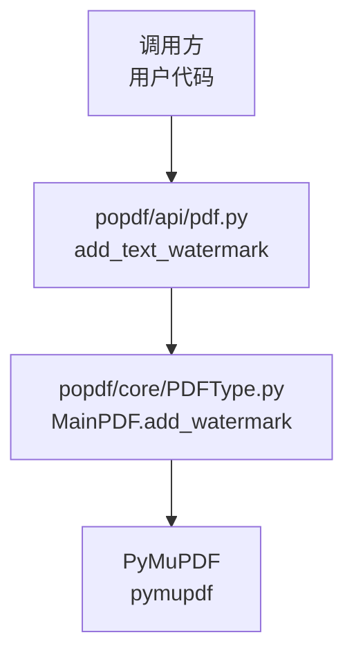
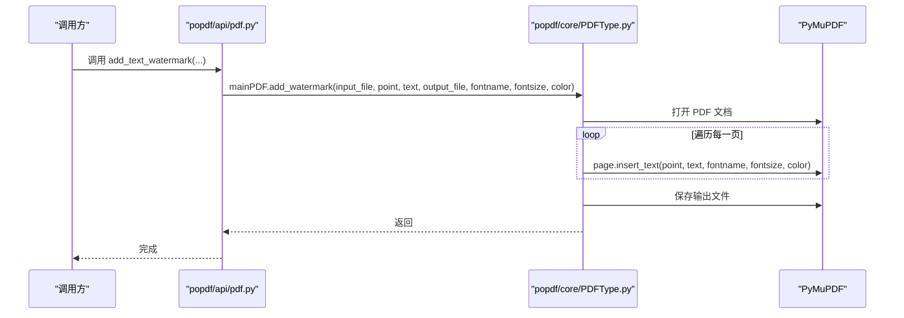
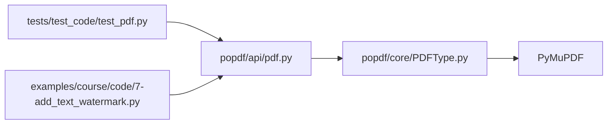

# 文本水印参数详解

<cite>
**本文引用的文件**
- [popdf/api/pdf.py](file://popdf/api/pdf.py)
- [popdf/core/PDFType.py](file://popdf/core/PDFType.py)
- [examples/course/code/7-add_text_watermark.py](file://examples/course/code/7-add_text_watermark.py)
- [tests/test_code/test_pdf.py](file://tests/test_code/test_pdf.py)
- [README.md](file://README.md)
</cite>

## 目录
1. [简介](#简介)
2. [项目结构与入口](#项目结构与入口)
3. [核心组件与职责](#核心组件与职责)
4. [架构概览](#架构概览)
5. [详细参数说明](#详细参数说明)
6. [参数配置示例](#参数配置示例)
7. [依赖关系分析](#依赖关系分析)
8. [性能与可靠性建议](#性能与可靠性建议)
9. [故障排查指南](#故障排查指南)
10. [结论](#结论)

## 简介
本文围绕 add_text_watermark 接口的参数配置进行系统化说明，重点解释：
- point 坐标参数在 PDF 页面中的定位机制（基于 PyMuPDF 的左下角为原点的笛卡尔坐标系）
- text 参数的字符编码支持（UTF-8）与长度建议
- fontname 参数支持的标准 14 种 PDF 字体及命名规范
- fontsize 参数的有效取值范围与越界处理策略
- color 参数的 RGB 颜色空间取值范围与透明度控制方法
- 提供参数配置示例，包括斜体、加粗、半透明水印等常见场景

## 项目结构与入口
- 对外接口位于 popdf/api/pdf.py 中，提供 add_text_watermark 方法
- 实际实现委托给 popdf/core/PDFType.py 中的 MainPDF.add_watermark
- 示例与测试分别位于 examples 与 tests 目录，便于快速验证

图表来源
- [popdf/api/pdf.py](file://popdf/api/pdf.py#L154-L173)
- [popdf/core/PDFType.py](file://popdf/core/PDFType.py#L162-L174)

章节来源
- [popdf/api/pdf.py](file://popdf/api/pdf.py#L154-L173)
- [popdf/core/PDFType.py](file://popdf/core/PDFType.py#L162-L174)
- [README.md](file://README.md#L110-L115)

## 核心组件与职责
- popdf/api/pdf.py
  - 对外暴露 add_text_watermark 接口，负责参数校验与转发
  - 默认参数：text='python-office'，fontname='Helvetica'，fontsize=12，color=(1,0,0)
- popdf/core/PDFType.py
  - 实现 MainPDF.add_watermark，内部通过 PyMuPDF 打开 PDF 并逐页插入文本
  - 保存输出文件并关闭文档

章节来源
- [popdf/api/pdf.py](file://popdf/api/pdf.py#L154-L173)
- [popdf/core/PDFType.py](file://popdf/core/PDFType.py#L162-L174)

## 架构概览
add_text_watermark 的调用链路如下：

图表来源
- [popdf/api/pdf.py](file://popdf/api/pdf.py#L154-L173)
- [popdf/core/PDFType.py](file://popdf/core/PDFType.py#L162-L174)

## 详细参数说明

### 1. point 坐标参数
- 定义：二元组 (x, y)，表示水印文本在 PDF 页面上的定位
- 坐标系：基于 PyMuPDF 的左下角为原点的笛卡尔坐标系
  - x：向右为正方向
  - y：向上为正方向
- 取值建议：
  - 通常应满足：0 ≤ x ≤ 页面宽度；0 ≤ y ≤ 页面高度
  - 若超出页面边界，文本可能不可见或被裁剪
- 注意事项：
  - 不同页面尺寸不同，需根据具体页面 rect.width/height 计算合理坐标
  - 若需要固定在页面某个角落，建议结合页面尺寸动态计算

章节来源
- [popdf/api/pdf.py](file://popdf/api/pdf.py#L159-L161)
- [popdf/core/PDFType.py](file://popdf/core/PDFType.py#L168-L170)

### 2. text 文本参数
- 类型：字符串
- 编码：UTF-8
- 长度建议：建议不超过 256 个字符
  - 过长文本可能导致渲染效率下降或显示异常
- 使用建议：
  - 中文、英文、数字与特殊符号均可直接传入
  - 如需多行水印，可在业务层自行拼接换行符

章节来源
- [popdf/api/pdf.py](file://popdf/api/pdf.py#L162-L163)
- [examples/course/code/7-add_text_watermark.py](file://examples/course/code/7-add_text_watermark.py#L12-L13)

### 3. fontname 字体参数
- 类型：字符串
- 支持的标准 14 种 PDF 字体（按常见命名规范）：
  - Helvetica、Helvetica-Bold、Helvetica-Oblique、Helvetica-BoldOblique
  - Times-Roman、Times-Bold、Times-Italic、Times-BoldItalic
  - Courier、Courier-Bold、Courier-Oblique、Courier-BoldOblique
  - Symbol
  - ZapfDingbats
- 命名规范：
  - 粗体：-Bold 后缀
  - 斜体：-Italic 或 -Oblique 后缀
  - 加粗斜体：同时包含 -Bold 与 -Italic/-Oblique
- 注意：
  - 以上为标准 14 字体的通用命名；实际可用性取决于目标 PDF 所嵌入的字体集合
  - 若指定字体不存在，PyMuPDF 可能回退或报错，建议优先使用 Helvetica、Times-Roman、Courier 等通用字体

章节来源
- [popdf/api/pdf.py](file://popdf/api/pdf.py#L164-L164)
- [popdf/core/PDFType.py](file://popdf/core/PDFType.py#L168-L170)

### 4. fontsize 字号参数
- 类型：整数（pt）
- 有效取值范围：6–72 pt
- 越界处理策略：
  - 当 fontsize 超出范围时，PyMuPDF 会进行裁剪或采用边界值
  - 建议在调用前对 fontsize 进行显式校验，避免意外渲染效果
- 建议：
  - 常用范围：12–36 pt 适合大多数场景
  - 水印建议使用较小字号，避免遮挡正文

章节来源
- [popdf/api/pdf.py](file://popdf/api/pdf.py#L165-L165)
- [popdf/core/PDFType.py](file://popdf/core/PDFType.py#L168-L170)

### 5. color 颜色参数
- 类型：三元组 (R, G, B)
- 颜色空间：RGB，取值范围 0.0–1.0
  - R：红色分量
  - G：绿色分量
  - B：蓝色分量
- 透明度控制：
  - 当前 add_text_watermark 接口未提供独立透明度参数
  - 若需半透明效果，可在业务层将颜色值按比例缩小（例如将 R/G/B 各乘以 0.5），以达到视觉上的半透明效果
  - 更精细的透明度控制可通过图像水印方式实现（非文本水印）

章节来源
- [popdf/api/pdf.py](file://popdf/api/pdf.py#L166-L166)
- [popdf/core/PDFType.py](file://popdf/core/PDFType.py#L168-L170)

## 参数配置示例

### 示例一：基础文本水印
- 目的：在指定位置插入一段文本水印
- 关键点：point 基于左下角原点；text 为 UTF-8；fontname 选择 Helvetica；fontsize 在 6–72 范围内；color 为 RGB(0~1)
- 参考调用路径
  - [调用示例](file://examples/course/code/7-add_text_watermark.py#L12-L13)
  - [接口定义](file://popdf/api/pdf.py#L154-L173)

### 示例二：斜体字体
- 目的：使用斜体字形显示水印
- 方案：将 fontname 设为 Helvetica-Oblique 或 Times-Italic 或 Courier-Oblique
- 注意：确保目标 PDF 已嵌入对应字体族，否则可能回退或失败

章节来源
- [popdf/api/pdf.py](file://popdf/api/pdf.py#L164-L164)

### 示例三：加粗字体
- 目的：使用粗体字形显示水印
- 方案：将 fontname 设为 Helvetica-Bold 或 Times-Bold 或 Courier-Bold
- 注意：同斜体字体，需目标 PDF 包含对应粗体字形

章节来源
- [popdf/api/pdf.py](file://popdf/api/pdf.py#L164-L164)

### 示例四：半透明水印
- 目的：降低水印可见度，避免遮挡正文
- 方案：将 color 的 R/G/B 值按比例缩小（如乘以 0.3~0.5），达到半透明视觉效果
- 说明：当前接口未提供透明度参数，此方法为业务层变通实现

章节来源
- [popdf/api/pdf.py](file://popdf/api/pdf.py#L166-L166)
- [popdf/core/PDFType.py](file://popdf/core/PDFType.py#L168-L170)

## 依赖关系分析
- 外部依赖
  - PyMuPDF：用于打开 PDF、遍历页面、插入文本
- 内部依赖
  - popdf/api/pdf.py 依赖 popdf/core/PDFType.py
  - popdf/core/PDFType.py 依赖 PyMuPDF
- 测试与示例
  - tests/test_code/test_pdf.py 中包含 add_text_watermark 的测试用例
  - examples/course/code/7-add_text_watermark.py 展示了基本用法

图表来源
- [popdf/api/pdf.py](file://popdf/api/pdf.py#L154-L173)
- [popdf/core/PDFType.py](file://popdf/core/PDFType.py#L162-L174)
- [tests/test_code/test_pdf.py](file://tests/test_code/test_pdf.py#L149-L152)
- [examples/course/code/7-add_text_watermark.py](file://examples/course/code/7-add_text_watermark.py#L12-L13)

章节来源
- [popdf/api/pdf.py](file://popdf/api/pdf.py#L154-L173)
- [popdf/core/PDFType.py](file://popdf/core/PDFType.py#L162-L174)
- [tests/test_code/test_pdf.py](file://tests/test_code/test_pdf.py#L149-L152)
- [examples/course/code/7-add_text_watermark.py](file://examples/course/code/7-add_text_watermark.py#L12-L13)

## 性能与可靠性建议
- 字号与透明度
  - 较大字号与过多半透明叠加可能影响渲染性能，建议在 12–36 pt 范围内选择
- 字体可用性
  - 优先使用 Helvetica、Times-Roman、Courier 等通用字体，确保跨平台兼容
- 坐标与页面尺寸
  - 建议先读取页面 rect.width/height，再计算 point，避免越界导致水印不可见
- 批量处理
  - 对大量页面插入文本水印时，建议分批处理并监控内存占用

## 故障排查指南
- 水印不可见
  - 检查 point 是否越界（x/y 超出页面尺寸）
  - 检查 fontname 是否为目标 PDF 所嵌入字体
  - 检查 fontsize 是否在 6–72 范围内
- 颜色异常
  - 确认 color 为 (R,G,B)，且 R/G/B ∈ [0.0, 1.0]
  - 若需半透明，需在业务层按比例缩小颜色分量
- 调试与验证
  - 参考测试用例与示例文件进行最小复现
  - 参考路径：
    - [测试用例](file://tests/test_code/test_pdf.py#L149-L152)
    - [示例文件](file://examples/course/code/7-add_text_watermark.py#L12-L13)

章节来源
- [tests/test_code/test_pdf.py](file://tests/test_code/test_pdf.py#L149-L152)
- [examples/course/code/7-add_text_watermark.py](file://examples/course/code/7-add_text_watermark.py#L12-L13)

## 结论
- add_text_watermark 接口通过 PyMuPDF 实现文本水印的快速添加
- 参数设计遵循 PyMuPDF 的坐标与颜色约定，fontname 与 fontsize 需结合目标 PDF 的字体嵌入情况与业务需求进行选择
- 透明度控制可通过业务层对颜色分量进行缩放实现
- 建议在生产环境中对 point、fontname、fontsize、color 进行显式校验，确保跨平台一致性与稳定性