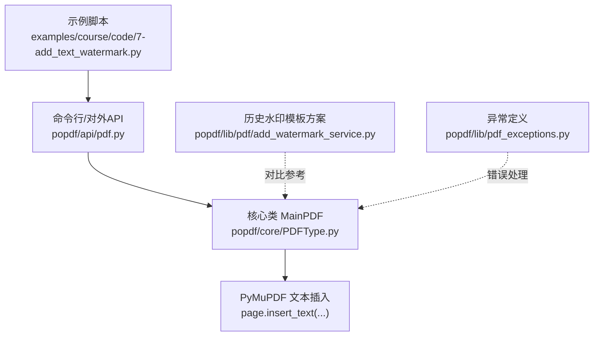
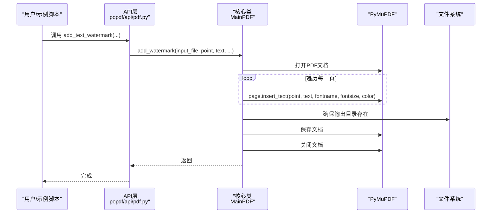
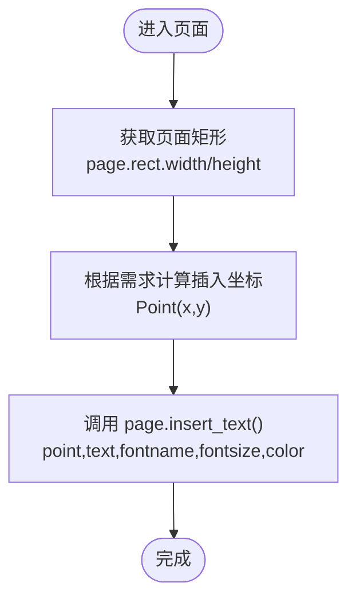
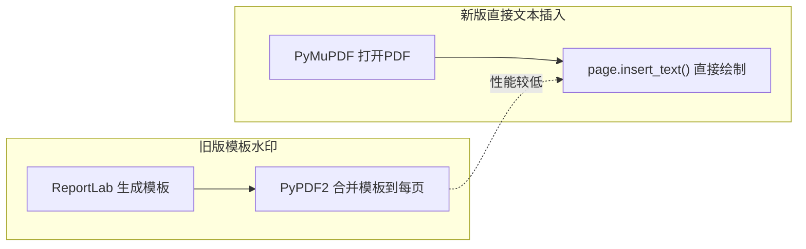
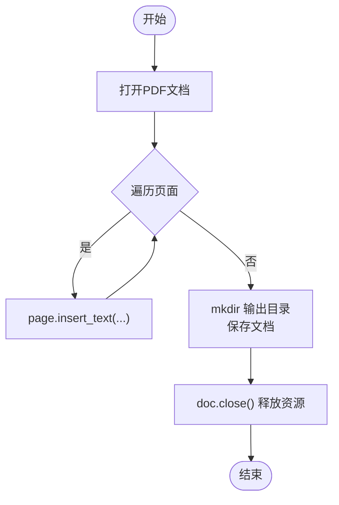
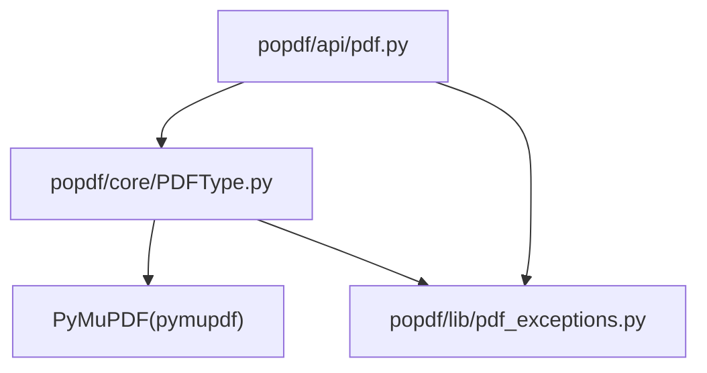

# 文本水印实现原理

<cite>
**本文引用的文件**
- [README.md](file://README.md)
- [examples/course/code/7-add_text_watermark.py](file://examples/course/code/7-add_text_watermark.py)
- [popdf/api/pdf.py](file://popdf/api/pdf.py)
- [popdf/core/PDFType.py](file://popdf/core/PDFType.py)
- [popdf/lib/pdf/add_watermark_service.py](file://popdf/lib/pdf/add_watermark_service.py)
- [popdf/lib/pdf_exceptions.py](file://popdf/lib/pdf_exceptions.py)
- [examples/course/test/page_num.py](file://examples/course/test/page_num.py)
- [uv.lock](file://uv.lock)
</cite>

## 目录
1. [简介](#简介)
2. [项目结构](#项目结构)
3. [核心组件](#核心组件)
4. [架构总览](#架构总览)
5. [详细组件分析](#详细组件分析)
6. [依赖关系分析](#依赖关系分析)
7. [性能考量](#性能考量)
8. [故障排查指南](#故障排查指南)
9. [结论](#结论)

## 简介
本文件围绕文本水印功能的技术实现进行深入解析，重点说明如何通过 PyMuPDF 的 page.insert_text() 方法在 PDF 页面上直接插入文本对象；解释底层坐标系统与页面尺寸的关系；描述字体渲染过程及支持的字体类型限制；对比当前“直接文本插入”与旧版“基于 PDF 模板水印”的技术差异与性能优劣；阐述异常处理机制（含加密 PDF 的处理策略）、输出路径自动创建与资源释放的最佳实践。

## 项目结构
- 示例入口位于 examples/course/code/7-add_text_watermark.py，演示了对外 API 的使用方式。
- 对外 API 定义于 popdf/api/pdf.py，封装 add_text_watermark 并委托给核心类 MainPDF。
- 核心实现位于 popdf/core/PDFType.py，其中 MainPDF.add_watermark 使用 PyMuPDF 的 page.insert_text() 实现文本水印。
- 旧版水印模板方案位于 popdf/lib/pdf/add_watermark_service.py（被注释的历史实现），展示了基于 ReportLab 生成水印模板、再用 PyPDF2 合并的思路。
- 异常定义位于 popdf/lib/pdf_exceptions.py，提供统一的异常基类。
- 参考示例 examples/course/test/page_num.py 展示了 PyMuPDF 中 page.rect、insert_text 的典型用法，有助于理解坐标系统与页面尺寸关系。

图表来源
- [examples/course/code/7-add_text_watermark.py](file://examples/course/code/7-add_text_watermark.py#L1-L26)
- [popdf/api/pdf.py](file://popdf/api/pdf.py#L154-L173)
- [popdf/core/PDFType.py](file://popdf/core/PDFType.py#L162-L174)
- [popdf/lib/pdf/add_watermark_service.py](file://popdf/lib/pdf/add_watermark_service.py#L1-L59)
- [popdf/lib/pdf_exceptions.py](file://popdf/lib/pdf_exceptions.py#L1-L25)

章节来源
- [README.md](file://README.md#L56-L72)
- [examples/course/code/7-add_text_watermark.py](file://examples/course/code/7-add_text_watermark.py#L1-L26)
- [popdf/api/pdf.py](file://popdf/api/pdf.py#L154-L173)
- [popdf/core/PDFType.py](file://popdf/core/PDFType.py#L162-L174)
- [popdf/lib/pdf/add_watermark_service.py](file://popdf/lib/pdf/add_watermark_service.py#L1-L59)
- [popdf/lib/pdf_exceptions.py](file://popdf/lib/pdf_exceptions.py#L1-L25)

## 核心组件
- 对外 API：popdf.api.pdf.add_text_watermark 将参数传递给主流程。
- 核心实现：popdf.core.PDFType.MainPDF.add_watermark 使用 PyMuPDF 打开 PDF、遍历页面并调用 page.insert_text() 插入文本，最后保存并关闭文档。
- 历史方案：popdf.lib.pdf.add_watermark_service 提供了基于 ReportLab 生成水印模板、再用 PyPDF2 合并的实现思路（当前未启用）。
- 异常处理：popdf.lib.pdf_exceptions 提供统一异常基类，便于集中处理错误。

章节来源
- [popdf/api/pdf.py](file://popdf/api/pdf.py#L154-L173)
- [popdf/core/PDFType.py](file://popdf/core/PDFType.py#L162-L174)
- [popdf/lib/pdf/add_watermark_service.py](file://popdf/lib/pdf/add_watermark_service.py#L1-L59)
- [popdf/lib/pdf_exceptions.py](file://popdf/lib/pdf_exceptions.py#L1-L25)

## 架构总览
文本水印的调用链路自上而下：示例脚本调用对外 API，API 再委托给 MainPDF，最终由 PyMuPDF 的 page.insert_text() 在每一页上绘制文本水印。

图表来源
- [examples/course/code/7-add_text_watermark.py](file://examples/course/code/7-add_text_watermark.py#L12-L13)
- [popdf/api/pdf.py](file://popdf/api/pdf.py#L154-L173)
- [popdf/core/PDFType.py](file://popdf/core/PDFType.py#L162-L174)

## 详细组件分析

### 1) PyMuPDF 文本插入与坐标系统
- 页面尺寸与坐标系：页面对象 page.rect 提供 width 和 height，可用于计算相对位置（如右下角、居中等）。示例 examples/course/test/page_num.py 展示了通过 page.rect 获取页面宽高并以 Point 作为插入位置的方式。
- 插入方法：MainPDF.add_watermark 直接调用 page.insert_text(point, text, fontname, fontsize, color) 将文本绘制到页面上。
- 坐标原点：通常以页面左下角为原点，向右为 x 正方向，向上为 y 正方向。具体行为受页面介质尺寸与渲染上下文影响，实际使用时应结合 page.rect 进行定位。

图表来源
- [examples/course/test/page_num.py](file://examples/course/test/page_num.py#L16-L23)
- [popdf/core/PDFType.py](file://popdf/core/PDFType.py#L162-L174)

章节来源
- [examples/course/test/page_num.py](file://examples/course/test/page_num.py#L1-L33)
- [popdf/core/PDFType.py](file://popdf/core/PDFType.py#L162-L174)

### 2) 字体渲染与字体类型限制
- 字体名称：API 层提供 fontname 参数（默认 "Helvetica"），MainPDF.add_watermark 直接传给 page.insert_text()。这意味着可用字体取决于 PyMuPDF 已内嵌或可加载的字体集合。
- 字体缓冲：示例 examples/course/test/page_num.py 展示了 page.insert_font(...) 与 page.insert_text(...) 的组合，表明可通过注入字体缓冲实现更丰富的字体支持。
- 版本要求：txt2pdf 流程中对 PyMuPDF 版本有最低要求（参见 core/PDFType.py），这间接反映了对新特性（如字体/链接处理）的支持能力。

章节来源
- [popdf/api/pdf.py](file://popdf/api/pdf.py#L154-L173)
- [popdf/core/PDFType.py](file://popdf/core/PDFType.py#L162-L174)
- [examples/course/test/page_num.py](file://examples/course/test/page_num.py#L1-L33)

### 3) 与旧版“模板水印”方案的对比
- 旧版思路（ReportLab + PyPDF2）：
  - 使用 ReportLab 生成独立的水印 PDF 模板（canvas、TTFont 注册、drawCentredString 等），再用 PyPDF2 的 PdfReader 读取模板，逐页 merge_page 到目标 PDF。
  - 优点：可实现复杂布局、旋转、倾斜、透明度等高级效果；适合批量处理。
  - 缺点：额外生成中间模板文件、需要二次 IO、合并过程较重。
- 当前实现（PyMuPDF 直接文本插入）：
  - 直接在页面上绘制文本，无需中间模板文件，减少一次 IO。
  - 优点：实现简单、速度较快、内存占用低。
  - 缺点：对复杂排版（如多行、旋转、倾斜、透明度）支持有限，需通过 page.insert_text 的参数与页面属性配合实现。

图表来源
- [popdf/lib/pdf/add_watermark_service.py](file://popdf/lib/pdf/add_watermark_service.py#L1-L59)
- [popdf/core/PDFType.py](file://popdf/core/PDFType.py#L162-L174)

章节来源
- [popdf/lib/pdf/add_watermark_service.py](file://popdf/lib/pdf/add_watermark_service.py#L1-L59)
- [popdf/core/PDFType.py](file://popdf/core/PDFType.py#L162-L174)

### 4) 异常处理机制与资源释放
- 异常定义：popdf/lib/pdf_exceptions 提供 PDFException 基类，便于统一捕获与报告错误信息。
- 资源释放：MainPDF.add_watermark 在保存后显式调用 doc.close()，避免句柄泄漏。
- 输出路径：在保存前通过 mkdir 确保输出目录存在，避免因路径不存在导致的写入失败。
- 加密 PDF：当前 add_watermark 未内置解密逻辑；若输入为加密 PDF，应在调用前先解密或在上游处理。解密相关能力可参考其他模块（如 decrypt4pdf），但 add_text_watermark 本身不负责解密。

图表来源
- [popdf/core/PDFType.py](file://popdf/core/PDFType.py#L162-L174)
- [popdf/lib/pdf_exceptions.py](file://popdf/lib/pdf_exceptions.py#L1-L25)

章节来源
- [popdf/core/PDFType.py](file://popdf/core/PDFType.py#L162-L174)
- [popdf/lib/pdf_exceptions.py](file://popdf/lib/pdf_exceptions.py#L1-L25)

## 依赖关系分析
- 外部依赖：PyMuPDF（pymupdf）是文本插入与页面操作的核心库；版本在 uv.lock 中有记录，确保兼容性。
- 内部依赖：API 层依赖核心类 MainPDF；MainPDF 依赖 PyMuPDF；异常模块提供统一异常类型。

图表来源
- [popdf/api/pdf.py](file://popdf/api/pdf.py#L154-L173)
- [popdf/core/PDFType.py](file://popdf/core/PDFType.py#L162-L174)
- [popdf/lib/pdf_exceptions.py](file://popdf/lib/pdf_exceptions.py#L1-L25)
- [uv.lock](file://uv.lock#L1545-L1634)

章节来源
- [uv.lock](file://uv.lock#L1545-L1634)
- [popdf/api/pdf.py](file://popdf/api/pdf.py#L154-L173)
- [popdf/core/PDFType.py](file://popdf/core/PDFType.py#L162-L174)
- [popdf/lib/pdf_exceptions.py](file://popdf/lib/pdf_exceptions.py#L1-L25)

## 性能考量
- 直接文本插入的优势：无需生成中间模板文件，避免额外 IO；对简单文本水印场景性能更优。
- 复杂排版需求：若需旋转、倾斜、多行、透明度等效果，旧版模板方案可能更灵活；但需权衡 IO 与内存成本。
- 批量处理：MainPDF.add_watermark 遍历每一页执行插入，整体复杂度近似 O(N)（N 为页数），在大多数情况下足够高效。

[本节为通用性能讨论，不直接分析具体文件]

## 故障排查指南
- 输出路径不存在：确保输出目录存在，MainPDF.add_watermark 在保存前会创建父目录。
- 文档保存失败：检查磁盘空间、权限与输出路径是否有效。
- 字体不可用：若指定的 fontname 未被 PyMuPDF 支持，可能导致渲染异常；可改用默认字体或注入字体缓冲。
- 加密 PDF：当前 add_text_watermark 不包含解密逻辑；请在调用前解密或在上游处理。
- 资源泄漏：确认文档在保存后已调用 close()，避免句柄未释放。

章节来源
- [popdf/core/PDFType.py](file://popdf/core/PDFType.py#L162-L174)
- [popdf/lib/pdf_exceptions.py](file://popdf/lib/pdf_exceptions.py#L1-L25)

## 结论
- 本项目采用 PyMuPDF 的 page.insert_text() 实现文本水印，具备实现简洁、性能优良的特点，适合快速部署与批量处理。
- 坐标系统与页面尺寸密切相关，建议结合 page.rect 计算插入位置；字体支持受限于 PyMuPDF 的字体集，必要时可注入字体缓冲。
- 与旧版模板方案相比，直接文本插入减少了中间模板与合并步骤，但在复杂排版方面略显不足。
- 异常处理与资源释放遵循最小侵入原则：统一异常类型、显式关闭文档、自动创建输出目录，提升稳定性与易用性。