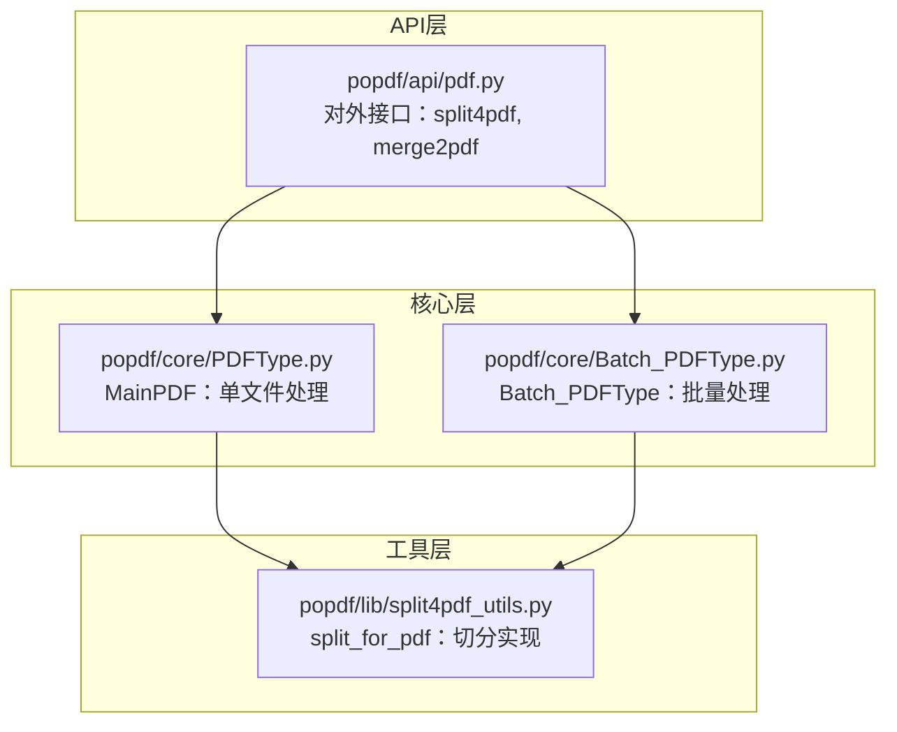
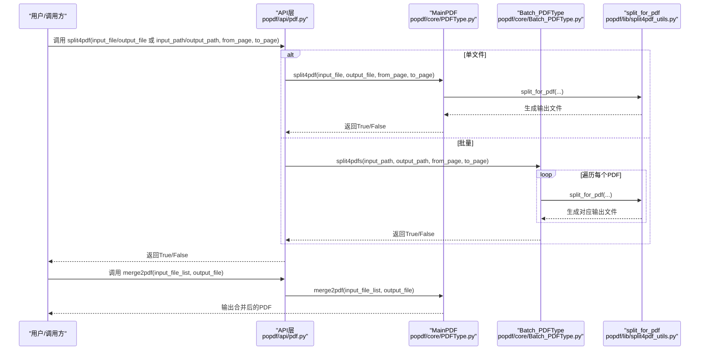
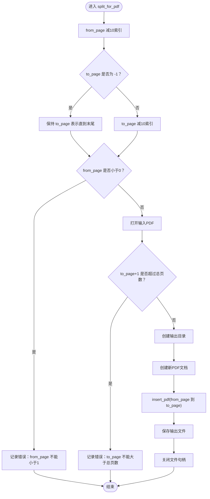
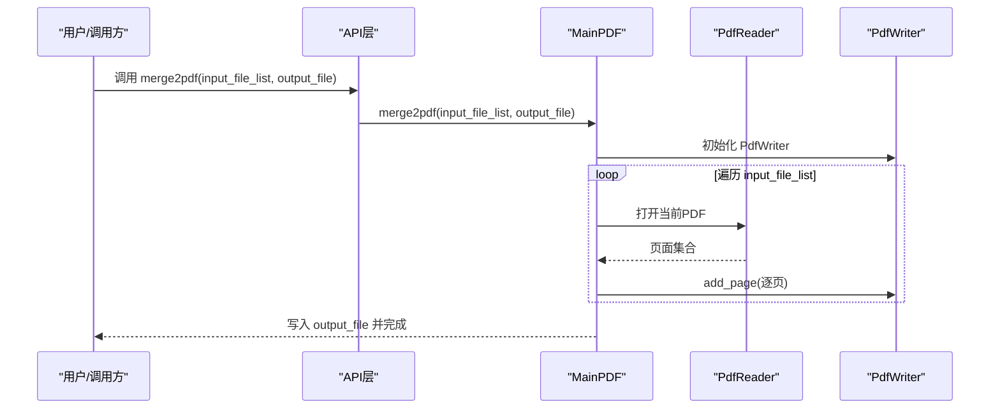
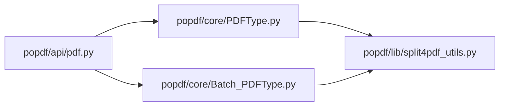

# PDF组织API

<cite>
**本文引用的文件**
- [popdf/api/pdf.py](file://popdf/api/pdf.py)
- [popdf/core/PDFType.py](file://popdf/core/PDFType.py)
- [popdf/core/Batch_PDFType.py](file://popdf/core/Batch_PDFType.py)
- [popdf/lib/split4pdf_utils.py](file://popdf/lib/split4pdf_utils.py)
- [examples/course/code/4-split4pdf.py](file://examples/course/code/4-split4pdf.py)
- [examples/course/code/8-merge2pdf.py](file://examples/course/code/8-merge2pdf.py)
- [README.md](file://README.md)
</cite>

## 目录
1. [简介](#简介)
2. [项目结构](#项目结构)
3. [核心组件](#核心组件)
4. [架构总览](#架构总览)
5. [详细组件分析](#详细组件分析)
6. [依赖关系分析](#依赖关系分析)
7. [性能与内存考量](#性能与内存考量)
8. [故障排查指南](#故障排查指南)
9. [结论](#结论)
10. [附录](#附录)

## 简介
本文件面向开发者与使用者，系统化梳理 popdf 的 PDF 组织能力，重点覆盖两个核心接口：
- split4pdf：按页码范围从单个或批量 PDF 中截取子集
- merge2pdf：将多个 PDF 按给定顺序合并为一个输出文件

文档将详细说明：
- split4pdf 的 from_page 与 to_page 参数的页码范围控制逻辑（基于1索引），以及 to_page 为 -1 的特殊语义
- 单文件与批量处理的实现路径：MainPDF 类负责单文件，Batch_PDFType.split4pdfs 实现批量
- merge2pdf 的输入顺序重要性与输出生成规则
- 实用示例：提取特定页面范围、合并多份合同文件
- 操作注意事项：大文件合并的内存消耗、跨平台路径分隔符等

## 项目结构
围绕“PDF组织”能力，相关代码主要分布在以下模块：
- API 层：对外暴露的高层接口，统一入口与参数校验
- 核心层：MainPDF（单文件）、Batch_PDFType（批量）
- 工具层：split4pdf_utils（具体切分逻辑）

图表来源
- [popdf/api/pdf.py](file://popdf/api/pdf.py#L93-L115)
- [popdf/core/PDFType.py](file://popdf/core/PDFType.py#L81-L97)
- [popdf/core/Batch_PDFType.py](file://popdf/core/Batch_PDFType.py#L32-L42)
- [popdf/lib/split4pdf_utils.py](file://popdf/lib/split4pdf_utils.py#L8-L38)

章节来源
- [README.md](file://README.md#L56-L72)

## 核心组件
- split4pdf 接口
  - 单文件：MainPDF.split4pdf
  - 批量：Batch_PDFType.split4pdfs
- merge2pdf 接口
  - 单文件：MainPDF.merge2pdf

章节来源
- [popdf/api/pdf.py](file://popdf/api/pdf.py#L93-L115)
- [popdf/core/PDFType.py](file://popdf/core/PDFType.py#L130-L148)
- [popdf/core/Batch_PDFType.py](file://popdf/core/Batch_PDFType.py#L32-L42)

## 架构总览
下面以序列图展示 split4pdf 与 merge2pdf 的调用链路与数据流。

图表来源
- [popdf/api/pdf.py](file://popdf/api/pdf.py#L93-L115)
- [popdf/core/PDFType.py](file://popdf/core/PDFType.py#L81-L97)
- [popdf/core/Batch_PDFType.py](file://popdf/core/Batch_PDFType.py#L32-L42)
- [popdf/lib/split4pdf_utils.py](file://popdf/lib/split4pdf_utils.py#L8-L38)

## 详细组件分析

### split4pdf：页码范围控制与批量实现
- 参数与行为
  - from_page：起始页（1索引）。若小于1，将触发错误日志并返回。
  - to_page：结束页（1索引）。若为 -1，则表示“直到末尾”，内部会转换为实际页码上限。
  - 单文件：MainPDF.split4pdf 调用 split_for_pdf 完成切分。
  - 批量：Batch_PDFType.split4pdfs 遍历输入目录下所有 .pdf 文件，逐一调用 split_for_pdf，并将输出文件写入指定输出目录。
- 页码转换逻辑
  - 内部将 from_page 与 to_page 减去 1，转换为基于0索引的页码区间，再交由底层库执行插入。
  - 若 to_page 不等于 -1，同样会减去 1；否则保留“直到末尾”的语义。
  - 若 to_page 超过总页数，将触发错误日志并返回。
- 输出命名（批量）
  - 批量模式下，输出文件名为“原文件名+split.pdf”。单文件模式下直接使用传入的 output_file。

图表来源
- [popdf/lib/split4pdf_utils.py](file://popdf/lib/split4pdf_utils.py#L8-L38)

章节来源
- [popdf/api/pdf.py](file://popdf/api/pdf.py#L93-L115)
- [popdf/core/PDFType.py](file://popdf/core/PDFType.py#L81-L97)
- [popdf/core/Batch_PDFType.py](file://popdf/core/Batch_PDFType.py#L32-L42)
- [popdf/lib/split4pdf_utils.py](file://popdf/lib/split4pdf_utils.py#L8-L38)

### merge2pdf：顺序重要性与输出规则
- 输入顺序的重要性
  - merge2pdf 会按传入的 input_file_list 顺序依次读取并追加页面，因此顺序直接影响最终输出的页面排列。
- 输出规则
  - 输出文件由 MainPDF.merge2pdf 直接写入指定路径。合并过程中逐页读取并写入，最终形成单一 PDF。
- 使用建议
  - 对于合同合并等场景，务必确保 input_file_list 的顺序与业务期望一致（如：封面、目录、正文、附件等）。

图表来源
- [popdf/api/pdf.py](file://popdf/api/pdf.py#L175-L181)
- [popdf/core/PDFType.py](file://popdf/core/PDFType.py#L130-L148)

章节来源
- [popdf/api/pdf.py](file://popdf/api/pdf.py#L175-L181)
- [popdf/core/PDFType.py](file://popdf/core/PDFType.py#L130-L148)

### 实用示例与最佳实践
- 提取 PDF 特定页面范围
  - 单文件：调用 split4pdf，设置 from_page 与 to_page（均基于1索引）。若 to_page 设为 -1，则表示从 from_page 到末尾。
  - 批量：传入 input_path 与 output_path，from_page 与 to_page 同样基于1索引。
  - 示例参考：[examples/course/code/4-split4pdf.py](file://examples/course/code/4-split4pdf.py#L16-L38)
- 合并多个合同文件
  - 按业务顺序准备 input_file_list，确保封面、目录、正文、附件等顺序正确。
  - 指定输出文件路径，调用 merge2pdf 即可生成合并后的 PDF。
  - 示例参考：[examples/course/code/8-merge2pdf.py](file://examples/course/code/8-merge2pdf.py#L13-L16)

章节来源
- [examples/course/code/4-split4pdf.py](file://examples/course/code/4-split4pdf.py#L16-L38)
- [examples/course/code/8-merge2pdf.py](file://examples/course/code/8-merge2pdf.py#L13-L16)

## 依赖关系分析
- API 层依赖核心层与工具层
  - split4pdf：API 层根据是否提供 input_file/input_path 分发至 MainPDF 或 Batch_PDFType；二者均调用 split_for_pdf 完成切分。
  - merge2pdf：API 层直接委托 MainPDF 执行合并。
- 工具层依赖底层库
  - split_for_pdf 使用底层 PDF 库进行插入与保存，涉及页码转换与边界校验。

图表来源
- [popdf/api/pdf.py](file://popdf/api/pdf.py#L93-L115)
- [popdf/core/PDFType.py](file://popdf/core/PDFType.py#L81-L97)
- [popdf/core/Batch_PDFType.py](file://popdf/core/Batch_PDFType.py#L32-L42)
- [popdf/lib/split4pdf_utils.py](file://popdf/lib/split4pdf_utils.py#L8-L38)

章节来源
- [popdf/api/pdf.py](file://popdf/api/pdf.py#L93-L115)
- [popdf/core/PDFType.py](file://popdf/core/PDFType.py#L81-L97)
- [popdf/core/Batch_PDFType.py](file://popdf/core/Batch_PDFType.py#L32-L42)
- [popdf/lib/split4pdf_utils.py](file://popdf/lib/split4pdf_utils.py#L8-L38)

## 性能与内存考量
- 大文件合并的内存消耗
  - merge2pdf 采用逐页读取与写入的方式，避免一次性加载整个 PDF 到内存，有助于降低内存峰值。但在极大规模合并时，仍可能受系统内存限制影响。
- 跨平台路径分隔符
  - 建议始终使用正斜杠或 Python 的路径处理工具（如 os.path 或 pathlib.Path）构造路径，避免硬编码反斜杠导致 Windows 与 Linux/macOS 行为差异。
- 批量处理效率
  - 批量切分时，建议先确认输入目录中仅包含目标 PDF 文件，减少无关文件扫描与 IO 开销。

[本节为通用指导，无需列出具体文件来源]

## 故障排查指南
- 参数错误
  - split4pdf：当未提供正确的 input_file/input_path 与 output_file/output_path 组合时，API 层会记录错误日志并返回 False。
  - merge2pdf：当未提供有效的 input_file_list 或 output_file 时，需检查参数完整性。
- 页码范围错误
  - from_page 小于1：会记录错误并返回。
  - to_page 超过总页数：会记录错误并返回。
  - to_page 为 -1：表示“直到末尾”，请确保 from_page 不大于总页数。
- 输出路径与权限
  - 确保输出目录存在且具备写权限；API 层会在必要时尝试创建目录。
- 路径与文件名
  - 批量模式下，输出文件名采用“原文件名+split.pdf”，请避免与现有文件冲突。

章节来源
- [popdf/api/pdf.py](file://popdf/api/pdf.py#L93-L115)
- [popdf/lib/split4pdf_utils.py](file://popdf/lib/split4pdf_utils.py#L14-L23)

## 结论
- split4pdf 提供灵活的页码范围控制，支持单文件与批量两种模式，满足从单份文档中提取子集的需求。
- merge2pdf 严格遵循输入顺序，适合多合同、多章节的有序合并场景。
- 在生产环境中，建议结合参数校验、路径规范化与日志监控，确保流程稳定与可追溯。

[本节为总结性内容，无需列出具体文件来源]

## 附录
- 参考示例
  - 分割示例：[examples/course/code/4-split4pdf.py](file://examples/course/code/4-split4pdf.py#L16-L38)
  - 合并示例：[examples/course/code/8-merge2pdf.py](file://examples/course/code/8-merge2pdf.py#L13-L16)

[本节为补充材料，无需列出具体文件来源]