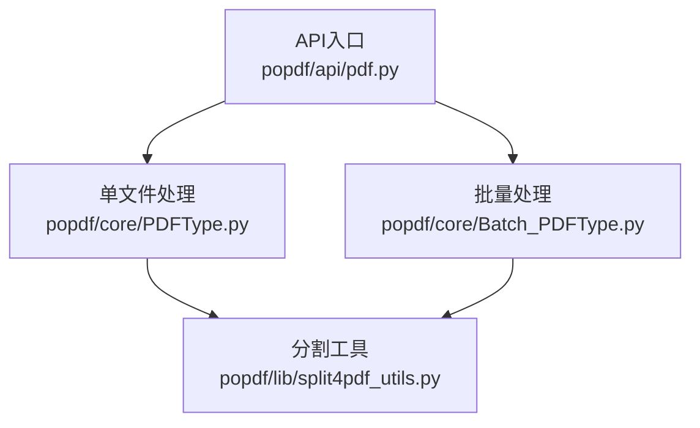
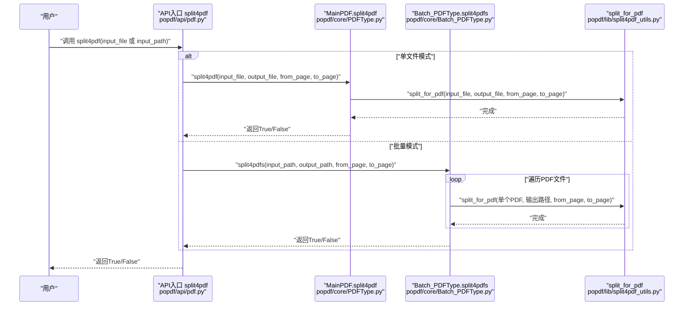
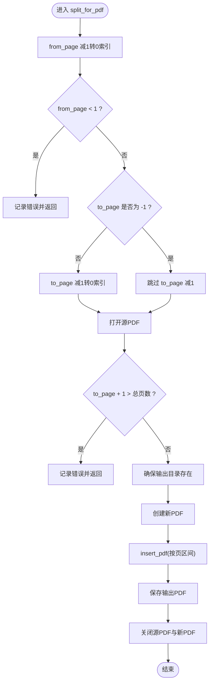
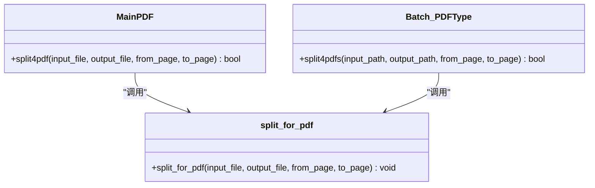
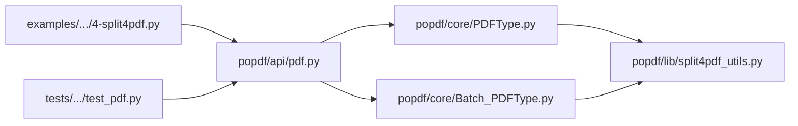

# 分割PDF接口

<cite>
**本文引用的文件**
- [popdf/api/pdf.py](file://popdf/api/pdf.py)
- [popdf/core/PDFType.py](file://popdf/core/PDFType.py)
- [popdf/core/Batch_PDFType.py](file://popdf/core/Batch_PDFType.py)
- [popdf/lib/split4pdf_utils.py](file://popdf/lib/split4pdf_utils.py)
- [examples/course/code/4-split4pdf.py](file://examples/course/code/4-split4pdf.py)
- [tests/test_code/test_pdf.py](file://tests/test_code/test_pdf.py)
- [web/src/components/PDFOrganizer.tsx](file://web/src/components/PDFOrganizer.tsx)
- [gui/main.py](file://gui/main.py)
- [popdf/__init__.py](file://popdf/__init__.py)
</cite>

## 目录
1. [简介](#简介)
2. [项目结构](#项目结构)
3. [核心组件](#核心组件)
4. [架构总览](#架构总览)
5. [详细组件分析](#详细组件分析)
6. [依赖关系分析](#依赖关系分析)
7. [性能考量](#性能考量)
8. [故障排查指南](#故障排查指南)
9. [结论](#结论)
10. [附录](#附录)

## 简介
本文件为 split4pdf 分割PDF功能的完整API文档，聚焦以下要点：
- input_file/output_file 与 input_path/output_path 两组参数的使用场景与互斥关系
- from_page 和 to_page 的页码控制机制（基于1索引），特别说明 to_page 为 -1 时代表“从 from_page 到文档末尾”
- 通过 MainPDF 类处理单个文件分割，通过 Batch_PDFType.split4pdfs 方法实现批量处理
- 提供实用示例：提取指定页面范围、批量截取合同关键页
- 记录潜在问题：大文件内存占用、页码越界错误处理、跨平台路径兼容性

## 项目结构
split4pdf 功能由三层协作构成：
- API层：对外暴露统一入口函数，负责参数校验与路由到单文件或批量处理
- 核心层：MainPDF 单文件处理；Batch_PDFType 批量处理
- 工具层：split_for_pdf 实际执行分割逻辑（底层调用 PyMuPDF）

图表来源
- [popdf/api/pdf.py](file://popdf/api/pdf.py#L93-L115)
- [popdf/core/PDFType.py](file://popdf/core/PDFType.py#L81-L97)
- [popdf/core/Batch_PDFType.py](file://popdf/core/Batch_PDFType.py#L32-L52)
- [popdf/lib/split4pdf_utils.py](file://popdf/lib/split4pdf_utils.py#L8-L38)

章节来源
- [popdf/api/pdf.py](file://popdf/api/pdf.py#L93-L115)
- [popdf/core/PDFType.py](file://popdf/core/PDFType.py#L81-L97)
- [popdf/core/Batch_PDFType.py](file://popdf/core/Batch_PDFType.py#L32-L52)
- [popdf/lib/split4pdf_utils.py](file://popdf/lib/split4pdf_utils.py#L8-L38)

## 核心组件
- API入口函数 split4pdf：根据是否提供 input_file/input_path 决定调用单文件或批量处理分支
- MainPDF.split4pdf：单文件分割入口，负责创建输出目录并委托工具函数
- Batch_PDFType.split4pdfs：批量分割入口，遍历目标目录下所有PDF并逐个分割
- split_for_pdf：实际分割逻辑，打开源PDF、计算页码区间、插入到新PDF并保存

章节来源
- [popdf/api/pdf.py](file://popdf/api/pdf.py#L93-L115)
- [popdf/core/PDFType.py](file://popdf/core/PDFType.py#L81-L97)
- [popdf/core/Batch_PDFType.py](file://popdf/core/Batch_PDFType.py#L32-L52)
- [popdf/lib/split4pdf_utils.py](file://popdf/lib/split4pdf_utils.py#L8-L38)

## 架构总览
下面的序列图展示了从API入口到具体分割执行的调用链路。

图表来源
- [popdf/api/pdf.py](file://popdf/api/pdf.py#L93-L115)
- [popdf/core/PDFType.py](file://popdf/core/PDFType.py#L81-L97)
- [popdf/core/Batch_PDFType.py](file://popdf/core/Batch_PDFType.py#L32-L52)
- [popdf/lib/split4pdf_utils.py](file://popdf/lib/split4pdf_utils.py#L8-L38)

## 详细组件分析

### API入口：split4pdf
- 参数设计
  - input_file/output_file：单文件模式专用
  - input_path/output_path：批量模式专用
  - from_page/to_page：页码范围控制（基于1索引）
- 行为规则
  - 若提供 input_file 与 output_file，则走单文件处理
  - 若提供 input_path 与 output_path，则走批量处理
  - 否则记录错误并返回 False
- 返回值
  - 成功返回 True，失败返回 False

章节来源
- [popdf/api/pdf.py](file://popdf/api/pdf.py#L93-L115)

### 单文件处理：MainPDF.split4pdf
- 职责
  - 校验输入文件路径有效性
  - 确保输出目录存在
  - 调用 split_for_pdf 执行分割
- 返回值
  - 成功返回 True，否则返回 False

章节来源
- [popdf/core/PDFType.py](file://popdf/core/PDFType.py#L81-L97)

### 批量处理：Batch_PDFType.split4pdfs
- 职责
  - 确保输出目录存在
  - 递归扫描 input_path 下的PDF文件
  - 对每个PDF调用 split_for_pdf 进行分割
- 错误处理
  - 未找到PDF文件时记录错误并返回 False
  - 输入/输出路径无效时记录错误并返回 False
  - 异常捕获并记录错误信息后返回 False

章节来源
- [popdf/core/Batch_PDFType.py](file://popdf/core/Batch_PDFType.py#L32-L52)

### 分割核心：split_for_pdf
- 页码转换
  - 将基于1索引的 from_page/to_page 转换为底层0索引（内部减1）
  - 特殊值 to_page=-1 表示“从 from_page 到文档末尾”
- 边界检查
  - from_page 不得小于1
  - to_page 不得大于总页数
- 执行流程
  - 打开源PDF
  - 创建新PDF并插入指定页区间
  - 保存输出并关闭文件句柄

图表来源
- [popdf/lib/split4pdf_utils.py](file://popdf/lib/split4pdf_utils.py#L8-L38)

章节来源
- [popdf/lib/split4pdf_utils.py](file://popdf/lib/split4pdf_utils.py#L8-L38)

### 类关系图

图表来源
- [popdf/core/PDFType.py](file://popdf/core/PDFType.py#L81-L97)
- [popdf/core/Batch_PDFType.py](file://popdf/core/Batch_PDFType.py#L32-L52)
- [popdf/lib/split4pdf_utils.py](file://popdf/lib/split4pdf_utils.py#L8-L38)

## 依赖关系分析
- API层依赖核心层与工具层
- 核心层依赖工具层
- 工具层依赖第三方库（PyMuPDF等）
- 示例与测试文件验证API行为

图表来源
- [popdf/api/pdf.py](file://popdf/api/pdf.py#L93-L115)
- [popdf/core/PDFType.py](file://popdf/core/PDFType.py#L81-L97)
- [popdf/core/Batch_PDFType.py](file://popdf/core/Batch_PDFType.py#L32-L52)
- [popdf/lib/split4pdf_utils.py](file://popdf/lib/split4pdf_utils.py#L8-L38)
- [examples/course/code/4-split4pdf.py](file://examples/course/code/4-split4pdf.py#L1-L54)
- [tests/test_code/test_pdf.py](file://tests/test_code/test_pdf.py#L80-L94)

章节来源
- [popdf/api/pdf.py](file://popdf/api/pdf.py#L93-L115)
- [popdf/core/PDFType.py](file://popdf/core/PDFType.py#L81-L97)
- [popdf/core/Batch_PDFType.py](file://popdf/core/Batch_PDFType.py#L32-L52)
- [popdf/lib/split4pdf_utils.py](file://popdf/lib/split4pdf_utils.py#L8-L38)
- [examples/course/code/4-split4pdf.py](file://examples/course/code/4-split4pdf.py#L1-L54)
- [tests/test_code/test_pdf.py](file://tests/test_code/test_pdf.py#L80-L94)

## 性能考量
- 大文件内存占用
  - 分割过程会加载源PDF至内存，再创建新PDF并插入对应页区间。对于超大PDF，建议分批处理或在低内存环境下谨慎使用
- I/O与磁盘空间
  - 输出目录需具备足够空间以容纳新PDF；建议提前清理或预估体积
- 并发与进度
  - 批量模式对每个文件独立处理，建议结合进度条或日志观察整体耗时
- PyMuPDF版本
  - 工具层使用底层库进行页区间插入，建议保持库版本更新以获得更稳定的性能表现

[本节为通用性能建议，不直接分析具体文件]

## 故障排查指南
- 参数错误
  - 未提供 input_file/output_file 或 input_path/output_path 时，API会记录错误并返回 False
- 页码越界
  - from_page 小于1：记录错误并返回
  - to_page 超过总页数：记录错误并返回
- 批量无文件
  - input_path 下未发现PDF文件：记录错误并返回 False
- 异常捕获
  - 批量处理过程中出现异常：记录错误并返回 False
- 跨平台路径兼容性
  - 建议使用绝对路径或规范化路径；Windows与Unix风格路径在拼接时需注意分隔符一致性
- 前端/GUI集成
  - Web前端与GUI均对起始页与结束页进行1索引约束与边界限制，避免非法页码传入

章节来源
- [popdf/api/pdf.py](file://popdf/api/pdf.py#L93-L115)
- [popdf/core/Batch_PDFType.py](file://popdf/core/Batch_PDFType.py#L32-L52)
- [popdf/lib/split4pdf_utils.py](file://popdf/lib/split4pdf_utils.py#L14-L23)
- [web/src/components/PDFOrganizer.tsx](file://web/src/components/PDFOrganizer.tsx#L109-L146)
- [gui/main.py](file://gui/main.py#L833-L844)

## 结论
split4pdf 接口通过清晰的参数分组（单文件 vs 批量）、明确的页码控制（1索引）与稳健的错误处理，提供了稳定可靠的PDF页面范围提取能力。配合示例与测试用例，用户可快速上手并安全地进行单文件与批量处理。

[本节为总结性内容，不直接分析具体文件]

## 附录

### API定义与使用示例

- API定义
  - 函数：split4pdf
  - 参数：
    - input_file：单文件输入路径（可含文件名）
    - output_file：单文件输出路径（可含文件名）
    - input_path：批量输入目录路径
    - output_path：批量输出目录路径
    - from_page：起始页（1索引）
    - to_page：结束页（1索引；-1表示到末尾）
  - 行为：
    - 单文件：当提供 input_file 与 output_file 时，调用 MainPDF.split4pdf
    - 批量：当提供 input_path 与 output_path 时，调用 Batch_PDFType.split4pdfs
    - 其他情况：记录错误并返回 False
  - 返回值：True/False

- 使用示例（参考路径）
  - 单文件分割示例：参见 [examples/course/code/4-split4pdf.py](file://examples/course/code/4-split4pdf.py#L20-L26)
  - 批量分割示例：参见 [examples/course/code/4-split4pdf.py](file://examples/course/code/4-split4pdf.py#L33-L38)
  - 测试用例示例：
    - 单文件：参见 [tests/test_code/test_pdf.py](file://tests/test_code/test_pdf.py#L80-L86)
    - 批量：参见 [tests/test_code/test_pdf.py](file://tests/test_code/test_pdf.py#L88-L94)

- 页码控制机制
  - from_page/to_page 基于1索引
  - to_page=-1 表示“从 from_page 到文档末尾”
  - 工具层内部将1索引转换为0索引进行底层操作

- 与GUI/Web的集成
  - Web前端对起始页与结束页进行1索引约束与边界限制，避免非法页码传入
  - GUI将用户输入映射为API调用，支持单文件与批量两种模式

章节来源
- [popdf/api/pdf.py](file://popdf/api/pdf.py#L93-L115)
- [popdf/core/PDFType.py](file://popdf/core/PDFType.py#L81-L97)
- [popdf/core/Batch_PDFType.py](file://popdf/core/Batch_PDFType.py#L32-L52)
- [popdf/lib/split4pdf_utils.py](file://popdf/lib/split4pdf_utils.py#L8-L38)
- [examples/course/code/4-split4pdf.py](file://examples/course/code/4-split4pdf.py#L20-L38)
- [tests/test_code/test_pdf.py](file://tests/test_code/test_pdf.py#L80-L94)
- [web/src/components/PDFOrganizer.tsx](file://web/src/components/PDFOrganizer.tsx#L109-L146)
- [gui/main.py](file://gui/main.py#L833-L844)