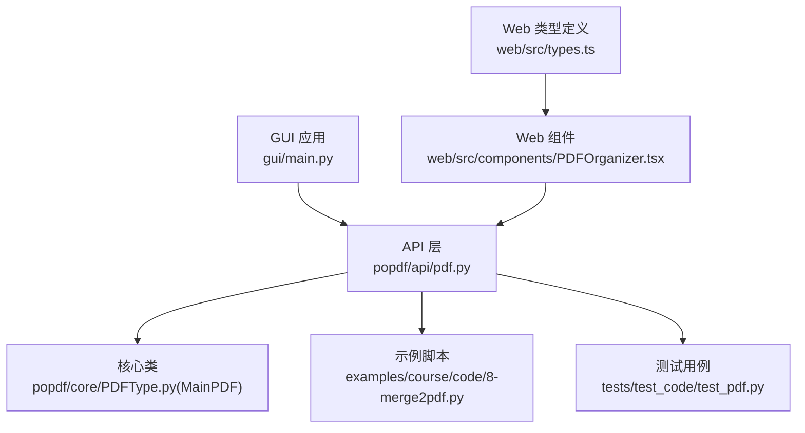
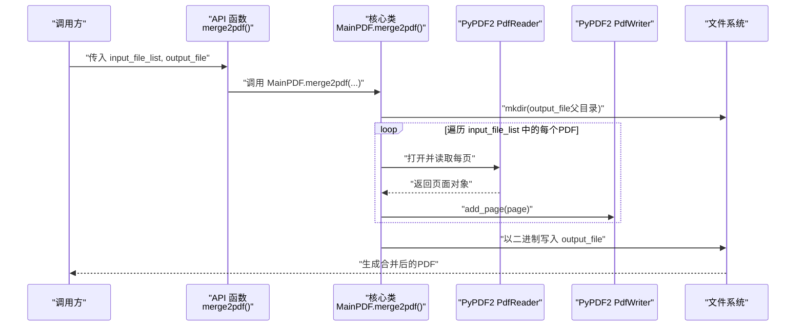
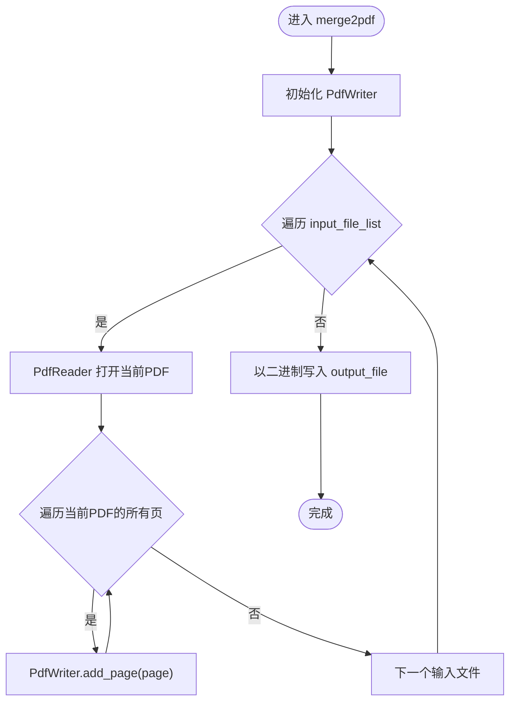
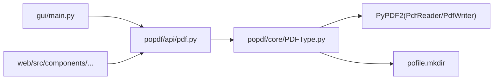

# 合并PDF接口

<cite>
**本文引用的文件**
- [popdf/api/pdf.py](file://popdf/api/pdf.py)
- [popdf/core/PDFType.py](file://popdf/core/PDFType.py)
- [examples/course/code/8-merge2pdf.py](file://examples/course/code/8-merge2pdf.py)
- [tests/test_code/test_pdf.py](file://tests/test_code/test_pdf.py)
- [gui/main.py](file://gui/main.py)
- [web/src/components/PDFOrganizer.tsx](file://web/src/components/PDFOrganizer.tsx)
- [web/src/types.ts](file://web/src/types.ts)
</cite>

## 目录
1. [简介](#简介)
2. [项目结构](#项目结构)
3. [核心组件](#核心组件)
4. [架构总览](#架构总览)
5. [详细组件分析](#详细组件分析)
6. [依赖关系分析](#依赖关系分析)
7. [性能与内存考量](#性能与内存考量)
8. [故障排查指南](#故障排查指南)
9. [结论](#结论)
10. [附录](#附录)

## 简介
本文件面向“合并PDF”能力的完整API文档，重点说明：
- input_file_list 参数的文件顺序即为输出文档的页码顺序，这是合并行为的关键特性。
- output_file 的生成规则与目录自动创建机制。
- 通过 MainPDF 类的 merge2pdf 方法，基于 PyPDF2 的 PdfWriter 逐页读取并写入新文档的实现原理。
- 典型使用场景：合并多章节文档、整合扫描件等。
- 常见问题与优化建议：大文件合并的内存消耗、路径格式错误、损坏PDF的处理策略、性能优化。

## 项目结构
围绕“合并PDF”的关键文件分布如下：
- API 层：对外暴露的函数入口，负责参数透传与调用核心实现。
- 核心层：MainPDF 类封装具体业务逻辑，包括合并PDF的实现。
- 示例与测试：演示与验证合并行为与顺序控制。
- GUI/Web：界面层支持用户选择文件顺序并触发合并。

图表来源
- [popdf/api/pdf.py](file://popdf/api/pdf.py#L174-L179)
- [popdf/core/PDFType.py](file://popdf/core/PDFType.py#L129-L147)
- [examples/course/code/8-merge2pdf.py](file://examples/course/code/8-merge2pdf.py#L13-L16)
- [tests/test_code/test_pdf.py](file://tests/test_code/test_pdf.py#L153-L157)
- [gui/main.py](file://gui/main.py#L878-L889)
- [web/src/components/PDFOrganizer.tsx](file://web/src/components/PDFOrganizer.tsx#L160-L239)
- [web/src/types.ts](file://web/src/types.ts#L58-L61)

章节来源
- [popdf/api/pdf.py](file://popdf/api/pdf.py#L174-L179)
- [popdf/core/PDFType.py](file://popdf/core/PDFType.py#L129-L147)
- [examples/course/code/8-merge2pdf.py](file://examples/course/code/8-merge2pdf.py#L13-L16)
- [tests/test_code/test_pdf.py](file://tests/test_code/test_pdf.py#L153-L157)
- [gui/main.py](file://gui/main.py#L878-L889)
- [web/src/components/PDFOrganizer.tsx](file://web/src/components/PDFOrganizer.tsx#L160-L239)
- [web/src/types.ts](file://web/src/types.ts#L58-L61)

## 核心组件
- API 函数：对外暴露的 merge2pdf(input_file_list, output_file) 仅负责参数透传，实际合并逻辑在核心类中实现。
- 核心类 MainPDF：提供 merge2pdf 方法，内部使用 PyPDF2 的 PdfReader/PdfWriter 逐页读取并写入新文档；同时对输出路径进行目录自动创建。
- 示例与测试：展示 input_file_list 的顺序即为输出顺序；测试覆盖基本合并流程。
- GUI/Web：提供文件选择与排序交互，确保最终传入的 input_file_list 顺序符合预期。

章节来源
- [popdf/api/pdf.py](file://popdf/api/pdf.py#L174-L179)
- [popdf/core/PDFType.py](file://popdf/core/PDFType.py#L129-L147)
- [examples/course/code/8-merge2pdf.py](file://examples/course/code/8-merge2pdf.py#L13-L16)
- [tests/test_code/test_pdf.py](file://tests/test_code/test_pdf.py#L153-L157)
- [gui/main.py](file://gui/main.py#L878-L889)
- [web/src/components/PDFOrganizer.tsx](file://web/src/components/PDFOrganizer.tsx#L160-L239)
- [web/src/types.ts](file://web/src/types.ts#L58-L61)

## 架构总览
下图展示了“合并PDF”从调用到落盘的端到端流程，包括参数传递、顺序控制、逐页读取与写入、目录创建等关键步骤。

图表来源
- [popdf/api/pdf.py](file://popdf/api/pdf.py#L174-L179)
- [popdf/core/PDFType.py](file://popdf/core/PDFType.py#L129-L147)

## 详细组件分析

### API 层：merge2pdf 函数
- 作用：作为对外 API，接收 input_file_list 与 output_file，并直接委托给核心类执行。
- 特性：不改变参数顺序，保持与 input_file_list 完全一致的输出顺序。

章节来源
- [popdf/api/pdf.py](file://popdf/api/pdf.py#L174-L179)

### 核心类：MainPDF.merge2pdf
- 实现原理：
  - 使用 PdfWriter 创建输出写入器。
  - 遍历 input_file_list 中的每个文件路径，使用 PdfReader 打开并逐页读取。
  - 将每一页通过 PdfWriter.add_page 追加到输出文档。
  - 最后以二进制模式写入 output_file。
- 目录自动创建：
  - 在写入前，确保 output_file 的父目录存在，若不存在则自动创建。
- 错误处理：
  - 代码中未显式捕获异常；建议调用方在外层进行 try/except 包裹，以便捕获底层异常（如文件不存在、权限不足、路径非法、损坏PDF等）。

图表来源
- [popdf/core/PDFType.py](file://popdf/core/PDFType.py#L129-L147)

章节来源
- [popdf/core/PDFType.py](file://popdf/core/PDFType.py#L129-L147)

### 示例与测试：顺序即页序
- 示例脚本明确传入两个PDF路径，演示 input_file_list 的顺序即为输出顺序。
- 测试用例同样以相同顺序传入两个文件，验证合并流程。

章节来源
- [examples/course/code/8-merge2pdf.py](file://examples/course/code/8-merge2pdf.py#L13-L16)
- [tests/test_code/test_pdf.py](file://tests/test_code/test_pdf.py#L153-L157)

### GUI/Web：顺序控制与交互
- Web 端组件允许用户勾选文件并调整顺序，最终将 order 作为 input_file_list 传入 API。
- 类型定义中包含 merge2pdf 的 order 字段，体现顺序控制的前端状态。

章节来源
- [web/src/components/PDFOrganizer.tsx](file://web/src/components/PDFOrganizer.tsx#L160-L239)
- [web/src/types.ts](file://web/src/types.ts#L58-L61)

### GUI 后端：参数透传
- GUI 后端在执行合并时，会将用户选择的文件列表与输出路径作为参数传给 API 层。

章节来源
- [gui/main.py](file://gui/main.py#L878-L889)

## 依赖关系分析
- 外部库依赖：
  - PyPDF2：提供 PdfReader/PdfWriter，用于读取与写入PDF。
  - loguru：日志记录（在其他方法中使用，合并方法本身未直接使用）。
  - pofile：提供 mkdir 工具，用于自动创建输出目录。
- 内部模块依赖：
  - API 层依赖核心类 MainPDF。
  - GUI/Web 通过 API 层间接依赖核心类。

图表来源
- [popdf/api/pdf.py](file://popdf/api/pdf.py#L174-L179)
- [popdf/core/PDFType.py](file://popdf/core/PDFType.py#L129-L147)

章节来源
- [popdf/api/pdf.py](file://popdf/api/pdf.py#L174-L179)
- [popdf/core/PDFType.py](file://popdf/core/PDFType.py#L129-L147)

## 性能与内存考量
- 逐页读取与写入：合并过程采用 PdfWriter.add_page 逐页追加，避免一次性加载全部页面到内存，有助于降低峰值内存占用。
- 大文件合并建议：
  - 控制 input_file_list 的规模，分批合并后再进行二次合并，减少单次内存压力。
  - 使用稳定的磁盘空间，避免频繁 IO 导致性能抖动。
  - 对于超大文件，考虑在外部工具或服务端执行，避免本地资源受限。
- I/O 优化：
  - 输出路径尽量指向本地 SSD，提升写入速度。
  - 避免在同一目录下同时进行大量并发写入，减少磁盘争用。

[本节为通用性能建议，不直接分析具体源码文件]

## 故障排查指南
- 路径格式错误
  - 症状：抛出文件不存在或无法打开异常。
  - 排查：确认 input_file_list 中每个路径有效且可访问；output_file 的父目录存在或可写。
  - 参考：核心类在写入前会自动创建父目录，但不会自动创建中间层级缺失的目录，需确保路径合法。
- 损坏PDF文件
  - 症状：读取阶段抛出异常或部分页面缺失。
  - 排查：尝试单独打开问题PDF，确认其完整性；替换为修复后的版本后再合并。
  - 建议：在调用前对输入文件进行预检，或在外层捕获异常并提示用户。
- 权限不足
  - 症状：写入 output_file 失败。
  - 排查：检查输出路径权限，确保有写入权限；必要时切换到非系统盘或临时目录。
- 大文件合并内存消耗
  - 症状：内存飙升导致卡顿或崩溃。
  - 排查：减少单次合并的文件数量；拆分为多次合并；监控系统内存使用。
- 并发与冲突
  - 症状：多个进程同时写入同一输出文件导致冲突。
  - 排查：确保 output_file 不被其他程序占用；使用唯一输出路径。

章节来源
- [popdf/core/PDFType.py](file://popdf/core/PDFType.py#L129-L147)

## 结论
- input_file_list 的顺序即为输出文档的页码顺序，这是合并行为的核心约定。
- output_file 的生成遵循“先创建父目录再写入”的规则，确保输出路径可用。
- 合并实现基于 PyPDF2 的 PdfWriter 逐页读取与写入，具备较好的内存友好性。
- 建议在调用层增加异常捕获与输入校验，以提升健壮性与用户体验。

[本节为总结性内容，不直接分析具体源码文件]

## 附录

### API 定义与使用要点
- 函数签名：merge2pdf(input_file_list, output_file)
- 参数说明：
  - input_file_list：待合并的PDF文件路径列表，顺序决定输出页序。
  - output_file：合并后PDF的输出路径，若父目录不存在将自动创建。
- 典型场景：
  - 合并多个章节文档：按章节顺序排列 input_file_list 即可得到正确页序。
  - 整合扫描件：将扫描件按页面顺序拼接，确保扫描方向一致，避免翻页错位。

章节来源
- [popdf/api/pdf.py](file://popdf/api/pdf.py#L174-L179)
- [popdf/core/PDFType.py](file://popdf/core/PDFType.py#L129-L147)
- [examples/course/code/8-merge2pdf.py](file://examples/course/code/8-merge2pdf.py#L13-L16)
- [tests/test_code/test_pdf.py](file://tests/test_code/test_pdf.py#L153-L157)