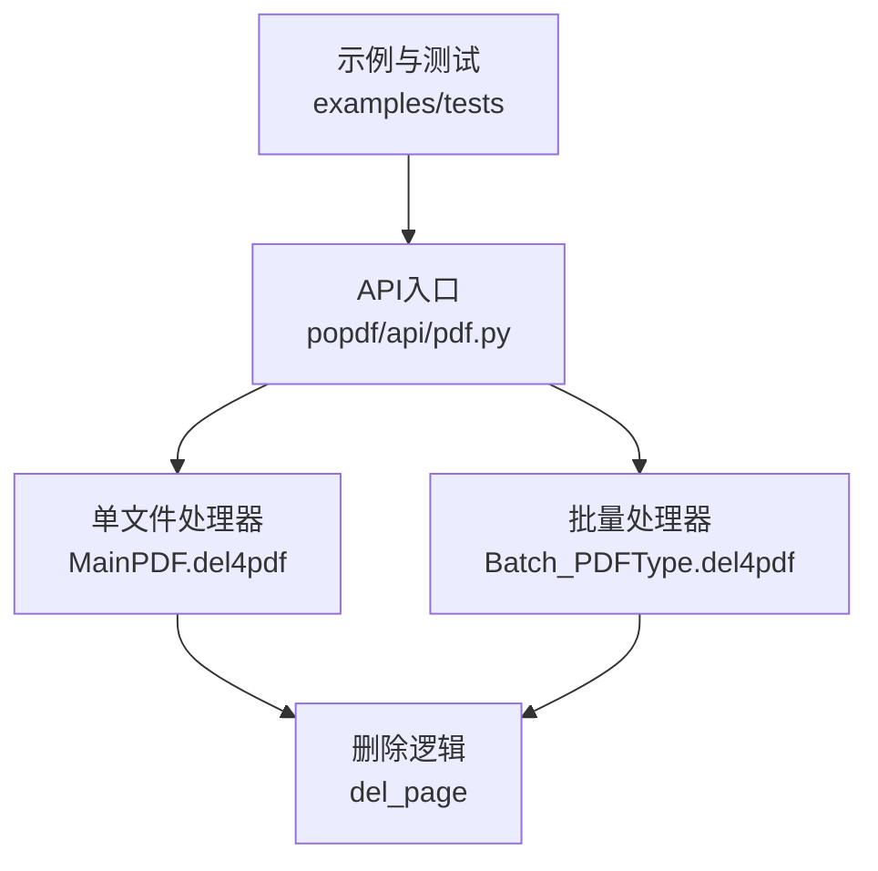
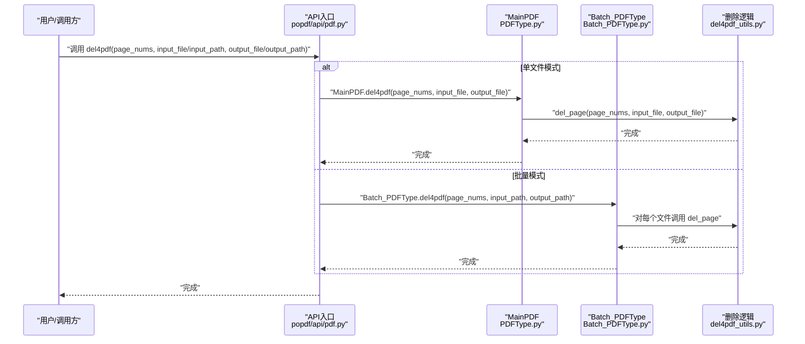
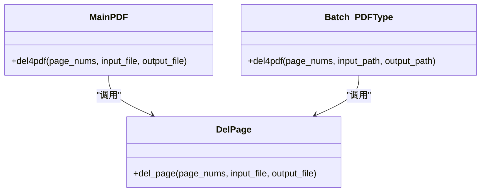
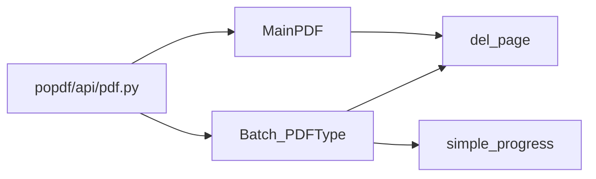
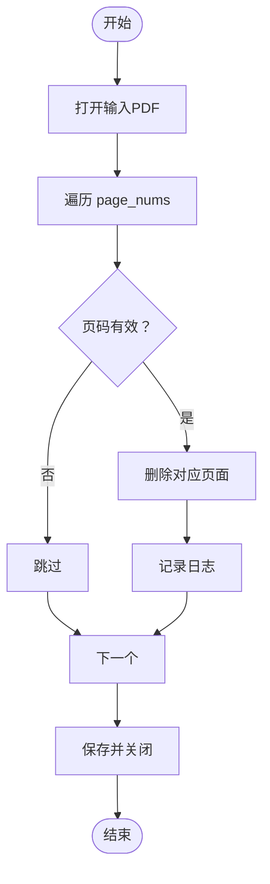

# PDF编辑API

<cite>
**本文引用的文件**
- [popdf/api/pdf.py](file://popdf/api/pdf.py)
- [popdf/core/PDFType.py](file://popdf/core/PDFType.py)
- [popdf/core/Batch_PDFType.py](file://popdf/core/Batch_PDFType.py)
- [popdf/lib/del4pdf_utils.py](file://popdf/lib/del4pdf_utils.py)
- [examples/course/code/9-del4pdf.py](file://examples/course/code/9-del4pdf.py)
- [tests/test_code/test_pdf.py](file://tests/test_code/test_pdf.py)
</cite>

## 目录
1. [简介](#简介)
2. [项目结构](#项目结构)
3. [核心组件](#核心组件)
4. [架构总览](#架构总览)
5. [详细组件分析](#详细组件分析)
6. [依赖关系分析](#依赖关系分析)
7. [性能与可用性](#性能与可用性)
8. [故障排查指南](#故障排查指南)
9. [结论](#结论)
10. [附录](#附录)

## 简介
本文件面向“删除PDF页面”能力的API文档，聚焦于 del4pdf 接口在 MainPDF 与 Batch_PDFType 中的实现机制，系统说明：
- 函数签名与参数语义（特别是 page_nums 的基于0索引的页面编号列表）
- input_file/input_path 与 output_file/output_path 的互斥关系
- 返回值与行为约定
- 单文件与批量删除的完整示例
- 进度条 simple_progress 的用户体验优化
- 常见失败原因与解决方案

## 项目结构
围绕删除页面功能，涉及如下关键模块：
- API入口层：popdf/api/pdf.py 提供 del4pdf 入口与参数分发
- 单文件处理器：popdf/core/PDFType.py 的 MainPDF.del4pdf
- 批量处理器：popdf/core/Batch_PDFType.py 的 Batch_PDFType.del4pdf
- 核心删除逻辑：popdf/lib/del4pdf_utils.py 的 del_page
- 示例与测试：examples/course/code/9-del4pdf.py 与 tests/test_code/test_pdf.py

图表来源
- [popdf/api/pdf.py](file://popdf/api/pdf.py#L183-L194)
- [popdf/core/PDFType.py](file://popdf/core/PDFType.py#L149-L161)
- [popdf/core/Batch_PDFType.py](file://popdf/core/Batch_PDFType.py#L128-L142)
- [popdf/lib/del4pdf_utils.py](file://popdf/lib/del4pdf_utils.py#L7-L20)

章节来源
- [popdf/api/pdf.py](file://popdf/api/pdf.py#L183-L194)
- [popdf/core/PDFType.py](file://popdf/core/PDFType.py#L149-L161)
- [popdf/core/Batch_PDFType.py](file://popdf/core/Batch_PDFType.py#L128-L142)
- [popdf/lib/del4pdf_utils.py](file://popdf/lib/del4pdf_utils.py#L7-L20)

## 核心组件
- del4pdf 入口函数：位于 popdf/api/pdf.py，负责根据参数选择单文件或批量处理路径
- MainPDF.del4pdf：单文件删除页面的实现
- Batch_PDFType.del4pdf：批量删除页面的实现
- del_page：底层删除逻辑，基于 PyMuPDF 对页面进行删除并保存

章节来源
- [popdf/api/pdf.py](file://popdf/api/pdf.py#L183-L194)
- [popdf/core/PDFType.py](file://popdf/core/PDFType.py#L149-L161)
- [popdf/core/Batch_PDFType.py](file://popdf/core/Batch_PDFType.py#L128-L142)
- [popdf/lib/del4pdf_utils.py](file://popdf/lib/del4pdf_utils.py#L7-L20)

## 架构总览
del4pdf 的调用链路如下：
- API 层接收参数，判断是否提供 input_file/input_path 与 output_file/output_path
- 若为单文件：调用 MainPDF.del4pdf
- 若为批量：调用 Batch_PDFType.del4pdf
- 两者最终均委托给 del_page 完成实际删除与保存

图表来源
- [popdf/api/pdf.py](file://popdf/api/pdf.py#L183-L194)
- [popdf/core/PDFType.py](file://popdf/core/PDFType.py#L149-L161)
- [popdf/core/Batch_PDFType.py](file://popdf/core/Batch_PDFType.py#L128-L142)
- [popdf/lib/del4pdf_utils.py](file://popdf/lib/del4pdf_utils.py#L7-L20)

## 详细组件分析

### API入口：del4pdf
- 函数签名与用途
  - 功能：删除PDF中的指定页码
  - 参数：
    - page_nums：必填，基于0索引的页面编号列表（注意：内部会按 page_num-1 计算实际索引）
    - input_file：单文件输入（与 input_path 二选一）
    - output_file：单文件输出（与 output_path 二选一）
    - input_path：批量输入目录（与 input_file 二选一）
    - output_path：批量输出目录（与 output_file 二选一）
  - 互斥关系：
    - 单文件模式：必须同时提供 input_file 与 output_file，且 page_nums 不为空
    - 批量模式：必须同时提供 input_path 与 output_path，且 page_nums 不为空
    - 若参数不满足上述任一组合，则记录错误日志
  - 返回值：
    - 单文件/批量成功：返回 True；失败：返回 False（由上层调用者记录日志）

- 行为要点
  - 参数校验失败时，记录错误日志并返回 False
  - 成功时分别委托 MainPDF.del4pdf 或 Batch_PDFType.del4pdf

章节来源
- [popdf/api/pdf.py](file://popdf/api/pdf.py#L183-L194)

### 单文件处理器：MainPDF.del4pdf
- 方法签名与用途
  - 功能：删除单个PDF中的指定页码
  - 参数：
    - page_nums：必填，基于0索引的页面编号列表
    - input_file：必填，输入PDF路径
    - output_file：必填，输出PDF路径
  - 返回值：无显式返回（内部调用 del_page 完成保存）

- 实现要点
  - 先创建输出目录，再调用 del_page 执行删除与保存
  - 内部直接委托至 del_page

章节来源
- [popdf/core/PDFType.py](file://popdf/core/PDFType.py#L149-L161)

### 批量处理器：Batch_PDFType.del4pdf
- 方法签名与用途
  - 功能：批量删除多个PDF中的指定页码
  - 参数：
    - page_nums：必填，基于0索引的页面编号列表
    - input_path：必填，输入目录
    - output_path：必填，输出目录
  - 返回值：无显式返回（内部遍历文件并逐个调用 del_page）

- 实现要点
  - 从 input_path 收集所有 .pdf 文件
  - 为每个输入文件创建对应的输出文件路径
  - 调用 del_page 执行删除与保存
  - 使用 simple_progress 包装文件循环，提供进度反馈

章节来源
- [popdf/core/Batch_PDFType.py](file://popdf/core/Batch_PDFType.py#L128-L142)

### 底层删除逻辑：del_page
- 函数签名与用途
  - 功能：打开输入PDF，按 page_nums 删除对应页面，保存到输出文件
  - 参数：
    - page_nums：必填，基于0索引的页面编号列表
    - input_file：必填，输入PDF路径
    - output_file：必填，输出PDF路径

- 实现要点
  - 打开输入PDF文档
  - 遍历 page_nums，对每个 page_num：
    - 将 page_num 转换为内部索引 page_num-1
    - 跳过超出范围的页码（小于等于0或大于总页数）
    - 删除对应页面并记录日志
  - 保存并关闭文档

章节来源
- [popdf/lib/del4pdf_utils.py](file://popdf/lib/del4pdf_utils.py#L7-L20)

### 类关系图（代码级）

图表来源
- [popdf/core/PDFType.py](file://popdf/core/PDFType.py#L149-L161)
- [popdf/core/Batch_PDFType.py](file://popdf/core/Batch_PDFType.py#L128-L142)
- [popdf/lib/del4pdf_utils.py](file://popdf/lib/del4pdf_utils.py#L7-L20)

## 依赖关系分析
- API层依赖 MainPDF 与 Batch_PDFType
- 二者均依赖 del_page 完成删除与保存
- 批量流程中使用 simple_progress 包装文件迭代，提升可观测性

图表来源
- [popdf/api/pdf.py](file://popdf/api/pdf.py#L183-L194)
- [popdf/core/PDFType.py](file://popdf/core/PDFType.py#L149-L161)
- [popdf/core/Batch_PDFType.py](file://popdf/core/Batch_PDFType.py#L128-L142)
- [popdf/lib/del4pdf_utils.py](file://popdf/lib/del4pdf_utils.py#L7-L20)

## 性能与可用性
- 性能特征
  - 删除操作为线性遍历 page_nums，复杂度 O(k)，k为待删页数
  - 每个PDF的打开/保存为O(n)（n为总页数），整体复杂度取决于文件数量与页数
- 用户体验优化
  - 批量模式下使用 simple_progress 包装文件迭代，提供进度反馈，避免长时间无响应
  - 日志记录删除过程，便于追踪与排障

章节来源
- [popdf/core/Batch_PDFType.py](file://popdf/core/Batch_PDFType.py#L128-L142)
- [popdf/lib/del4pdf_utils.py](file://popdf/lib/del4pdf_utils.py#L7-L20)

## 故障排查指南
- 常见失败原因
  - 参数不匹配：未同时提供 input_file+output_file 或 input_path+output_path
  - 页码范围无效：page_nums 中存在小于等于0或大于总页数的值
  - 文件权限问题：输入文件不可读、输出目录不可写
  - 路径不存在：input_path 或 output_path 不存在
- 解决方案
  - 确保仅提供一组互斥参数（单文件或批量）
  - 校验 page_nums 的有效性（基于0索引，注意转换为内部索引时的边界）
  - 确认输入文件存在且可读，输出目录存在且可写
  - 参考测试与示例，确保路径与文件名正确

章节来源
- [popdf/api/pdf.py](file://popdf/api/pdf.py#L183-L194)
- [popdf/lib/del4pdf_utils.py](file://popdf/lib/del4pdf_utils.py#L7-L20)
- [tests/test_code/test_pdf.py](file://tests/test_code/test_pdf.py#L159-L173)

## 结论
- del4pdf 提供统一入口，支持单文件与批量删除
- page_nums 采用基于0索引的页面编号列表，内部会按 page_num-1 计算实际索引
- 批量模式通过 simple_progress 提升可观测性
- 建议在调用前校验参数与路径，确保删除结果符合预期

## 附录

### API定义与参数说明
- 函数：del4pdf
- 参数
  - page_nums：必填，基于0索引的页面编号列表
  - input_file：单文件输入（与 input_path 二选一）
  - output_file：单文件输出（与 output_path 二选一）
  - input_path：批量输入目录（与 input_file 二选一）
  - output_path：批量输出目录（与 output_file 二选一）
- 互斥关系
  - 单文件模式：input_file 与 output_file 必须同时提供
  - 批量模式：input_path 与 output_path 必须同时提供
- 返回值
  - 成功：True；失败：False（并记录错误日志）

章节来源
- [popdf/api/pdf.py](file://popdf/api/pdf.py#L183-L194)

### 使用示例
- 单文件删除单个页面
  - 参考示例：[examples/course/code/9-del4pdf.py](file://examples/course/code/9-del4pdf.py#L13-L17)
- 批量删除单个页面
  - 参考测试：[tests/test_code/test_pdf.py](file://tests/test_code/test_pdf.py#L167-L173)
- 批量删除多个不连续页面
  - 参考测试：[tests/test_code/test_pdf.py](file://tests/test_code/test_pdf.py#L159-L173)
  - 注意：page_nums 为基于0索引的列表，需按内部规则转换为实际索引

章节来源
- [examples/course/code/9-del4pdf.py](file://examples/course/code/9-del4pdf.py#L13-L17)
- [tests/test_code/test_pdf.py](file://tests/test_code/test_pdf.py#L159-L173)

### 删除算法流程（基于源码）

图表来源
- [popdf/lib/del4pdf_utils.py](file://popdf/lib/del4pdf_utils.py#L7-L20)