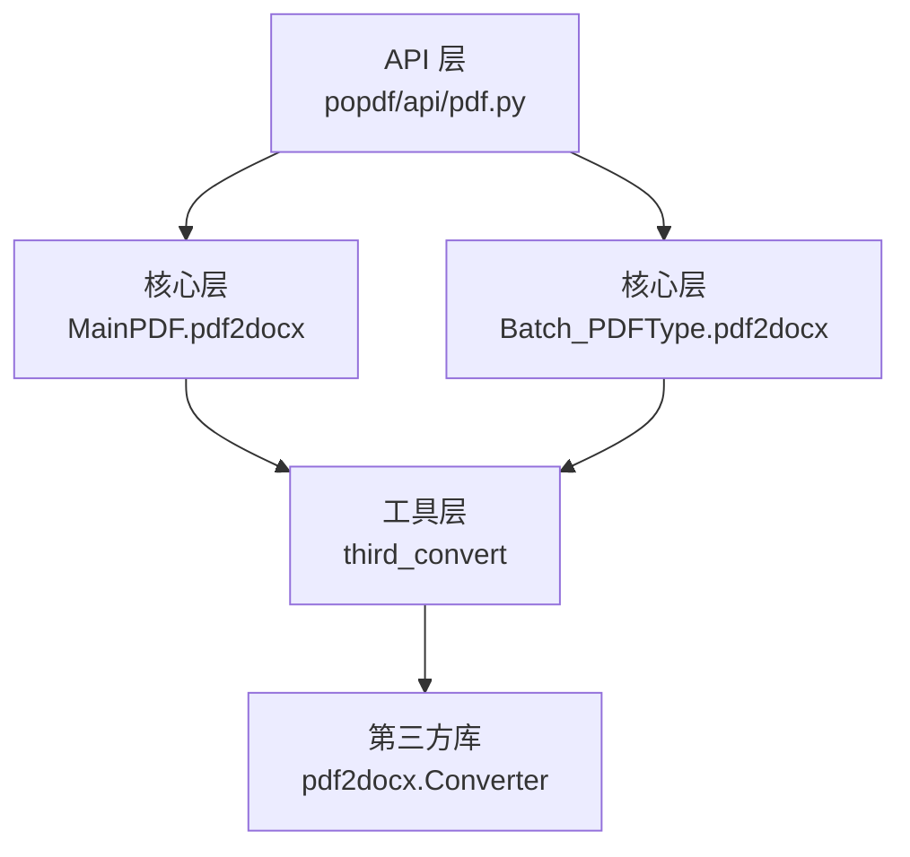
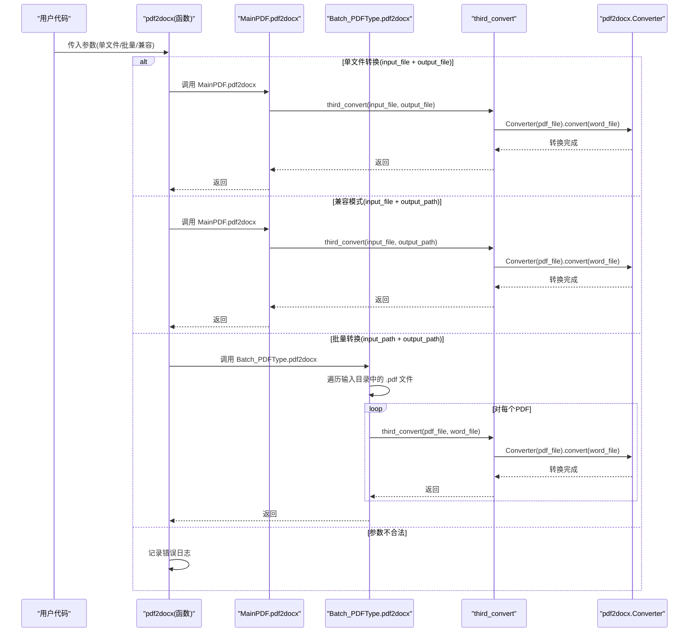
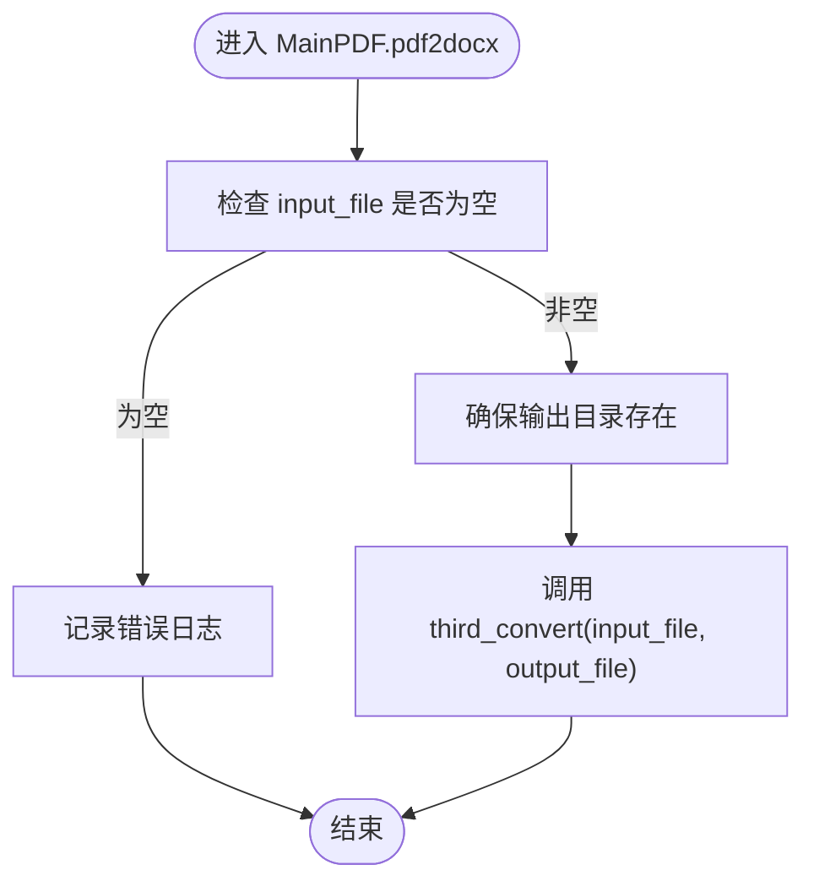
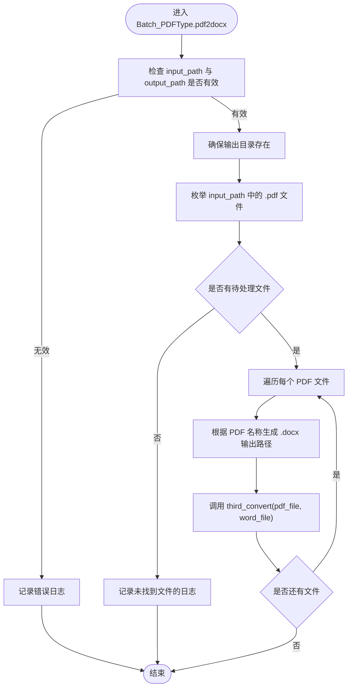
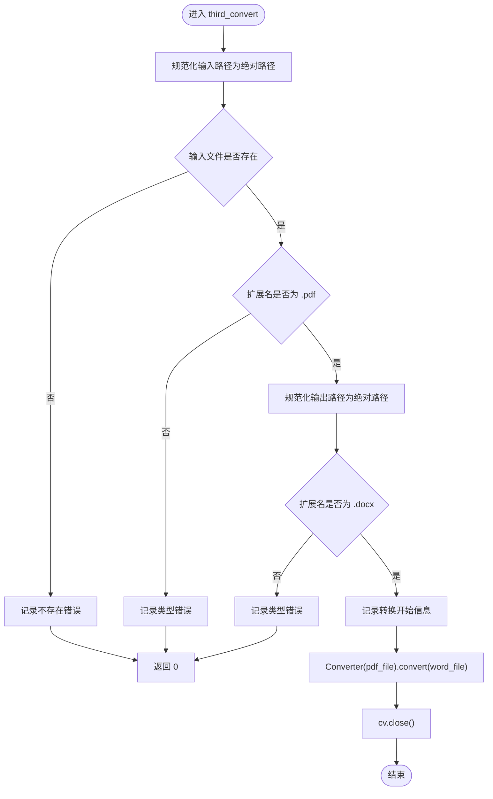
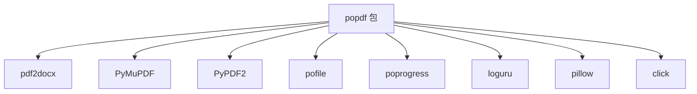

# PDF转Word API

<cite>
**本文引用的文件**
- [popdf/api/pdf.py](file://popdf/api/pdf.py)
- [popdf/core/PDFType.py](file://popdf/core/PDFType.py)
- [popdf/core/Batch_PDFType.py](file://popdf/core/Batch_PDFType.py)
- [popdf/lib/pdf2docx_utils.py](file://popdf/lib/pdf2docx_utils.py)
- [examples/course/code/1-pdf2docx.py](file://examples/course/code/1-pdf2docx.py)
- [pyproject.toml](file://pyproject.toml)
- [uv.lock](file://uv.lock)
- [popdf/__init__.py](file://popdf/__init__.py)
</cite>

## 目录
1. [简介](#简介)
2. [项目结构](#项目结构)
3. [核心组件](#核心组件)
4. [架构总览](#架构总览)
5. [详细组件分析](#详细组件分析)
6. [依赖关系分析](#依赖关系分析)
7. [性能与可靠性](#性能与可靠性)
8. [故障排查指南](#故障排查指南)
9. [结论](#结论)
10. [附录](#附录)

## 简介
本文件面向使用 popdf 的开发者，系统化梳理 popdf.api.pdf 模块中的 pdf2docx 函数及其底层实现，重点覆盖以下内容：
- 四种调用模式：单文件转换（input_file + output_file）、兼容模式（input_file + output_path）、批量转换（input_path + output_path）
- 核心方法 MainPDF.pdf2docx 与 Batch_PDFType.pdf2docx 的内部逻辑：路径处理、目录创建、第三方转换工具调用流程
- 实际使用示例：单个PDF转.docx、批量处理文件夹中的PDF
- 可能抛出的异常与错误场景：输入路径无效、输出目录不可写、文件类型不匹配等
- 第三方转换工具 third_convert 的依赖要求与行为约束

## 项目结构
popdf 的 PDF 转 Word 能力由三层协作完成：
- API 层：对外暴露 pdf2docx 函数，负责参数分发与日志提示
- 核心层：MainPDF（单文件）与 Batch_PDFType（批量）封装具体业务逻辑
- 工具层：third_convert 封装 pdf2docx.Converter 的调用，并做基础校验

图表来源
- [popdf/api/pdf.py](file://popdf/api/pdf.py#L17-L44)
- [popdf/core/PDFType.py](file://popdf/core/PDFType.py#L23-L27)
- [popdf/core/Batch_PDFType.py](file://popdf/core/Batch_PDFType.py#L21-L31)
- [popdf/lib/pdf2docx_utils.py](file://popdf/lib/pdf2docx_utils.py#L7-L23)

章节来源
- [popdf/api/pdf.py](file://popdf/api/pdf.py#L17-L44)
- [popdf/core/PDFType.py](file://popdf/core/PDFType.py#L19-L27)
- [popdf/core/Batch_PDFType.py](file://popdf/core/Batch_PDFType.py#L16-L31)
- [popdf/lib/pdf2docx_utils.py](file://popdf/lib/pdf2docx_utils.py#L1-L23)

## 核心组件
- pdf2docx 函数：根据传入参数选择调用 MainPDF.pdf2docx 或 Batch_PDFType.pdf2docx，并在参数不合法时记录错误日志
- MainPDF.pdf2docx：确保输出目录存在，调用 third_convert 完成转换
- Batch_PDFType.pdf2docx：遍历输入目录下所有 .pdf 文件，逐个转换为 .docx，输出到指定目录
- third_convert：对输入/输出路径与扩展名进行基础校验，调用 pdf2docx.Converter 执行转换

章节来源
- [popdf/api/pdf.py](file://popdf/api/pdf.py#L17-L44)
- [popdf/core/PDFType.py](file://popdf/core/PDFType.py#L23-L27)
- [popdf/core/Batch_PDFType.py](file://popdf/core/Batch_PDFType.py#L21-L31)
- [popdf/lib/pdf2docx_utils.py](file://popdf/lib/pdf2docx_utils.py#L7-L23)

## 架构总览
下面以序列图展示三种调用模式的控制流与数据流。

图表来源
- [popdf/api/pdf.py](file://popdf/api/pdf.py#L17-L44)
- [popdf/core/PDFType.py](file://popdf/core/PDFType.py#L23-L27)
- [popdf/core/Batch_PDFType.py](file://popdf/core/Batch_PDFType.py#L21-L31)
- [popdf/lib/pdf2docx_utils.py](file://popdf/lib/pdf2docx_utils.py#L7-L23)

## 详细组件分析

### 1) pdf2docx 函数与调用模式
- 单文件转换：input_file + output_file
  - 行为：直接调用 MainPDF.pdf2docx(input_file, output_file)
- 兼容模式：input_file + output_path
  - 行为：调用 MainPDF.pdf2docx(input_file, output_path)，内部仍会确保输出目录存在并调用 third_convert
- 批量转换：input_path + output_path
  - 行为：调用 Batch_PDFType.pdf2docx(input_path, output_path)，内部遍历目录中所有 .pdf 并逐个转换
- 参数不合法：记录错误日志并返回

章节来源
- [popdf/api/pdf.py](file://popdf/api/pdf.py#L17-L44)

### 2) MainPDF.pdf2docx 内部逻辑
- 路径处理：接收 input_file 与 output_file，确保输出目录存在
- 第三方工具调用：委托 third_convert 完成转换
- 目录创建：通过目录工具确保输出父目录存在

图表来源
- [popdf/core/PDFType.py](file://popdf/core/PDFType.py#L23-L27)

章节来源
- [popdf/core/PDFType.py](file://popdf/core/PDFType.py#L23-L27)

### 3) Batch_PDFType.pdf2docx 内部逻辑
- 目录创建：先确保输出目录存在
- 文件枚举：扫描输入目录下所有 .pdf 文件
- 路径拼接：将每个 PDF 的 stem 拼接为 .docx 输出文件名
- 转换调用：逐个调用 third_convert 完成转换

图表来源
- [popdf/core/Batch_PDFType.py](file://popdf/core/Batch_PDFType.py#L21-L31)

章节来源
- [popdf/core/Batch_PDFType.py](file://popdf/core/Batch_PDFType.py#L21-L31)

### 4) third_convert 工具函数
- 输入校验：确保输入文件存在且扩展名为 .pdf；输出扩展名为 .docx
- 日志记录：打印转换任务信息
- 转换执行：使用 pdf2docx.Converter 完成转换并关闭资源

图表来源
- [popdf/lib/pdf2docx_utils.py](file://popdf/lib/pdf2docx_utils.py#L7-L23)

章节来源
- [popdf/lib/pdf2docx_utils.py](file://popdf/lib/pdf2docx_utils.py#L7-L23)

### 5) 实际使用示例
- 单文件转换示例：参考示例脚本，传入 input_file 与 output_file，即可将单个 PDF 转换为 .docx
- 批量转换示例：传入 input_path 与 output_path，自动遍历目录中所有 .pdf 并输出对应 .docx

章节来源
- [examples/course/code/1-pdf2docx.py](file://examples/course/code/1-pdf2docx.py#L11-L23)

## 依赖关系分析
- 外部依赖
  - pdf2docx：核心转换引擎
  - PyMuPDF：PDF 处理能力（在其他功能中使用）
  - PyPDF2：PDF 读写能力（在其他功能中使用）
  - pofile：文件与目录工具（mkdir、get_files）
  - poprogress：进度条工具
  - loguru：日志记录
  - pillow：图像处理（在其他功能中使用）
  - click：命令行入口（在 CLI 中使用）

- 版本与安装
  - 项目声明的依赖见构建配置
  - 锁定文件显示 pdf2docx 的版本与子依赖

图表来源
- [pyproject.toml](file://pyproject.toml#L14-L23)
- [uv.lock](file://uv.lock#L1466-L1484)

章节来源
- [pyproject.toml](file://pyproject.toml#L14-L23)
- [uv.lock](file://uv.lock#L1466-L1484)

## 性能与可靠性
- 性能特征
  - 单文件转换：线性 IO，受磁盘与第三方库性能影响
  - 批量转换：串行逐个转换，适合中小规模批量；大规模建议外部并发调度
- 可靠性要点
  - 路径与扩展名校验：避免无效输入导致的异常传播
  - 目录创建：统一在转换前确保输出目录存在
  - 日志记录：便于定位问题与审计

[本节为通用指导，无需列出章节来源]

## 故障排查指南
- 常见错误与定位
  - 输入路径无效：API 层会在参数不合法时记录错误日志
  - 输入文件不存在或扩展名非 .pdf：third_convert 会记录错误并返回
  - 输出扩展名非 .docx：third_convert 会记录错误并返回
  - 输出目录不可写：目录创建阶段失败会导致后续转换无法进行
- 建议排查步骤
  - 确认输入路径指向真实存在的 .pdf 文件
  - 确认输出路径扩展名为 .docx，且父目录可写
  - 检查第三方依赖是否正确安装（pdf2docx、PyMuPDF、PyPDF2、pofile、poprogress、loguru、pillow、click）
  - 查看日志输出，定位具体失败环节

章节来源
- [popdf/api/pdf.py](file://popdf/api/pdf.py#L17-L44)
- [popdf/lib/pdf2docx_utils.py](file://popdf/lib/pdf2docx_utils.py#L7-L23)

## 结论
popdf 的 PDF 转 Word 能力通过清晰的分层设计实现了高可用与易用性：
- API 层统一入口与参数分发
- 核心层分别处理单文件与批量场景
- 工具层封装第三方转换，提供基础校验与日志
- 依赖明确，安装与运行门槛低，适合快速集成到各类自动化流程中

[本节为总结性内容，无需列出章节来源]

## 附录

### A. 四种调用模式与参数说明
- 单文件转换：input_file + output_file
- 兼容模式：input_file + output_path（内部仍以 output_file 形式处理）
- 批量转换：input_path + output_path
- 参数不合法：记录错误日志

章节来源
- [popdf/api/pdf.py](file://popdf/api/pdf.py#L17-L44)

### B. 示例脚本路径
- 单文件转换示例：[examples/course/code/1-pdf2docx.py](file://examples/course/code/1-pdf2docx.py#L11-L23)

章节来源
- [examples/course/code/1-pdf2docx.py](file://examples/course/code/1-pdf2docx.py#L11-L23)

### C. 第三方转换工具依赖
- pdf2docx：核心转换库
- 子依赖：numpy、opencv-python-headless、python-docx 等（版本随锁定文件确定）

章节来源
- [pyproject.toml](file://pyproject.toml#L14-L23)
- [uv.lock](file://uv.lock#L1073-L1098)

### D. 导出入口与版本
- 导出入口：popdf.api.pdf 模块导出 pdf2docx 等函数
- 版本：包版本在初始化文件中声明

章节来源
- [popdf/__init__.py](file://popdf/__init__.py#L1-L5)