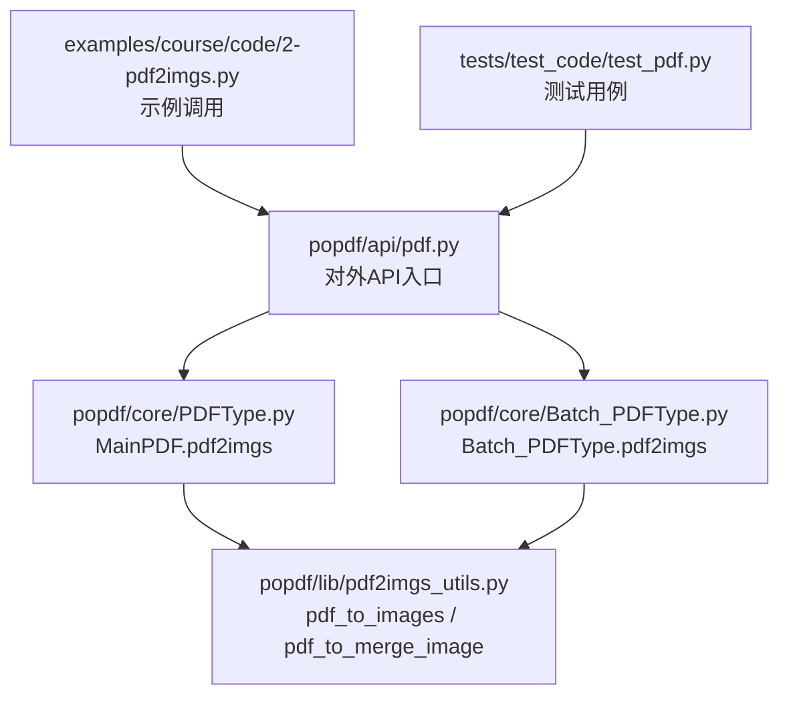
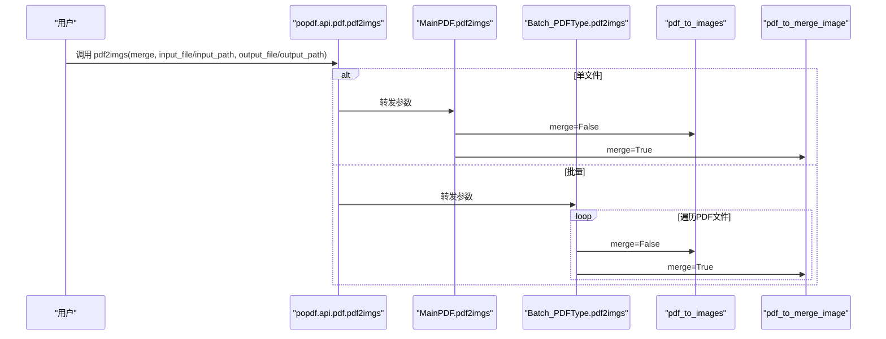
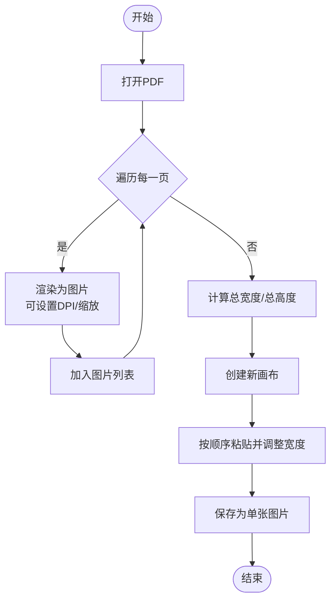
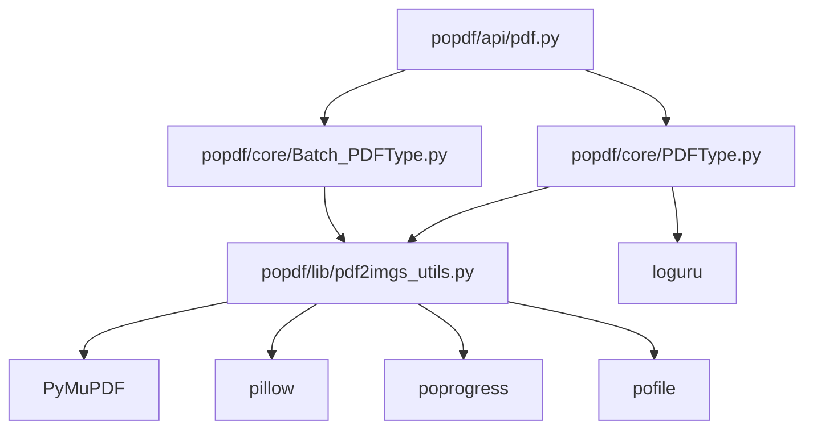

# PDF转图片 API

<cite>
**本文引用的文件**
- [popdf/api/pdf.py](file://popdf/api/pdf.py)
- [popdf/core/PDFType.py](file://popdf/core/PDFType.py)
- [popdf/core/Batch_PDFType.py](file://popdf/core/Batch_PDFType.py)
- [popdf/lib/pdf2imgs_utils.py](file://popdf/lib/pdf2imgs_utils.py)
- [examples/course/code/2-pdf2imgs.py](file://examples/course/code/2-pdf2imgs.py)
- [tests/test_code/test_pdf.py](file://tests/test_code/test_pdf.py)
- [pyproject.toml](file://pyproject.toml)
- [popdf/__init__.py](file://popdf/__init__.py)
</cite>

## 目录
1. [简介](#简介)
2. [项目结构](#项目结构)
3. [核心组件](#核心组件)
4. [架构总览](#架构总览)
5. [详细组件分析](#详细组件分析)
6. [依赖分析](#依赖分析)
7. [性能考虑](#性能考虑)
8. [故障排查指南](#故障排查指南)
9. [结论](#结论)
10. [附录](#附录)

## 简介
本文件面向 popdf.api.pdf 模块中的 pdf2imgs 函数，系统化梳理其行为与实现细节，重点说明：
- merge 参数的作用：merge=True 时将整个 PDF 合并为单张长图；merge=False 时将每页 PDF 转换为独立图片并按页码命名存储。
- MainPDF.pdf2imgs 与 Batch_PDFType.pdf2imgs 的实现机制：包括图像输出路径生成规则、批量处理时的进度提示机制。
- 工具函数 pdf_to_images 与 pdf_to_merge_image 的技术差异。
- 提供实际调用示例与常见异常场景说明，帮助用户正确使用该 API 并进行问题定位。

## 项目结构
围绕 PDF 转图片能力，相关代码分布在以下模块：
- popdf/api/pdf.py：对外暴露 pdf2imgs API，并根据参数分派到单文件或批量处理流程。
- popdf/core/PDFType.py：单文件处理类 MainPDF，封装 pdf2imgs 的具体逻辑。
- popdf/core/Batch_PDFType.py：批量处理类 Batch_PDFType，封装批量 pdf2imgs 的循环与进度提示。
- popdf/lib/pdf2imgs_utils.py：底层工具函数 pdf_to_images 与 pdf_to_merge_image，分别负责“逐页导出”和“整页拼接”。
- examples/course/code/2-pdf2imgs.py：课程示例，演示单个 PDF 转图片的基本用法。
- tests/test_code/test_pdf.py：测试用例，覆盖单文件与批量、合并与非合并等场景。

图表来源
- [popdf/api/pdf.py](file://popdf/api/pdf.py#L45-L70)
- [popdf/core/PDFType.py](file://popdf/core/PDFType.py#L28-L35)
- [popdf/core/Batch_PDFType.py](file://popdf/core/Batch_PDFType.py#L68-L79)
- [popdf/lib/pdf2imgs_utils.py](file://popdf/lib/pdf2imgs_utils.py#L10-L61)
- [examples/course/code/2-pdf2imgs.py](file://examples/course/code/2-pdf2imgs.py#L12-L14)
- [tests/test_code/test_pdf.py](file://tests/test_code/test_pdf.py#L43-L65)

章节来源
- [popdf/api/pdf.py](file://popdf/api/pdf.py#L45-L70)
- [popdf/core/PDFType.py](file://popdf/core/PDFType.py#L28-L35)
- [popdf/core/Batch_PDFType.py](file://popdf/core/Batch_PDFType.py#L68-L79)
- [popdf/lib/pdf2imgs_utils.py](file://popdf/lib/pdf2imgs_utils.py#L10-L61)
- [examples/course/code/2-pdf2imgs.py](file://examples/course/code/2-pdf2imgs.py#L12-L14)
- [tests/test_code/test_pdf.py](file://tests/test_code/test_pdf.py#L43-L65)

## 核心组件
- pdf2imgs(API)：位于 popdf/api/pdf.py，负责解析输入参数并分派到 MainPDF 或 Batch_PDFType。
- MainPDF.pdf2imgs：位于 popdf/core/PDFType.py，依据 merge 参数选择底层工具函数。
- Batch_PDFType.pdf2imgs：位于 popdf/core/Batch_PDFType.py，遍历输入目录下所有 PDF，逐个执行转换，并通过进度条提示。
- pdf_to_images：位于 popdf/lib/pdf2imgs_utils.py，逐页渲染为图片并保存，输出路径为“输出目录/原文件名-页码.jpg”。
- pdf_to_merge_image：位于 popdf/lib/pdf2imgs_utils.py，将每页渲染为图片后按宽度对齐纵向拼接为单张长图，输出为“输出文件”。

章节来源
- [popdf/api/pdf.py](file://popdf/api/pdf.py#L45-L70)
- [popdf/core/PDFType.py](file://popdf/core/PDFType.py#L28-L35)
- [popdf/core/Batch_PDFType.py](file://popdf/core/Batch_PDFType.py#L68-L79)
- [popdf/lib/pdf2imgs_utils.py](file://popdf/lib/pdf2imgs_utils.py#L10-L61)

## 架构总览
pdf2imgs 的调用链路如下：
- 单文件模式：popdf.api.pdf.pdf2imgs -> popdf.core.MainPDF.pdf2imgs -> popdf.lib.pdf2imgs_utils.pdf_to_images 或 pdf_to_merge_image
- 批量模式：popdf.api.pdf.pdf2imgs -> popdf.core.Batch_PDFType.pdf2imgs -> 遍历文件 -> 调用 pdf_to_images 或 pdf_to_merge_image

图表来源
- [popdf/api/pdf.py](file://popdf/api/pdf.py#L45-L70)
- [popdf/core/PDFType.py](file://popdf/core/PDFType.py#L28-L35)
- [popdf/core/Batch_PDFType.py](file://popdf/core/Batch_PDFType.py#L68-L79)
- [popdf/lib/pdf2imgs_utils.py](file://popdf/lib/pdf2imgs_utils.py#L10-L61)

## 详细组件分析

### pdf2imgs 函数与参数说明
- 功能：统一入口，根据传入参数决定单文件或批量处理，并透传 merge 参数。
- 参数要点：
  - input_file：单文件输入路径（与 input_path 互斥）
  - output_file：单文件输出路径（与 output_path 互斥）
  - input_path：批量输入目录（与 input_file 互斥）
  - output_path：批量输出目录（与 output_file 互斥）
  - merge：是否合并为单张长图
- 行为：
  - 单文件：调用 MainPDF.pdf2imgs
  - 批量：调用 Batch_PDFType.pdf2imgs
  - 参数错误：记录日志并返回

章节来源
- [popdf/api/pdf.py](file://popdf/api/pdf.py#L45-L70)

### MainPDF.pdf2imgs 实现机制
- 当 merge=True：直接调用 pdf_to_merge_image，输出为单张长图。
- 当 merge=False：确保输出目录存在，调用 pdf_to_images，输出为“输出目录/原文件名-页码.jpg”的多张图片。
- 输出路径生成规则：
  - 单文件非合并：输出目录为 output_file 的父目录，图片命名为“原文件名-页码.jpg”，页码从 0 开始。
  - 单文件合并：输出文件由 output_file 指定，扩展名为 .jpg。
- 进度提示：内部调用 pdf_to_images 时使用进度条库进行逐页提示。

章节来源
- [popdf/core/PDFType.py](file://popdf/core/PDFType.py#L28-L35)
- [popdf/lib/pdf2imgs_utils.py](file://popdf/lib/pdf2imgs_utils.py#L10-L26)

### Batch_PDFType.pdf2imgs 实现机制
- 遍历 input_path 下所有 .pdf 文件，逐个执行转换。
- 输出路径生成规则：
  - 合并模式：输出文件为“output_path/原PDF文件名.jpg”
  - 非合并模式：输出目录为“output_path/原PDF文件名”，并在其中生成“原PDF文件名-页码.jpg”
- 进度提示：使用进度条库对每个 PDF 文件进行进度提示。

章节来源
- [popdf/core/Batch_PDFType.py](file://popdf/core/Batch_PDFType.py#L68-L79)

### 工具函数：pdf_to_images 与 pdf_to_merge_image 的技术差异
- pdf_to_images（逐页导出）
  - 打开 PDF，遍历每一页，使用矩阵放大系数生成更高分辨率的位图，保存为 JPEG。
  - 输出命名：原文件名-页码.jpg，页码从 0 开始。
  - 适合需要保留每页独立图片的场景。
- pdf_to_merge_image（整页拼接）
  - 将每一页渲染为图片，计算最大宽度与总高度，创建新画布，按顺序纵向粘贴，最终保存为单张图片。
  - 输出命名：由调用方指定文件名（通常为 .jpg）。
  - 适合需要将整份 PDF 作为一张长图导出的场景。

图表来源
- [popdf/lib/pdf2imgs_utils.py](file://popdf/lib/pdf2imgs_utils.py#L28-L61)

章节来源
- [popdf/lib/pdf2imgs_utils.py](file://popdf/lib/pdf2imgs_utils.py#L10-L61)

### 图像输出路径生成规则
- 单文件非合并（merge=False）：
  - 输出目录：output_file 的父目录
  - 图片命名：原文件名-页码.jpg（页码从 0 开始）
- 单文件合并（merge=True）：
  - 输出文件：output_file（扩展名为 .jpg）
- 批量非合并（merge=False）：
  - 输出目录：output_path/原PDF文件名
  - 图片命名：原PDF文件名-页码.jpg（页码从 0 开始）
- 批量合并（merge=True）：
  - 输出文件：output_path/原PDF文件名.jpg

章节来源
- [popdf/core/PDFType.py](file://popdf/core/PDFType.py#L28-L35)
- [popdf/core/Batch_PDFType.py](file://popdf/core/Batch_PDFType.py#L68-L79)
- [popdf/lib/pdf2imgs_utils.py](file://popdf/lib/pdf2imgs_utils.py#L10-L26)

### 批量处理的进度提示机制
- 单文件：pdf_to_images 内部使用进度条库对页数进行迭代提示。
- 批量：Batch_PDFType.pdf2imgs 对 PDF 文件列表进行迭代，使用进度条库显示处理进度。

章节来源
- [popdf/lib/pdf2imgs_utils.py](file://popdf/lib/pdf2imgs_utils.py#L10-L16)
- [popdf/core/Batch_PDFType.py](file://popdf/core/Batch_PDFType.py#L68-L79)

### 实际代码示例
- 单个 PDF 转图片序列（非合并）：
  - 参考示例：[examples/course/code/2-pdf2imgs.py](file://examples/course/code/2-pdf2imgs.py#L12-L14)
  - 调用方式：传入 input_file 与 output_path，不传 merge 或显式传入 False
  - 输出：output_path/原文件名-页码.jpg（页码从 0 开始）
- 批量处理多个 PDF 文件（非合并）：
  - 参考测试：[tests/test_code/test_pdf.py](file://tests/test_code/test_pdf.py#L54-L59)
  - 调用方式：传入 input_path 与 output_path，不传 merge 或显式传入 False
  - 输出：output_path/原PDF文件名/原PDF文件名-页码.jpg
- 单个 PDF 合并为单张长图：
  - 参考测试：[tests/test_code/test_pdf.py](file://tests/test_code/test_pdf.py#L49-L53)
  - 调用方式：传入 input_file 与 output_file，并设置 merge=True
  - 输出：output_file（扩展名为 .jpg）
- 批量合并为单张长图：
  - 参考测试：[tests/test_code/test_pdf.py](file://tests/test_code/test_pdf.py#L60-L65)
  - 调用方式：传入 input_path 与 output_path，并设置 merge=True
  - 输出：output_path/原PDF文件名.jpg

章节来源
- [examples/course/code/2-pdf2imgs.py](file://examples/course/code/2-pdf2imgs.py#L12-L14)
- [tests/test_code/test_pdf.py](file://tests/test_code/test_pdf.py#L43-L65)

## 依赖分析
- 外部依赖（来自 pyproject.toml）：
  - PyMuPDF：PDF 渲染与位图生成
  - pillow：图像处理（如拼接、保存）
  - poprogress：进度条提示
  - pofile：文件与目录操作（如 mkdir、get_files）
  - loguru：日志记录
  - PyPDF2：PDF 相关读写（在其他功能中使用）
- 版本要求：
  - 代码中对 PyMuPDF 版本存在检查点（见 MainPDF.txt2pdf），建议确保 PyMuPDF 版本满足最低要求，避免运行时异常。

图表来源
- [pyproject.toml](file://pyproject.toml#L14-L23)
- [popdf/api/pdf.py](file://popdf/api/pdf.py#L45-L70)
- [popdf/core/PDFType.py](file://popdf/core/PDFType.py#L28-L35)
- [popdf/core/Batch_PDFType.py](file://popdf/core/Batch_PDFType.py#L68-L79)
- [popdf/lib/pdf2imgs_utils.py](file://popdf/lib/pdf2imgs_utils.py#L10-L61)

章节来源
- [pyproject.toml](file://pyproject.toml#L14-L23)
- [popdf/api/pdf.py](file://popdf/api/pdf.py#L45-L70)
- [popdf/core/PDFType.py](file://popdf/core/PDFType.py#L28-L35)
- [popdf/core/Batch_PDFType.py](file://popdf/core/Batch_PDFType.py#L68-L79)
- [popdf/lib/pdf2imgs_utils.py](file://popdf/lib/pdf2imgs_utils.py#L10-L61)

## 性能考虑
- 分辨率与缩放：工具函数内部对渲染矩阵进行了缩放，以提升图片分辨率，从而获得更清晰的输出。在高 DPI 场景下，建议合理设置 DPI 或缩放系数，平衡清晰度与文件体积。
- 批量处理：使用进度条库对文件与页数进行迭代，有助于感知处理进度；但大量文件或大体积 PDF 会带来较长耗时，建议在批量处理前预估总页数与内存占用。
- 合并模式：整页拼接会产生单张大图，需关注内存峰值与磁盘 IO；若 PDF 页数较多，建议谨慎使用合并模式。

## 故障排查指南
- 参数错误：
  - 当未提供有效输入/输出参数组合时，API 层会记录错误日志并返回。请检查 input_file/input_path 与 output_file/output_path 是否匹配。
  - 参考：[popdf/api/pdf.py](file://popdf/api/pdf.py#L61-L70)
- PyMuPDF 版本不兼容：
  - 在某些转换流程中存在对 PyMuPDF 版本的要求检查。若版本过低，可能导致运行时异常或功能不可用。请升级至满足要求的版本。
  - 参考：[popdf/core/PDFType.py](file://popdf/core/PDFType.py#L39-L40)
- 图片编码失败：
  - 若输出路径不存在或权限不足，可能导致保存失败。请确保输出目录存在且具备写权限。
  - 参考：[popdf/lib/pdf2imgs_utils.py](file://popdf/lib/pdf2imgs_utils.py#L23-L26)
- 批量处理异常：
  - 批量模式下，若输入目录为空或无 .pdf 文件，将记录相应日志。请确认输入路径与文件后缀。
  - 参考：[popdf/core/Batch_PDFType.py](file://popdf/core/Batch_PDFType.py#L33-L49)

章节来源
- [popdf/api/pdf.py](file://popdf/api/pdf.py#L61-L70)
- [popdf/core/PDFType.py](file://popdf/core/PDFType.py#L39-L40)
- [popdf/lib/pdf2imgs_utils.py](file://popdf/lib/pdf2imgs_utils.py#L23-L26)
- [popdf/core/Batch_PDFType.py](file://popdf/core/Batch_PDFType.py#L33-L49)

## 结论
- pdf2imgs 的核心在于 merge 参数的差异化处理：非合并模式输出多张图片（按页码命名），合并模式输出单张长图。
- MainPDF 与 Batch_PDFType 分别承担单文件与批量场景，均通过 pdf_to_images 与 pdf_to_merge_image 完成底层渲染与保存。
- 输出路径遵循“单文件/批量 + 合并/非合并”的规则，便于组织与检索。
- 建议在高 DPI 或大批量场景下关注性能与资源占用，并确保 PyMuPDF 版本满足要求。

## 附录
- API 调用示例参考：
  - 单文件非合并：[examples/course/code/2-pdf2imgs.py](file://examples/course/code/2-pdf2imgs.py#L12-L14)
  - 批量非合并：[tests/test_code/test_pdf.py](file://tests/test_code/test_pdf.py#L54-L59)
  - 单文件合并：[tests/test_code/test_pdf.py](file://tests/test_code/test_pdf.py#L49-L53)
  - 批量合并：[tests/test_code/test_pdf.py](file://tests/test_code/test_pdf.py#L60-L65)
- 初始化与版本信息：
  - 包初始化：[popdf/__init__.py](file://popdf/__init__.py#L1-L6)
  - 依赖声明：[pyproject.toml](file://pyproject.toml#L14-L23)