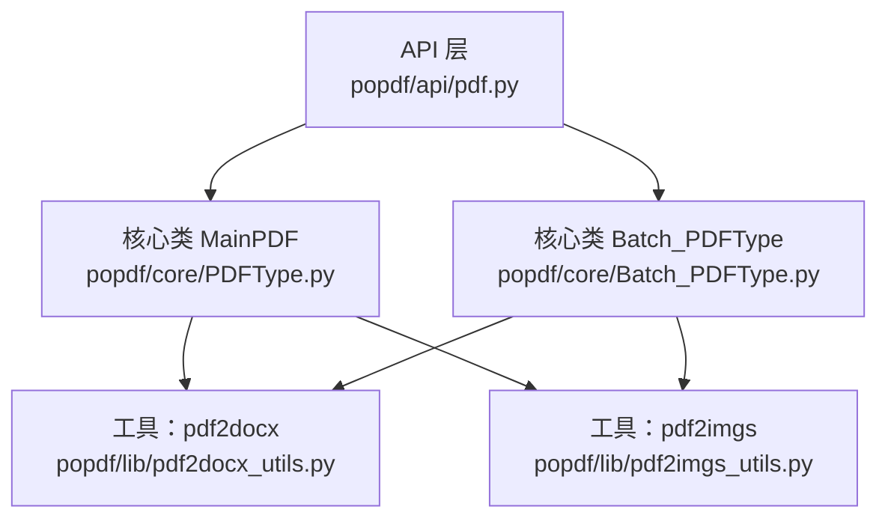
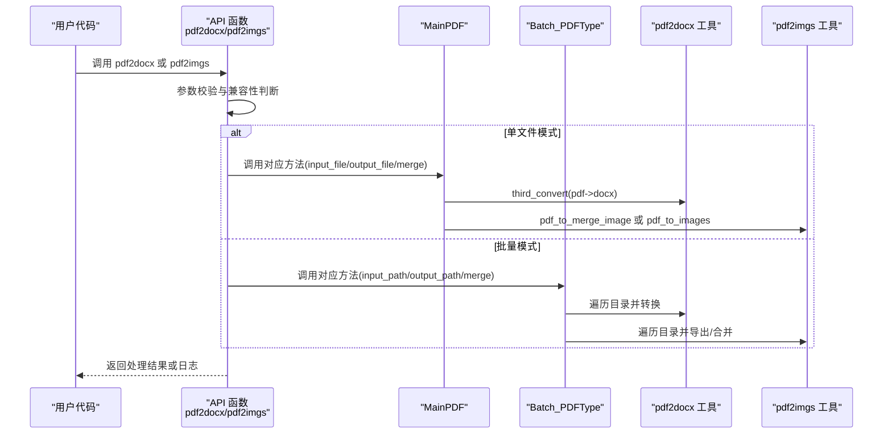
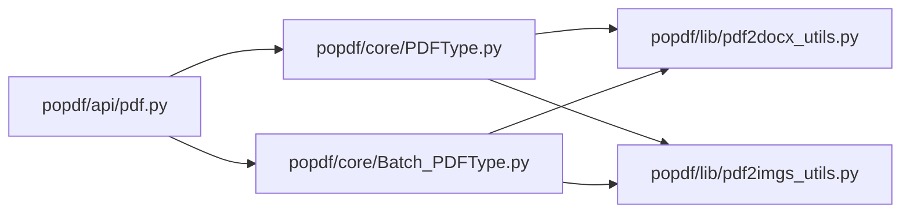

# PDF转换API

<cite>
**本文引用的文件**
- [popdf/api/pdf.py](file://popdf/api/pdf.py)
- [popdf/core/Batch_PDFType.py](file://popdf/core/Batch_PDFType.py)
- [popdf/core/PDFType.py](file://popdf/core/PDFType.py)
- [popdf/lib/pdf2docx_utils.py](file://popdf/lib/pdf2docx_utils.py)
- [popdf/lib/pdf2imgs_utils.py](file://popdf/lib/pdf2imgs_utils.py)
- [examples/course/code/1-pdf2docx.py](file://examples/course/code/1-pdf2docx.py)
- [examples/course/code/2-pdf2imgs.py](file://examples/course/code/2-pdf2imgs.py)
- [popdf/__init__.py](file://popdf/__init__.py)
- [README.md](file://README.md)
</cite>

## 目录
1. [简介](#简介)
2. [项目结构](#项目结构)
3. [核心组件](#核心组件)
4. [架构总览](#架构总览)
5. [详细组件分析](#详细组件分析)
6. [依赖关系分析](#依赖关系分析)
7. [性能与行为特性](#性能与行为特性)
8. [故障排查指南](#故障排查指南)
9. [结论](#结论)
10. [附录](#附录)

## 简介
本文件面向使用 popdf 的开发者，系统化梳理 PDF 转 Word（pdf2docx）与 PDF 转图片（pdf2imgs）两大核心接口的 API 设计与使用规范，重点覆盖：
- MainPDF 类与 Batch_PDFType 类中对应方法的函数签名、参数类型、默认值与语义
- input_file/input_path 与 output_file/output_path 的路径参数使用规则
- 单文件处理与批量处理的调用差异
- 实际代码示例路径（以文件路径代替具体代码片段）
- 可能抛出的异常情形（如文件不存在、路径无效等）
- merge 参数在图片转换中的作用说明

## 项目结构
popdf 的核心由三层构成：
- API 层：对外暴露统一入口函数，负责参数校验与路由至具体实现
- 核心层：MainPDF（单文件）与 Batch_PDFType（批量）两类核心类
- 工具层：各功能的具体实现（如 pdf2docx、pdf2imgs 的底层转换逻辑）

图表来源
- [popdf/api/pdf.py](file://popdf/api/pdf.py#L1-L120)
- [popdf/core/PDFType.py](file://popdf/core/PDFType.py#L1-L120)
- [popdf/core/Batch_PDFType.py](file://popdf/core/Batch_PDFType.py#L1-L80)
- [popdf/lib/pdf2docx_utils.py](file://popdf/lib/pdf2docx_utils.py#L1-L23)
- [popdf/lib/pdf2imgs_utils.py](file://popdf/lib/pdf2imgs_utils.py#L1-L62)

章节来源
- [popdf/api/pdf.py](file://popdf/api/pdf.py#L1-L120)
- [popdf/core/PDFType.py](file://popdf/core/PDFType.py#L1-L120)
- [popdf/core/Batch_PDFType.py](file://popdf/core/Batch_PDFType.py#L1-L80)

## 核心组件
- API 函数 pdf2docx 与 pdf2imgs：负责参数解析与路由，支持单文件与批量两种模式
- MainPDF：提供单文件转换能力，内部调用工具层实现
- Batch_PDFType：提供批量转换能力，内部遍历目录并调用工具层实现
- 工具层：
  - pdf2docx_utils.third_convert：封装 pdf2docx 的转换流程与基础校验
  - pdf2imgs_utils.pdf_to_images 与 pdf_to_merge_image：分别实现分页导出与整图合并

章节来源
- [popdf/api/pdf.py](file://popdf/api/pdf.py#L17-L70)
- [popdf/core/PDFType.py](file://popdf/core/PDFType.py#L23-L35)
- [popdf/core/Batch_PDFType.py](file://popdf/core/Batch_PDFType.py#L68-L79)
- [popdf/lib/pdf2docx_utils.py](file://popdf/lib/pdf2docx_utils.py#L7-L23)
- [popdf/lib/pdf2imgs_utils.py](file://popdf/lib/pdf2imgs_utils.py#L10-L62)

## 架构总览
下图展示 pdf2docx 与 pdf2imgs 的调用链路与数据流：

图表来源
- [popdf/api/pdf.py](file://popdf/api/pdf.py#L17-L70)
- [popdf/core/PDFType.py](file://popdf/core/PDFType.py#L23-L35)
- [popdf/core/Batch_PDFType.py](file://popdf/core/Batch_PDFType.py#L21-L79)
- [popdf/lib/pdf2docx_utils.py](file://popdf/lib/pdf2docx_utils.py#L7-L23)
- [popdf/lib/pdf2imgs_utils.py](file://popdf/lib/pdf2imgs_utils.py#L10-L62)

## 详细组件分析

### API 层：pdf2docx 与 pdf2imgs
- pdf2docx
  - 函数签名要点：接收 input_file、output_file、input_path、output_path 四类参数；通过条件分支选择单文件或批量调用
  - 参数语义：
    - input_file：单文件输入路径（含扩展名）
    - output_file：单文件输出路径（含扩展名，通常为 .docx）
    - input_path：批量输入目录路径
    - output_path：批量输出目录路径
  - 调用差异：
    - 单文件：直接调用 MainPDF.pdf2docx(input_file, output_file)
    - 批量：调用 Batch_PDFType.pdf2docx(input_path, output_path)
  - 兼容性：对旧版参数命名（<=1.0.1）做了兼容处理
- pdf2imgs
  - 函数签名要点：接收 input_file、output_file、input_path、output_path、merge 五类参数
  - 参数语义：
    - merge：布尔值，控制是否将多页合并为一张图片
  - 调用差异：
    - 单文件：MainPDF.pdf2imgs(input_file, output_file, merge)
    - 批量：Batch_PDFType.pdf2imgs(input_path, output_path, merge)

章节来源
- [popdf/api/pdf.py](file://popdf/api/pdf.py#L17-L70)

### 核心类：MainPDF
- pdf2docx(input_file, output_file)
  - 行为：确保输出目录存在，调用 third_convert 完成转换
  - 注意：output_file 必须为完整文件路径（含 .docx）
- pdf2imgs(input_file, output_file, merge)
  - 行为：
    - merge=True：调用 pdf_to_merge_image，将整份 PDF 合并为一张高分辨率图片
    - merge=False：调用 pdf_to_images，按页导出为多张图片（输出目录需存在）
  - 注意：当 merge=False 时，output_file 作为输出目录路径使用

章节来源
- [popdf/core/PDFType.py](file://popdf/core/PDFType.py#L23-L35)

### 核心类：Batch_PDFType
- pdf2docx(input_path, output_path)
  - 行为：扫描 input_path 下所有 .pdf 文件，逐一转换为 .docx，输出到 output_path
- pdf2imgs(input_path, output_path, merge)
  - 行为：
    - merge=True：对每个 PDF 调用 pdf_to_merge_image，输出为 .jpg
    - merge=False：对每个 PDF 调用 pdf_to_images，输出为同名目录下的多张图片
  - 注意：会自动创建输出目录

章节来源
- [popdf/core/Batch_PDFType.py](file://popdf/core/Batch_PDFType.py#L21-L79)

### 工具层：pdf2docx 与 pdf2imgs
- pdf2docx_utils.third_convert(pdf_file, word_file)
  - 校验：输入文件存在且为 .pdf，输出文件后缀为 .docx
  - 流程：创建 Converter 并执行转换
- pdf2imgs_utils.pdf_to_images(input_file, output_path)
  - 行为：逐页渲染为图片，保存为“文件名-页码.jpg”
- pdf2imgs_utils.pdf_to_merge_image(input_file, output_file, dpi=300)
  - 行为：将所有页按顺序垂直拼接为一张大图，输出为 .jpg

章节来源
- [popdf/lib/pdf2docx_utils.py](file://popdf/lib/pdf2docx_utils.py#L7-L23)
- [popdf/lib/pdf2imgs_utils.py](file://popdf/lib/pdf2imgs_utils.py#L10-L62)

### 路径参数使用规则
- input_file 与 output_file
  - 单文件模式下，output_file 通常为完整文件路径（含扩展名）
  - 当 merge=False 且 pdf2imgs 用于单文件时，output_file 会被视为输出目录
- input_path 与 output_path
  - 批量模式下，input_path 为目录，output_path 为目录；工具层会自动创建输出目录
- 兼容性
  - API 层对旧版参数命名（<=1.0.1）做了兼容处理，允许 input_file+output_path 的组合

章节来源
- [popdf/api/pdf.py](file://popdf/api/pdf.py#L17-L70)
- [popdf/core/PDFType.py](file://popdf/core/PDFType.py#L23-L35)
- [popdf/core/Batch_PDFType.py](file://popdf/core/Batch_PDFType.py#L21-L79)

### 单文件 vs 批量处理调用差异
- 单文件
  - pdf2docx：MainPDF.pdf2docx(input_file, output_file)
  - pdf2imgs：MainPDF.pdf2imgs(input_file, output_file, merge)
- 批量
  - pdf2docx：Batch_PDFType.pdf2docx(input_path, output_path)
  - pdf2imgs：Batch_PDFType.pdf2imgs(input_path, output_path, merge)

章节来源
- [popdf/api/pdf.py](file://popdf/api/pdf.py#L17-L70)
- [popdf/core/PDFType.py](file://popdf/core/PDFType.py#L23-L35)
- [popdf/core/Batch_PDFType.py](file://popdf/core/Batch_PDFType.py#L21-L79)

### merge 参数的作用
- 在 pdf2imgs 中：
  - merge=True：将整份 PDF 合并为一张图片（适合长图场景）
  - merge=False：按页导出为多张图片（适合分页浏览与处理）

章节来源
- [popdf/api/pdf.py](file://popdf/api/pdf.py#L45-L70)
- [popdf/core/PDFType.py](file://popdf/core/PDFType.py#L28-L35)
- [popdf/core/Batch_PDFType.py](file://popdf/core/Batch_PDFType.py#L68-L79)
- [popdf/lib/pdf2imgs_utils.py](file://popdf/lib/pdf2imgs_utils.py#L28-L62)

### 实际使用示例（代码路径）
- 将单个 PDF 转为 Word 文档
  - 示例路径：[examples/course/code/1-pdf2docx.py](file://examples/course/code/1-pdf2docx.py#L1-L35)
- 将单个 PDF 转为图片（批量输出为多张图片）
  - 示例路径：[examples/course/code/2-pdf2imgs.py](file://examples/course/code/2-pdf2imgs.py#L1-L27)
- 将单个 PDF 转为图片（合并为一张长图）
  - 可在调用 pdf2imgs 时传入 merge=True（示例路径见上一节“调用差异”）

章节来源
- [examples/course/code/1-pdf2docx.py](file://examples/course/code/1-pdf2docx.py#L1-L35)
- [examples/course/code/2-pdf2imgs.py](file://examples/course/code/2-pdf2imgs.py#L1-L27)

## 依赖关系分析
- API 层依赖核心类与工具层
- 核心类依赖工具层实现
- 工具层依赖第三方库（pdf2docx、PyMuPDF、Pillow 等）

图表来源
- [popdf/api/pdf.py](file://popdf/api/pdf.py#L1-L120)
- [popdf/core/PDFType.py](file://popdf/core/PDFType.py#L1-L120)
- [popdf/core/Batch_PDFType.py](file://popdf/core/Batch_PDFType.py#L1-L80)
- [popdf/lib/pdf2docx_utils.py](file://popdf/lib/pdf2docx_utils.py#L1-L23)
- [popdf/lib/pdf2imgs_utils.py](file://popdf/lib/pdf2imgs_utils.py#L1-L62)

## 性能与行为特性
- 单文件模式：直接调用对应工具函数，开销主要来自底层渲染与 IO
- 批量模式：会遍历目录并逐个处理，建议合理规划输出目录与磁盘空间
- 合并图片（merge=True）：整图拼接会占用更多内存与磁盘空间，建议控制 DPI 与 PDF 页数
- 进度提示：工具层使用进度条库进行进度提示，便于长耗时任务监控

章节来源
- [popdf/core/Batch_PDFType.py](file://popdf/core/Batch_PDFType.py#L68-L79)
- [popdf/lib/pdf2imgs_utils.py](file://popdf/lib/pdf2imgs_utils.py#L10-L62)

## 故障排查指南
- 常见错误与定位
  - 参数填写错误：API 层会在参数不合法时记录错误日志
  - 输入或输出路径无效：批量处理时若路径为空或不可访问，会记录错误
  - 未找到 PDF 文件：批量处理时若目录内无 .pdf 文件，会记录相应提示
  - 文件不存在或非 PDF：工具层会对输入文件存在性与后缀进行校验
  - 版本依赖：部分功能依赖 PyMuPDF v1.14.0+，低版本会触发退出
- 建议排查步骤
  - 确认 input_file/input_path 与 output_file/output_path 是否正确
  - 确认输出目录权限与磁盘空间
  - 对于 pdf2imgs 合并模式，确认 DPI 设置与 PDF 页数
  - 查看日志输出，定位具体失败环节

章节来源
- [popdf/api/pdf.py](file://popdf/api/pdf.py#L34-L70)
- [popdf/core/Batch_PDFType.py](file://popdf/core/Batch_PDFType.py#L32-L79)
- [popdf/core/PDFType.py](file://popdf/core/PDFType.py#L36-L40)
- [popdf/lib/pdf2docx_utils.py](file://popdf/lib/pdf2docx_utils.py#L7-L23)

## 结论
- popdf 提供统一的 API 入口，兼顾单文件与批量处理
- MainPDF 与 Batch_PDFType 分别承担单文件与批量转换职责，工具层实现具体转换细节
- merge 参数在图片转换中起到关键作用：分页导出与整图合并二选一
- 使用示例位于 examples/course/code，可据此快速上手

## 附录

### API 方法定义与参数说明（摘要）
- pdf2docx(input_file=None, output_file=None, input_path=None, output_path=None)
  - 单文件：input_file + output_file
  - 批量：input_path + output_path
- pdf2imgs(input_file=None, output_file=None, input_path=None, output_path=None, merge=False)
  - 单文件：input_file + output_file（merge 控制输出形态）
  - 批量：input_path + output_path（merge 控制输出形态）

章节来源
- [popdf/api/pdf.py](file://popdf/api/pdf.py#L17-L70)

### 典型使用场景（代码路径）
- 单个 PDF 转 Word 文档：[examples/course/code/1-pdf2docx.py](file://examples/course/code/1-pdf2docx.py#L1-L35)
- 单个 PDF 转图片（多页导出）：[examples/course/code/2-pdf2imgs.py](file://examples/course/code/2-pdf2imgs.py#L1-L27)
- 合并为一张长图：在调用 pdf2imgs 时传入 merge=True（参见“调用差异”）

章节来源
- [examples/course/code/1-pdf2docx.py](file://examples/course/code/1-pdf2docx.py#L1-L35)
- [examples/course/code/2-pdf2imgs.py](file://examples/course/code/2-pdf2imgs.py#L1-L27)