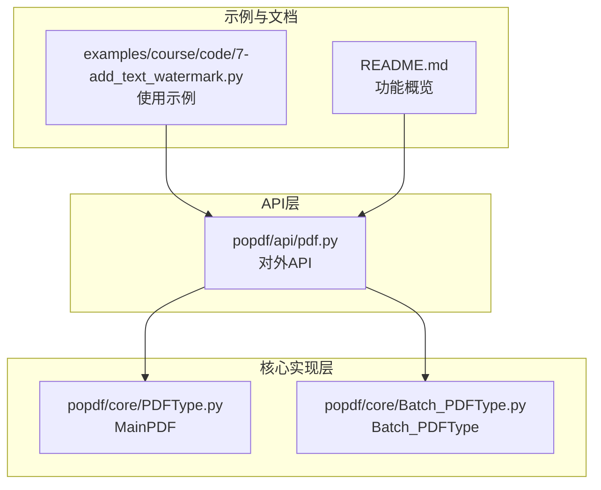
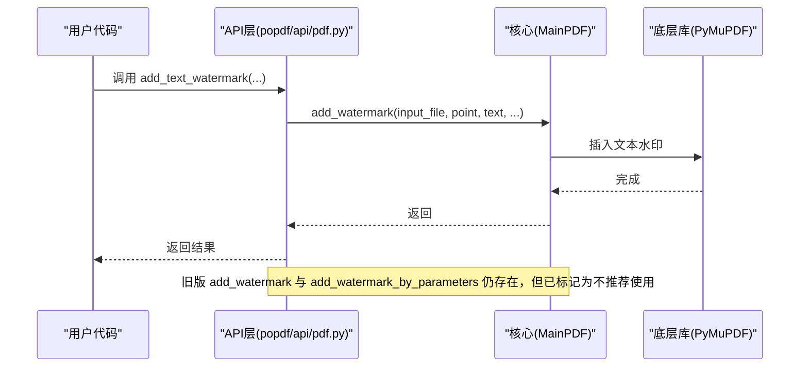
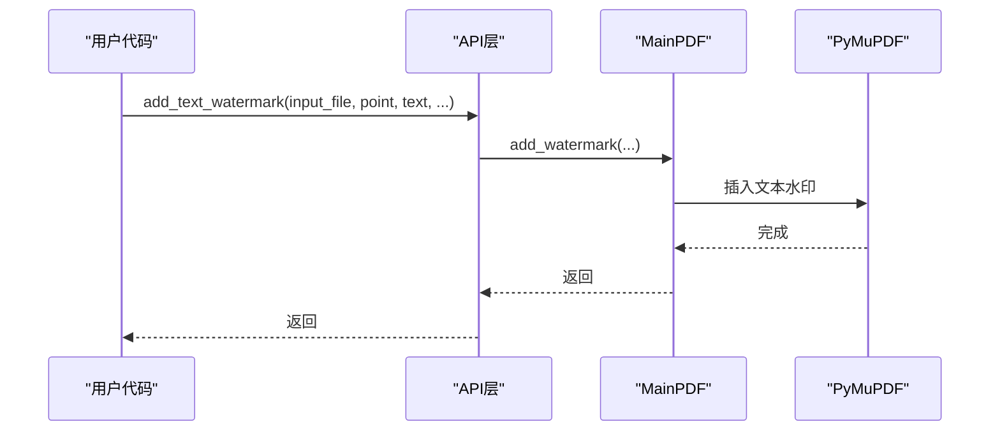
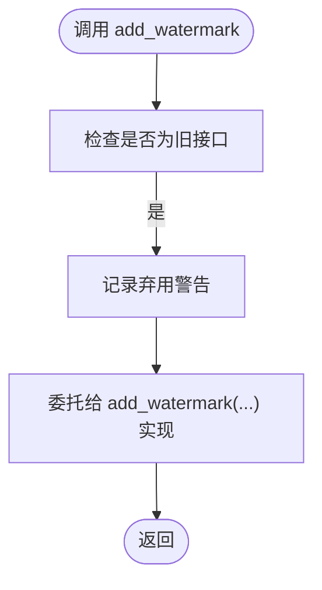
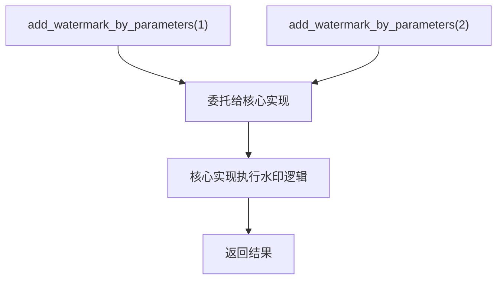
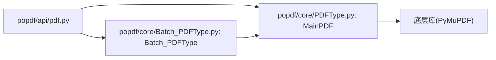

# 遗留API

<cite>
**本文引用的文件**
- [popdf/api/pdf.py](file://popdf/api/pdf.py)
- [popdf/core/PDFType.py](file://popdf/core/PDFType.py)
- [popdf/core/Batch_PDFType.py](file://popdf/core/Batch_PDFType.py)
- [examples/course/code/7-add_text_watermark.py](file://examples/course/code/7-add_text_watermark.py)
- [README.md](file://README.md)
</cite>

## 目录
1. [简介](#简介)
2. [项目结构](#项目结构)
3. [核心组件](#核心组件)
4. [架构总览](#架构总览)
5. [详细组件分析](#详细组件分析)
6. [依赖关系分析](#依赖关系分析)
7. [性能与兼容性考量](#性能与兼容性考量)
8. [迁移指南](#迁移指南)
9. [故障排查](#故障排查)
10. [结论](#结论)

## 简介
本文件聚焦于项目中已弃用或不推荐使用的API接口，尤其是“添加水印”相关接口：add_watermark 与重复声明的 add_watermark_by_parameters 函数。这些接口已被更现代、参数更清晰的 add_text_watermark 等接口所取代。文档明确指出保留这些旧接口的向后兼容性考虑，同时强烈建议新用户使用更新的API；并提供从旧接口迁移到新接口的代码转换指南，包括参数映射与调用方式变更，以及未来版本中可能完全移除这些遗留接口的风险提示，帮助开发者评估技术债务。

## 项目结构
围绕“遗留API”的关键文件分布如下：
- popdf/api/pdf.py：对外暴露的高层API，包含旧版水印接口与新版 add_text_watermark。
- popdf/core/PDFType.py：核心实现层，包含 add_watermark 的具体实现。
- popdf/core/Batch_PDFType.py：批量处理能力，配合 api 层完成批量场景。
- examples/course/code/7-add_text_watermark.py：新版 add_text_watermark 的使用示例。
- README.md：项目功能概览，包含“PDF加水印”功能入口。

图表来源
- [popdf/api/pdf.py](file://popdf/api/pdf.py#L1-L235)
- [popdf/core/PDFType.py](file://popdf/core/PDFType.py#L1-L180)
- [popdf/core/Batch_PDFType.py](file://popdf/core/Batch_PDFType.py#L1-L142)
- [examples/course/code/7-add_text_watermark.py](file://examples/course/code/7-add_text_watermark.py#L1-L26)
- [README.md](file://README.md#L56-L72)

章节来源
- [popdf/api/pdf.py](file://popdf/api/pdf.py#L1-L235)
- [README.md](file://README.md#L56-L72)

## 核心组件
- 对外API层（popdf/api/pdf.py）
  - 提供 add_text_watermark 等现代化接口。
  - 保留 add_watermark 与重复声明的 add_watermark_by_parameters 作为兼容接口，并附带警告与替代指引。
- 核心实现层（popdf/core/PDFType.py）
  - 实现 add_watermark 的底层逻辑，负责文本水印插入。
- 批量处理层（popdf/core/Batch_PDFType.py）
  - 提供批量场景的封装，配合 API 层完成批量水印等操作。

章节来源
- [popdf/api/pdf.py](file://popdf/api/pdf.py#L154-L235)
- [popdf/core/PDFType.py](file://popdf/core/PDFType.py#L162-L174)
- [popdf/core/Batch_PDFType.py](file://popdf/core/Batch_PDFType.py#L1-L142)

## 架构总览
对外API通过 API 层转发至核心实现层，再由核心实现层调用底层库完成实际处理。对于水印功能，新版 add_text_watermark 直接委托给核心实现层的 add_water印，旧版 add_watermark 与 add_watermark_by_parameters 仍存在以保证兼容。

图表来源
- [popdf/api/pdf.py](file://popdf/api/pdf.py#L154-L173)
- [popdf/core/PDFType.py](file://popdf/core/PDFType.py#L162-L174)

## 详细组件分析

### add_text_watermark（推荐的新接口）
- 作用：在PDF文档中添加文本水印，参数清晰、语义明确。
- 调用链路：API层 -> 核心实现层 -> 底层库。
- 示例：见示例脚本。

图表来源
- [popdf/api/pdf.py](file://popdf/api/pdf.py#L154-L173)
- [popdf/core/PDFType.py](file://popdf/core/PDFType.py#L162-L174)
- [examples/course/code/7-add_text_watermark.py](file://examples/course/code/7-add_text_watermark.py#L12-L13)

章节来源
- [popdf/api/pdf.py](file://popdf/api/pdf.py#L154-L173)
- [popdf/core/PDFType.py](file://popdf/core/PDFType.py#L162-L174)
- [examples/course/code/7-add_text_watermark.py](file://examples/course/code/7-add_text_watermark.py#L12-L13)

### add_watermark（已弃用的旧接口）
- 作用：旧版文本水印接口，参数与语义不如新版清晰。
- 状态：已标记为不推荐使用，建议迁移至 add_text_watermark。
- 调用链路：API层 -> 核心实现层 -> 底层库。

图表来源
- [popdf/api/pdf.py](file://popdf/api/pdf.py#L196-L203)
- [popdf/core/PDFType.py](file://popdf/core/PDFType.py#L162-L174)

章节来源
- [popdf/api/pdf.py](file://popdf/api/pdf.py#L196-L203)
- [popdf/core/PDFType.py](file://popdf/core/PDFType.py#L162-L174)

### add_watermark_by_parameters（重复声明的不推荐接口）
- 问题：在同一模块内重复定义了同名函数，属于不规范的代码结构。
- 状态：已标记为不推荐使用，建议迁移至 add_text_watermark。
- 影响：重复声明可能导致调用歧义与维护困难。

图表来源
- [popdf/api/pdf.py](file://popdf/api/pdf.py#L212-L234)
- [popdf/core/PDFType.py](file://popdf/core/PDFType.py#L162-L174)

章节来源
- [popdf/api/pdf.py](file://popdf/api/pdf.py#L212-L234)

### add_img_water（图像水印接口）
- 作用：基于模板PDF实现图像水印。
- 状态：作为独立接口存在，与文本水印并列，不涉及弃用问题。
- 调用链路：API层 -> 核心实现层 -> 底层库。

章节来源
- [popdf/api/pdf.py](file://popdf/api/pdf.py#L204-L211)
- [popdf/core/PDFType.py](file://popdf/core/PDFType.py#L126-L128)

## 依赖关系分析
- API层对核心实现层的依赖：API层函数调用核心类方法，核心类再调用底层库。
- 批量处理依赖：API层的批量函数会委托给批量类，批量类再遍历文件并调用核心实现。

图表来源
- [popdf/api/pdf.py](file://popdf/api/pdf.py#L1-L235)
- [popdf/core/PDFType.py](file://popdf/core/PDFType.py#L1-L180)
- [popdf/core/Batch_PDFType.py](file://popdf/core/Batch_PDFType.py#L1-L142)

章节来源
- [popdf/api/pdf.py](file://popdf/api/pdf.py#L1-L235)
- [popdf/core/PDFType.py](file://popdf/core/PDFType.py#L1-L180)
- [popdf/core/Batch_PDFType.py](file://popdf/core/Batch_PDFType.py#L1-L142)

## 性能与兼容性考量
- 向后兼容性：旧接口仍可使用，但会在日志中给出弃用警告，建议尽快迁移。
- 新旧接口性能差异：新版 add_text_watermark 参数更清晰，便于优化与扩展；旧接口由于历史原因参数命名与语义不够统一，可能带来额外的适配成本。
- 批量处理：批量场景建议使用 API 层提供的批量函数，避免手动循环带来的复杂度与错误风险。
- 未来风险：随着版本演进，旧接口可能在未来版本中被移除，建议尽早迁移以降低升级成本。

## 迁移指南
以下为从旧接口迁移到新接口的转换要点与建议，帮助开发者评估技术债务并制定迁移计划。

- 从 add_watermark 迁移到 add_text_watermark
  - 参数映射
    - 旧接口：add_watermark(input_file, point, text, output_file, fontname, fontsize, color)
    - 新接口：add_text_watermark(input_file, point, text, output_file, fontname, fontsize, color)
  - 调用方式变更
    - 旧接口：直接调用 add_watermark(...)
    - 新接口：调用 add_text_watermark(...)
  - 参考示例：见示例脚本中对 add_text_watermark 的调用方式。

- 从 add_watermark_by_parameters 迁移到 add_text_watermark
  - 问题说明：该函数在模块内重复声明，属于不规范代码，建议直接替换为 add_text_watermark。
  - 参数映射
    - 旧接口：add_watermark_by_parameters(pdf_file, mark_str, output_path, output_file_name)
    - 新接口：add_text_watermark(input_file, point, text, output_file, fontname, fontsize, color)
  - 调用方式变更
    - 旧接口：add_watermark_by_parameters(...)
    - 新接口：add_text_watermark(...)
  - 注意事项
    - 旧接口参数命名与语义与新接口不一致，需按新接口参数清单重新组织调用。
    - 旧接口重复声明可能导致调用歧义，建议清理重复定义后再迁移。

- 批量场景迁移
  - 若原使用 add_watermark_by_parameters 的批量逻辑，建议结合 API 层的批量函数与 add_text_watermark，统一参数风格与调用方式。
  - 参考批量处理类的批量方法，减少手写循环与异常处理的复杂度。

- 未来版本风险评估
  - 旧接口已标注为不推荐使用，未来版本中可能完全移除。
  - 建议在近期版本中完成迁移，避免后续升级时出现兼容性问题。

章节来源
- [popdf/api/pdf.py](file://popdf/api/pdf.py#L154-L173)
- [popdf/api/pdf.py](file://popdf/api/pdf.py#L204-L234)
- [popdf/core/PDFType.py](file://popdf/core/PDFType.py#L162-L174)
- [examples/course/code/7-add_text_watermark.py](file://examples/course/code/7-add_text_watermark.py#L12-L13)

## 故障排查
- 日志与告警
  - 旧接口会在调用时记录弃用警告，提示使用 add_text_watermark。
- 常见问题
  - 重复声明导致的调用歧义：清理重复定义后重试。
  - 参数不匹配：对照新接口参数清单，确保所有参数均已正确传递。
  - 批量处理异常：检查输入路径与输出路径权限，确认文件存在且可读写。
- 建议
  - 在迁移过程中逐步替换调用点，先在小范围内验证，再扩大范围。
  - 使用示例脚本作为对照，确保行为一致。

章节来源
- [popdf/api/pdf.py](file://popdf/api/pdf.py#L196-L203)
- [popdf/api/pdf.py](file://popdf/api/pdf.py#L212-L234)

## 结论
- 新接口 add_text_watermark 已成为推荐的文本水印入口，参数更清晰、语义更明确。
- 旧接口 add_watermark 与重复声明的 add_watermark_by_parameters 已标记为不推荐使用，建议尽快迁移。
- 为降低技术债务与未来升级风险，建议在近期版本中完成迁移，并清理重复定义。
- 批量场景建议结合 API 层的批量函数与新接口，提升一致性与可维护性。