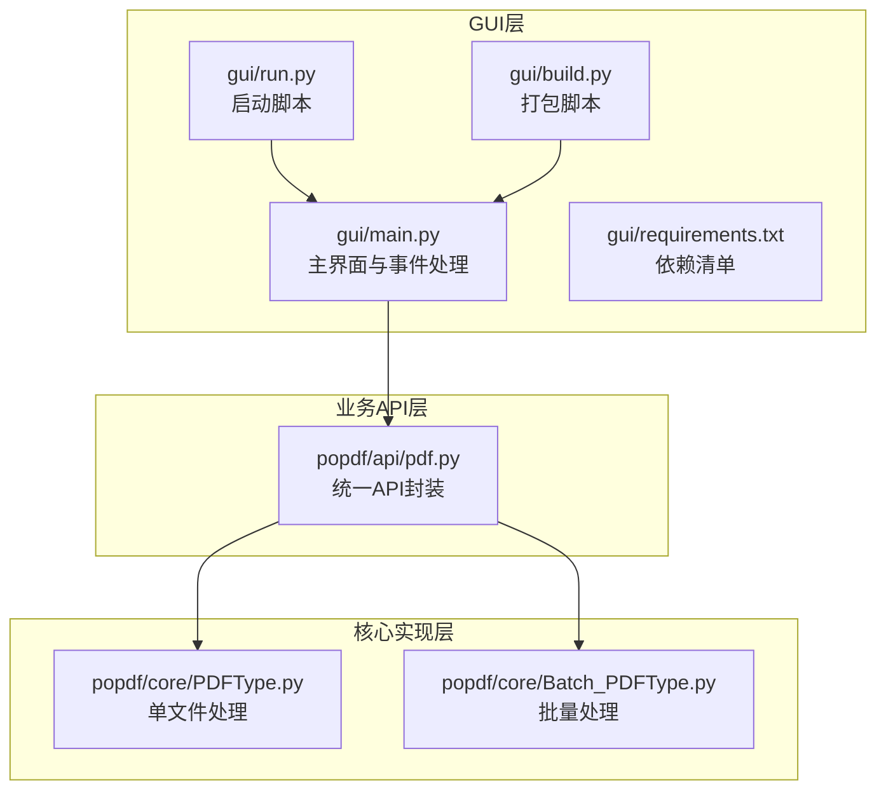
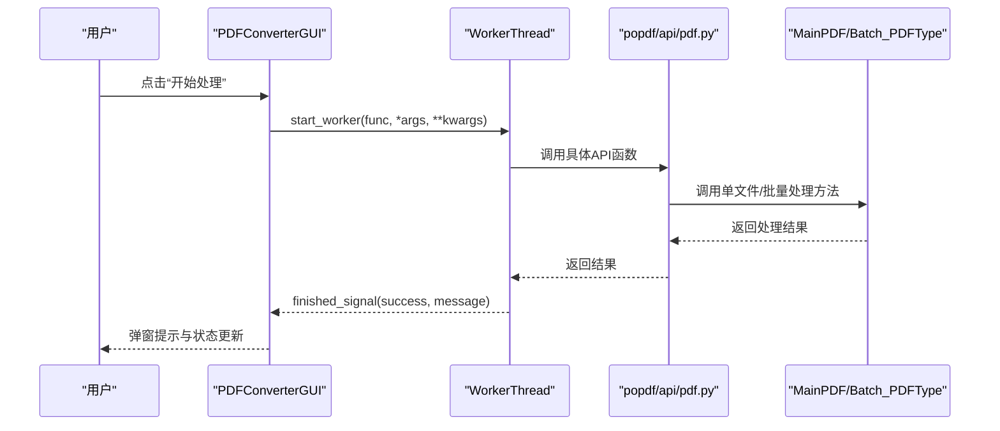
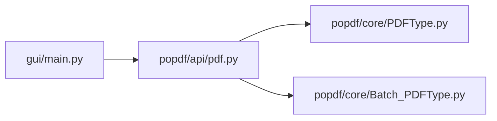

# GUI使用指南

<cite>
**本文引用的文件**
- [gui/main.py](file://gui/main.py)
- [gui/README.md](file://gui/README.md)
- [gui/build.py](file://gui/build.py)
- [gui/run.py](file://gui/run.py)
- [gui/requirements.txt](file://gui/requirements.txt)
- [popdf/api/pdf.py](file://popdf/api/pdf.py)
- [popdf/core/PDFType.py](file://popdf/core/PDFType.py)
- [popdf/core/Batch_PDFType.py](file://popdf/core/Batch_PDFType.py)
</cite>

## 更新摘要
**变更内容**
- 将文档中所有HTTP链接更新为HTTPS链接，确保用户访问安全的文档地址。
- 更新了功能文档链接，从`http://www.python4office.cn`改为`https://www.python4office.cn`。

## 目录
1. [简介](#简介)
2. [项目结构](#项目结构)
3. [核心组件](#核心组件)
4. [架构总览](#架构总览)
5. [详细组件分析](#详细组件分析)
6. [依赖关系分析](#依赖关系分析)
7. [性能与并发特性](#性能与并发特性)
8. [故障排查](#故障排查)
9. [结论](#结论)
10. [附录](#附录)

## 简介
本指南面向首次使用“PDF智能处理平台”桌面GUI应用的用户，提供从安装、启动到各功能模块操作的完整使用说明。GUI基于PySide6构建，覆盖PDF转换、编辑、安全与组织等常用场景，并支持单文件与批量处理模式。界面采用现代化风格，包含进度条、状态栏与多标签页布局，便于快速定位所需功能。

## 项目结构
GUI应用位于gui目录，核心入口为main.py；功能调用通过popdf/api/pdf.py对接底层PDF处理能力，底层实现由popdf/core中的MainPDF与Batch_PDFType类负责。

图表来源
- [gui/main.py](file://gui/main.py#L1-L120)
- [gui/run.py](file://gui/run.py#L1-L56)
- [gui/build.py](file://gui/build.py#L1-L163)
- [gui/requirements.txt](file://gui/requirements.txt#L1-L7)
- [popdf/api/pdf.py](file://popdf/api/pdf.py#L1-L200)
- [popdf/core/PDFType.py](file://popdf/core/PDFType.py#L1-L37)
- [popdf/core/Batch_PDFType.py](file://popdf/core/Batch_PDFType.py#L1-L84)

章节来源
- [gui/main.py](file://gui/main.py#L1-L120)
- [gui/README.md](file://gui/README.md#L1-L161)

## 核心组件
- 主窗口与标签页：采用QTabWidget组织九个功能标签页，分别为“PDF转Word”“PDF转图片”“文本转PDF”“PDF分割”“PDF加密”“PDF解密”“添加水印”“PDF合并”“删除页面”，满足常见PDF处理需求。
- 文件选择组件：每类功能均提供“单个文件”和“批量文件夹”两种输入方式，分别通过浏览按钮选择文件或文件夹。
- 参数设置区：针对不同功能提供专用参数控件，如页码范围、密码、水印文本与位置、字体大小等。
- 进度与状态：底部状态栏显示“系统就绪/操作成功/操作失败”等提示，右侧进度条实时反馈处理进度。
- 多线程执行：通过WorkerThread在后台线程执行耗时任务，避免UI阻塞。

章节来源
- [gui/main.py](file://gui/main.py#L294-L350)
- [gui/main.py](file://gui/main.py#L351-L421)
- [gui/main.py](file://gui/main.py#L423-L520)
- [gui/main.py](file://gui/main.py#L522-L585)
- [gui/main.py](file://gui/main.py#L587-L648)
- [gui/main.py](file://gui/main.py#L650-L698)
- [gui/main.py](file://gui/main.py#L700-L730)
- [gui/main.py](file://gui/main.py#L732-L805)
- [gui/main.py](file://gui/main.py#L773-L805)

## 架构总览
GUI通过统一API封装调用底层PDF处理逻辑，单文件与批量处理分别映射到MainPDF与Batch_PDFType类的方法。

图表来源
- [gui/main.py](file://gui/main.py#L773-L805)
- [gui/main.py](file://gui/main.py#L806-L923)
- [popdf/api/pdf.py](file://popdf/api/pdf.py#L1-L200)
- [popdf/core/PDFType.py](file://popdf/core/PDFType.py#L1-L37)
- [popdf/core/Batch_PDFType.py](file://popdf/core/Batch_PDFType.py#L1-L84)

## 详细组件分析

### 主界面与组件
- 标题与副标题：顶部居中显示“PDF 智能处理平台”及副标题，营造专业感。
- 标签页布局：九个功能标签页，每个标签页内包含文件选择区、参数设置区与“开始处理”按钮。
- 状态栏与进度条：底部状态栏显示当前状态，右侧进度条在处理时可见并更新。
- 自定义控件：TechButton/TechLineEdit/TechGroupBox/TechProgressBar/TechTabWidget提供一致的视觉风格。

章节来源
- [gui/main.py](file://gui/main.py#L172-L211)
- [gui/main.py](file://gui/main.py#L135-L170)
- [gui/main.py](file://gui/main.py#L294-L350)

### 文件上传与参数设置
- 通用文件选择组：包含“单个文件”和“批量文件夹”两组输入，分别绑定浏览按钮，支持拖拽与路径粘贴。
- 参数控件：
  - PDF分割：起始页码、结束页码（支持“末尾”特殊值）。
  - PDF加密/解密：密码输入框（隐藏输入）。
  - 添加水印：水印文本、X/Y坐标、字体大小。
  - PDF合并：多文件列表（支持逐个添加与清空）、输出文件选择。
  - 删除页面：页码输入（支持逗号分隔与连字符范围）。

章节来源
- [gui/main.py](file://gui/main.py#L351-L421)
- [gui/main.py](file://gui/main.py#L477-L520)
- [gui/main.py](file://gui/main.py#L522-L585)
- [gui/main.py](file://gui/main.py#L587-L648)
- [gui/main.py](file://gui/main.py#L650-L698)
- [gui/main.py](file://gui/main.py#L700-L730)

### 多线程与进度反馈
- WorkerThread：封装进度信号、消息信号与完成信号，run中调用传入函数并触发UI更新。
- UI交互：start_worker启动线程，update_progress更新进度条，update_status更新状态栏，operation_finished弹窗提示并重置状态。

章节来源
- [gui/main.py](file://gui/main.py#L212-L237)
- [gui/main.py](file://gui/main.py#L773-L805)

### 功能模块使用指南

#### PDF转Word
- 单文件：选择输入PDF与输出Word路径，点击“开始转换”。
- 批量：选择包含PDF的文件夹作为输入，选择输出文件夹，点击“开始转换”。

章节来源
- [gui/main.py](file://gui/main.py#L384-L421)
- [gui/main.py](file://gui/main.py#L806-L815)
- [popdf/api/pdf.py](file://popdf/api/pdf.py#L17-L43)

#### PDF转图片
- 单文件：选择输入PDF与输出图片路径，勾选“合并为单张图片”可将所有页面合成一张图。
- 批量：选择包含PDF的文件夹作为输入，选择输出文件夹，勾选合并选项。

章节来源
- [gui/main.py](file://gui/main.py#L423-L452)
- [gui/main.py](file://gui/main.py#L816-L824)
- [popdf/api/pdf.py](file://popdf/api/pdf.py#L45-L71)

#### 文本转PDF
- 单文件：选择输入文本文件与输出PDF路径，点击“开始转换”。
- 批量：选择包含文本文件的文件夹作为输入，选择输出文件夹，点击“开始转换”。

章节来源
- [gui/main.py](file://gui/main.py#L454-L475)
- [gui/main.py](file://gui/main.py#L825-L832)
- [popdf/api/pdf.py](file://popdf/api/pdf.py#L72-L91)

#### PDF分割
- 设置起始页码与结束页码（结束页可设为“末尾”），单文件或批量均可。
- 注意：批量模式会遍历输入文件夹内的所有PDF并输出到指定输出文件夹。

章节来源
- [gui/main.py](file://gui/main.py#L477-L520)
- [gui/main.py](file://gui/main.py#L833-L844)
- [popdf/api/pdf.py](file://popdf/api/pdf.py#L93-L115)

#### PDF加密
- 输入密码，单文件或批量均可。
- 注意：若未输入密码，将弹出警告提示。

章节来源
- [gui/main.py](file://gui/main.py#L522-L553)
- [gui/main.py](file://gui/main.py#L845-L857)
- [popdf/api/pdf.py](file://popdf/api/pdf.py#L117-L124)

#### PDF解密
- 输入密码，单文件或批量均可。
- 注意：若未输入密码，将弹出警告提示。

章节来源
- [gui/main.py](file://gui/main.py#L555-L585)
- [gui/main.py](file://gui/main.py#L858-L870)
- [popdf/api/pdf.py](file://popdf/api/pdf.py#L126-L151)

#### 添加水印
- 设置水印文本、X/Y坐标与字体大小，必须同时选择输入与输出文件。
- 注意：若未选择输入或输出，将弹出警告提示。

章节来源
- [gui/main.py](file://gui/main.py#L587-L648)
- [gui/main.py](file://gui/main.py#L871-L878)
- [popdf/api/pdf.py](file://popdf/api/pdf.py#L154-L173)

#### PDF合并
- 使用“添加文件”按钮逐个添加待合并的PDF，或直接粘贴路径列表；设置输出文件路径后点击“开始合并”。

章节来源
- [gui/main.py](file://gui/main.py#L650-L698)
- [gui/main.py](file://gui/main.py#L879-L890)
- [popdf/api/pdf.py](file://popdf/api/pdf.py#L175-L181)

#### 删除页面
- 输入要删除的页码（支持逗号分隔与连字符范围），单文件或批量均可。
- 注意：若未输入页码，将弹出警告提示。

章节来源
- [gui/main.py](file://gui/main.py#L700-L730)
- [gui/main.py](file://gui/main.py#L892-L904)
- [popdf/api/pdf.py](file://popdf/api/pdf.py#L183-L194)

### 单文件处理与批量处理差异
- 单文件处理：输入与输出均为单一文件路径，适合快速处理个别文件。
- 批量处理：输入为包含多个PDF的文件夹，输出为文件夹，框架会自动遍历并处理所有PDF文件，适合成批归档或批量转换。

章节来源
- [gui/main.py](file://gui/main.py#L351-L421)
- [gui/main.py](file://gui/main.py#L423-L520)
- [gui/main.py](file://gui/main.py#L522-L585)
- [gui/main.py](file://gui/main.py#L587-L648)
- [gui/main.py](file://gui/main.py#L650-L698)
- [gui/main.py](file://gui/main.py#L700-L730)
- [popdf/core/Batch_PDFType.py](file://popdf/core/Batch_PDFType.py#L1-L84)

### 启动方式与系统要求
- 启动方式
  - 源码运行：安装依赖后，执行启动脚本以检查并安装缺失依赖，随后启动GUI。
  - 可执行文件：运行打包脚本生成独立exe，直接双击运行。
- 系统要求
  - Windows 7/8/10/11（推荐Windows 10+）
  - 至少2GB内存
  - 足够的磁盘空间
  - Python 3.7+（仅源码运行需要）

章节来源
- [gui/README.md](file://gui/README.md#L18-L115)
- [gui/README.md](file://gui/README.md#L101-L115)
- [gui/run.py](file://gui/run.py#L1-L56)
- [gui/build.py](file://gui/build.py#L1-L163)
- [gui/requirements.txt](file://gui/requirements.txt#L1-L7)

## 依赖关系分析
GUI通过统一API封装调用底层PDF处理逻辑，形成清晰的分层依赖。

图表来源
- [gui/main.py](file://gui/main.py#L1-L23)
- [popdf/api/pdf.py](file://popdf/api/pdf.py#L1-L200)
- [popdf/core/PDFType.py](file://popdf/core/PDFType.py#L1-L37)
- [popdf/core/Batch_PDFType.py](file://popdf/core/Batch_PDFType.py#L1-L84)

章节来源
- [gui/main.py](file://gui/main.py#L1-L23)
- [popdf/api/pdf.py](file://popdf/api/pdf.py#L1-L200)

## 性能与并发特性
- 多线程处理：所有耗时操作在WorkerThread中执行，避免阻塞UI，提升用户体验。
- 进度反馈：通过progress_signal与message_signal实时更新进度与状态，便于用户感知处理过程。
- 批量效率：批量处理采用简单循环与进度工具，适合成批转换场景。

章节来源
- [gui/main.py](file://gui/main.py#L212-L237)
- [gui/main.py](file://gui/main.py#L773-L805)
- [popdf/core/Batch_PDFType.py](file://popdf/core/Batch_PDFType.py#L1-L84)

## 故障排查
- 应用无法启动
  - 检查是否安装所有依赖包，或尝试重新打包可执行文件。
- 文件处理失败
  - 检查文件路径是否正确，确认文件未被其他程序占用。
- 批量处理不工作
  - 确认输入文件夹包含有效PDF文件，输出文件夹具备写入权限。
- 内存不足
  - 关闭其他程序释放内存，或分批处理大文件。
- 控制台日志
  - 应用在控制台输出处理日志，遇到问题可查看相关错误信息。

章节来源
- [gui/README.md](file://gui/README.md#L116-L161)

## 结论
本GUI应用以PySide6为基础，围绕popdf库构建了完整的PDF处理工具集，覆盖转换、编辑、安全与组织等核心场景。通过统一API与多线程机制，既保证了易用性，也兼顾了性能与稳定性。用户可根据自身需求选择单文件或批量处理模式，快速完成各类PDF任务。

## 附录

### 快速操作步骤（以典型功能为例）
- PDF转Word（单文件）
  1) 在“PDF转Word”标签页选择输入PDF与输出Word路径。
  2) 点击“开始转换”，等待进度条完成并弹窗提示。
- PDF转图片（批量）
  1) 在“PDF转图片”标签页选择包含PDF的文件夹作为输入，选择输出文件夹。
  2) 可勾选“合并为单张图片”，点击“开始转换”。
- PDF分割
  1) 在“PDF分割”标签页设置起始页码与结束页码。
  2) 选择输入与输出，点击“开始分割”。

章节来源
- [gui/main.py](file://gui/main.py#L384-L421)
- [gui/main.py](file://gui/main.py#L423-L452)
- [gui/main.py](file://gui/main.py#L477-L520)