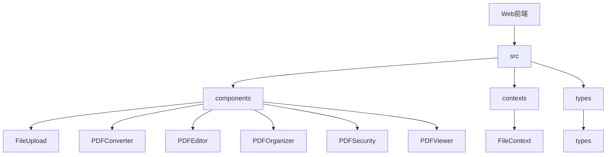
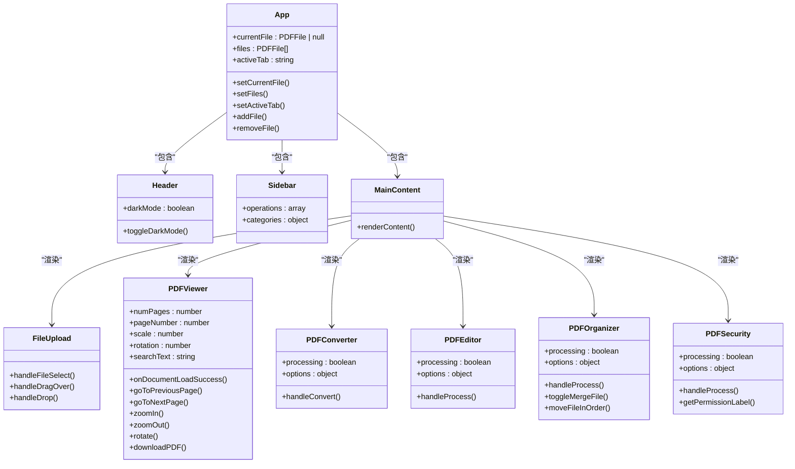
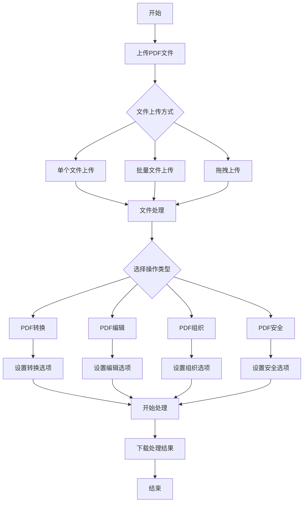
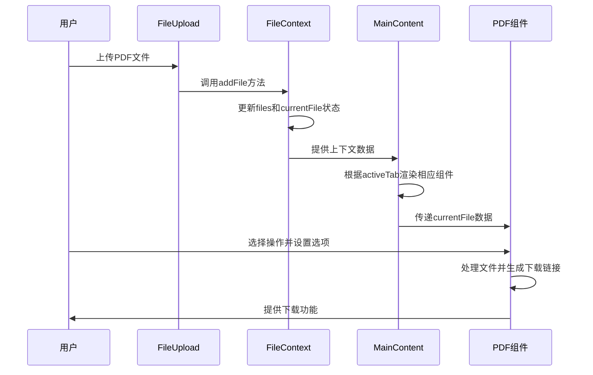
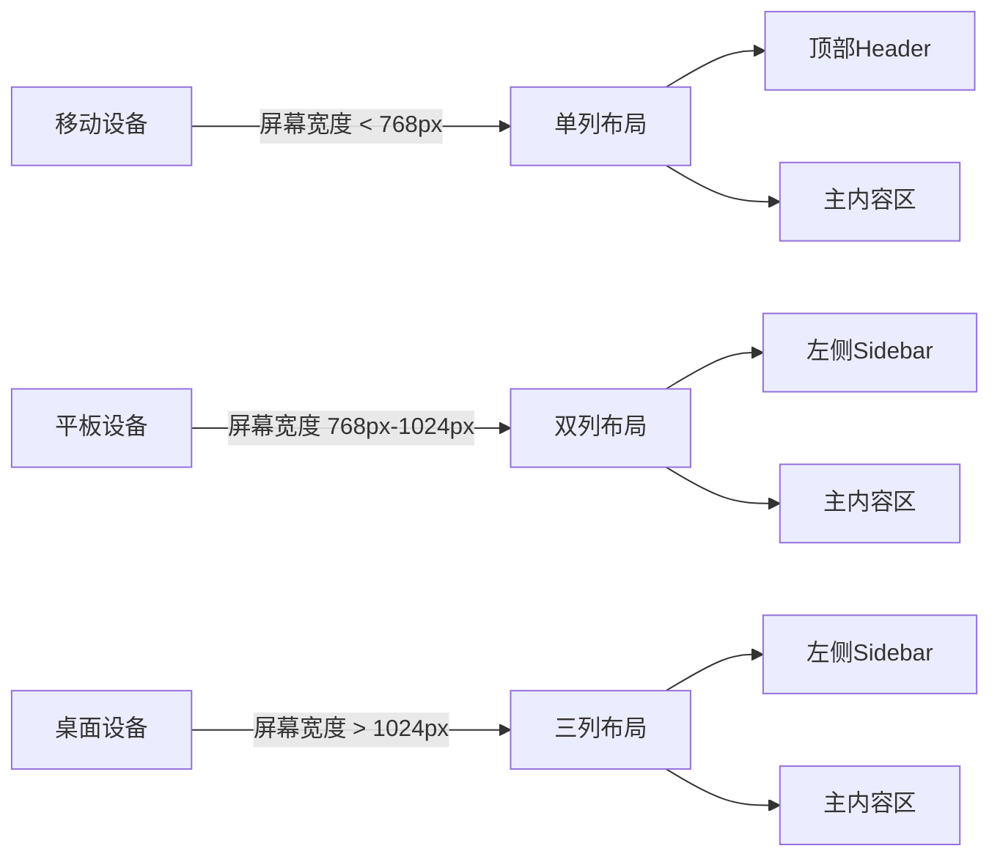
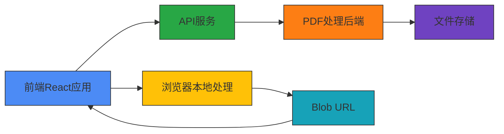
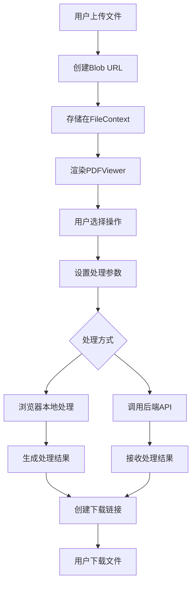

# Web界面使用

<cite>
**本文档引用的文件**   
- [App.tsx](file://web/src/App.tsx)
- [FileContext.tsx](file://web/src/contexts/FileContext.tsx)
- [types.ts](file://web/src/types.ts)
- [Header.tsx](file://web/src/components/Header.tsx)
- [Sidebar.tsx](file://web/src/components/Sidebar.tsx)
- [MainContent.tsx](file://web/src/components/MainContent.tsx)
- [FileUpload.tsx](file://web/src/components/FileUpload.tsx)
- [PDFConverter.tsx](file://web/src/components/PDFConverter.tsx)
- [PDFEditor.tsx](file://web/src/components/PDFEditor.tsx)
- [PDFOrganizer.tsx](file://web/src/components/PDFOrganizer.tsx)
- [PDFSecurity.tsx](file://web/src/components/PDFSecurity.tsx)
- [PDFViewer.tsx](file://web/src/components/PDFViewer.tsx)
- [package.json](file://web/package.json)
- [vite.config.ts](file://web/vite.config.ts)
- [tailwind.config.js](file://web/tailwind.config.js)
- [tsconfig.json](file://web/tsconfig.json)
</cite>

## 目录
1. [项目结构](#项目结构)
2. [核心组件](#核心组件)
3. [Web界面组件结构](#web界面组件结构)
4. [文件上传与处理流程](#文件上传与处理流程)
5. [响应式设计与用户体验](#响应式设计与用户体验)
6. [前端与后端交互机制](#前端与后端交互机制)

## 项目结构

Web前端应用位于`web`目录下，采用React + TypeScript技术栈构建。项目使用Vite作为构建工具，Tailwind CSS作为样式框架，Lucide React作为图标库。主要目录结构包括：

- `src/components`：存放所有UI组件
- `src/contexts`：存放React Context
- `src/types`：定义TypeScript类型
- `public`：静态资源文件
- 根目录配置文件：`vite.config.ts`、`tailwind.config.js`、`tsconfig.json`等



**Diagram sources**
- [App.tsx](file://web/src/App.tsx)
- [package.json](file://web/package.json)
- [vite.config.ts](file://web/vite.config.ts)

## 核心组件

Web界面的核心组件基于React函数式组件和Hooks构建，使用TypeScript提供类型安全。主要技术栈包括：

- **React 18**：用于构建用户界面
- **TypeScript**：提供静态类型检查
- **Vite**：现代化的前端构建工具
- **Tailwind CSS**：实用优先的CSS框架
- **React PDF**：用于PDF渲染和操作
- **Lucide React**：轻量级图标库

应用采用模块化设计，通过组件化方式组织代码，提高可维护性和可复用性。

**Section sources**
- [package.json](file://web/package.json)
- [vite.config.ts](file://web/vite.config.ts)
- [tsconfig.json](file://web/tsconfig.json)

## Web界面组件结构

Web界面由多个功能组件构成，每个组件负责特定的PDF处理功能。组件之间通过React Context进行状态管理，实现数据共享。

### 主要组件



**Diagram sources**
- [App.tsx](file://web/src/App.tsx)
- [Header.tsx](file://web/src/components/Header.tsx)
- [Sidebar.tsx](file://web/src/components/Sidebar.tsx)
- [MainContent.tsx](file://web/src/components/MainContent.tsx)
- [FileUpload.tsx](file://web/src/components/FileUpload.tsx)
- [PDFConverter.tsx](file://web/src/components/PDFConverter.tsx)
- [PDFEditor.tsx](file://web/src/components/PDFEditor.tsx)
- [PDFOrganizer.tsx](file://web/src/components/PDFOrganizer.tsx)
- [PDFSecurity.tsx](file://web/src/components/PDFSecurity.tsx)
- [PDFViewer.tsx](file://web/src/components/PDFViewer.tsx)

### 组件功能说明

| 组件名称 | 功能描述 | 主要属性/方法 |
|--------|--------|-------------|
| **FileUpload** | 文件上传组件 | 支持单个文件上传、批量上传、拖拽上传 |
| **PDFConverter** | PDF转换器 | 支持PDF转Word、PDF转图片、文本转PDF |
| **PDFEditor** | PDF编辑器 | 支持添加水印、删除页面 |
| **PDFOrganizer** | PDF组织工具 | 支持PDF分割、PDF合并 |
| **PDFSecurity** | PDF安全工具 | 支持PDF加密、PDF解密 |
| **PDFViewer** | PDF查看器 | 支持缩放、旋转、页面导航、搜索 |

**Section sources**
- [FileUpload.tsx](file://web/src/components/FileUpload.tsx)
- [PDFConverter.tsx](file://web/src/components/PDFConverter.tsx)
- [PDFEditor.tsx](file://web/src/components/PDFEditor.tsx)
- [PDFOrganizer.tsx](file://web/src/components/PDFOrganizer.tsx)
- [PDFSecurity.tsx](file://web/src/components/PDFSecurity.tsx)
- [PDFViewer.tsx](file://web/src/components/PDFViewer.tsx)

## 文件上传与处理流程

Web界面提供完整的文件上传到处理完成的操作流程，用户可以轻松完成PDF文件的各种操作。

### 操作流程



**Diagram sources**
- [FileUpload.tsx](file://web/src/components/FileUpload.tsx)
- [MainContent.tsx](file://web/src/components/MainContent.tsx)

### 状态管理流程



**Diagram sources**
- [FileContext.tsx](file://web/src/contexts/FileContext.tsx)
- [MainContent.tsx](file://web/src/components/MainContent.tsx)
- [FileUpload.tsx](file://web/src/components/FileUpload.tsx)

## 响应式设计与用户体验

Web界面采用响应式设计，确保在不同设备上都能提供良好的用户体验。

### 响应式布局



**Diagram sources**
- [App.tsx](file://web/src/App.tsx)
- [tailwind.config.js](file://web/tailwind.config.js)

### 用户体验特点

1. **直观的导航**：通过左侧边栏提供清晰的功能导航
2. **实时反馈**：操作过程中提供加载状态和进度指示
3. **暗色模式**：支持亮色和暗色模式切换，适应不同环境
4. **拖拽上传**：支持拖拽文件上传，提升操作便捷性
5. **预览功能**：在编辑操作前提供预览，确保操作准确性
6. **本地处理**：所有文件处理在浏览器端完成，保护用户隐私

**Section sources**
- [Header.tsx](file://web/src/components/Header.tsx)
- [Sidebar.tsx](file://web/src/components/Sidebar.tsx)
- [tailwind.config.js](file://web/tailwind.config.js)

## 前端与后端交互机制

虽然当前实现主要在前端完成PDF处理，但系统设计支持与后端API的交互。

### 交互架构



**Diagram sources**
- [App.tsx](file://web/src/App.tsx)
- [PDFConverter.tsx](file://web/src/components/PDFConverter.tsx)

### 数据流设计



**Diagram sources**
- [FileContext.tsx](file://web/src/contexts/FileContext.tsx)
- [types.ts](file://web/src/types.ts)

### 类型定义

```mermaid
classDiagram
class PDFFile {
+id : string
+name : string
+size : number
+url : string
+pages : number
+uploadTime : Date
}
class PDFOperation {
+id : string
+name : string
+description : string
+icon : string
+category : 'conversion' | 'edit' | 'security' | 'organize'
}
class ProcessingOptions {
+pdf2docx : { quality : 'standard' | 'high' }
+pdf2imgs : { format : 'jpg' | 'png', dpi : number, merge : boolean }
+split4pdf : { startPage : number, endPage : number }
+encrypt4pdf : { password : string, ownerPassword? : string, permissions : { printing? : boolean, modifying? : boolean, copying? : boolean, annotating? : boolean } }
+addWatermark : { text : string, fontSize : number, opacity : number, position : 'center' | 'top-left' | 'top-right' | 'bottom-left' | 'bottom-right', rotation : number }
+merge2pdf : { files : PDFFile[], order : string[] }
+del4pdf : { pages : string }
}
class ProcessingResult {
+success : boolean
+message : string
+downloadUrl? : string
+file? : PDFFile
+error? : string
}
class FileContextType {
+currentFile : PDFFile | null
+files : PDFFile[]
+activeTab : string
+setCurrentFile : (file : PDFFile | null) => void
+setFiles : (files : PDFFile[]) => void
+setActiveTab : (tab : string) => void
+addFile : (file : PDFFile) => void
+removeFile : (fileId : string) => void
}
```

**Diagram sources**
- [types.ts](file://web/src/types.ts)
- [FileContext.tsx](file://web/src/contexts/FileContext.tsx)