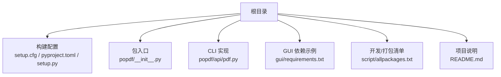
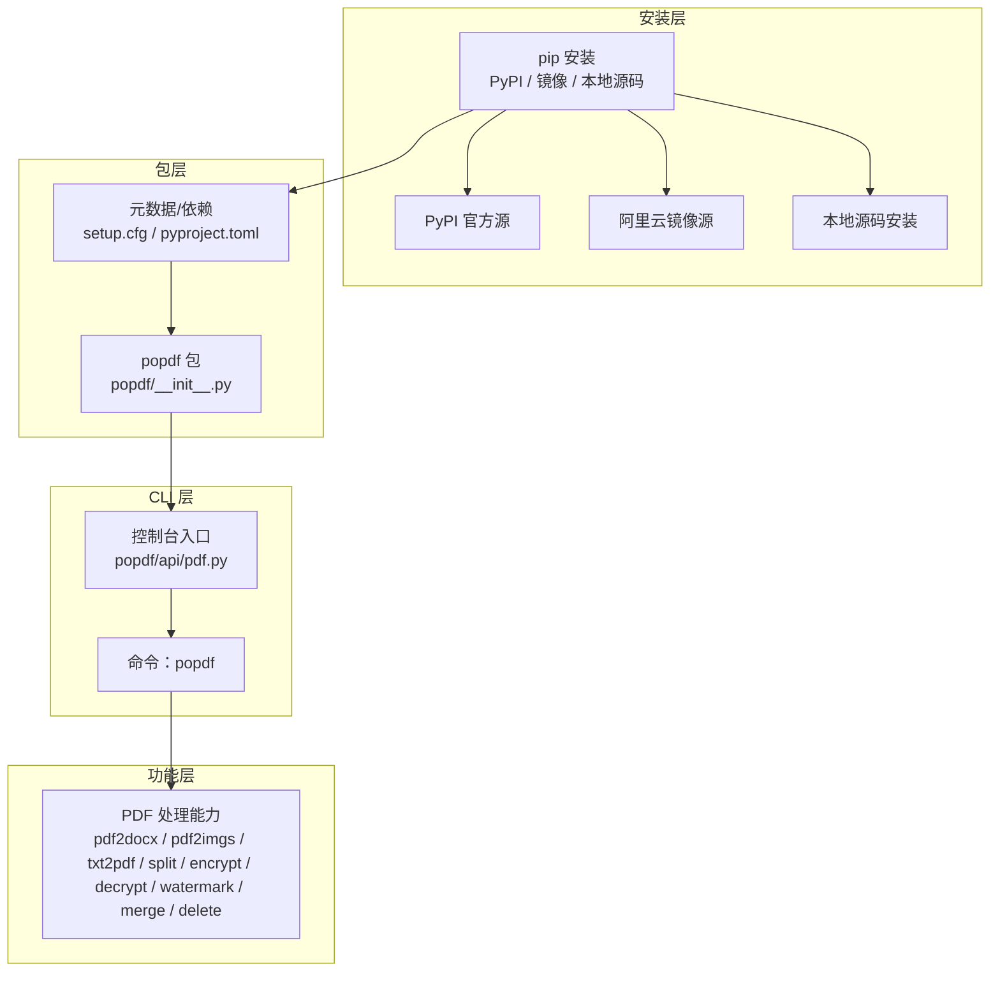
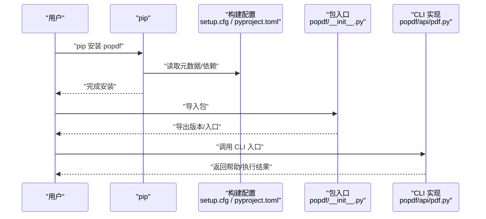
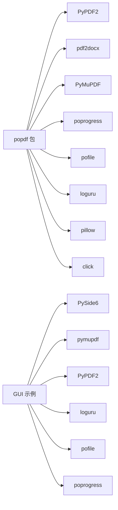

# 安装指南

<cite>
**本文引用的文件**
- [README.md](file://README.md)
- [setup.cfg](file://setup.cfg)
- [pyproject.toml](file://pyproject.toml)
- [setup.py](file://setup.py)
- [popdf/api/pdf.py](file://popdf/api/pdf.py)
- [popdf/__init__.py](file://popdf/__init__.py)
- [gui/requirements.txt](file://gui/requirements.txt)
- [script/allpackages.txt](file://script/allpackages.txt)
</cite>

## 目录
1. [简介](#简介)
2. [项目结构](#项目结构)
3. [核心组件](#核心组件)
4. [架构总览](#架构总览)
5. [详细组件分析](#详细组件分析)
6. [依赖分析](#依赖分析)
7. [性能考虑](#性能考虑)
8. [故障排查指南](#故障排查指南)
9. [结论](#结论)
10. [附录](#附录)

## 简介
本指南面向希望安装与使用 popdf 的用户，系统讲解三种安装方式：
- 使用 pip 从 PyPI 官方源安装
- 使用阿里云镜像加速安装
- 从源码本地开发安装（可选）

同时覆盖安装过程中的常见问题排查（依赖冲突、权限问题、网络问题），以及如何验证安装成功与环境配置建议。

## 项目结构
popdf 作为 Python 包，其安装配置主要由以下文件定义：
- 构建与元数据：setup.cfg、pyproject.toml、setup.py
- 包导出与 CLI：popdf/__init__.py、popdf/api/pdf.py
- GUI 示例依赖：gui/requirements.txt
- 开发与打包清单：script/allpackages.txt

图表来源
- [setup.cfg](file://setup.cfg#L1-L37)
- [pyproject.toml](file://pyproject.toml#L1-L35)
- [setup.py](file://setup.py#L1-L14)
- [popdf/__init__.py](file://popdf/__init__.py#L1-L6)
- [popdf/api/pdf.py](file://popdf/api/pdf.py#L1-L235)
- [gui/requirements.txt](file://gui/requirements.txt#L1-L7)
- [script/allpackages.txt](file://script/allpackages.txt#L1-L54)
- [README.md](file://README.md#L1-L124)

章节来源
- [README.md](file://README.md#L1-L124)
- [setup.cfg](file://setup.cfg#L1-L37)
- [pyproject.toml](file://pyproject.toml#L1-L35)
- [setup.py](file://setup.py#L1-L14)
- [popdf/__init__.py](file://popdf/__init__.py#L1-L6)
- [popdf/api/pdf.py](file://popdf/api/pdf.py#L1-L235)
- [gui/requirements.txt](file://gui/requirements.txt#L1-L7)
- [script/allpackages.txt](file://script/allpackages.txt#L1-L54)

## 核心组件
- 包元数据与依赖
  - 版本与描述：见 [setup.cfg](file://setup.cfg#L1-L37)、[pyproject.toml](file://pyproject.toml#L1-L35)
  - Python 版本要求：>=3.7（见 [setup.cfg](file://setup.cfg#L31-L31)、[pyproject.toml](file://pyproject.toml#L10-L10)）
  - 安装依赖列表：见 [setup.cfg](file://setup.cfg#L21-L30)、[pyproject.toml](file://pyproject.toml#L14-L23)
- CLI 入口
  - 控制台脚本注册：见 [setup.cfg](file://setup.cfg#L35-L37)、[pyproject.toml](file://pyproject.toml#L31-L32)
  - CLI 实现：见 [popdf/api/pdf.py](file://popdf/api/pdf.py#L1-L235)
- 包导出
  - 包入口导出：见 [popdf/__init__.py](file://popdf/__init__.py#L1-L6)

章节来源
- [setup.cfg](file://setup.cfg#L1-L37)
- [pyproject.toml](file://pyproject.toml#L1-L35)
- [popdf/api/pdf.py](file://popdf/api/pdf.py#L1-L235)
- [popdf/__init__.py](file://popdf/__init__.py#L1-L6)

## 架构总览
下图展示 popdf 的安装与运行架构：从 PyPI 或本地源码安装，到 CLI 可执行入口，再到核心 PDF 处理能力。

图表来源
- [setup.cfg](file://setup.cfg#L1-L37)
- [pyproject.toml](file://pyproject.toml#L1-L35)
- [popdf/__init__.py](file://popdf/__init__.py#L1-L6)
- [popdf/api/pdf.py](file://popdf/api/pdf.py#L1-L235)

## 详细组件分析

### 方式一：使用 pip 从 PyPI 安装
- 适用场景
  - 快速获得稳定版本，适合大多数用户
  - 无需本地源码，减少环境准备成本
- 操作步骤
  - 使用 pip 安装最新版本（官方源）
  - 若需升级，使用更新选项
- 优点
  - 安装简单、标准化
  - 便于统一管理与分发
- 缺点
  - 受网络影响，国内部分地区可能较慢
- 常见问题与对策
  - 网络超时/不稳定：改用镜像源
  - 权限不足：使用用户级安装或管理员权限
  - 依赖冲突：隔离环境或锁定兼容版本
- 验证安装
  - 运行命令行入口以确认安装成功
  - 查看包版本信息

章节来源
- [README.md](file://README.md#L32-L72)
- [setup.cfg](file://setup.cfg#L1-L37)
- [pyproject.toml](file://pyproject.toml#L1-L35)
- [popdf/api/pdf.py](file://popdf/api/pdf.py#L1-L235)

### 方式二：使用阿里云镜像加速安装
- 适用场景
  - 国内网络环境不佳或不稳定
  - 需要更快的下载速度
- 操作步骤
  - 指定阿里云镜像源进行安装
  - 如需升级，使用更新选项
- 优点
  - 下载速度快，成功率高
- 缺点
  - 依赖镜像源可用性
- 常见问题与对策
  - 镜像源不可用：切换至其他镜像或官方源
  - 与本地缓存冲突：清理 pip 缓存后重试
- 验证安装
  - 同“方式一”的验证步骤

章节来源
- [README.md](file://README.md#L46-L53)
- [setup.cfg](file://setup.cfg#L1-L37)
- [pyproject.toml](file://pyproject.toml#L1-L35)

### 方式三：从源码安装（本地开发）
- 适用场景
  - 需要调试或二次开发
  - 需要使用未发布的特性或修复
- 操作步骤
  - 克隆仓库到本地
  - 进入项目目录
  - 使用可编辑安装模式进行开发安装
- 优点
  - 可直接修改源码并即时生效
- 缺点
  - 需要本地 Python 环境与构建工具
  - 依赖管理复杂度增加
- 常见问题与对策
  - 依赖缺失：根据依赖清单补齐
  - 版本不匹配：锁定兼容版本
  - 权限问题：使用虚拟环境或用户级安装
- 验证安装
  - 同“方式一”的验证步骤

章节来源
- [README.md](file://README.md#L34-L45)
- [setup.cfg](file://setup.cfg#L1-L37)
- [pyproject.toml](file://pyproject.toml#L1-L35)
- [script/allpackages.txt](file://script/allpackages.txt#L1-L54)

### CLI 入口与验证
- CLI 注册
  - 控制台脚本名称与入口函数已在构建配置中声明
- 验证方法
  - 运行命令行入口，查看帮助信息
  - 检查包版本信息

图表来源
- [setup.cfg](file://setup.cfg#L1-L37)
- [pyproject.toml](file://pyproject.toml#L1-L35)
- [popdf/__init__.py](file://popdf/__init__.py#L1-L6)
- [popdf/api/pdf.py](file://popdf/api/pdf.py#L1-L235)

## 依赖分析
- 运行时依赖（来自构建配置）
  - PyPDF2、pdf2docx、PyMuPDF、poprogress、pofile、loguru、pillow、click
- GUI 示例依赖（来自 GUI 依赖文件）
  - PySide6、pymupdf、PyPDF2、loguru、pofile、poprogress
- 开发/打包清单（来自开发清单）
  - 包含 popdf 本地路径条目，便于本地开发与打包校验

图表来源
- [setup.cfg](file://setup.cfg#L21-L30)
- [pyproject.toml](file://pyproject.toml#L14-L23)
- [gui/requirements.txt](file://gui/requirements.txt#L1-L7)
- [script/allpackages.txt](file://script/allpackages.txt#L1-L54)

章节来源
- [setup.cfg](file://setup.cfg#L21-L30)
- [pyproject.toml](file://pyproject.toml#L14-L23)
- [gui/requirements.txt](file://gui/requirements.txt#L1-L7)
- [script/allpackages.txt](file://script/allpackages.txt#L1-L54)

## 性能考虑
- 选择合适的安装源
  - 国内网络建议优先使用镜像源以提升下载速度
- 依赖精简
  - 仅安装实际需要的功能模块，避免不必要的依赖
- 环境隔离
  - 使用虚拟环境，减少依赖冲突与版本污染
- 并行处理
  - 对于批量 PDF 处理任务，合理规划并发与资源占用

## 故障排查指南
- 依赖冲突
  - 现象：安装失败或运行时报错
  - 排查：检查依赖版本范围与现有环境，必要时使用虚拟环境隔离
  - 参考：依赖清单来源
    - [setup.cfg](file://setup.cfg#L21-L30)
    - [pyproject.toml](file://pyproject.toml#L14-L23)
    - [gui/requirements.txt](file://gui/requirements.txt#L1-L7)
- 权限问题
  - 现象：安装失败提示权限不足
  - 排查：使用用户级安装或以管理员身份运行
- 网络问题
  - 现象：下载缓慢或超时
  - 排查：切换至镜像源或代理；若仍失败，尝试离线安装或本地源码安装
- CLI 不可用
  - 现象：命令不存在或无法找到入口
  - 排查：确认安装成功、PATH 中包含脚本路径、重新安装

章节来源
- [setup.cfg](file://setup.cfg#L21-L30)
- [pyproject.toml](file://pyproject.toml#L14-L23)
- [gui/requirements.txt](file://gui/requirements.txt#L1-L7)

## 结论
- 对大多数用户，推荐使用 pip 从 PyPI 安装，快速稳定
- 国内用户可优先使用阿里云镜像加速安装
- 需要开发或调试时，采用本地源码可编辑安装
- 安装完成后，通过 CLI 入口与版本信息验证安装成功

## 附录
- 安装命令参考
  - 从 PyPI 安装：参见 [README.md](file://README.md#L32-L72)
  - 使用阿里云镜像安装：参见 [README.md](file://README.md#L46-L53)
  - 从源码安装：参见 [README.md](file://README.md#L34-L45)
- CLI 入口与验证
  - 控制台脚本注册：参见 [setup.cfg](file://setup.cfg#L35-L37)、[pyproject.toml](file://pyproject.toml#L31-L32)
  - CLI 实现：参见 [popdf/api/pdf.py](file://popdf/api/pdf.py#L1-L235)
  - 包导出：参见 [popdf/__init__.py](file://popdf/__init__.py#L1-L6)
- 依赖清单
  - 运行时依赖：参见 [setup.cfg](file://setup.cfg#L21-L30)、[pyproject.toml](file://pyproject.toml#L14-L23)
  - GUI 示例依赖：参见 [gui/requirements.txt](file://gui/requirements.txt#L1-L7)
  - 开发/打包清单：参见 [script/allpackages.txt](file://script/allpackages.txt#L1-L54)