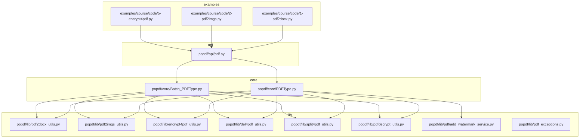
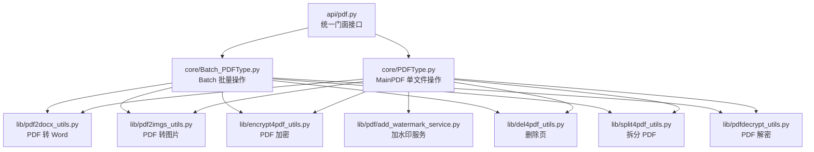
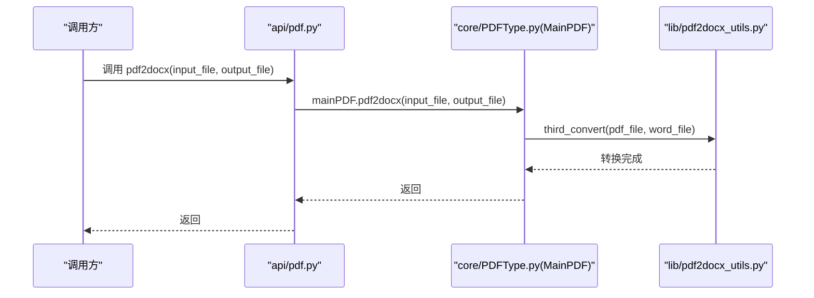
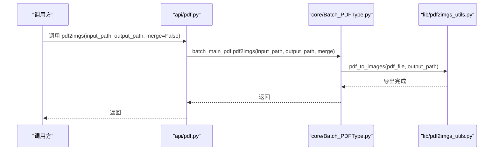
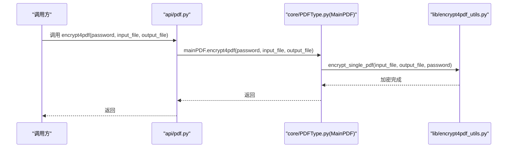
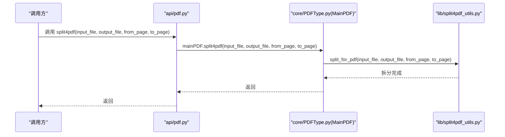
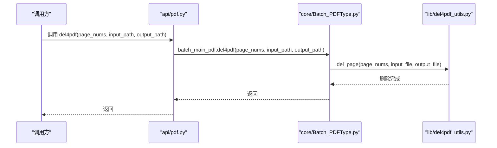
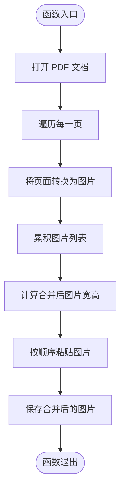
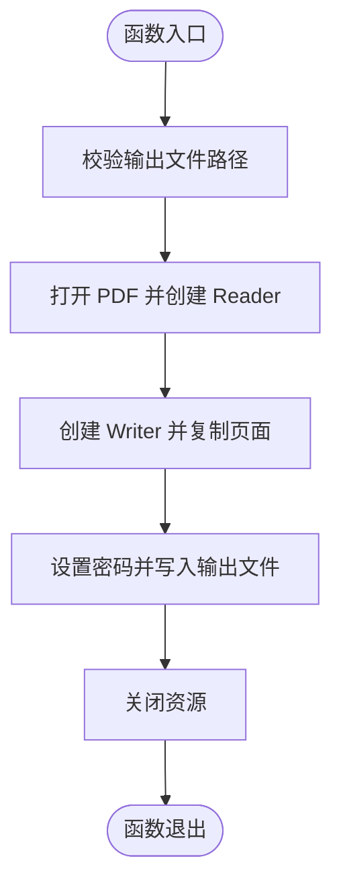
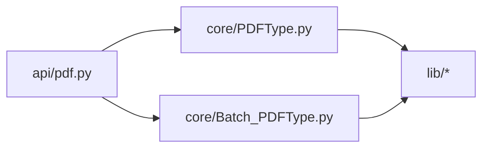

# 代码结构说明

<cite>
**本文引用的文件**
- [README.md](file://README.md)
- [popdf/api/pdf.py](file://popdf/api/pdf.py)
- [popdf/core/PDFType.py](file://popdf/core/PDFType.py)
- [popdf/core/Batch_PDFType.py](file://popdf/core/Batch_PDFType.py)
- [popdf/lib/pdf2docx_utils.py](file://popdf/lib/pdf2docx_utils.py)
- [popdf/lib/pdf2imgs_utils.py](file://popdf/lib/pdf2imgs_utils.py)
- [popdf/lib/encrypt4pdf_utils.py](file://popdf/lib/encrypt4pdf_utils.py)
- [popdf/lib/del4pdf_utils.py](file://popdf/lib/del4pdf_utils.py)
- [popdf/lib/split4pdf_utils.py](file://popdf/lib/split4pdf_utils.py)
- [popdf/lib/pdfdecrypt_utils.py](file://popdf/lib/pdfdecrypt_utils.py)
- [popdf/lib/pdf/add_watermark_service.py](file://popdf/lib/pdf/add_watermark_service.py)
- [popdf/lib/pdf_exceptions.py](file://popdf/lib/pdf_exceptions.py)
- [examples/course/code/1-pdf2docx.py](file://examples/course/code/1-pdf2docx.py)
- [examples/course/code/2-pdf2imgs.py](file://examples/course/code/2-pdf2imgs.py)
- [examples/course/code/5-encrypt4pdf.py](file://examples/course/code/5-encrypt4pdf.py)
</cite>

## 目录
1. [简介](#简介)
2. [项目结构](#项目结构)
3. [核心组件](#核心组件)
4. [架构总览](#架构总览)
5. [详细组件分析](#详细组件分析)
6. [依赖关系分析](#依赖关系分析)
7. [性能考量](#性能考量)
8. [故障排查指南](#故障排查指南)
9. [结论](#结论)
10. [附录](#附录)

## 简介
本文件面向开发者，系统性梳理 popdf 项目的分层架构设计与模块职责，明确 api、core、lib 三层的边界与协作关系：
- api 层：对外提供统一门面接口，负责参数校验、命令行入口与调用 core 层。
- core 层：封装业务实体与流程，提供单文件与批量两类操作类，协调 lib 层工具完成具体功能。
- lib 层：封装第三方库（如 PyMuPDF、PyPDF2、pdf2docx 等）的具体调用，提供稳定的功能接口。

同时，结合 README.md 中的目录说明，给出数据流与控制流的可视化图示，帮助开发者快速定位代码路径与实现细节。

## 项目结构
项目采用“api/core/lib”三层组织方式，配合 examples 与 tests 提供使用示例与测试覆盖。README.md 明确了目录规范与贡献流程，强调 examples 中新增功能需配套使用案例。

图表来源
- [popdf/api/pdf.py](file://popdf/api/pdf.py#L1-L235)
- [popdf/core/PDFType.py](file://popdf/core/PDFType.py#L1-L180)
- [popdf/core/Batch_PDFType.py](file://popdf/core/Batch_PDFType.py#L1-L142)
- [popdf/lib/pdf2docx_utils.py](file://popdf/lib/pdf2docx_utils.py#L1-L23)
- [popdf/lib/pdf2imgs_utils.py](file://popdf/lib/pdf2imgs_utils.py#L1-L62)
- [popdf/lib/encrypt4pdf_utils.py](file://popdf/lib/encrypt4pdf_utils.py#L1-L83)
- [popdf/lib/del4pdf_utils.py](file://popdf/lib/del4pdf_utils.py#L1-L20)
- [popdf/lib/split4pdf_utils.py](file://popdf/lib/split4pdf_utils.py#L1-L38)
- [popdf/lib/pdfdecrypt_utils.py](file://popdf/lib/pdfdecrypt_utils.py#L1-L27)
- [popdf/lib/pdf/add_watermark_service.py](file://popdf/lib/pdf/add_watermark_service.py#L1-L59)
- [popdf/lib/pdf_exceptions.py](file://popdf/lib/pdf_exceptions.py#L1-L25)
- [examples/course/code/1-pdf2docx.py](file://examples/course/code/1-pdf2docx.py#L1-L35)
- [examples/course/code/2-pdf2imgs.py](file://examples/course/code/2-pdf2imgs.py#L1-L27)
- [examples/course/code/5-encrypt4pdf.py](file://examples/course/code/5-encrypt4pdf.py#L1-L28)

章节来源
- [README.md](file://README.md#L77-L89)

## 核心组件
- api/pdf.py：统一门面接口层，提供 pdf2docx、pdf2imgs、txt2pdf、split4pdf、encrypt4pdf、decrypt4pdf、add_text_watermark、merge2pdf、del4pdf 等函数；内部通过 click.group 定义 CLI；实例化 MainPDF 与 Batch_PDFType，负责参数兼容与路由分发。
- core/PDFType.py：核心类 MainPDF，封装单文件操作，直接调用 lib 层工具函数，完成 PDF 转 Word、转图片、TXT 转 PDF、拆分、加密、解密、加水印、合并、删除页等。
- core/Batch_PDFType.py：核心类 Batch_PDFType，封装批量操作，遍历输入目录中的 PDF 文件，逐一调用 lib 层工具函数，完成批量转换、拆分、解密、图片导出、TXT 转 PDF、删除页等。
- lib/*：工具模块，封装第三方库调用，提供稳定接口，如 pdf2docx_utils、pdf2imgs_utils、encrypt4pdf_utils、del4pdf_utils、split4pdf_utils、pdfdecrypt_utils、pdf/add_watermark_service、pdf_exceptions 等。

章节来源
- [popdf/api/pdf.py](file://popdf/api/pdf.py#L1-L235)
- [popdf/core/PDFType.py](file://popdf/core/PDFType.py#L1-L180)
- [popdf/core/Batch_PDFType.py](file://popdf/core/Batch_PDFType.py#L1-L142)
- [popdf/lib/pdf2docx_utils.py](file://popdf/lib/pdf2docx_utils.py#L1-L23)
- [popdf/lib/pdf2imgs_utils.py](file://popdf/lib/pdf2imgs_utils.py#L1-L62)
- [popdf/lib/encrypt4pdf_utils.py](file://popdf/lib/encrypt4pdf_utils.py#L1-L83)
- [popdf/lib/del4pdf_utils.py](file://popdf/lib/del4pdf_utils.py#L1-L20)
- [popdf/lib/split4pdf_utils.py](file://popdf/lib/split4pdf_utils.py#L1-L38)
- [popdf/lib/pdfdecrypt_utils.py](file://popdf/lib/pdfdecrypt_utils.py#L1-L27)
- [popdf/lib/pdf/add_watermark_service.py](file://popdf/lib/pdf/add_watermark_service.py#L1-L59)
- [popdf/lib/pdf_exceptions.py](file://popdf/lib/pdf_exceptions.py#L1-L25)

## 架构总览
下图展示了三层之间的依赖关系与典型调用链路，体现“api 调用 core，core 调用 lib”的分层设计。

图表来源
- [popdf/api/pdf.py](file://popdf/api/pdf.py#L1-L235)
- [popdf/core/PDFType.py](file://popdf/core/PDFType.py#L1-L180)
- [popdf/core/Batch_PDFType.py](file://popdf/core/Batch_PDFType.py#L1-L142)
- [popdf/lib/pdf2docx_utils.py](file://popdf/lib/pdf2docx_utils.py#L1-L23)
- [popdf/lib/pdf2imgs_utils.py](file://popdf/lib/pdf2imgs_utils.py#L1-L62)
- [popdf/lib/encrypt4pdf_utils.py](file://popdf/lib/encrypt4pdf_utils.py#L1-L83)
- [popdf/lib/del4pdf_utils.py](file://popdf/lib/del4pdf_utils.py#L1-L20)
- [popdf/lib/split4pdf_utils.py](file://popdf/lib/split4pdf_utils.py#L1-L38)
- [popdf/lib/pdfdecrypt_utils.py](file://popdf/lib/pdfdecrypt_utils.py#L1-L27)
- [popdf/lib/pdf/add_watermark_service.py](file://popdf/lib/pdf/add_watermark_service.py#L1-L59)

## 详细组件分析

### API 层：统一门面接口
- 职责
  - 对外暴露统一函数式接口，兼容历史参数风格（单文件与批量参数混用），内部根据参数选择调用 MainPDF 或 Batch_PDFType。
  - 通过 click.group 提供 CLI 入口，便于命令行使用。
- 关键点
  - 函数命名与行为：pdf2docx、pdf2imgs、txt2pdf、split4pdf、encrypt4pdf、decrypt4pdf、add_text_watermark、merge2pdf、del4pdf。
  - 参数兼容策略：优先单文件参数，其次批量参数，否则记录错误日志。
  - 日志记录：对参数错误与异常进行统一记录，便于问题定位。
- 示例路径
  - [API 函数定义与参数分发](file://popdf/api/pdf.py#L17-L235)
  - [CLI 入口与日志初始化](file://popdf/api/pdf.py#L12-L16)

章节来源
- [popdf/api/pdf.py](file://popdf/api/pdf.py#L1-L235)

### Core 层：单文件与批量操作
- MainPDF（单文件）
  - 职责：封装单文件 PDF 的常用操作，统一创建输出目录、调用 lib 工具函数。
  - 功能：PDF 转 Word、PDF 转图片（单页/合并）、TXT 转 PDF、拆分、加密、解密、加水印、合并、删除页。
  - 复杂度：O(n) 页面级操作，依赖第三方库进行页面遍历与写入。
- Batch_PDFType（批量）
  - 职责：扫描输入目录，批量执行相同操作，自动创建输出目录。
  - 功能：批量转换、批量拆分、批量解密、批量导出图片、批量 TXT 转 PDF、批量删除页。
  - 复杂度：O(k·n)（k 为文件数，n 为平均页数）。
- 示例路径
  - [MainPDF 类与方法](file://popdf/core/PDFType.py#L1-L180)
  - [Batch_PDFType 类与方法](file://popdf/core/Batch_PDFType.py#L1-L142)

章节来源
- [popdf/core/PDFType.py](file://popdf/core/PDFType.py#L1-L180)
- [popdf/core/Batch_PDFType.py](file://popdf/core/Batch_PDFType.py#L1-L142)

### Lib 层：第三方库封装
- pdf2docx_utils：封装 pdf2docx Converter，完成 PDF 到 Word 的转换。
- pdf2imgs_utils：封装 PyMuPDF 与 Pillow，完成 PDF 到图片的导出与合并。
- encrypt4pdf_utils：封装 PyPDF2，完成单文件与批量加密。
- del4pdf_utils：封装 PyMuPDF，完成删除页操作。
- split4pdf_utils：封装 PyMuPDF，完成 PDF 指定页范围的拆分。
- pdfdecrypt_utils：封装 PyPDF2，完成 PDF 解密。
- add_watermark_service：预留水印服务实现（当前注释掉），未来可扩展。
- pdf_exceptions：自定义异常类，统一异常表达。
- 示例路径
  - [PDF 转 Word](file://popdf/lib/pdf2docx_utils.py#L1-L23)
  - [PDF 转图片与合并](file://popdf/lib/pdf2imgs_utils.py#L1-L62)
  - [PDF 加密（单/批）](file://popdf/lib/encrypt4pdf_utils.py#L1-L83)
  - [删除页](file://popdf/lib/del4pdf_utils.py#L1-L20)
  - [拆分 PDF](file://popdf/lib/split4pdf_utils.py#L1-L38)
  - [PDF 解密](file://popdf/lib/pdfdecrypt_utils.py#L1-L27)
  - [水印服务（预留）](file://popdf/lib/pdf/add_watermark_service.py#L1-L59)
  - [异常类](file://popdf/lib/pdf_exceptions.py#L1-L25)

章节来源
- [popdf/lib/pdf2docx_utils.py](file://popdf/lib/pdf2docx_utils.py#L1-L23)
- [popdf/lib/pdf2imgs_utils.py](file://popdf/lib/pdf2imgs_utils.py#L1-L62)
- [popdf/lib/encrypt4pdf_utils.py](file://popdf/lib/encrypt4pdf_utils.py#L1-L83)
- [popdf/lib/del4pdf_utils.py](file://popdf/lib/del4pdf_utils.py#L1-L20)
- [popdf/lib/split4pdf_utils.py](file://popdf/lib/split4pdf_utils.py#L1-L38)
- [popdf/lib/pdfdecrypt_utils.py](file://popdf/lib/pdfdecrypt_utils.py#L1-L27)
- [popdf/lib/pdf/add_watermark_service.py](file://popdf/lib/pdf/add_watermark_service.py#L1-L59)
- [popdf/lib/pdf_exceptions.py](file://popdf/lib/pdf_exceptions.py#L1-L25)

### 数据流与控制流（以典型流程为例）

#### 流程一：PDF 转 Word（单文件）

图表来源
- [popdf/api/pdf.py](file://popdf/api/pdf.py#L17-L43)
- [popdf/core/PDFType.py](file://popdf/core/PDFType.py#L23-L27)
- [popdf/lib/pdf2docx_utils.py](file://popdf/lib/pdf2docx_utils.py#L7-L23)

#### 流程二：PDF 转图片（批量）

图表来源
- [popdf/api/pdf.py](file://popdf/api/pdf.py#L45-L70)
- [popdf/core/Batch_PDFType.py](file://popdf/core/Batch_PDFType.py#L68-L80)
- [popdf/lib/pdf2imgs_utils.py](file://popdf/lib/pdf2imgs_utils.py#L10-L27)

#### 流程三：PDF 加密（单文件）

图表来源
- [popdf/api/pdf.py](file://popdf/api/pdf.py#L117-L124)
- [popdf/core/PDFType.py](file://popdf/core/PDFType.py#L100-L108)
- [popdf/lib/encrypt4pdf_utils.py](file://popdf/lib/encrypt4pdf_utils.py#L54-L83)

#### 流程四：PDF 拆分（单文件）

图表来源
- [popdf/api/pdf.py](file://popdf/api/pdf.py#L93-L115)
- [popdf/core/PDFType.py](file://popdf/core/PDFType.py#L81-L98)
- [popdf/lib/split4pdf_utils.py](file://popdf/lib/split4pdf_utils.py#L8-L38)

#### 流程五：删除指定页（批量）

图表来源
- [popdf/api/pdf.py](file://popdf/api/pdf.py#L183-L194)
- [popdf/core/Batch_PDFType.py](file://popdf/core/Batch_PDFType.py#L128-L142)
- [popdf/lib/del4pdf_utils.py](file://popdf/lib/del4pdf_utils.py#L7-L20)

### 复杂算法与流程图示例

#### PDF 转图片（合并为一张大图）流程

图表来源
- [popdf/lib/pdf2imgs_utils.py](file://popdf/lib/pdf2imgs_utils.py#L28-L62)

#### PDF 加密（单文件）流程

图表来源
- [popdf/lib/encrypt4pdf_utils.py](file://popdf/lib/encrypt4pdf_utils.py#L54-L83)

## 依赖关系分析
- 模块耦合
  - api 层仅依赖 core 层类，保持对外接口稳定。
  - core 层依赖 lib 层工具函数，形成稳定的业务编排层。
  - lib 层直接依赖第三方库，封装其复杂性，向上提供简洁接口。
- 外部依赖
  - PyMuPDF：用于 PDF 渲染、页面操作、合并插入等。
  - PyPDF2：用于 PDF 读取、写入、加密、解密等。
  - pdf2docx：用于 PDF 转 Word。
  - Pillow：用于图片处理与合并。
- 可能的循环依赖
  - 当前结构为单向依赖（api -> core -> lib），未发现循环依赖迹象。
- 接口契约
  - core 层方法签名统一，lib 层函数参数明确，便于替换与扩展。

图表来源
- [popdf/api/pdf.py](file://popdf/api/pdf.py#L1-L235)
- [popdf/core/PDFType.py](file://popdf/core/PDFType.py#L1-L180)
- [popdf/core/Batch_PDFType.py](file://popdf/core/Batch_PDFType.py#L1-L142)

章节来源
- [popdf/api/pdf.py](file://popdf/api/pdf.py#L1-L235)
- [popdf/core/PDFType.py](file://popdf/core/PDFType.py#L1-L180)
- [popdf/core/Batch_PDFType.py](file://popdf/core/Batch_PDFType.py#L1-L142)

## 性能考量
- I/O 与内存
  - 批量操作涉及多文件与多页遍历，应关注磁盘 I/O 与内存占用，合理设置输出目录与中间文件清理策略。
- 第三方库优化
  - PyMuPDF 的 Matrix 缩放与 DPI 设置直接影响图片质量与体积，应在保证质量的前提下平衡性能。
  - PyPDF2 的页面复制与写入为 O(n) 操作，建议避免重复打开/关闭文件。
- 进度与日志
  - 使用进度条库提升用户体验，同时保留必要的日志以便问题定位。

## 故障排查指南
- 常见问题
  - 参数错误：API 层对参数组合进行校验并记录错误日志，检查调用参数是否符合单文件或批量模式。
  - 文件不存在或类型不符：lib 层对输入/输出路径与扩展名进行校验，确保路径存在且类型正确。
  - 第三方库版本不匹配：部分功能对 PyMuPDF 版本有最低要求，升级至满足条件的版本。
- 定位路径
  - 从 API 入口定位到 core 方法，再深入到具体 lib 工具函数，逐步缩小问题范围。
- 示例路径
  - [API 参数校验与日志](file://popdf/api/pdf.py#L34-L43)
  - [PDF 转 Word 输入校验](file://popdf/lib/pdf2docx_utils.py#L9-L18)
  - [TXT 转 PDF 版本检查](file://popdf/core/PDFType.py#L39-L40)

章节来源
- [popdf/api/pdf.py](file://popdf/api/pdf.py#L34-L43)
- [popdf/lib/pdf2docx_utils.py](file://popdf/lib/pdf2docx_utils.py#L9-L18)
- [popdf/core/PDFType.py](file://popdf/core/PDFType.py#L39-L40)

## 结论
popdf 采用清晰的三层架构：api 层负责统一入口与参数兼容，core 层负责业务编排与流程控制，lib 层负责第三方库封装与具体实现。该设计使得功能扩展与维护更加清晰，调用链路直观易懂。结合 README.md 的目录规范与 examples 的使用示例，开发者可快速上手并定位到具体实现路径。

## 附录
- 使用示例路径
  - [PDF 转 Word 示例](file://examples/course/code/1-pdf2docx.py#L1-L35)
  - [PDF 转图片 示例](file://examples/course/code/2-pdf2imgs.py#L1-L27)
  - [PDF 加密 示例](file://examples/course/code/5-encrypt4pdf.py#L1-L28)
- 目录规范
  - 参考 README.md 中的目录说明，确保新增功能配套 examples 与 tests。

章节来源
- [README.md](file://README.md#L77-L89)
- [examples/course/code/1-pdf2docx.py](file://examples/course/code/1-pdf2docx.py#L1-L35)
- [examples/course/code/2-pdf2imgs.py](file://examples/course/code/2-pdf2imgs.py#L1-L27)
- [examples/course/code/5-encrypt4pdf.py](file://examples/course/code/5-encrypt4pdf.py#L1-L28)