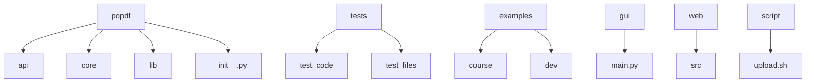
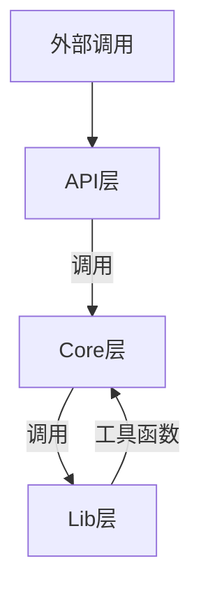
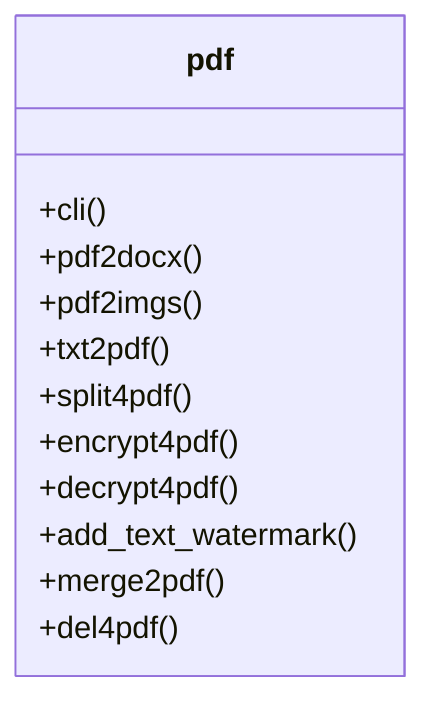
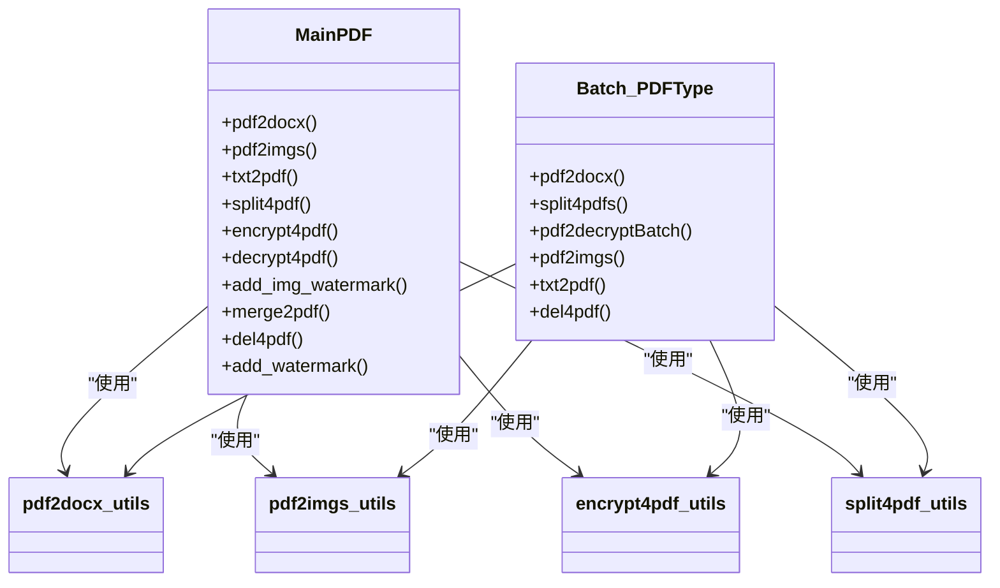
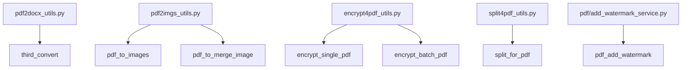
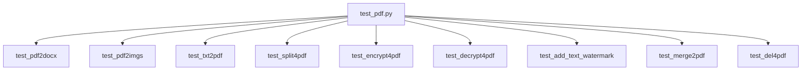
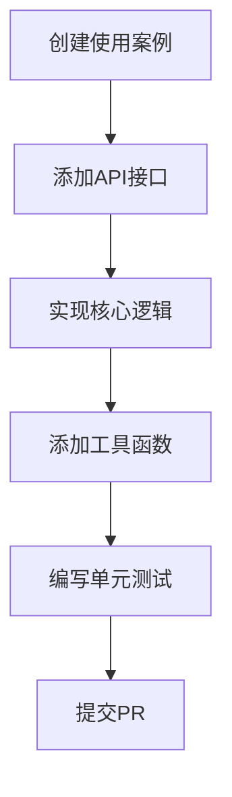
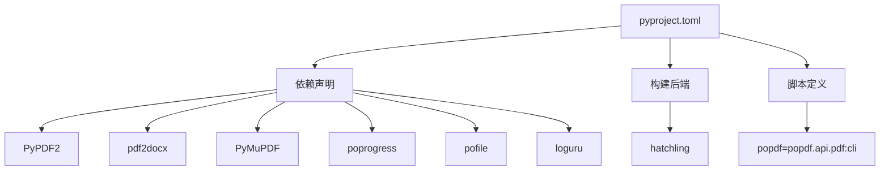
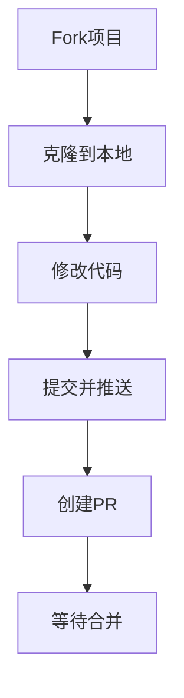

# 开发者指南

<cite>
**本文档中引用的文件**  
- [README.md](file://README.md)
- [pyproject.toml](file://pyproject.toml)
- [setup.py](file://setup.py)
- [popdf/__init__.py](file://popdf/__init__.py)
- [popdf/api/pdf.py](file://popdf/api/pdf.py)
- [popdf/core/PDFType.py](file://popdf/core/PDFType.py)
- [popdf/core/Batch_PDFType.py](file://popdf/core/Batch_PDFType.py)
- [popdf/lib/pdf2docx_utils.py](file://popdf/lib/pdf2docx_utils.py)
- [popdf/lib/pdf2imgs_utils.py](file://popdf/lib/pdf2imgs_utils.py)
- [popdf/lib/encrypt4pdf_utils.py](file://popdf/lib/encrypt4pdf_utils.py)
- [popdf/lib/split4pdf_utils.py](file://popdf/lib/split4pdf_utils.py)
- [popdf/lib/pdf/add_watermark_service.py](file://popdf/lib/pdf/add_watermark_service.py)
- [tests/test_code/test_pdf.py](file://tests/test_code/test_pdf.py)
- [examples/course/code/0-install.py](file://examples/course/code/0-install.py)
- [gui/main.py](file://gui/main.py)
- [web/src/App.tsx](file://web/src/App.tsx)
</cite>

## 目录

1. [项目结构](#项目结构)
2. [代码分层设计](#代码分层设计)
3. [API层](#apilayer)
4. [Core层](#corelayer)
5. [Lib层](#liblayer)
6. [单元测试](#单元测试)
7. [添加新功能](#添加新功能)
8. [依赖管理与构建流程](#依赖管理与构建流程)
9. [贡献代码](#贡献代码)

## 项目结构

本项目采用清晰的模块化结构，便于维护和扩展。主要目录结构如下：

**图源**  
- [README.md](file://README.md#L77-L88)

## 代码分层设计

项目采用三层架构设计，分别为API层、Core层和Lib层，各层职责分明，便于维护和扩展。

**图源**  
- [README.md](file://README.md#L81-L84)

## API层

API层提供外部调用的接口，是用户与库交互的主要入口。该层通过`click`库实现命令行接口，并通过`__init__.py`导出所有功能。

**图源**  
- [popdf/api/pdf.py](file://popdf/api/pdf.py#L12-L235)
- [popdf/__init__.py](file://popdf/__init__.py#L1)

## Core层

Core层包含项目的核心业务逻辑，主要由`MainPDF`和`Batch_PDFType`两个类组成，分别处理单个文件和批量文件操作。

**图源**  
- [popdf/core/PDFType.py](file://popdf/core/PDFType.py#L19-L179)
- [popdf/core/Batch_PDFType.py](file://popdf/core/Batch_PDFType.py#L16-L142)

## Lib层

Lib层包含各种工具函数，为Core层提供底层支持。每个工具文件对应特定功能，实现高内聚低耦合。

**图源**  
- [popdf/lib/pdf2docx_utils.py](file://popdf/lib/pdf2docx_utils.py#L7)
- [popdf/lib/pdf2imgs_utils.py](file://popdf/lib/pdf2imgs_utils.py#L10-L27)
- [popdf/lib/encrypt4pdf_utils.py](file://popdf/lib/encrypt4pdf_utils.py#L16-L54)
- [popdf/lib/split4pdf_utils.py](file://popdf/lib/split4pdf_utils.py#L8)
- [popdf/lib/pdf/add_watermark_service.py](file://popdf/lib/pdf/add_watermark_service.py#L31)

## 单元测试

项目高度重视代码质量，要求每新增或修改一个函数都必须编写单元测试。测试代码位于`tests/test_code`目录下。

**图源**  
- [tests/test_code/test_pdf.py](file://tests/test_code/test_pdf.py#L8-L196)
- [README.md](file://README.md#L86)

## 添加新功能

为项目添加新功能需要遵循以下步骤：

1. 在`examples`目录下创建使用案例
2. 在`popdf/api/pdf.py`中添加API接口
3. 在`popdf/core`中实现核心逻辑
4. 在`popdf/lib`中添加必要的工具函数
5. 在`tests/test_code`中编写单元测试

**图源**  
- [README.md](file://README.md#L80-L87)

## 依赖管理与构建流程

项目使用`pyproject.toml`进行依赖管理，通过`hatchling`进行构建。主要依赖包括PyPDF2、pdf2docx、PyMuPDF等PDF处理库。

**图源**  
- [pyproject.toml](file://pyproject.toml#L1-L35)
- [setup.py](file://setup.py#L12)

## 贡献代码

欢迎任何人参与项目开发。贡献代码的步骤如下：

1. Fork项目到自己的仓库
2. 克隆到本地进行修改
3. 提交代码并推送到自己的仓库
4. 创建Pull Request到主分支
5. 等待作者合并

**图源**  
- [README.md](file://README.md#L100-L105)