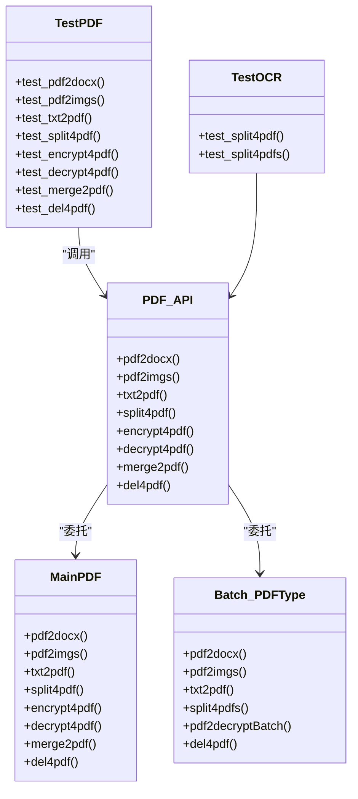
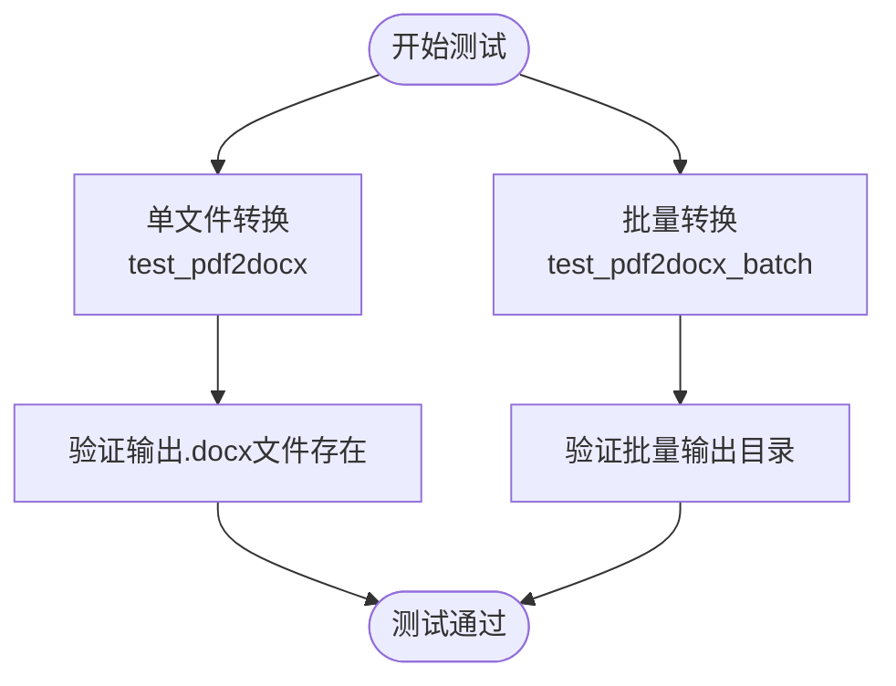
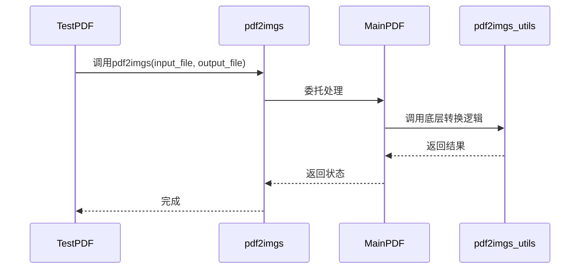
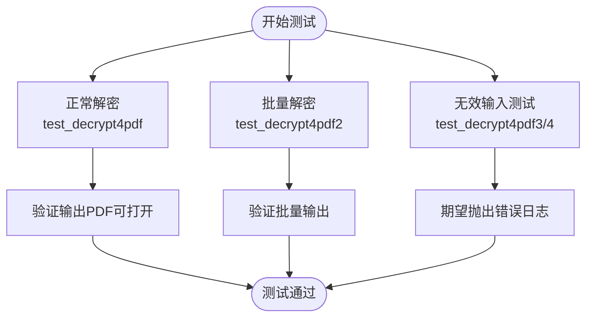
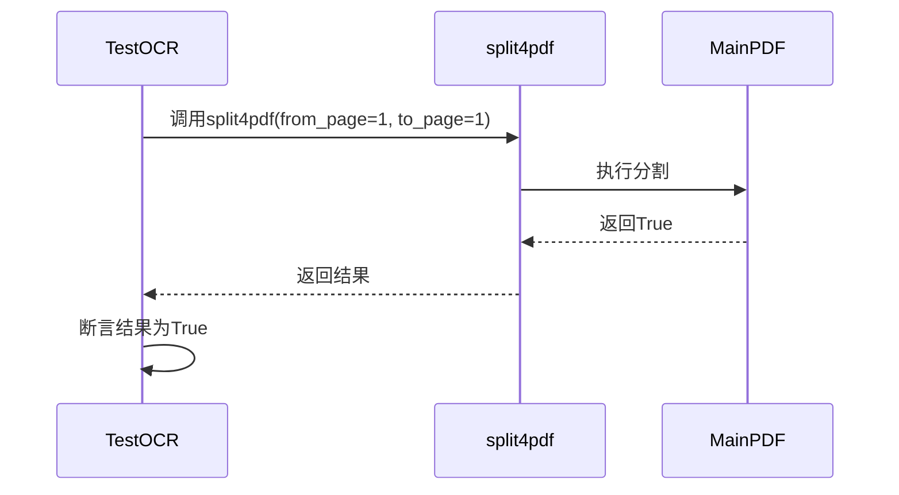
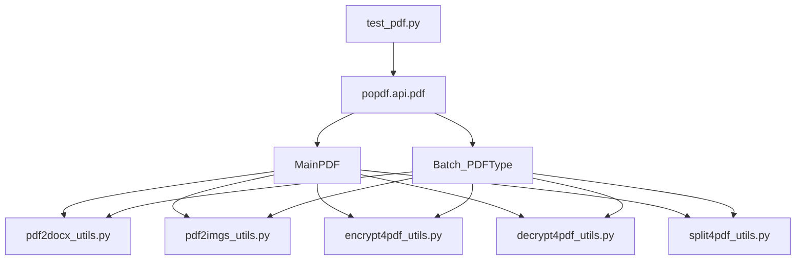

# 测试策略与实践

<cite>
**本文档引用的文件**  
- [test_pdf.py](file://tests/test_code/test_pdf.py)
- [test_dev.py](file://tests/test_code/test_dev.py)
- [pdf.py](file://popdf/api/pdf.py)
- [pdf2docx_utils.py](file://popdf/lib/pdf2docx_utils.py)
- [pdf2imgs_utils.py](file://popdf/lib/pdf2imgs_utils.py)
- [encrypt4pdf_utils.py](file://popdf/lib/encrypt4pdf_utils.py)
- [decrypt4pdf_utils.py](file://popdf/lib/decrypt4pdf_utils.py)
- [split4pdf_utils.py](file://popdf/lib/split4pdf_utils.py)
- [1-pdf2docx.py](file://examples/course/code/1-pdf2docx.py)
- [2-pdf2imgs.py](file://examples/course/code/2-pdf2imgs.py)
- [5-encrypt4pdf.py](file://examples/course/code/5-encrypt4pdf.py)
- [6-decrypt4pdf.py](file://examples/course/code/6-decrypt4pdf.py)
- [4-split4pdf.py](file://examples/course/code/4-split4pdf.py)
</cite>

## 目录
1. [引言](#引言)
2. [项目结构与测试布局](#项目结构与测试布局)
3. [核心测试组件分析](#核心测试组件分析)
4. [测试架构概述](#测试架构概述)
5. [详细组件测试分析](#详细组件测试分析)
6. [依赖关系分析](#依赖关系分析)
7. [性能与覆盖率考量](#性能与覆盖率考量)
8. [故障排查指南](#故障排查指南)
9. [结论](#结论)

## 引言
本文档旨在为开发者提供一套完整的单元测试策略，指导如何使用 `unittest` 框架对 PDF 处理功能进行高质量的测试验证。通过分析 `test_pdf.py` 和 `test_dev.py` 的测试结构，结合 `examples/course/code` 中的示例代码，明确测试用例组织规范、测试数据管理方式以及覆盖率要求，确保 PDF 核心功能的稳定性与健壮性。

## 项目结构与测试布局

```mermaid
graph TB
subgraph "测试代码"
TC[test_code/]
TC1[test_pdf.py]
TC2[test_dev.py]
end
subgraph "测试数据"
TF[test_files/]
TF1[txt2pdf/]
TF2[pdf2docx/]
TF3[pdf2imgs/]
TF4[split4pdf/]
TF5[encrypt4pdf/]
TF6[decrypt4pdf/]
end
subgraph "核心实现"
API[api/pdf.py]
LIB[lib/]
CORE[core/]
end
subgraph "示例代码"
EX[examples/course/code/]
EX1[1-pdf2docx.py]
EX2[2-pdf2imgs.py]
EX3[5-encrypt4pdf.py]
EX4[6-decrypt4pdf.py]
EX5[4-split4pdf.py]
end
TC1 --> API : "调用PDF API"
TC2 --> API
API --> LIB : "使用工具类"
LIB --> CORE : "依赖核心类型"
EX1 --> API : "演示调用"
EX2 --> API
EX3 --> API
EX4 --> API
EX5 --> API
```

**图示来源**  
- [test_pdf.py](file://tests/test_code/test_pdf.py#L1-L242)
- [test_dev.py](file://tests/test_code/test_dev.py#L1-L19)
- [pdf.py](file://popdf/api/pdf.py#L1-L235)

**本节来源**  
- [test_pdf.py](file://tests/test_code/test_pdf.py#L1-L242)
- [test_dev.py](file://tests/test_code/test_dev.py#L1-L19)

## 核心测试组件分析

`test_pdf.py` 文件实现了对 PDF 处理功能的全面测试，覆盖了从文档转换到加密解密的多个核心操作。每个测试方法均通过构造输入路径、输出路径及参数，调用对应的 API 函数，并隐式验证输出结果的存在性和正确性。

`test_dev.py` 提供了一个异常处理的测试模板，展示了如何捕获和验证异常行为，为后续扩展异常测试用例提供了基础结构。

**本节来源**  
- [test_pdf.py](file://tests/test_code/test_pdf.py#L1-L242)
- [test_dev.py](file://tests/test_code/test_dev.py#L1-L19)

## 测试架构概述

系统采用分层架构设计，测试层通过 `unittest.TestCase` 继承机制组织测试用例，调用位于 `popdf.api.pdf` 模块中的高层接口。这些接口进一步委托给 `MainPDF` 和 `Batch_PDFType` 两个核心类，分别处理单文件和批量操作。



**图示来源**  
- [test_pdf.py](file://tests/test_code/test_pdf.py#L8-L242)
- [pdf.py](file://popdf/api/pdf.py#L17-L235)
- [core/PDFType.py](file://popdf/core/PDFType.py)
- [core/Batch_PDFType.py](file://popdf/core/Batch_PDFType.py)

## 详细组件测试分析

### PDF 转 Word 测试分析

#### 测试场景覆盖


该测试验证了 `pdf2docx` 函数在单文件和批量模式下的行为一致性，确保转换后 `.docx` 文件正确生成。

**图示来源**  
- [test_pdf.py](file://tests/test_code/test_pdf.py#L10-L42)
- [pdf2docx_utils.py](file://popdf/lib/pdf2docx_utils.py)

**本节来源**  
- [test_pdf.py](file://tests/test_code/test_pdf.py#L10-L42)
- [1-pdf2docx.py](file://examples/course/code/1-pdf2docx.py)

### PDF 转图片测试分析

#### 测试流程


测试覆盖了合并模式（merge=True）和非合并模式的图像输出，确保不同参数组合下功能正常。

**图示来源**  
- [test_pdf.py](file://tests/test_code/test_pdf.py#L43-L65)
- [pdf.py](file://popdf/api/pdf.py#L45-L70)
- [pdf2imgs_utils.py](file://popdf/lib/pdf2imgs_utils.py)

**本节来源**  
- [test_pdf.py](file://tests/test_code/test_pdf.py#L43-L65)
- [2-pdf2imgs.py](file://examples/course/code/2-pdf2imgs.py)

### PDF 加密与解密测试分析

#### 解密异常处理测试


测试覆盖了正常解密、批量解密以及参数异常（如 `input_path=None`）等边界情况，确保错误处理机制健全。

**图示来源**  
- [test_pdf.py](file://tests/test_code/test_pdf.py#L110-L148)
- [decrypt4pdf_utils.py](file://popdf/lib/decrypt4pdf_utils.py)
- [encrypt4pdf_utils.py](file://popdf/lib/encrypt4pdf_utils.py)

**本节来源**  
- [test_pdf.py](file://tests/test_code/test_pdf.py#L97-L148)
- [5-encrypt4pdf.py](file://examples/course/code/5-encrypt4pdf.py)
- [6-decrypt4pdf.py](file://examples/course/code/6-decrypt4pdf.py)

### PDF 分割测试分析

#### 分割功能验证


`TestOCR` 类中的测试方法明确添加了断言 `self.assertTrue(r)`，体现了更严格的测试验证方式，建议在所有关键操作中采用。

**图示来源**  
- [test_pdf.py](file://tests/test_code/test_pdf.py#L213-L241)
- [split4pdf_utils.py](file://popdf/lib/split4pdf_utils.py)

**本节来源**  
- [test_pdf.py](file://tests/test_code/test_pdf.py#L80-L94)
- [4-split4pdf.py](file://examples/course/code/4-split4pdf.py)

## 依赖关系分析



所有测试用例均依赖于 `api/pdf.py` 提供的高层接口，而这些接口又依赖于 `lib` 目录下的具体实现工具类。这种分层设计有利于解耦和独立测试。

**图示来源**  
- [pdf.py](file://popdf/api/pdf.py#L1-L235)
- [lib/*.py](file://popdf/lib/)

**本节来源**  
- [pdf.py](file://popdf/api/pdf.py#L1-L235)
- [lib/*.py](file://popdf/lib/)

## 性能与覆盖率考量

### 测试覆盖率要求
| 功能模块 | 正常流程 | 异常处理 | 边界情况 |
|--------|---------|---------|---------|
| PDF转Word | ✓ | 参数校验 | 空文件、大文件 |
| PDF转图片 | ✓ | 图像格式错误 | 单页PDF、无权限 |
| 文本转PDF | ✓ | 编码错误 | 空文本、长文本 |
| PDF分割 | ✓ | 页码越界 | 单页分割、全选 |
| PDF加密 | ✓ | 密码强度 | 已加密文件 |
| PDF解密 | ✓ | 密码错误 | 未加密文件 |
| 合并PDF | ✓ | 文件损坏 | 单文件合并 |
| 删除页面 | ✓ | 页码无效 | 删除所有页 |

建议使用 `coverage.py` 工具确保核心模块测试覆盖率不低于 85%。

### 测试数据管理规范
- **测试代码**：存放于 `tests/test_code/` 目录下
- **测试数据**：存放于 `tests/test_files/` 对应子目录中
- **命名规范**：测试文件与功能模块对应，如 `txt2pdf/` 存放文本转PDF的样本
- **清理机制**：建议在 `tearDown()` 方法中清理生成的测试文件

**本节来源**  
- [test_pdf.py](file://tests/test_code/test_pdf.py#L1-L242)
- [test_files/](file://tests/test_files/)

## 故障排查指南

当测试失败时，请按以下步骤排查：

1. **检查路径问题**：确认 `input_file` 和 `output_file` 路径正确，使用 `os.path.join` 构造跨平台路径
2. **验证依赖项**：确保 `PyPDF2`、`pdf2docx` 等第三方库已正确安装
3. **查看日志输出**：检查 `logger.error` 输出的错误信息，定位参数错误原因
4. **测试数据完整性**：确认测试用 PDF 文件未损坏且可正常打开
5. **权限问题**：确保程序有读写目标目录的权限

**本节来源**  
- [test_pdf.py](file://tests/test_code/test_pdf.py#L42-L43)
- [pdf.py](file://popdf/api/pdf.py#L42-L43)

## 结论
本文档系统性地分析了 `popdf` 项目的测试结构与实践，明确了使用 `unittest` 框架进行 PDF 功能测试的最佳实践。通过遵循测试文件管理规范、覆盖正常流程、异常处理和边界情况，并结合示例代码构建测试场景，开发者可以有效提升代码质量与系统稳定性。建议在后续开发中持续完善测试用例，特别是对未完全覆盖的方法（如 `add_img_water`）补充测试。