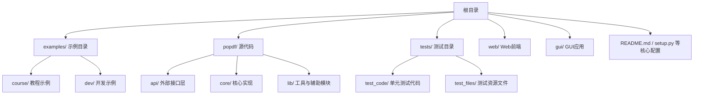
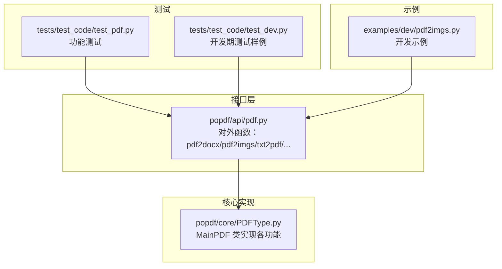
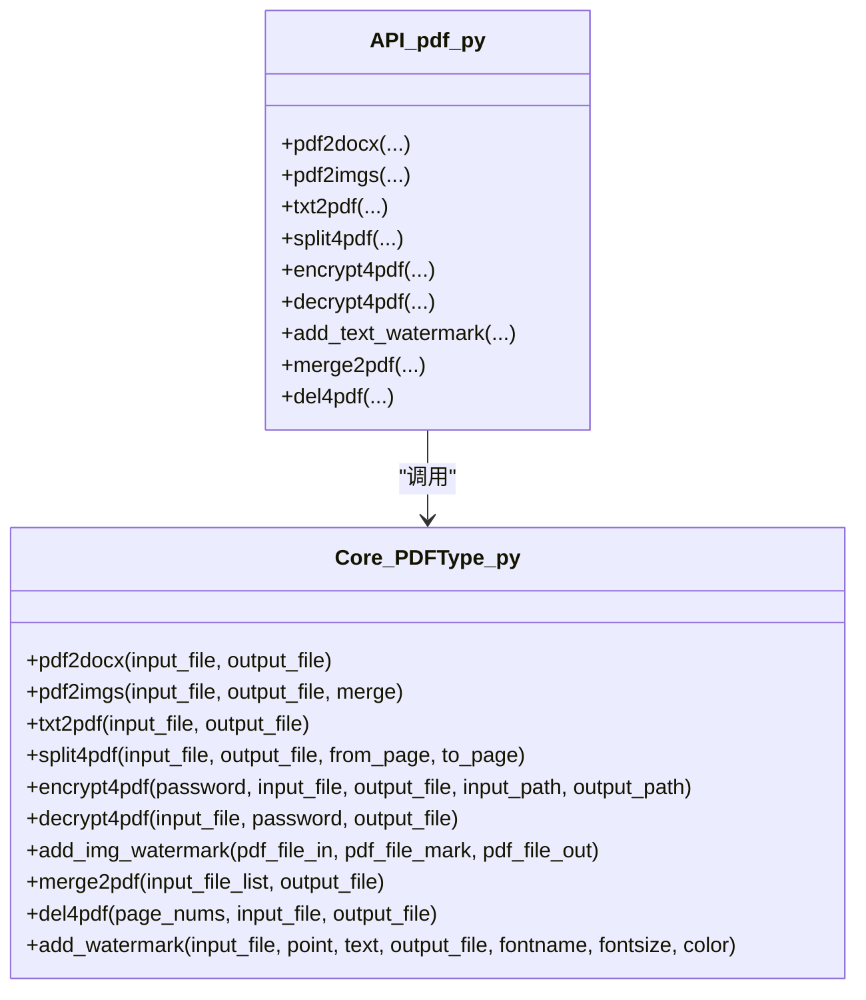
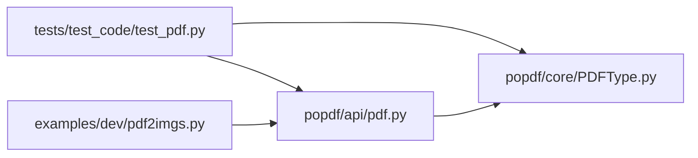

# 贡献代码指南

<cite>
**本文引用的文件**
- [README.md](file://README.md)
- [examples/dev/pdf2imgs.py](file://examples/dev/pdf2imgs.py)
- [tests/test_code/test_pdf.py](file://tests/test_code/test_pdf.py)
- [tests/test_code/test_dev.py](file://tests/test_code/test_dev.py)
- [popdf/api/pdf.py](file://popdf/api/pdf.py)
- [popdf/core/PDFType.py](file://popdf/core/PDFType.py)
- [setup.py](file://setup.py)
</cite>

## 目录
1. [简介](#简介)
2. [项目结构](#项目结构)
3. [核心贡献流程](#核心贡献流程)
4. [架构总览](#架构总览)
5. [详细组件与规范说明](#详细组件与规范说明)
6. [依赖关系分析](#依赖关系分析)
7. [性能与质量建议](#性能与质量建议)
8. [故障排查指南](#故障排查指南)
9. [结语](#结语)

## 简介
本指南面向希望参与 popdf 项目开发的贡献者，依据仓库 README.md 第 73-106 行的贡献要求，系统化说明从 fork 到 PR 提交的完整流程，并重点强调新增或修改功能必须配套：
- 在 examples/ 中新增使用案例（以 dev/pdf2imgs.py 为例）
- 在 tests/test_code/ 中编写单元测试（以 test_pdf.py 和 test_dev.py 为例）
同时明确禁止修改 README.md、setup.py 等核心配置文件，确保项目维护的一致性与稳定性。

## 项目结构
项目采用“功能模块 + 示例 + 测试”的组织方式，便于贡献者快速定位新增功能的落地位置与验证路径。

图表来源
- [README.md](file://README.md#L73-L106)

章节来源
- [README.md](file://README.md#L73-L106)

## 核心贡献流程
遵循 README.md 第 73-106 行的要求，贡献流程如下：
1) Fork 项目至个人仓库
2) 本地克隆仓库
3) 新增/修改代码
4) 提交并推送至个人仓库
5) 在 Gitee/GitHub/atomgit 上提交 Pull Request 至主分支
6) 等待维护者合并；建议在微信交流群中同步告知

此外，README.md 明确：一般不修改 README.md、requirements.txt、setup.py 等核心配置文件，避免引入不必要的变更风险。

章节来源
- [README.md](file://README.md#L73-L106)

## 架构总览
popdf 的对外接口集中在 popdf/api/pdf.py，内部通过 popdf/core/PDFType.py 实现具体 PDF 操作逻辑，测试位于 tests/test_code/，示例位于 examples/。

图表来源
- [popdf/api/pdf.py](file://popdf/api/pdf.py#L1-L235)
- [popdf/core/PDFType.py](file://popdf/core/PDFType.py#L1-L180)
- [tests/test_code/test_pdf.py](file://tests/test_code/test_pdf.py#L1-L242)
- [tests/test_code/test_dev.py](file://tests/test_code/test_dev.py#L1-L19)
- [examples/dev/pdf2imgs.py](file://examples/dev/pdf2imgs.py#L1-L61)

## 详细组件与规范说明

### 1) 新增/修改功能必须配套示例与测试
- 示例（examples/）：新增功能或接口变更后，需在 examples/ 下新增对应的使用案例文件，用于演示如何调用新功能，便于用户理解与复用。
- 测试（tests/test_code/）：每新增或修改一个函数/接口，提交前必须补充单元测试，覆盖正常路径与边界条件，保证功能稳定。

参考范例：
- 示例：dev/pdf2imgs.py 展示了如何从 PDF 中提取图片并保存为文件，包含参数说明与调用示例。
- 测试：test_pdf.py 包含多组测试用例，覆盖单文件与批量处理、合并图片、异常参数等场景；test_dev.py 提供开发期异常捕获示例。

章节来源
- [README.md](file://README.md#L73-L106)
- [examples/dev/pdf2imgs.py](file://examples/dev/pdf2imgs.py#L1-L61)
- [tests/test_code/test_pdf.py](file://tests/test_code/test_pdf.py#L1-L242)
- [tests/test_code/test_dev.py](file://tests/test_code/test_dev.py#L1-L19)

### 2) 接口层与核心实现的关系
- 接口层（popdf/api/pdf.py）：定义对外函数，负责参数校验与分派，调用核心实现。
- 核心实现（popdf/core/PDFType.py）：MainPDF 类封装具体 PDF 操作，如转换、拆分、加密、解密、加水印、合并、删除页等。

图表来源
- [popdf/api/pdf.py](file://popdf/api/pdf.py#L1-L235)
- [popdf/core/PDFType.py](file://popdf/core/PDFType.py#L1-L180)

章节来源
- [popdf/api/pdf.py](file://popdf/api/pdf.py#L1-L235)
- [popdf/core/PDFType.py](file://popdf/core/PDFType.py#L1-L180)

### 3) 如何为新功能创建示例文件
- 在 examples/ 下选择合适子目录（如 dev/ 或 course/），新增一个 Python 文件，命名与功能相关。
- 在文件中提供清晰的函数签名说明与调用示例，展示单文件与批量处理两种常见用法。
- 可参考 examples/dev/pdf2imgs.py 的风格：先导入必要库，再定义函数，最后在 if __name__ 中给出调用示例。

章节来源
- [examples/dev/pdf2imgs.py](file://examples/dev/pdf2imgs.py#L1-L61)

### 4) 如何编写覆盖边界条件的测试用例
- 在 tests/test_code/ 下新增或补充测试文件，使用 unittest 编写测试类与方法。
- 建议覆盖：
  - 正常路径：单文件与批量处理
  - 边界条件：空参数、非法路径、异常类型
  - 回归测试：历史兼容参数形式
- 可参考 test_pdf.py 的组织方式：每个功能一个或多个测试方法，使用相对路径指向测试资源，必要时断言返回值或文件生成结果。

章节来源
- [tests/test_code/test_pdf.py](file://tests/test_code/test_pdf.py#L1-L242)
- [tests/test_code/test_dev.py](file://tests/test_code/test_dev.py#L1-L19)

### 5) 提交 PR 后的处理流程
- 在 Gitee/GitHub/atomgit 上提交 PR 至主分支（master/main）。
- 等待维护者审核与合并。
- 建议在微信交流群中同步告知，便于社区关注与协作。

章节来源
- [README.md](file://README.md#L73-L106)

### 6) 文件修改权限与注意事项
- README.md、requirements.txt、setup.py 等核心配置文件一般不修改，避免引入不必要的变更风险。
- 若确需修改，请在 PR 中详细说明原因与影响评估。

章节来源
- [README.md](file://README.md#L73-L106)
- [setup.py](file://setup.py#L1-L14)

## 依赖关系分析
- 接口层依赖核心实现：API 层函数统一调度 MainPDF 的实例方法。
- 测试依赖接口层：通过直接导入 popdf.api.pdf 的函数进行测试。
- 示例依赖接口层：示例脚本直接调用 popdf.api.pdf 的函数，便于演示与复用。

图表来源
- [tests/test_code/test_pdf.py](file://tests/test_code/test_pdf.py#L1-L242)
- [popdf/api/pdf.py](file://popdf/api/pdf.py#L1-L235)
- [popdf/core/PDFType.py](file://popdf/core/PDFType.py#L1-L180)
- [examples/dev/pdf2imgs.py](file://examples/dev/pdf2imgs.py#L1-L61)

## 性能与质量建议
- 示例与测试应尽量覆盖常见输入规模与边界情况，避免长耗时任务阻塞 CI。
- 测试文件中使用相对路径与固定测试资源，减少对环境的依赖。
- 新增功能时，优先在接口层增加参数校验与错误提示，提升用户体验与可维护性。

## 故障排查指南
- 参数错误：接口层会在参数不合法时记录日志并返回错误提示，可在测试中模拟此类场景，验证日志输出与返回值。
- 文件路径问题：确保测试资源路径正确，必要时使用绝对路径或相对路径拼接。
- 异常捕获：可参考 test_dev.py 的异常捕获示例，验证异常类型与消息是否符合预期。

章节来源
- [popdf/api/pdf.py](file://popdf/api/pdf.py#L1-L235)
- [tests/test_code/test_dev.py](file://tests/test_code/test_dev.py#L1-L19)

## 结语
感谢每一位贡献者的付出。请严格遵守新增/修改功能必须配套示例与测试的原则，共同维护 popdf 的高质量与易用性。如有任何疑问，欢迎在项目交流群中沟通。