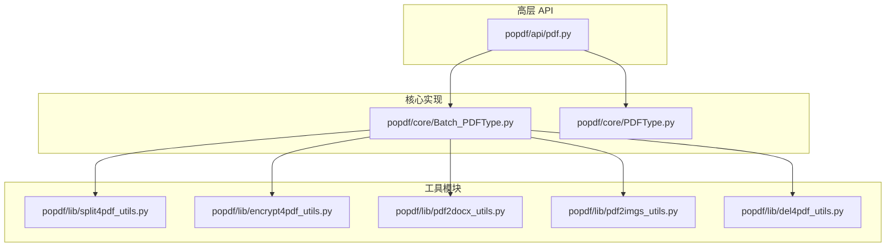
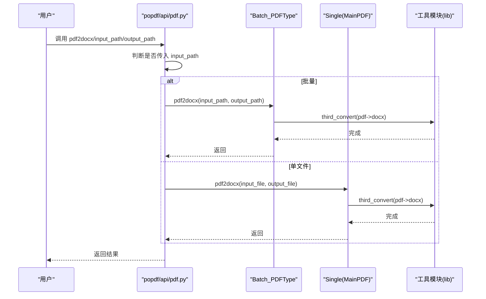
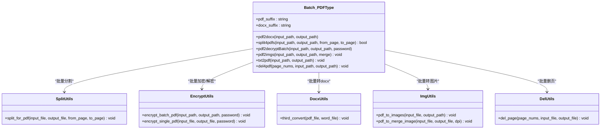
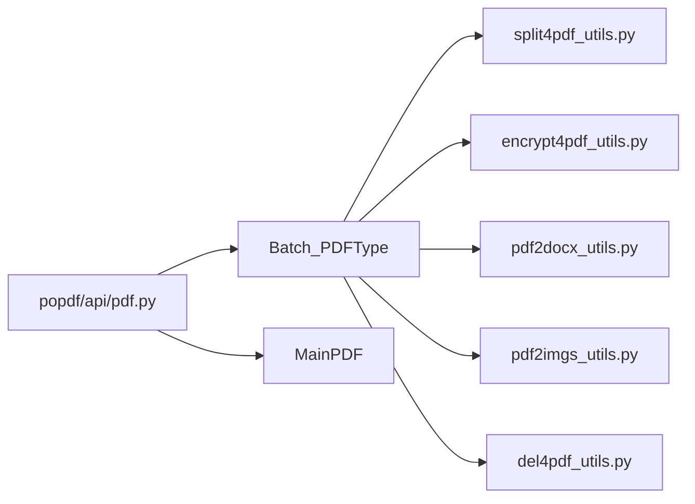

# 批量处理

<cite>
**本文引用的文件**
- [Batch_PDFType.py](file://popdf/core/Batch_PDFType.py)
- [PDFType.py](file://popdf/core/PDFType.py)
- [pdf.py](file://popdf/api/pdf.py)
- [split4pdf_utils.py](file://popdf/lib/split4pdf_utils.py)
- [encrypt4pdf_utils.py](file://popdf/lib/encrypt4pdf_utils.py)
- [pdf2docx_utils.py](file://popdf/lib/pdf2docx_utils.py)
- [pdf2imgs_utils.py](file://popdf/lib/pdf2imgs_utils.py)
- [del4pdf_utils.py](file://popdf/lib/del4pdf_utils.py)
- [4-split4pdf.py](file://examples/course/code/4-split4pdf.py)
- [5-encrypt4pdf.py](file://examples/course/code/5-encrypt4pdf.py)
- [6-decrypt4pdf.py](file://examples/course/code/6-decrypt4pdf.py)
- [1-pdf2docx.py](file://examples/course/code/1-pdf2docx.py)
- [2-pdf2imgs.py](file://examples/course/code/2-pdf2imgs.py)
- [3-txt2pdf.py](file://examples/course/code/3-txt2pdf.py)
- [8-merge2pdf.py](file://examples/course/code/8-merge2pdf.py)
- [9-del4pdf.py](file://examples/course/code/9-del4pdf.py)
</cite>

## 目录
1. [简介](#简介)
2. [项目结构](#项目结构)
3. [核心组件](#核心组件)
4. [架构总览](#架构总览)
5. [详细组件分析](#详细组件分析)
6. [依赖关系分析](#依赖关系分析)
7. [性能与资源特性](#性能与资源特性)
8. [故障排查指南](#故障排查指南)
9. [结论](#结论)
10. [附录](#附录)

## 简介
本章节聚焦于 popdf 库的批量处理能力，系统性讲解 Batch_PDFType 类的设计理念、使用方法与最佳实践。内容涵盖：
- 如何对目录中的多个 PDF 文件进行批量转换、批量分割、批量加密、批量解密、批量转图片、批量删除页面、批量 TXT 转 PDF 等。
- 输入输出路径配置方式与错误处理机制。
- 性能特征与资源消耗分析，并给出优化建议。
- 对比单文件处理与批量处理在 API 调用上的差异。

## 项目结构
popdf 的批量处理能力由“高层 API”与“核心实现”两层构成：
- 高层 API 层：位于 popdf/api/pdf.py，统一暴露 pdf2docx、pdf2imgs、txt2pdf、split4pdf、encrypt4pdf、decrypt4pdf、merge2pdf、del4pdf 等接口，内部根据是否传入 input_path 或 input_file 自动路由到单文件 MainPDF 或批量 Batch_PDFType 实现。
- 核心实现层：位于 popdf/core，Batch_PDFType 提供批量能力；PDFType.MainPDF 提供单文件能力；各 lib 工具模块封装具体算法（如分割、加密、转图片、删除页面等）。

图表来源
- [pdf.py](file://popdf/api/pdf.py#L1-L235)
- [Batch_PDFType.py](file://popdf/core/Batch_PDFType.py#L1-L142)
- [PDFType.py](file://popdf/core/PDFType.py#L1-L180)
- [split4pdf_utils.py](file://popdf/lib/split4pdf_utils.py#L1-L38)
- [encrypt4pdf_utils.py](file://popdf/lib/encrypt4pdf_utils.py#L1-L83)
- [pdf2docx_utils.py](file://popdf/lib/pdf2docx_utils.py#L1-L23)
- [pdf2imgs_utils.py](file://popdf/lib/pdf2imgs_utils.py#L1-L62)
- [del4pdf_utils.py](file://popdf/lib/del4pdf_utils.py#L1-L20)

章节来源
- [pdf.py](file://popdf/api/pdf.py#L1-L235)
- [Batch_PDFType.py](file://popdf/core/Batch_PDFType.py#L1-L142)
- [PDFType.py](file://popdf/core/PDFType.py#L1-L180)

## 核心组件
- Batch_PDFType：面向批量场景的统一入口，负责遍历目录、筛选 PDF/TXT 文件、调用对应工具模块完成批量转换/分割/加密/解密/转图片/删除页面等任务。
- PDFType.MainPDF：面向单文件场景的实现，提供与 Batch_PDFType 对应的单文件版本能力。
- 工具模块：split4pdf_utils、encrypt4pdf_utils、pdf2docx_utils、pdf2imgs_utils、del4pdf_utils 等，封装具体算法与 IO 处理。

章节来源
- [Batch_PDFType.py](file://popdf/core/Batch_PDFType.py#L1-L142)
- [PDFType.py](file://popdf/core/PDFType.py#L1-L180)
- [split4pdf_utils.py](file://popdf/lib/split4pdf_utils.py#L1-L38)
- [encrypt4pdf_utils.py](file://popdf/lib/encrypt4pdf_utils.py#L1-L83)
- [pdf2docx_utils.py](file://popdf/lib/pdf2docx_utils.py#L1-L23)
- [pdf2imgs_utils.py](file://popdf/lib/pdf2imgs_utils.py#L1-L62)
- [del4pdf_utils.py](file://popdf/lib/del4pdf_utils.py#L1-L20)

## 架构总览
下图展示 popdf 批量处理的整体调用链路：高层 API 根据参数自动选择单文件或批量实现，批量实现再通过工具模块完成具体业务逻辑。

图表来源
- [pdf.py](file://popdf/api/pdf.py#L1-L235)
- [Batch_PDFType.py](file://popdf/core/Batch_PDFType.py#L1-L142)
- [PDFType.py](file://popdf/core/PDFType.py#L1-L180)
- [pdf2docx_utils.py](file://popdf/lib/pdf2docx_utils.py#L1-L23)

## 详细组件分析

### Batch_PDFType 类设计与职责
- 设计要点
  - 统一入口：通过 pdf2docx、split4pdfs、pdf2decryptBatch、pdf2imgs、txt2pdf、del4pdf 等方法提供批量能力。
  - 路径与文件枚举：使用工具函数扫描目录并过滤 .pdf/.txt 文件，确保批量处理的自动化与可扩展性。
  - 进度与日志：部分方法使用进度条库输出处理进度，便于长耗时任务监控。
  - 错误处理：对空目录、无效路径、异常等情况进行日志记录与返回值控制，避免中断整个批处理流程。
- 数据流
  - 输入：input_path（批量输入目录）、output_path（批量输出目录）、可选参数（如 from_page/to_page、password、merge 等）。
  - 处理：遍历匹配文件，调用对应工具模块执行转换/分割/加密/解密/转图片/删除页面。
  - 输出：每个文件生成独立输出文件，或按需合并为单张图片（合并模式）。

图表来源
- [Batch_PDFType.py](file://popdf/core/Batch_PDFType.py#L1-L142)
- [split4pdf_utils.py](file://popdf/lib/split4pdf_utils.py#L1-L38)
- [encrypt4pdf_utils.py](file://popdf/lib/encrypt4pdf_utils.py#L1-L83)
- [pdf2docx_utils.py](file://popdf/lib/pdf2docx_utils.py#L1-L23)
- [pdf2imgs_utils.py](file://popdf/lib/pdf2imgs_utils.py#L1-L62)
- [del4pdf_utils.py](file://popdf/lib/del4pdf_utils.py#L1-L20)

章节来源
- [Batch_PDFType.py](file://popdf/core/Batch_PDFType.py#L1-L142)

### 批量转换（PDF→DOCX）
- 能力概述
  - 扫描 input_path 下所有 .pdf 文件，逐一调用第三方转换器生成 .docx。
  - 输出文件名与原 PDF 名称一致，仅后缀替换为 .docx。
- 使用要点
  - 输入输出路径必须存在且可写。
  - 若 input_path 中无 .pdf 文件，会记录错误并返回 False。
- 示例参考
  - 单文件转换示例：[1-pdf2docx.py](file://examples/course/code/1-pdf2docx.py#L1-L35)
  - 批量转换入口：[pdf.py](file://popdf/api/pdf.py#L17-L43)

章节来源
- [Batch_PDFType.py](file://popdf/core/Batch_PDFType.py#L21-L31)
- [pdf2docx_utils.py](file://popdf/lib/pdf2docx_utils.py#L1-L23)
- [1-pdf2docx.py](file://examples/course/code/1-pdf2docx.py#L1-L35)
- [pdf.py](file://popdf/api/pdf.py#L17-L43)

### 批量分割（PDF 分页）
- 能力概述
  - 对 input_path 下的每个 PDF，按 from_page 到 to_page 范围生成新的 PDF 文件。
  - 输出文件名包含 “split” 后缀，便于区分原文件。
- 使用要点
  - from_page/to_page 采用“从 1 开始”的页码语义，内部会转换为 0 基索引。
  - 若未找到 .pdf 文件，记录错误并返回 False。
- 示例参考
  - 批量分割示例：[4-split4pdf.py](file://examples/course/code/4-split4pdf.py#L1-L54)
  - 批量分割入口：[pdf.py](file://popdf/api/pdf.py#L93-L114)

章节来源
- [Batch_PDFType.py](file://popdf/core/Batch_PDFType.py#L32-L53)
- [split4pdf_utils.py](file://popdf/lib/split4pdf_utils.py#L1-L38)
- [4-split4pdf.py](file://examples/course/code/4-split4pdf.py#L1-L54)
- [pdf.py](file://popdf/api/pdf.py#L93-L114)

### 批量加密（PDF 加密）
- 能力概述
  - 对 input_path 下的每个 PDF，使用指定密码进行加密，输出到 output_path。
  - 支持覆盖输出目录不存在时自动创建。
- 使用要点
  - 若 output_path 为空，则默认覆盖写回原目录。
  - 该方法为批量加密入口，内部调用加密工具模块。
- 示例参考
  - 批量加密示例：[5-encrypt4pdf.py](file://examples/course/code/5-encrypt4pdf.py#L1-L28)
  - 批量加密入口：[pdf.py](file://popdf/api/pdf.py#L117-L124)

章节来源
- [Batch_PDFType.py](file://popdf/core/Batch_PDFType.py#L54-L67)
- [encrypt4pdf_utils.py](file://popdf/lib/encrypt4pdf_utils.py#L1-L83)
- [5-encrypt4pdf.py](file://examples/course/code/5-encrypt4pdf.py#L1-L28)
- [pdf.py](file://popdf/api/pdf.py#L117-L124)

### 批量解密（PDF 解密）
- 能力概述
  - 对 input_path 下的每个 PDF，使用指定密码进行解密，输出到 output_path。
  - 该方法为批量解密入口，内部直接遍历目录并调用解密工具。
- 使用要点
  - 仅处理 .pdf 文件，跳过非 PDF 文件并记录信息。
  - 若缺少必要参数，记录错误。
- 示例参考
  - 批量解密示例：[6-decrypt4pdf.py](file://examples/course/code/6-decrypt4pdf.py#L1-L30)
  - 批量解密入口：[pdf.py](file://popdf/api/pdf.py#L126-L151)

章节来源
- [Batch_PDFType.py](file://popdf/core/Batch_PDFType.py#L54-L67)
- [6-decrypt4pdf.py](file://examples/course/code/6-decrypt4pdf.py#L1-L30)
- [pdf.py](file://popdf/api/pdf.py#L126-L151)

### 批量转图片（PDF→JPG）
- 能力概述
  - 支持两种模式：
    - 分页导出：为每个 PDF 生成独立子目录，目录内按页导出 JPG。
    - 合并导出：将 PDF 所有页合并为一张高分辨率 JPG。
  - 输出目录按需创建。
- 使用要点
  - 合并模式下，输出文件名为原 PDF 名称 + .jpg。
  - 分页模式下，输出目录为原 PDF 名称，文件名为 “原文件名-页号.jpg”。
- 示例参考
  - 批量转图片示例：[2-pdf2imgs.py](file://examples/course/code/2-pdf2imgs.py#L1-L27)
  - 批量转图片入口：[pdf.py](file://popdf/api/pdf.py#L45-L70)

章节来源
- [Batch_PDFType.py](file://popdf/core/Batch_PDFType.py#L68-L79)
- [pdf2imgs_utils.py](file://popdf/lib/pdf2imgs_utils.py#L1-L62)
- [2-pdf2imgs.py](file://examples/course/code/2-pdf2imgs.py#L1-L27)
- [pdf.py](file://popdf/api/pdf.py#L45-L70)

### 批量 TXT 转 PDF
- 能力概述
  - 扫描 input_path 下所有 .txt 文件，逐一转换为 PDF，并保留目录结构。
  - 输出文件名为原文件名 + .pdf。
- 使用要点
  - 依赖 PyMuPDF 版本要求，低于最低版本会抛出退出异常。
  - 保留目录结构与元数据，链接处理与命名链接跳过策略明确。
- 示例参考
  - 批量 TXT 转 PDF 示例：[3-txt2pdf.py](file://examples/course/code/3-txt2pdf.py#L1-L27)
  - 批量 TXT 转 PDF 入口：[pdf.py](file://popdf/api/pdf.py#L72-L91)

章节来源
- [Batch_PDFType.py](file://popdf/core/Batch_PDFType.py#L80-L126)
- [PDFType.py](file://popdf/core/PDFType.py#L36-L80)
- [3-txt2pdf.py](file://examples/course/code/3-txt2pdf.py#L1-L27)
- [pdf.py](file://popdf/api/pdf.py#L72-L91)

### 批量删除页面（PDF 删页）
- 能力概述
  - 对 input_path 下的每个 PDF，删除指定页号（基于 1 的页码），输出到 output_path。
  - 支持多页删除，内部进行越界保护。
- 使用要点
  - 页号列表为 1 基索引，内部转换为 0 基索引。
  - 输出文件名与原文件一致。
- 示例参考
  - 批量删页示例：[9-del4pdf.py](file://examples/course/code/9-del4pdf.py#L1-L30)
  - 批量删页入口：[pdf.py](file://popdf/api/pdf.py#L183-L194)

章节来源
- [Batch_PDFType.py](file://popdf/core/Batch_PDFType.py#L127-L142)
- [del4pdf_utils.py](file://popdf/lib/del4pdf_utils.py#L1-L20)
- [9-del4pdf.py](file://examples/course/code/9-del4pdf.py#L1-L30)
- [pdf.py](file://popdf/api/pdf.py#L183-L194)

### 输入输出路径配置与错误处理
- 路径配置
  - input_path：批量输入目录，用于扫描 .pdf/.txt 文件。
  - output_path：批量输出目录，若不存在则自动创建。
  - input_file/output_file：单文件场景下的输入输出文件路径。
- 错误处理
  - 未找到 .pdf/.txt 文件：记录错误并返回 False（如批量分割）。
  - 无效路径或参数缺失：记录错误并返回 False。
  - 工具模块内部异常：捕获并记录错误，不影响其他文件处理。
  - 版本检查失败：在 TXT 转 PDF 场景中直接抛出退出异常，提示最低版本要求。

章节来源
- [Batch_PDFType.py](file://popdf/core/Batch_PDFType.py#L21-L53)
- [Batch_PDFType.py](file://popdf/core/Batch_PDFType.py#L80-L126)
- [PDFType.py](file://popdf/core/PDFType.py#L36-L80)

### 单文件 vs 批量处理 API 差异
- 路由规则
  - 高层 API 通过判断是否传入 input_path 来决定调用 Batch_PDFType 还是 MainPDF。
- 方法签名差异
  - 批量：接收 input_path、output_path 及相关参数（如 from_page/to_page、merge、page_nums 等）。
  - 单文件：接收 input_file、output_file 及相关参数。
- 行为差异
  - 批量：自动遍历目录、过滤文件、逐个处理并输出到对应位置。
  - 单文件：直接对单个文件执行转换/分割/加密/解密/转图片/删页等操作。

章节来源
- [pdf.py](file://popdf/api/pdf.py#L17-L235)
- [Batch_PDFType.py](file://popdf/core/Batch_PDFType.py#L1-L142)
- [PDFType.py](file://popdf/core/PDFType.py#L1-L180)

## 依赖关系分析
- 组件耦合
  - Batch_PDFType 与工具模块之间为“使用”关系，耦合度低，便于替换与扩展。
  - 高层 API 作为门面，屏蔽单文件与批量实现差异，降低调用复杂度。
- 外部依赖
  - PyMuPDF：用于 PDF 读写、页面渲染、合并等。
  - PyPDF2：用于 PDF 加密/解密。
  - pdf2docx：用于 PDF→DOCX 转换。
  - PIL：用于图片合并。
  - 日志与进度：loguru、poprogress。
- 潜在循环依赖
  - 未发现循环导入；模块间为单向依赖（API → Batch/MainPDF → 工具模块）。

图表来源
- [pdf.py](file://popdf/api/pdf.py#L1-L235)
- [Batch_PDFType.py](file://popdf/core/Batch_PDFType.py#L1-L142)
- [PDFType.py](file://popdf/core/PDFType.py#L1-L180)
- [split4pdf_utils.py](file://popdf/lib/split4pdf_utils.py#L1-L38)
- [encrypt4pdf_utils.py](file://popdf/lib/encrypt4pdf_utils.py#L1-L83)
- [pdf2docx_utils.py](file://popdf/lib/pdf2docx_utils.py#L1-L23)
- [pdf2imgs_utils.py](file://popdf/lib/pdf2imgs_utils.py#L1-L62)
- [del4pdf_utils.py](file://popdf/lib/del4pdf_utils.py#L1-L20)

## 性能与资源特性
- 时间复杂度
  - 批量处理的时间复杂度近似为 O(N × T)，其中 N 为文件数量，T 为单文件处理时间（受页数、分辨率、算法复杂度影响）。
  - 分割/加密/解密/转图片/删页等操作通常与页数线性相关。
- 空间复杂度
  - 图片合并模式会产生大尺寸图片，内存占用较高；分页导出模式内存占用较低。
  - 加密/解密过程通常为流式处理，内存占用可控。
- 资源消耗
  - CPU：图片转码、PDF 渲染、加密/解密等计算密集型操作。
  - 内存：图片合并、PDF 页面加载、第三方转换器（如 pdf2docx）可能占用较多内存。
  - 磁盘：批量输出文件数量较多，需预留充足磁盘空间。
- 优化建议
  - 并发控制：在外部对 Batch_PDFType 的调用进行并发限制，避免同时打开过多文件导致内存峰值过高。
  - 合理选择模式：优先使用分页导出而非合并导出，除非确实需要单张大图。
  - 选择合适 DPI：合并导出时适当降低 DPI，减少内存与磁盘压力。
  - 预检路径：提前检查输入输出路径权限与可用空间，避免中途失败。
  - 进度与日志：利用进度条与日志定位慢点，及时调整参数。

[本节为通用性能指导，无需列出具体文件来源]

## 故障排查指南
- 常见问题
  - 未找到 PDF/TXT 文件：确认 input_path 是否正确、是否存在 .pdf/.txt 文件。
  - 路径无效或权限不足：检查输出目录是否存在且可写。
  - 加密/解密失败：确认密码正确、文件未损坏。
  - 图片合并失败：检查内存是否不足、DPI 设置是否过高。
  - 第三方转换失败：确认 pdf2docx 可用、网络环境稳定。
- 排查步骤
  - 查看日志：Batch_PDFType 与工具模块均使用日志记录关键信息与错误。
  - 逐步缩小范围：先对单个文件验证流程，再扩大到批量。
  - 调整参数：降低 DPI、关闭合并模式、减少并发数。
- 相关实现参考
  - 错误处理与日志记录：[Batch_PDFType.py](file://popdf/core/Batch_PDFType.py#L21-L53)
  - 加密/解密错误处理：[encrypt4pdf_utils.py](file://popdf/lib/encrypt4pdf_utils.py#L1-L83)
  - 转图片错误处理：[pdf2imgs_utils.py](file://popdf/lib/pdf2imgs_utils.py#L1-L62)
  - 删页错误处理：[del4pdf_utils.py](file://popdf/lib/del4pdf_utils.py#L1-L20)

章节来源
- [Batch_PDFType.py](file://popdf/core/Batch_PDFType.py#L21-L53)
- [encrypt4pdf_utils.py](file://popdf/lib/encrypt4pdf_utils.py#L1-L83)
- [pdf2imgs_utils.py](file://popdf/lib/pdf2imgs_utils.py#L1-L62)
- [del4pdf_utils.py](file://popdf/lib/del4pdf_utils.py#L1-L20)

## 结论
Batch_PDFType 通过统一的批量入口与清晰的工具模块分工，提供了覆盖转换、分割、加密、解密、转图片、删页等在内的完整批量处理能力。其设计强调易用性与健壮性：自动路径创建、进度反馈、错误日志与返回值控制，使大规模 PDF 处理更加可靠。结合合理的参数配置与资源管理，可在保证质量的同时提升整体吞吐。

[本节为总结性内容，无需列出具体文件来源]

## 附录
- 示例参考
  - 批量分割：[4-split4pdf.py](file://examples/course/code/4-split4pdf.py#L1-L54)
  - 批量加密：[5-encrypt4pdf.py](file://examples/course/code/5-encrypt4pdf.py#L1-L28)
  - 批量解密：[6-decrypt4pdf.py](file://examples/course/code/6-decrypt4pdf.py#L1-L30)
  - 批量转 DOCX：[1-pdf2docx.py](file://examples/course/code/1-pdf2docx.py#L1-L35)
  - 批量转图片：[2-pdf2imgs.py](file://examples/course/code/2-pdf2imgs.py#L1-L27)
  - 批量 TXT 转 PDF：[3-txt2pdf.py](file://examples/course/code/3-txt2pdf.py#L1-L27)
  - 批量删页：[9-del4pdf.py](file://examples/course/code/9-del4pdf.py#L1-L30)
- 合并 PDF（单文件）
  - 示例：[8-merge2pdf.py](file://examples/course/code/8-merge2pdf.py#L1-L30)

[本节为示例汇总，无需列出具体文件来源]