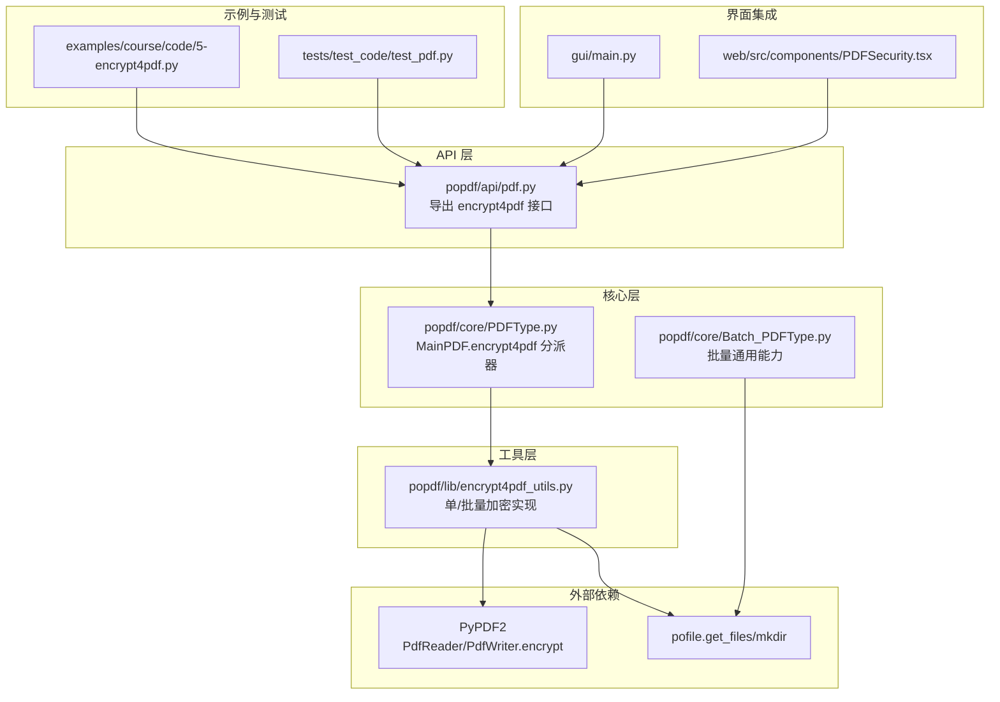
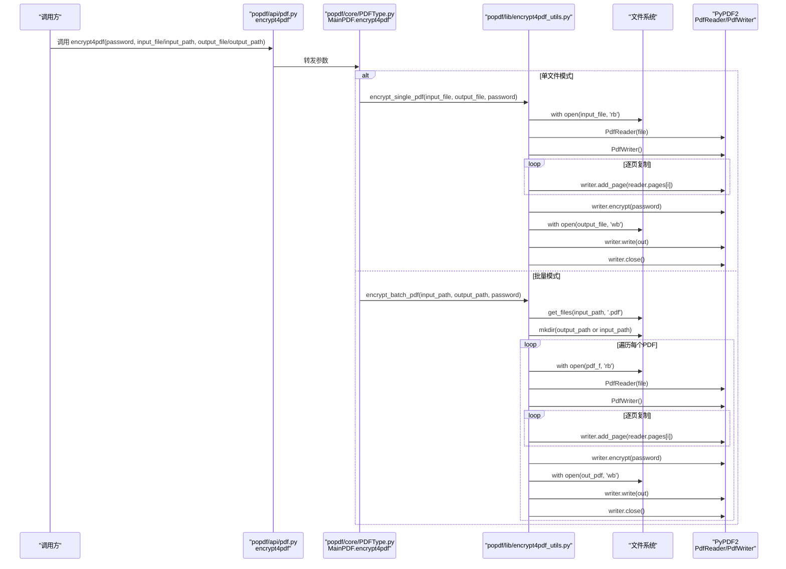
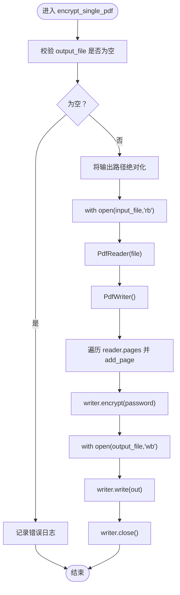
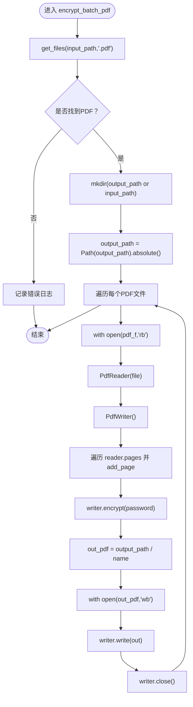
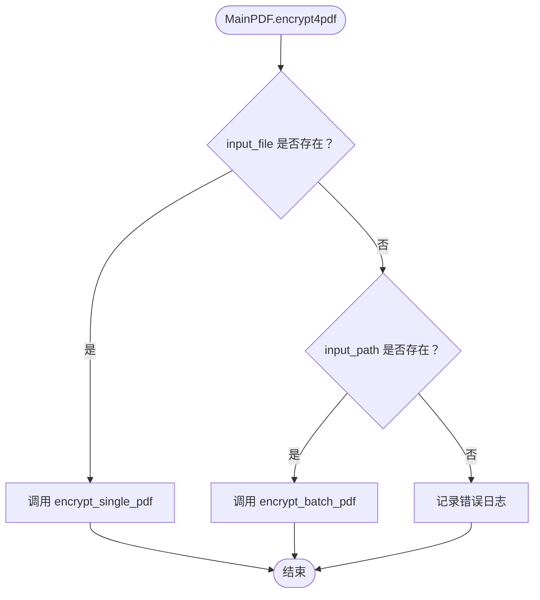
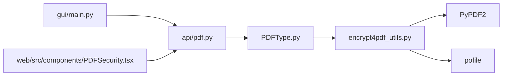

# PDF加密

<cite>
**本文引用的文件**
- [popdf/lib/encrypt4pdf_utils.py](file://popdf/lib/encrypt4pdf_utils.py)
- [popdf/api/pdf.py](file://popdf/api/pdf.py)
- [popdf/core/PDFType.py](file://popdf/core/PDFType.py)
- [popdf/core/Batch_PDFType.py](file://popdf/core/Batch_PDFType.py)
- [examples/course/code/5-encrypt4pdf.py](file://examples/course/code/5-encrypt4pdf.py)
- [tests/test_code/test_pdf.py](file://tests/test_code/test_pdf.py)
- [gui/main.py](file://gui/main.py)
- [web/src/components/PDFSecurity.tsx](file://web/src/components/PDFSecurity.tsx)
- [uv.lock](file://uv.lock)
</cite>

## 目录
1. [简介](#简介)
2. [项目结构](#项目结构)
3. [核心组件](#核心组件)
4. [架构总览](#架构总览)
5. [详细组件分析](#详细组件分析)
6. [依赖关系分析](#依赖关系分析)
7. [性能考量](#性能考量)
8. [故障排查指南](#故障排查指南)
9. [结论](#结论)
10. [附录](#附录)

## 简介
本文件系统性解析 popdf 库的 PDF 加密能力，围绕 PyPDF2 的 PdfWriter.encrypt 方法，深入剖析单文件加密 encrypt_single_pdf 与批量加密 encrypt_batch_pdf 的实现逻辑；阐明密码参数处理流程、输出路径自动创建（mkdir）、文件流的安全关闭；结合 MainPDF.encrypt4pdf 方法，说明如何通过 input_file/input_path 参数区分单文件与批量处理模式；并提供加密强度建议、密码复杂度要求，以及常见问题（如输出路径无效、源文件不存在）的解决方案。最后给出与命令行工具 encrypt4pdf、GUI 与 Web 界面的集成调用示例。

## 项目结构
与“PDF加密”直接相关的核心模块与文件如下：
- API 层：对外暴露 encrypt4pdf 接口，统一入口
- 核心层：MainPDF 将单/批量模式分派至具体实现
- 工具层：encrypt4pdf_utils 提供单/批量加密的具体实现
- 批量工具层：Batch_PDFType 提供批量通用能力（如 get_files、mkdir）
- 示例与测试：演示与验证加密流程
- GUI/Web：提供图形化界面与前端组件

图表来源
- [popdf/api/pdf.py](file://popdf/api/pdf.py#L117-L124)
- [popdf/core/PDFType.py](file://popdf/core/PDFType.py#L99-L108)
- [popdf/lib/encrypt4pdf_utils.py](file://popdf/lib/encrypt4pdf_utils.py#L16-L82)
- [popdf/core/Batch_PDFType.py](file://popdf/core/Batch_PDFType.py#L1-L142)
- [examples/course/code/5-encrypt4pdf.py](file://examples/course/code/5-encrypt4pdf.py#L1-L28)
- [tests/test_code/test_pdf.py](file://tests/test_code/test_pdf.py#L96-L108)
- [gui/main.py](file://gui/main.py#L845-L857)
- [web/src/components/PDFSecurity.tsx](file://web/src/components/PDFSecurity.tsx#L233-L249)

章节来源
- [popdf/api/pdf.py](file://popdf/api/pdf.py#L117-L124)
- [popdf/core/PDFType.py](file://popdf/core/PDFType.py#L99-L108)
- [popdf/lib/encrypt4pdf_utils.py](file://popdf/lib/encrypt4pdf_utils.py#L16-L82)
- [popdf/core/Batch_PDFType.py](file://popdf/core/Batch_PDFType.py#L1-L142)

## 核心组件
- API 入口：popdf.api.pdf.encrypt4pdf 将调用转发给 MainPDF.encrypt4pdf
- 主处理类：MainPDF.encrypt4pdf 根据 input_file 或 input_path 判断单/批量模式
- 单文件加密：encrypt_single_pdf 读取单个 PDF，逐页复制到 PdfWriter 并调用 encrypt
- 批量加密：encrypt_batch_pdf 枚举目录下所有 .pdf，逐个加密并输出到目标目录
- 输出路径：使用 pofile.mkdir 自动创建输出目录；若未提供 output_path，采用 input_path
- 文件流：使用 with open(...) 上下文管理器保证文件句柄安全关闭；PdfWriter.write 后显式 close

章节来源
- [popdf/api/pdf.py](file://popdf/api/pdf.py#L117-L124)
- [popdf/core/PDFType.py](file://popdf/core/PDFType.py#L99-L108)
- [popdf/lib/encrypt4pdf_utils.py](file://popdf/lib/encrypt4pdf_utils.py#L16-L82)

## 架构总览
下面的序列图展示了从 API 调用到底层实现的完整流程，包括参数判断、路径处理与文件写入。

图表来源
- [popdf/api/pdf.py](file://popdf/api/pdf.py#L117-L124)
- [popdf/core/PDFType.py](file://popdf/core/PDFType.py#L99-L108)
- [popdf/lib/encrypt4pdf_utils.py](file://popdf/lib/encrypt4pdf_utils.py#L16-L82)

## 详细组件分析

### 单文件加密 encrypt_single_pdf
- 输入：input_file、output_file、password
- 流程要点：
  - 校验 output_file 是否为空（为空则记录错误日志）
  - 使用 with open 读取输入 PDF，构建 PdfReader
  - 创建 PdfWriter，遍历 reader.pages 逐页 add_page
  - 调用 writer.encrypt(password) 应用加密
  - 使用 with open 写出到 output_file
  - 显式 writer.close() 释放资源
- 输出路径：若未提供 output_file，会记录错误；否则对输出路径进行绝对化处理

图表来源
- [popdf/lib/encrypt4pdf_utils.py](file://popdf/lib/encrypt4pdf_utils.py#L54-L82)

章节来源
- [popdf/lib/encrypt4pdf_utils.py](file://popdf/lib/encrypt4pdf_utils.py#L54-L82)

### 批量加密 encrypt_batch_pdf
- 输入：input_path、output_path、password
- 流程要点：
  - 通过 pofile.get_files 获取 input_path 下所有 .pdf 文件
  - 若未提供 output_path，则回退到 input_path
  - 使用 pofile.mkdir 确保输出目录存在
  - 遍历每个 PDF：with open 读取、PdfReader 构建、PdfWriter 构建、逐页 add_page、writer.encrypt(password)、写出到 out_pdf、writer.close()
- 输出路径：始终对 output_path 进行绝对化处理，避免相对路径导致的不可预期行为

图表来源
- [popdf/lib/encrypt4pdf_utils.py](file://popdf/lib/encrypt4pdf_utils.py#L16-L53)

章节来源
- [popdf/lib/encrypt4pdf_utils.py](file://popdf/lib/encrypt4pdf_utils.py#L16-L53)

### MainPDF.encrypt4pdf 模式区分
- 参数：password、input_file、output_file、input_path、output_path
- 判断逻辑：
  - 若 input_file 存在：走单文件分支，调用 encrypt_single_pdf
  - 若 input_path 存在：走批量分支，调用 encrypt_batch_pdf
  - 否则：记录错误日志
- 作用：作为统一入口，屏蔽调用方对单/批量差异的关注

图表来源
- [popdf/core/PDFType.py](file://popdf/core/PDFType.py#L99-L108)

章节来源
- [popdf/core/PDFType.py](file://popdf/core/PDFType.py#L99-L108)

### API 层封装与 CLI 集成
- popdf.api.pdf.encrypt4pdf 将参数透传给 MainPDF.encrypt4pdf
- 示例脚本 examples/course/code/5-encrypt4pdf.py 展示了单文件调用方式
- 测试用例 tests/test_code/test_pdf.py 同时覆盖了单文件与批量加密场景

章节来源
- [popdf/api/pdf.py](file://popdf/api/pdf.py#L117-L124)
- [examples/course/code/5-encrypt4pdf.py](file://examples/course/code/5-encrypt4pdf.py#L1-L28)
- [tests/test_code/test_pdf.py](file://tests/test_code/test_pdf.py#L96-L108)

### GUI/Web 集成
- GUI（Qt）：在“加密”标签页收集密码与输入/输出路径，根据单/批量条件调用 encrypt4pdf
- Web（React）：PDFSecurity 组件渲染加密设置（用户密码、所有者密码、权限），点击按钮触发处理流程

章节来源
- [gui/main.py](file://gui/main.py#L522-L553)
- [gui/main.py](file://gui/main.py#L845-L857)
- [web/src/components/PDFSecurity.tsx](file://web/src/components/PDFSecurity.tsx#L70-L139)
- [web/src/components/PDFSecurity.tsx](file://web/src/components/PDFSecurity.tsx#L233-L249)

## 依赖关系分析
- 外部库依赖：
  - PyPDF2：提供 PdfReader、PdfWriter.encrypt 等核心能力
  - pofile：提供 get_files、mkdir 等文件与目录操作
- 版本信息参考 uv.lock 中 pofile 的依赖项

图表来源
- [popdf/lib/encrypt4pdf_utils.py](file://popdf/lib/encrypt4pdf_utils.py#L11-L14)
- [popdf/core/PDFType.py](file://popdf/core/PDFType.py#L1-L20)
- [popdf/api/pdf.py](file://popdf/api/pdf.py#L1-L20)
- [uv.lock](file://uv.lock#L1451-L1464)

章节来源
- [uv.lock](file://uv.lock#L1451-L1464)

## 性能考量
- 单文件加密：I/O 与内存占用主要受 PDF 页数与图像复杂度影响；逐页复制与一次写入策略合理
- 批量加密：get_files 会扫描目录树，建议仅在必要范围内提供 input_path；输出路径 mkdir 可能带来额外 I/O，建议提前准备输出目录
- 加密强度：PyPDF2 默认加密强度由底层库决定；如需更高强度，可在上层业务中对密码策略进行约束与提示

[本节为通用指导，无需列出章节来源]

## 故障排查指南
- 输出路径无效
  - 症状：批量加密时未创建输出目录或写入失败
  - 处理：确认 output_path 是否存在；encrypt_batch_pdf 会调用 mkdir，若仍失败检查权限与路径合法性
  - 参考实现：[popdf/lib/encrypt4pdf_utils.py](file://popdf/lib/encrypt4pdf_utils.py#L29-L33)
- 源文件不存在
  - 症状：单文件加密报错或空文件
  - 处理：确认 input_file 路径正确且可读；检查文件是否存在
  - 参考实现：[popdf/lib/encrypt4pdf_utils.py](file://popdf/lib/encrypt4pdf_utils.py#L63-L66)
- 未提供输出文件名
  - 症状：单文件加密记录错误日志
  - 处理：必须提供 output_file
  - 参考实现：[popdf/lib/encrypt4pdf_utils.py](file://popdf/lib/encrypt4pdf_utils.py#L63-L66)
- 模式参数缺失
  - 症状：MainPDF.encrypt4pdf 记录错误日志
  - 处理：确保至少提供 input_file 或 input_path 之一
  - 参考实现：[popdf/core/PDFType.py](file://popdf/core/PDFType.py#L104-L108)
- GUI/Web 输入校验
  - 症状：GUI 提示“请输入密码”
  - 处理：在 GUI/前端界面中确保密码非空后再发起请求
  - 参考实现：[gui/main.py](file://gui/main.py#L846-L848), [web/src/components/PDFSecurity.tsx](file://web/src/components/PDFSecurity.tsx#L233-L236)

章节来源
- [popdf/lib/encrypt4pdf_utils.py](file://popdf/lib/encrypt4pdf_utils.py#L29-L33)
- [popdf/lib/encrypt4pdf_utils.py](file://popdf/lib/encrypt4pdf_utils.py#L63-L66)
- [popdf/core/PDFType.py](file://popdf/core/PDFType.py#L104-L108)
- [gui/main.py](file://gui/main.py#L846-L848)
- [web/src/components/PDFSecurity.tsx](file://web/src/components/PDFSecurity.tsx#L233-L236)

## 结论
popdf 的 PDF 加密功能以 PyPDF2 为核心，通过 MainPDF.encrypt4pdf 实现单/批量模式的统一入口，encrypt4pdf_utils 提供稳健的实现：单文件与批量均采用 with 上下文管理文件流，显式关闭 PdfWriter，确保资源安全；输出路径通过 mkdir 自动创建，避免手动干预。GUI/Web 界面进一步降低了使用门槛。建议在实际部署中配合严格的密码策略与权限控制，提升安全性。

[本节为总结性内容，无需列出章节来源]

## 附录

### 加密强度与密码复杂度建议
- 密码长度：建议至少 12 位以上
- 字符类型：混合大小写字母、数字与特殊字符
- 避免常见弱口令：生日、连续数字、键盘序列等
- 所有者密码与用户密码：所有者密码用于权限管理；仅设置用户密码时默认允许常见操作
- 权限控制：在 Web/GUI 中可根据需要勾选限制打印、复制、编辑等权限

[本节为通用指导，无需列出章节来源]

### 常见调用示例

- 命令行工具（CLI）
  - 使用 popdf.api.pdf.encrypt4pdf 的方式调用，参数与 GUI/Web 一致
  - 参考示例脚本：[examples/course/code/5-encrypt4pdf.py](file://examples/course/code/5-encrypt4pdf.py#L1-L28)

- 单文件加密（Python）
  - 调用路径：[popdf/api/pdf.py](file://popdf/api/pdf.py#L117-L124) -> [popdf/core/PDFType.py](file://popdf/core/PDFType.py#L99-L108) -> [popdf/lib/encrypt4pdf_utils.py](file://popdf/lib/encrypt4pdf_utils.py#L54-L82)
  - 测试用例参考：[tests/test_code/test_pdf.py](file://tests/test_code/test_pdf.py#L96-L101)

- 批量加密（Python）
  - 调用路径：[popdf/api/pdf.py](file://popdf/api/pdf.py#L117-L124) -> [popdf/core/PDFType.py](file://popdf/core/PDFType.py#L99-L108) -> [popdf/lib/encrypt4pdf_utils.py](file://popdf/lib/encrypt4pdf_utils.py#L16-L53)
  - 测试用例参考：[tests/test_code/test_pdf.py](file://tests/test_code/test_pdf.py#L103-L108)

- GUI 集成
  - 加密标签页：收集密码与输入/输出路径，根据单/批量条件调用 encrypt4pdf
  - 参考实现：[gui/main.py](file://gui/main.py#L522-L553), [gui/main.py](file://gui/main.py#L845-L857)

- Web 集成
  - PDFSecurity 组件：渲染加密设置（用户密码、所有者密码、权限），点击按钮触发处理
  - 参考实现：[web/src/components/PDFSecurity.tsx](file://web/src/components/PDFSecurity.tsx#L70-L139), [web/src/components/PDFSecurity.tsx](file://web/src/components/PDFSecurity.tsx#L233-L249)