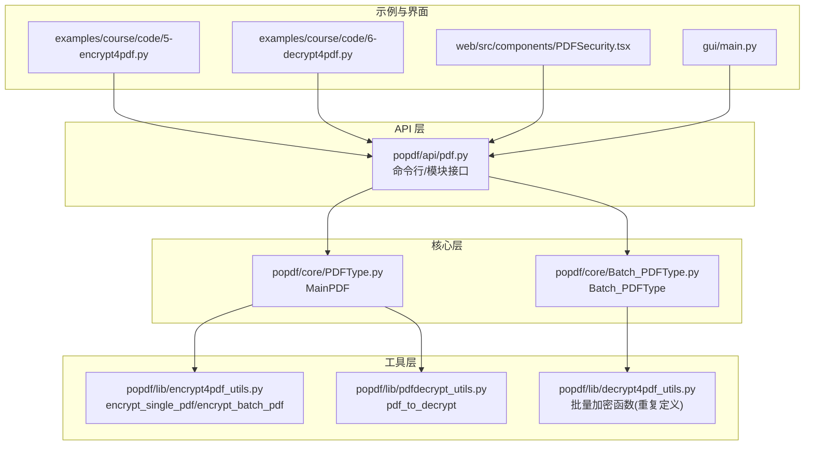
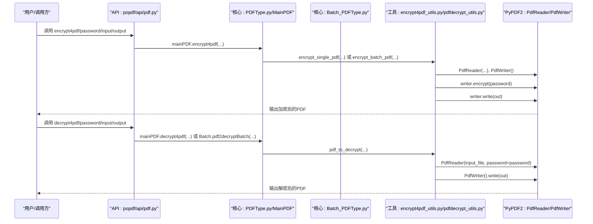
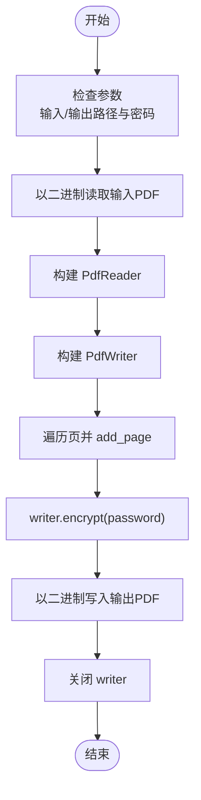
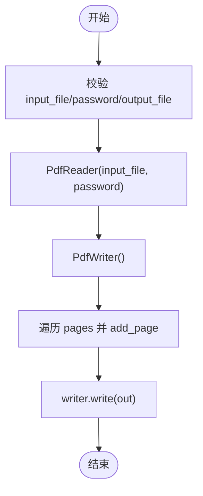
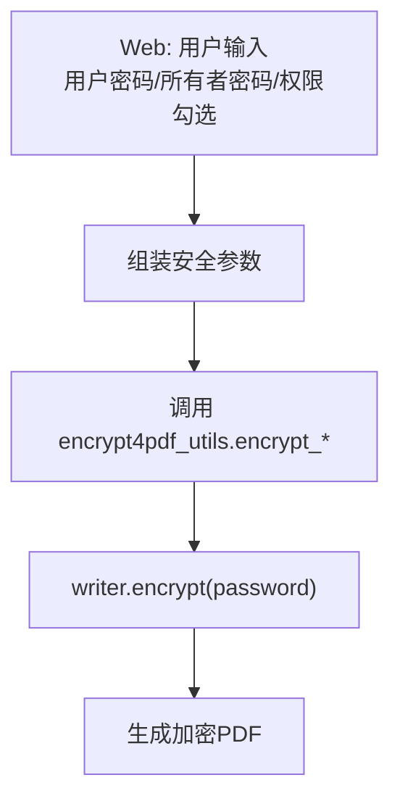
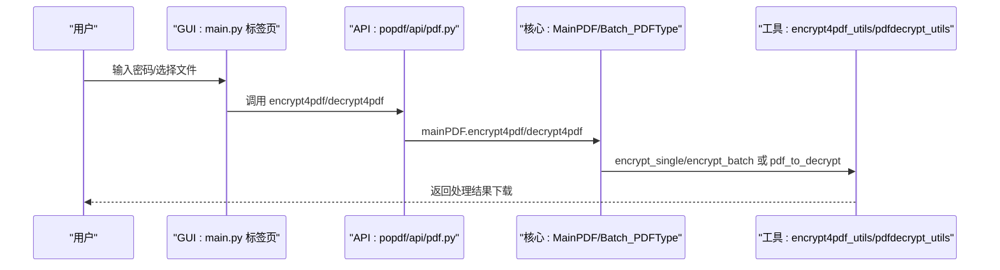
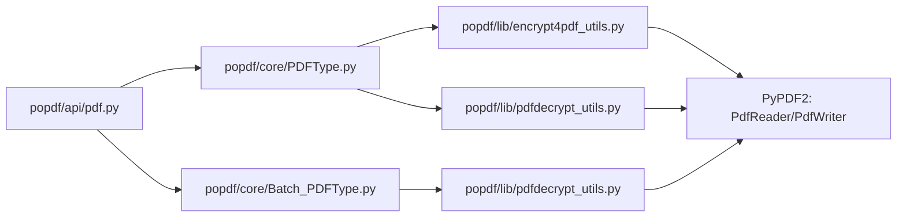

# PDF安全

<cite>
**本文引用的文件**
- [encrypt4pdf_utils.py](file://popdf/lib/encrypt4pdf_utils.py)
- [decrypt4pdf_utils.py](file://popdf/lib/decrypt4pdf_utils.py)
- [pdfdecrypt_utils.py](file://popdf/lib/pdfdecrypt_utils.py)
- [PDFType.py](file://popdf/core/PDFType.py)
- [Batch_PDFType.py](file://popdf/core/Batch_PDFType.py)
- [pdf.py](file://popdf/api/pdf.py)
- [5-encrypt4pdf.py](file://examples/course/code/5-encrypt4pdf.py)
- [6-decrypt4pdf.py](file://examples/course/code/6-decrypt4pdf.py)
- [PDFSecurity.tsx](file://web/src/components/PDFSecurity.tsx)
- [main.py](file://gui/main.py)
- [README.md](file://README.md)
</cite>

## 目录
1. [简介](#简介)
2. [项目结构](#项目结构)
3. [核心组件](#核心组件)
4. [架构总览](#架构总览)
5. [详细组件分析](#详细组件分析)
6. [依赖关系分析](#依赖关系分析)
7. [性能与安全特性](#性能与安全特性)
8. [故障排查指南](#故障排查指南)
9. [结论](#结论)
10. [附录](#附录)

## 简介
本章节系统化介绍 popdf 库的 PDF 安全能力，重点覆盖加密与解密两大核心流程。基于 PyPDF2 的 PdfReader 和 PdfWriter，解析密码保护的实现原理；说明对称加密算法在 PDF 中的应用方式、权限控制（打印、编辑、复制、注释）以及不同 PDF 版本的兼容性注意事项。结合 encrypt4pdf_utils.py 中的 encrypt_single_pdf 与 encrypt_batch_pdf 函数，解释单文件与批量加密的实现差异；同时给出安全强度建议、密码策略指导、常见错误排查方法，并说明 GUI/Web 界面集成时的安全上下文传递机制。

## 项目结构
popdf 将安全相关逻辑拆分为多层：
- API 层：对外暴露命令行与模块接口，封装加密/解密入口
- 核心层：MainPDF/Batch_PDFType 提供业务编排与文件遍历
- 工具层：encrypt4pdf_utils.py、decrypt4pdf_utils.py、pdfdecrypt_utils.py 实现具体读写与加密/解密逻辑
- 示例与界面：examples 中的课程示例，web/gui 提供前端交互

图表来源
- [pdf.py](file://popdf/api/pdf.py#L117-L152)
- [PDFType.py](file://popdf/core/PDFType.py#L99-L125)
- [Batch_PDFType.py](file://popdf/core/Batch_PDFType.py#L54-L67)
- [encrypt4pdf_utils.py](file://popdf/lib/encrypt4pdf_utils.py#L16-L82)
- [decrypt4pdf_utils.py](file://popdf/lib/decrypt4pdf_utils.py#L16-L82)
- [pdfdecrypt_utils.py](file://popdf/lib/pdfdecrypt_utils.py#L1-L27)
- [5-encrypt4pdf.py](file://examples/course/code/5-encrypt4pdf.py#L1-L27)
- [6-decrypt4pdf.py](file://examples/course/code/6-decrypt4pdf.py#L1-L29)
- [PDFSecurity.tsx](file://web/src/components/PDFSecurity.tsx#L1-L262)
- [main.py](file://gui/main.py#L522-L585)

章节来源
- [README.md](file://README.md#L56-L72)

## 核心组件
- 加密工具：encrypt4pdf_utils.py 提供单文件与批量加密函数，均通过 PdfWriter.encrypt 进行加密写入
- 解密工具：pdfdecrypt_utils.py 提供单文件解密函数，通过 PdfReader 传入密码读取，再用 PdfWriter 写出
- 主流程编排：PDFType.py 的 MainPDF.encrypt4pdf/decrypt4pdf 作为入口；Batch_PDFType.py 的 pdf2decryptBatch 支持批量解密
- API 接口：popdf/api/pdf.py 对外暴露 encrypt4pdf/decrypt4pdf，内部委派至 MainPDF/Batch_PDFType
- 示例与界面：examples 中的课程脚本演示调用；web/gui 组件负责收集用户输入并触发处理

章节来源
- [encrypt4pdf_utils.py](file://popdf/lib/encrypt4pdf_utils.py#L16-L82)
- [pdfdecrypt_utils.py](file://popdf/lib/pdfdecrypt_utils.py#L1-L27)
- [PDFType.py](file://popdf/core/PDFType.py#L99-L125)
- [Batch_PDFType.py](file://popdf/core/Batch_PDFType.py#L54-L67)
- [pdf.py](file://popdf/api/pdf.py#L117-L152)
- [5-encrypt4pdf.py](file://examples/course/code/5-encrypt4pdf.py#L1-L27)
- [6-decrypt4pdf.py](file://examples/course/code/6-decrypt4pdf.py#L1-L29)
- [PDFSecurity.tsx](file://web/src/components/PDFSecurity.tsx#L1-L262)
- [main.py](file://gui/main.py#L522-L585)

## 架构总览
下图展示从 API 到工具层的调用链路，以及 Web/GUI 如何传递安全上下文（密码、权限）。

图表来源
- [pdf.py](file://popdf/api/pdf.py#L117-L152)
- [PDFType.py](file://popdf/core/PDFType.py#L99-L125)
- [Batch_PDFType.py](file://popdf/core/Batch_PDFType.py#L54-L67)
- [encrypt4pdf_utils.py](file://popdf/lib/encrypt4pdf_utils.py#L16-L82)
- [pdfdecrypt_utils.py](file://popdf/lib/pdfdecrypt_utils.py#L1-L27)

## 详细组件分析

### 加密流程（单文件 vs 批量）
- 单文件加密：encrypt_single_pdf 读取输入 PDF，逐页加入 PdfWriter，调用 writer.encrypt(password) 后写入输出文件
- 批量加密：encrypt_batch_pdf 遍历目录下所有 .pdf 文件，逐个执行相同流程，输出到目标目录

图表来源
- [encrypt4pdf_utils.py](file://popdf/lib/encrypt4pdf_utils.py#L54-L82)

章节来源
- [encrypt4pdf_utils.py](file://popdf/lib/encrypt4pdf_utils.py#L16-L82)

### 解密流程（单文件）
- pdf_to_decrypt 通过 PdfReader(input_file, password=password) 读取受保护的 PDF，逐页 add_page 到 PdfWriter，写入新文件
- 注意：该函数未直接设置权限，而是按页复制，最终生成未加密的新 PDF

图表来源
- [pdfdecrypt_utils.py](file://popdf/lib/pdfdecrypt_utils.py#L1-L27)

章节来源
- [pdfdecrypt_utils.py](file://popdf/lib/pdfdecrypt_utils.py#L1-L27)

### 权限控制与“所有者密码”
- Web 界面组件 PDFSecurity.tsx 显示了“用户密码”和“所有者密码”的输入项，并提供打印、修改、复制、注释等权限勾选项
- 说明：用户密码用于打开文件；所有者密码用于设置权限。若仅设置用户密码，默认允许全部权限
- 实际加密时，encrypt4pdf_utils.py 仅调用 writer.encrypt(password)；未显式传入权限参数。因此权限控制由底层 PyPDF2 的默认行为决定

图表来源
- [PDFSecurity.tsx](file://web/src/components/PDFSecurity.tsx#L1-L262)
- [encrypt4pdf_utils.py](file://popdf/lib/encrypt4pdf_utils.py#L16-L82)

章节来源
- [PDFSecurity.tsx](file://web/src/components/PDFSecurity.tsx#L1-L262)

### GUI 集成与安全上下文传递
- GUI 标签页中分别提供“加密”和“解密”标签页，输入密码、选择文件、点击执行按钮
- 执行时将密码与文件路径传递给后端处理流程，最终生成加密/解密后的 PDF

图表来源
- [main.py](file://gui/main.py#L522-L585)
- [pdf.py](file://popdf/api/pdf.py#L117-L152)
- [PDFType.py](file://popdf/core/PDFType.py#L99-L125)
- [Batch_PDFType.py](file://popdf/core/Batch_PDFType.py#L54-L67)
- [encrypt4pdf_utils.py](file://popdf/lib/encrypt4pdf_utils.py#L16-L82)
- [pdfdecrypt_utils.py](file://popdf/lib/pdfdecrypt_utils.py#L1-L27)

章节来源
- [main.py](file://gui/main.py#L522-L585)

## 依赖关系分析
- API 层依赖核心层；核心层依赖工具层；示例与界面通过 API 调用核心能力
- 工具层直接依赖 PyPDF2（PdfReader/PdfWriter），用于读写与加密/解密
- 批量解密通过 Batch_PDFType.pdf2decryptBatch 遍历目录并调用 pdf_to_decrypt

图表来源
- [pdf.py](file://popdf/api/pdf.py#L117-L152)
- [PDFType.py](file://popdf/core/PDFType.py#L99-L125)
- [Batch_PDFType.py](file://popdf/core/Batch_PDFType.py#L54-L67)
- [encrypt4pdf_utils.py](file://popdf/lib/encrypt4pdf_utils.py#L16-L82)
- [pdfdecrypt_utils.py](file://popdf/lib/pdfdecrypt_utils.py#L1-L27)

章节来源
- [pdf.py](file://popdf/api/pdf.py#L117-L152)
- [PDFType.py](file://popdf/core/PDFType.py#L99-L125)
- [Batch_PDFType.py](file://popdf/core/Batch_PDFType.py#L54-L67)
- [encrypt4pdf_utils.py](file://popdf/lib/encrypt4pdf_utils.py#L16-L82)
- [pdfdecrypt_utils.py](file://popdf/lib/pdfdecrypt_utils.py#L1-L27)

## 性能与安全特性
- 性能特征
  - 单文件加密/解密：I/O 为主，时间复杂度近似 O(n)（n 为页数），内存占用与 PDF 体积线性相关
  - 批量加密：循环遍历目录，整体复杂度 O(k·n)，k 为文件数量
- 安全要点
  - 加密强度：PyPDF2 默认使用标准加密算法，具体强度取决于底层实现与 PDF 版本
  - 权限控制：当前工具层未显式设置权限位，权限由默认策略决定；如需细粒度权限，可在更高层扩展
  - 密码策略：建议使用足够长度与复杂度的密码，避免弱口令；所有者密码用于权限管理
  - PDF 版本兼容：不同版本的 PDF 可能存在加密算法差异，建议在目标平台验证兼容性

[本节为通用指导，不直接分析具体文件]

## 故障排查指南
- 常见错误与定位
  - 解密失败：确认密码正确且文件确实受保护；检查是否使用了正确的 PdfReader 构造方式
  - 权限不足：若 PDF 仅设置了用户密码而未设置所有者密码，默认允许全部权限；如出现异常，检查是否误用了权限位
  - 批量处理无文件：当目录中不存在 .pdf 文件时会记录错误日志；请核对输入路径
  - 输出路径为空：单文件加密时若未提供输出文件路径会记录错误；请确保输出路径有效
- 日志与异常
  - 工具层使用日志记录器输出错误信息；建议在调用前后检查日志
  - 解密流程中捕获异常并抛出，便于上层处理

章节来源
- [encrypt4pdf_utils.py](file://popdf/lib/encrypt4pdf_utils.py#L16-L82)
- [decrypt4pdf_utils.py](file://popdf/lib/decrypt4pdf_utils.py#L16-L82)
- [pdfdecrypt_utils.py](file://popdf/lib/pdfdecrypt_utils.py#L1-L27)

## 结论
popdf 的 PDF 安全能力以 PyPDF2 为基础，通过清晰的分层设计实现了加密与解密的完整流程。加密侧提供单文件与批量两种模式；解密侧提供单文件解密能力。权限控制在界面层可见，但当前工具层未显式设置权限位，实际权限遵循默认策略。建议在生产环境中采用强密码策略，并根据目标平台验证 PDF 版本兼容性。

[本节为总结，不直接分析具体文件]

## 附录

### 使用示例与调用路径
- 单文件加密示例：examples/course/code/5-encrypt4pdf.py
- 单文件解密示例：examples/course/code/6-decrypt4pdf.py
- Web 界面：web/src/components/PDFSecurity.tsx
- GUI 界面：gui/main.py

章节来源
- [5-encrypt4pdf.py](file://examples/course/code/5-encrypt4pdf.py#L1-L27)
- [6-decrypt4pdf.py](file://examples/course/code/6-decrypt4pdf.py#L1-L29)
- [PDFSecurity.tsx](file://web/src/components/PDFSecurity.tsx#L1-L262)
- [main.py](file://gui/main.py#L522-L585)