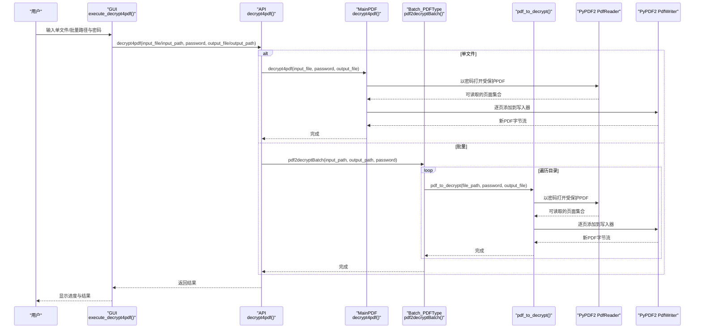
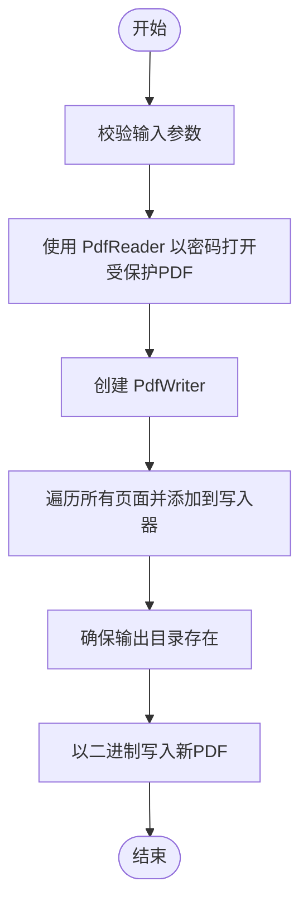
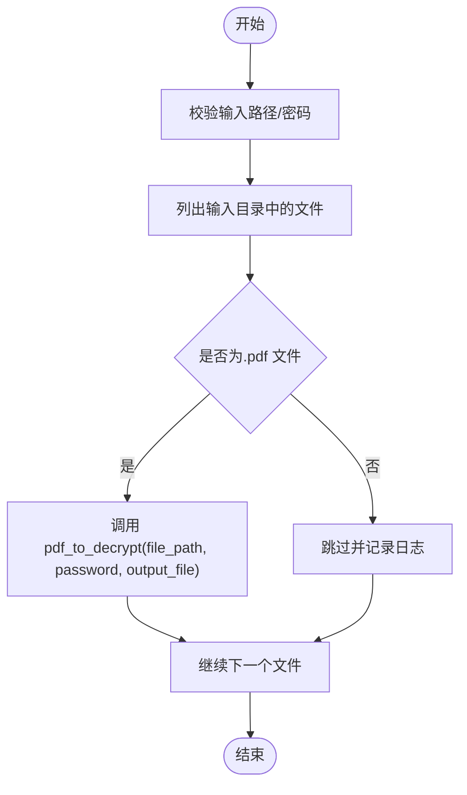
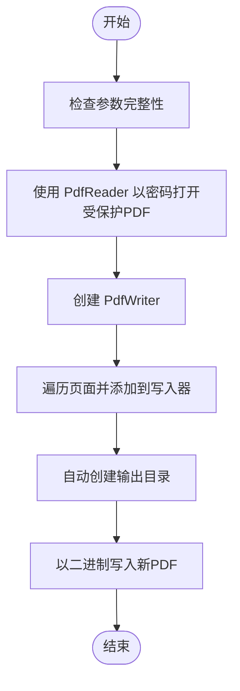
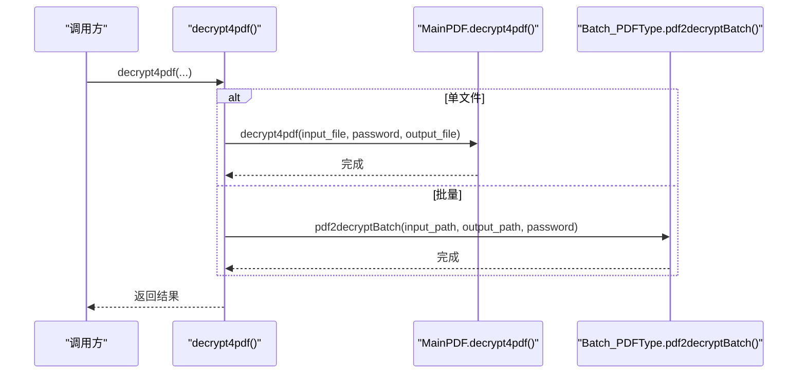
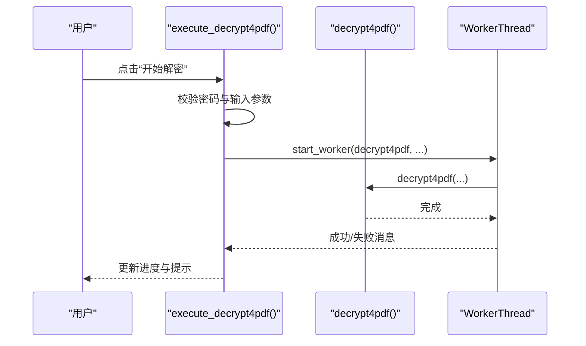
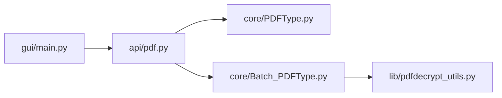

# PDF解密

<cite>
**本文引用的文件**
- [popdf/core/PDFType.py](file://popdf/core/PDFType.py)
- [popdf/lib/pdfdecrypt_utils.py](file://popdf/lib/pdfdecrypt_utils.py)
- [popdf/core/Batch_PDFType.py](file://popdf/core/Batch_PDFType.py)
- [popdf/api/pdf.py](file://popdf/api/pdf.py)
- [examples/course/code/6-decrypt4pdf.py](file://examples/course/code/6-decrypt4pdf.py)
- [gui/main.py](file://gui/main.py)
- [tests/test_code/test_pdf.py](file://tests/test_code/test_pdf.py)
- [README.md](file://README.md)
</cite>

## 目录
1. [简介](#简介)
2. [项目结构](#项目结构)
3. [核心组件](#核心组件)
4. [架构总览](#架构总览)
5. [详细组件分析](#详细组件分析)
6. [依赖关系分析](#依赖关系分析)
7. [性能考量](#性能考量)
8. [故障排查指南](#故障排查指南)
9. [结论](#结论)
10. [附录](#附录)

## 简介
本文件系统性介绍 popdf 库的 PDF 解密能力，重点围绕以下方面展开：
- 基于 PyPDF2 的 PdfReader 在密码验证下的文档读取机制
- MainPDF.decrypt4pdf 方法如何通过提供密码参数解密受保护的 PDF，并使用 PdfWriter 重建无保护的新 PDF
- 批量解密功能在 Batch_PDFType.pdf2decryptBatch 中的实现，包括目录遍历、文件过滤和逐个解密流程
- 密码错误时的异常处理策略、输出文件路径的自动创建（mkdir）、二进制文件流的正确操作
- 解密失败的排查指南（密码错误、文件非加密状态等）
- 与 API、命令行、图形界面的调用示例

## 项目结构
popdf 的解密相关代码分布在多个层次：
- API 层：对外暴露的 decrypt4pdf 接口，统一入口，支持单文件与批量两种模式
- 核心层：MainPDF 提供单文件解密逻辑；Batch_PDFType 提供批量解密逻辑
- 工具层：pdfdecrypt_utils 提供独立的解密工具函数（可被其他模块复用）
- 示例与测试：examples 和 tests 提供调用示例与回归测试
- GUI：图形界面封装了 API 调用，提供用户交互

```mermaid
graph TB
subgraph "API 层"
API["popdf/api/pdf.py<br/>decrypt4pdf()"]
end
subgraph "核心层"
CoreMain["popdf/core/PDFType.py<br/>MainPDF.decrypt4pdf()"]
CoreBatch["popdf/core/Batch_PDFType.py<br/>Batch_PDFType.pdf2decryptBatch()"]
end
subgraph "工具层"
Utils["popdf/lib/pdfdecrypt_utils.py<br/>pdf_to_decrypt()"]
end
subgraph "示例与测试"
Example["examples/course/code/6-decrypt4pdf.py"]
Test["tests/test_code/test_pdf.py"]
end
subgraph "GUI"
GUI["gui/main.py<br/>execute_decrypt4pdf()"]
end
API --> CoreMain
API --> CoreBatch
CoreBatch --> Utils
Example --> API
Test --> API
GUI --> API
```

图表来源
- [popdf/api/pdf.py](file://popdf/api/pdf.py#L126-L152)
- [popdf/core/PDFType.py](file://popdf/core/PDFType.py#L110-L125)
- [popdf/core/Batch_PDFType.py](file://popdf/core/Batch_PDFType.py#L54-L67)
- [popdf/lib/pdfdecrypt_utils.py](file://popdf/lib/pdfdecrypt_utils.py#L8-L27)
- [examples/course/code/6-decrypt4pdf.py](file://examples/course/code/6-decrypt4pdf.py#L12-L16)
- [tests/test_code/test_pdf.py](file://tests/test_code/test_pdf.py#L113-L131)
- [gui/main.py](file://gui/main.py#L858-L870)

章节来源
- [README.md](file://README.md#L56-L72)

## 核心组件
- MainPDF.decrypt4pdf：单文件解密的核心实现，使用 PdfReader 以密码参数打开受保护 PDF，再用 PdfWriter 重建新 PDF 并写入磁盘
- Batch_PDFType.pdf2decryptBatch：批量解密，遍历输入目录，过滤 .pdf 文件，逐个调用解密逻辑
- pdf_to_decrypt：独立工具函数，提供与 MainPDF.decrypt4pdf 类似的解密流程，便于复用
- decrypt4pdf：API 入口，根据是否提供 input_file/output_file 或 input_path/output_path 决定调用单文件或批量解密
- GUI.execute_decrypt4pdf：图形界面入口，校验参数后调用 API

章节来源
- [popdf/core/PDFType.py](file://popdf/core/PDFType.py#L110-L125)
- [popdf/core/Batch_PDFType.py](file://popdf/core/Batch_PDFType.py#L54-L67)
- [popdf/lib/pdfdecrypt_utils.py](file://popdf/lib/pdfdecrypt_utils.py#L8-L27)
- [popdf/api/pdf.py](file://popdf/api/pdf.py#L126-L152)
- [gui/main.py](file://gui/main.py#L858-L870)

## 架构总览
下图展示了从 API 到核心再到工具层的调用链路，以及 GUI 如何桥接 API。



图表来源
- [popdf/api/pdf.py](file://popdf/api/pdf.py#L126-L152)
- [popdf/core/PDFType.py](file://popdf/core/PDFType.py#L110-L125)
- [popdf/core/Batch_PDFType.py](file://popdf/core/Batch_PDFType.py#L54-L67)
- [popdf/lib/pdfdecrypt_utils.py](file://popdf/lib/pdfdecrypt_utils.py#L8-L27)

## 详细组件分析

### MainPDF.decrypt4pdf：单文件解密流程
- 输入参数：input_file、password、output_file
- 处理逻辑：
  - 使用 PdfReader 以密码参数打开受保护 PDF
  - 创建 PdfWriter
  - 逐页将页面添加到写入器
  - 确保输出目录存在（mkdir），以二进制写入方式写入新 PDF
- 异常处理：未显式捕获异常，交由上层处理



图表来源
- [popdf/core/PDFType.py](file://popdf/core/PDFType.py#L110-L125)

章节来源
- [popdf/core/PDFType.py](file://popdf/core/PDFType.py#L110-L125)

### Batch_PDFType.pdf2decryptBatch：批量解密流程
- 输入参数：input_path、output_path、password
- 处理逻辑：
  - 遍历输入目录
  - 过滤 .pdf 文件
  - 对每个文件调用 pdf_to_decrypt，传入 file_path、password、output_file
  - 未匹配到文件时记录日志
- 注意事项：
  - 当前实现不支持递归子目录
  - 输出路径与输入路径一一对应（同名文件）



图表来源
- [popdf/core/Batch_PDFType.py](file://popdf/core/Batch_PDFType.py#L54-L67)
- [popdf/lib/pdfdecrypt_utils.py](file://popdf/lib/pdfdecrypt_utils.py#L8-L27)

章节来源
- [popdf/core/Batch_PDFType.py](file://popdf/core/Batch_PDFType.py#L54-L67)

### pdf_to_decrypt：独立工具函数
- 输入参数：input_file、password、output_file
- 处理逻辑：
  - 使用 PdfReader 以密码打开受保护 PDF
  - 创建 PdfWriter
  - 逐页添加到写入器
  - 自动创建输出目录（os.makedirs）
  - 以二进制写入新 PDF
- 异常处理：捕获异常并向上抛出



图表来源
- [popdf/lib/pdfdecrypt_utils.py](file://popdf/lib/pdfdecrypt_utils.py#L8-L27)

章节来源
- [popdf/lib/pdfdecrypt_utils.py](file://popdf/lib/pdfdecrypt_utils.py#L8-L27)

### API decrypt4pdf：统一入口
- 支持两种模式：
  - 单文件：decrypt4pdf(input_file, password, output_file)
  - 批量：decrypt4pdf(input_path, password, output_path)
- 实现要点：
  - 单文件直接调用 MainPDF.decrypt4pdf
  - 批量调用 Batch_PDFType.pdf2decryptBatch



图表来源
- [popdf/api/pdf.py](file://popdf/api/pdf.py#L126-L152)

章节来源
- [popdf/api/pdf.py](file://popdf/api/pdf.py#L126-L152)

### GUI execute_decrypt4pdf：图形界面入口
- 参数校验：
  - 必须提供密码
  - 单文件或批量至少一组有效路径
- 调用链：
  - 单文件：decrypt4pdf(input_file, password, output_file)
  - 批量：decrypt4pdf(input_path, password, output_path)
- 使用线程异步执行，避免阻塞 UI



图表来源
- [gui/main.py](file://gui/main.py#L858-L870)

章节来源
- [gui/main.py](file://gui/main.py#L858-L870)

## 依赖关系分析
- API 层依赖核心层与工具层
- 批量解密依赖独立工具函数以复用解密逻辑
- GUI 依赖 API，形成完整的三层调用链



图表来源
- [popdf/api/pdf.py](file://popdf/api/pdf.py#L126-L152)
- [popdf/core/PDFType.py](file://popdf/core/PDFType.py#L110-L125)
- [popdf/core/Batch_PDFType.py](file://popdf/core/Batch_PDFType.py#L54-L67)
- [popdf/lib/pdfdecrypt_utils.py](file://popdf/lib/pdfdecrypt_utils.py#L8-L27)
- [gui/main.py](file://gui/main.py#L858-L870)

章节来源
- [popdf/api/pdf.py](file://popdf/api/pdf.py#L126-L152)
- [popdf/core/Batch_PDFType.py](file://popdf/core/Batch_PDFType.py#L54-L67)
- [popdf/lib/pdfdecrypt_utils.py](file://popdf/lib/pdfdecrypt_utils.py#L8-L27)
- [gui/main.py](file://gui/main.py#L858-L870)

## 性能考量
- 单文件解密：逐页读取与写入，时间复杂度与页数线性相关
- 批量解密：对每个 .pdf 文件重复上述过程，整体复杂度与文件数量和页数相关
- I/O 模式：以二进制写入，减少编码开销
- 目录遍历：当前实现不递归子目录，避免深层遍历带来的额外开销

[本节为通用性能讨论，无需特定文件来源]

## 故障排查指南
- 密码错误
  - 现象：解密失败或抛出异常
  - 排查：确认密码是否正确、是否区分大小写、是否包含隐藏字符
  - 建议：在 GUI 中逐步尝试不同密码，或在 API 层增加重试与日志
- 文件非加密状态
  - 现象：使用密码打开可能不报错但无法读取受保护属性
  - 排查：确认 PDF 是否确实设置了打开密码或权限密码
  - 建议：先用其他工具验证 PDF 的加密状态
- 输出路径不存在
  - 现象：写入失败
  - 排查：确认输出目录是否存在；代码会自动创建目录，但需确保父路径可写
- 二进制文件流操作
  - 现象：写入乱码或损坏
  - 排查：确保以二进制写入；确认文件句柄正确关闭
- 批量解密未生效
  - 现象：仅部分文件被处理
  - 排查：确认输入目录中文件扩展名为 .pdf；当前实现不递归子目录
- 参数缺失
  - 现象：日志报错
  - 排查：确保提供 input_file/output_file 或 input_path/output_path 之一，以及 password

章节来源
- [popdf/lib/pdfdecrypt_utils.py](file://popdf/lib/pdfdecrypt_utils.py#L8-L27)
- [popdf/core/Batch_PDFType.py](file://popdf/core/Batch_PDFType.py#L54-L67)
- [tests/test_code/test_pdf.py](file://tests/test_code/test_pdf.py#L113-L155)

## 结论
popdf 的 PDF 解密能力由 API、核心与工具层协同实现，具备清晰的单文件与批量解密路径。其设计遵循“单一职责”原则：MainPDF 负责单文件解密，Batch_PDFType 负责批量遍历与调度，pdf_to_decrypt 提供可复用的解密工具。GUI 作为用户入口，将参数校验与异步执行结合，提升用户体验。在实际使用中，应重点关注密码正确性、输出路径可写性与二进制写入的正确性，并在批量场景中注意目录遍历范围与文件过滤规则。

[本节为总结性内容，无需特定文件来源]

## 附录

### 调用示例

- API 调用（单文件）
  - 参考路径：[examples/course/code/6-decrypt4pdf.py](file://examples/course/code/6-decrypt4pdf.py#L12-L16)
  - 调用形式：decrypt4pdf(input_file=..., password=..., output_file=...)
- API 调用（批量）
  - 参考路径：[tests/test_code/test_pdf.py](file://tests/test_code/test_pdf.py#L126-L131)
  - 调用形式：decrypt4pdf(input_path=..., password=..., output_path=...)
- 命令行调用
  - 参考路径：[popdf/api/pdf.py](file://popdf/api/pdf.py#L126-L152)
  - 使用方式：通过 CLI 统一入口调用 decrypt4pdf，参数与 API 一致
- 图形界面调用
  - 参考路径：[gui/main.py](file://gui/main.py#L858-L870)
  - 使用方式：在“PDF解密”标签页输入密码与路径，点击“开始解密”

章节来源
- [examples/course/code/6-decrypt4pdf.py](file://examples/course/code/6-decrypt4pdf.py#L12-L16)
- [tests/test_code/test_pdf.py](file://tests/test_code/test_pdf.py#L113-L155)
- [popdf/api/pdf.py](file://popdf/api/pdf.py#L126-L152)
- [gui/main.py](file://gui/main.py#L858-L870)