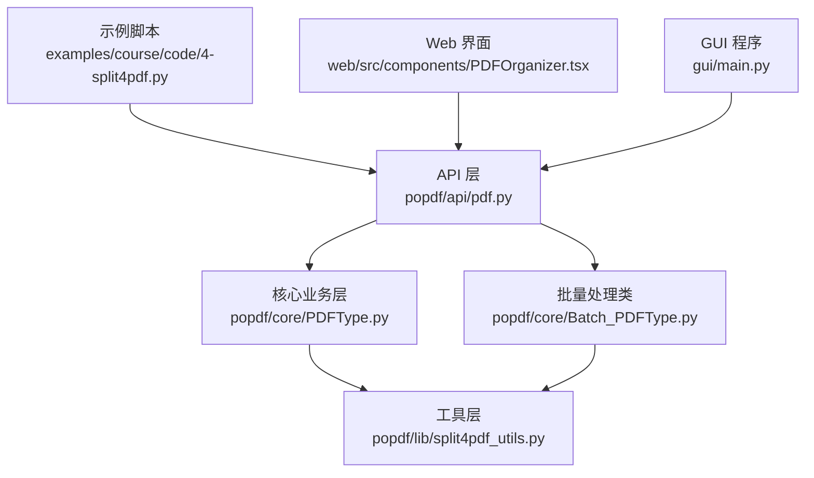
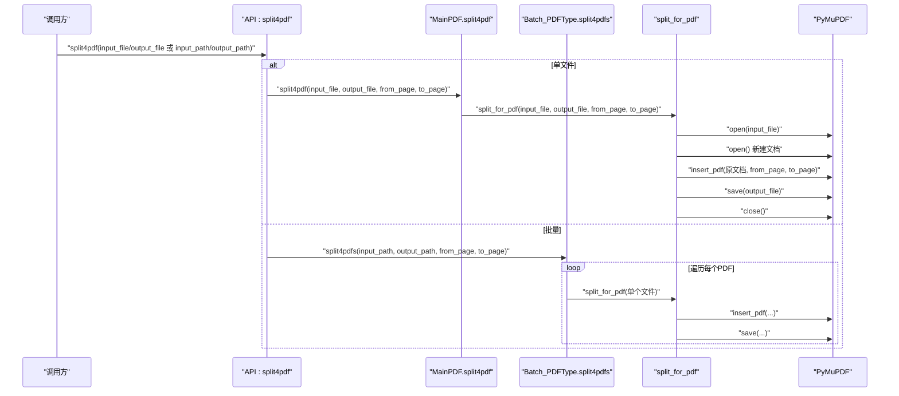
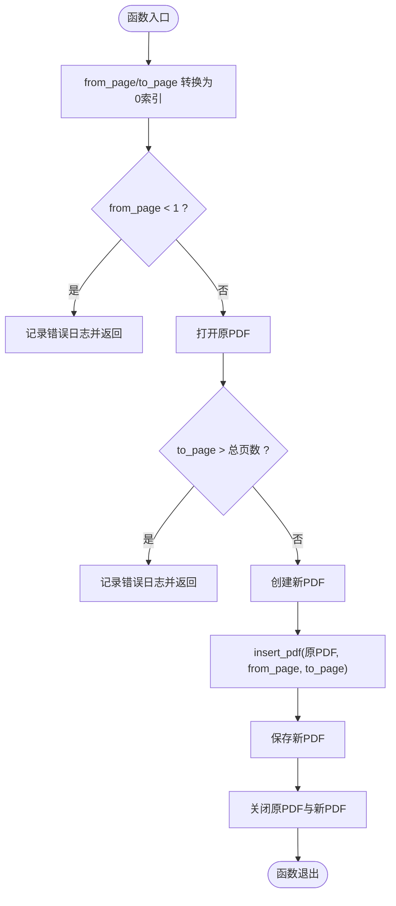
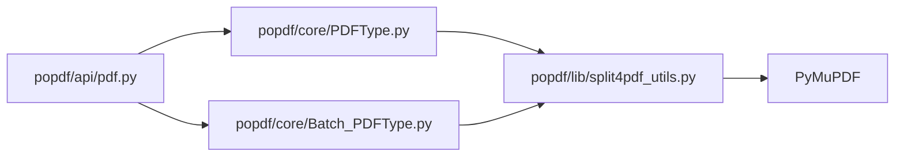

# PDF分割

<cite>
**本文引用的文件**
- [popdf/api/pdf.py](file://popdf/api/pdf.py)
- [popdf/core/PDFType.py](file://popdf/core/PDFType.py)
- [popdf/core/Batch_PDFType.py](file://popdf/core/Batch_PDFType.py)
- [popdf/lib/split4pdf_utils.py](file://popdf/lib/split4pdf_utils.py)
- [examples/course/code/4-split4pdf.py](file://examples/course/code/4-split4pdf.py)
- [web/src/components/PDFOrganizer.tsx](file://web/src/components/PDFOrganizer.tsx)
- [gui/main.py](file://gui/main.py)
- [tests/test_code/test_pdf.py](file://tests/test_code/test_pdf.py)
</cite>

## 目录
1. [简介](#简介)
2. [项目结构](#项目结构)
3. [核心组件](#核心组件)
4. [架构总览](#架构总览)
5. [详细组件分析](#详细组件分析)
6. [依赖分析](#依赖分析)
7. [性能考虑](#性能考虑)
8. [故障排查指南](#故障排查指南)
9. [结论](#结论)
10. [附录](#附录)

## 简介
本文件系统性讲解 popdf 库中“PDF 分割”功能的实现机制，重点围绕以下方面展开：
- split4pdf_utils.py 中的 split_for_pdf 函数与 PDFType.py 中的 split4pdf 方法之间的协作关系；
- 用户以“从1开始”的页码计数体验，以及在底层如何转换为0索引；
- from_page 和 to_page 的边界校验策略（起始页不得小于1，结束页不得大于总页数）；
- 基于 PyMuPDF insert_pdf 的文档片段提取技术原理；
- 单文件分割与批量分割（split4pdfs）的使用示例与参数说明；
- 大文件分割的内存管理、临时文件处理与进度反馈建议；
- GUI 与 Web 界面中该功能的集成方式，使用户能直观选择页码范围并预览效果。

## 项目结构
popdf 的 PDF 分割能力由 API 层、核心业务层与工具层协同完成：
- API 层：对外暴露统一入口函数 split4pdf，负责参数分发与调用；
- 核心业务层：MainPDF 提供单文件分割；Batch_PDFType 提供批量分割；
- 工具层：split4pdf_utils 提供底层实现，封装 PyMuPDF 的 insert_pdf。

图表来源
- [popdf/api/pdf.py](file://popdf/api/pdf.py#L93-L114)
- [popdf/core/PDFType.py](file://popdf/core/PDFType.py#L81-L98)
- [popdf/core/Batch_PDFType.py](file://popdf/core/Batch_PDFType.py#L32-L52)
- [popdf/lib/split4pdf_utils.py](file://popdf/lib/split4pdf_utils.py#L8-L38)
- [examples/course/code/4-split4pdf.py](file://examples/course/code/4-split4pdf.py#L16-L38)
- [web/src/components/PDFOrganizer.tsx](file://web/src/components/PDFOrganizer.tsx#L104-L156)
- [gui/main.py](file://gui/main.py#L833-L857)

章节来源
- [popdf/api/pdf.py](file://popdf/api/pdf.py#L93-L114)
- [popdf/core/PDFType.py](file://popdf/core/PDFType.py#L81-L98)
- [popdf/core/Batch_PDFType.py](file://popdf/core/Batch_PDFType.py#L32-L52)
- [popdf/lib/split4pdf_utils.py](file://popdf/lib/split4pdf_utils.py#L8-L38)
- [examples/course/code/4-split4pdf.py](file://examples/course/code/4-split4pdf.py#L16-L38)

## 核心组件
- API 入口：split4pdf，根据是否传入单文件参数或批量参数，分别委托给 MainPDF 或 Batch_PDFType；
- 单文件分割：MainPDF.split4pdf，负责创建输出目录并调用 split_for_pdf；
- 批量分割：Batch_PDFType.split4pdfs，遍历目录下所有 PDF，逐一调用 split_for_pdf；
- 底层实现：split_for_pdf，打开原 PDF，创建新 PDF，使用 PyMuPDF 的 insert_pdf 进行片段插入，保存并关闭文件。

章节来源
- [popdf/api/pdf.py](file://popdf/api/pdf.py#L93-L114)
- [popdf/core/PDFType.py](file://popdf/core/PDFType.py#L81-L98)
- [popdf/core/Batch_PDFType.py](file://popdf/core/Batch_PDFType.py#L32-L52)
- [popdf/lib/split4pdf_utils.py](file://popdf/lib/split4pdf_utils.py#L8-L38)

## 架构总览
下面的序列图展示了从 API 到底层工具的调用链路，以及 PyMuPDF 的 insert_pdf 技术要点。

图表来源
- [popdf/api/pdf.py](file://popdf/api/pdf.py#L93-L114)
- [popdf/core/PDFType.py](file://popdf/core/PDFType.py#L81-L98)
- [popdf/core/Batch_PDFType.py](file://popdf/core/Batch_PDFType.py#L32-L52)
- [popdf/lib/split4pdf_utils.py](file://popdf/lib/split4pdf_utils.py#L8-L38)

## 详细组件分析

### 1) split_for_pdf：底层分割实现与索引转换
- 用户页码从1开始计数，底层 PyMuPDF 以0索引处理。因此在进入底层前，会将 from_page 与 to_page（若非特殊值）减1，转换为0索引；
- 边界校验：
  - 起始页必须 ≥ 1，否则记录错误日志并返回；
  - 结束页必须 ≤ 总页数，否则记录错误日志并返回；
- 文件处理：
  - 打开原 PDF；
  - 创建新 PDF；
  - 使用 insert_pdf 将指定范围的页面复制到新文档；
  - 保存新文档并关闭两个文件句柄。

图表来源
- [popdf/lib/split4pdf_utils.py](file://popdf/lib/split4pdf_utils.py#L8-L38)

章节来源
- [popdf/lib/split4pdf_utils.py](file://popdf/lib/split4pdf_utils.py#L8-L38)

### 2) MainPDF.split4pdf：单文件分割的业务入口
- 接收 input_file、output_file、from_page、to_page；
- 调用 split_for_pdf 完成实际分割；
- 对输出目录进行创建（mkdir）；
- 返回布尔值表示成功与否。

章节来源
- [popdf/core/PDFType.py](file://popdf/core/PDFType.py#L81-L98)

### 3) Batch_PDFType.split4pdfs：批量分割的业务入口
- 接收 input_path、output_path、from_page、to_page；
- 获取目录下所有 PDF 文件；
- 逐个调用 split_for_pdf；
- 对输出目录进行创建（mkdir）；
- 返回布尔值表示成功与否。

章节来源
- [popdf/core/Batch_PDFType.py](file://popdf/core/Batch_PDFType.py#L32-L52)

### 4) API 入口：split4pdf 的参数分发
- 若同时提供 input_file 与 output_file，则走单文件流程；
- 若同时提供 input_path 与 output_path，则走批量流程；
- 否则记录参数错误并返回 False。

章节来源
- [popdf/api/pdf.py](file://popdf/api/pdf.py#L93-L114)

### 5) PyMuPDF insert_pdf 技术原理
- insert_pdf 支持将一个 PDF 的若干页插入到另一个 PDF 中；
- 在本实现中，将原 PDF 的 from_page 到 to_page 范围内的页面插入到新建 PDF 中，从而实现“片段提取”；
- 该过程避免了逐页渲染与重绘，直接进行页面级复制，性能较好。

章节来源
- [popdf/lib/split4pdf_utils.py](file://popdf/lib/split4pdf_utils.py#L28-L33)

### 6) 页码计数与边界校验：用户友好与底层一致性
- 用户体验：from_page 与 to_page 以“从1开始”的自然页码计数；
- 底层实现：在 split_for_pdf 内部将页码转换为0索引；
- 边界检查：
  - 起始页不得小于1；
  - 结束页不得大于总页数；
- 特殊值 to_page=-1 表示“直到末尾”，在转换时会跳过减1，保持语义正确。

章节来源
- [popdf/lib/split4pdf_utils.py](file://popdf/lib/split4pdf_utils.py#L8-L24)

### 7) 使用示例：单文件与批量分割
- 单文件分割：通过 input_file 与 output_file 指定源与目标；
- 批量分割：通过 input_path 与 output_path 指定目录，from_page 与 to_page 指定页码范围；
- 示例脚本展示了两种用法及参数说明。

章节来源
- [examples/course/code/4-split4pdf.py](file://examples/course/code/4-split4pdf.py#L16-L38)
- [tests/test_code/test_pdf.py](file://tests/test_code/test_pdf.py#L80-L94)

### 8) GUI 与 Web 集成：直观选择页码与预览
- Web 界面（React）：
  - 提供起始页码与结束页码输入框，min/max 限制在1到总页数之间；
  - 输入变化时动态更新预览文案，提示将提取的页码范围；
- GUI 程序（PyQt）：
  - 提供单文件与批量两种模式的输入框；
  - 根据用户选择调用 split4pdf 并启动后台工作线程执行任务。

章节来源
- [web/src/components/PDFOrganizer.tsx](file://web/src/components/PDFOrganizer.tsx#L104-L156)
- [gui/main.py](file://gui/main.py#L833-L857)

## 依赖分析
- API 层依赖核心业务层与批量处理类；
- 核心业务层与批量处理类共同依赖工具层；
- 工具层依赖 PyMuPDF 实现页面级复制；
- 日志与文件系统工具来自外部库（loguru、pofile）。

图表来源
- [popdf/api/pdf.py](file://popdf/api/pdf.py#L93-L114)
- [popdf/core/PDFType.py](file://popdf/core/PDFType.py#L81-L98)
- [popdf/core/Batch_PDFType.py](file://popdf/core/Batch_PDFType.py#L32-L52)
- [popdf/lib/split4pdf_utils.py](file://popdf/lib/split4pdf_utils.py#L8-L38)

章节来源
- [popdf/api/pdf.py](file://popdf/api/pdf.py#L93-L114)
- [popdf/core/PDFType.py](file://popdf/core/PDFType.py#L81-L98)
- [popdf/core/Batch_PDFType.py](file://popdf/core/Batch_PDFType.py#L32-L52)
- [popdf/lib/split4pdf_utils.py](file://popdf/lib/split4pdf_utils.py#L8-L38)

## 性能考虑
- 页面级复制：使用 PyMuPDF 的 insert_pdf 直接复制页面，避免逐页渲染，适合大文件；
- 内存管理建议：
  - 大文件分割时，尽量控制单次处理的页数范围，避免一次性加载过多页面；
  - 分批处理多个大文件，减少峰值内存占用；
- 临时文件与中间产物：
  - 本实现采用“新建 PDF + insert_pdf”的方式，无需额外临时文件；
  - 若需持久化中间状态，建议在外部流程中进行；
- 进度反馈：
  - 批量处理时可在循环中增加进度条或日志输出，便于用户感知进度；
  - 可参考项目中其他模块对进度条的使用方式（如简单进度包装器）。

[本节为通用建议，不直接分析具体文件]

## 故障排查指南
- 常见错误与处理：
  - 起始页小于1：记录错误日志并提前返回；
  - 结束页大于总页数：记录错误日志并提前返回；
  - 参数缺失：API 层记录“参数填写错误”并返回 False；
  - 未找到PDF文件：批量处理时记录“没有找到要处理的PDF文件”并返回 False。
- 建议排查步骤：
  - 确认输入路径与输出路径有效；
  - 确认 from_page 与 to_page 的范围合法；
  - 查看日志输出定位问题；
  - 对大文件尝试缩小页码范围或分批处理。

章节来源
- [popdf/lib/split4pdf_utils.py](file://popdf/lib/split4pdf_utils.py#L14-L24)
- [popdf/api/pdf.py](file://popdf/api/pdf.py#L104-L114)
- [popdf/core/Batch_PDFType.py](file://popdf/core/Batch_PDFType.py#L41-L46)

## 结论
popdf 的 PDF 分割功能以清晰的分层设计实现了“用户友好页码 + 底层高效实现”的平衡：
- 用户以自然的1开始页码计数；
- 底层通过0索引与 insert_pdf 实现高性能片段提取；
- API 层统一分发，单文件与批量处理并存；
- GUI/Web 界面提供直观的页码选择与预览；
- 错误处理与日志记录保证了可用性与可观测性。

[本节为总结，不直接分析具体文件]

## 附录

### A. API 定义与参数说明
- 入口函数：split4pdf
  - 单文件：input_file、output_file、from_page（默认1）、to_page（默认-1，表示直到末尾）
  - 批量：input_path、output_path、from_page、to_page
- 返回值：成功返回 True，失败返回 False 并记录错误日志

章节来源
- [popdf/api/pdf.py](file://popdf/api/pdf.py#L93-L114)

### B. 使用示例路径
- 单文件分割示例：[examples/course/code/4-split4pdf.py](file://examples/course/code/4-split4pdf.py#L16-L26)
- 批量分割示例：[examples/course/code/4-split4pdf.py](file://examples/course/code/4-split4pdf.py#L29-L38)
- 测试用例示例：[tests/test_code/test_pdf.py](file://tests/test_code/test_pdf.py#L80-L94)

### C. GUI 与 Web 集成要点
- Web 界面：起始页与结束页输入框，min/max 限制与预览文案；
- GUI 程序：单文件/批量切换，参数校验与后台执行。

章节来源
- [web/src/components/PDFOrganizer.tsx](file://web/src/components/PDFOrganizer.tsx#L104-L156)
- [gui/main.py](file://gui/main.py#L833-L857)