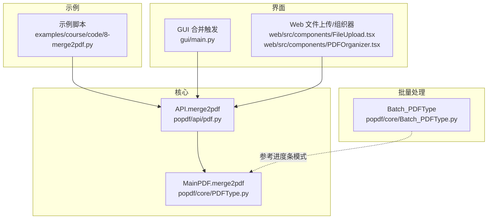
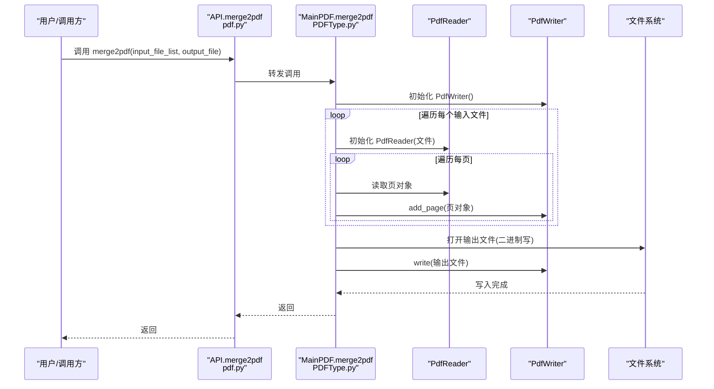
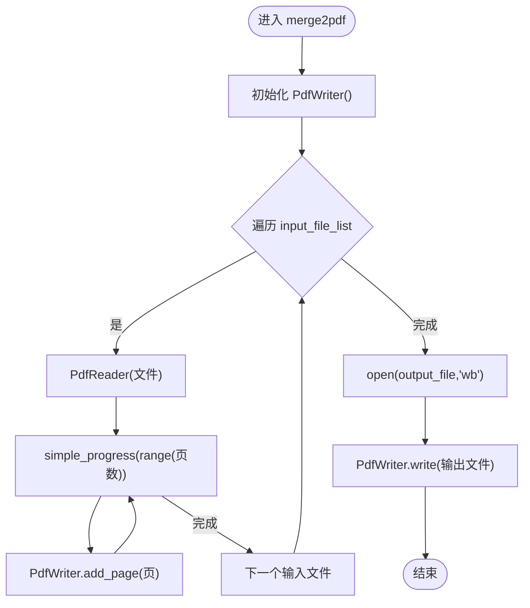
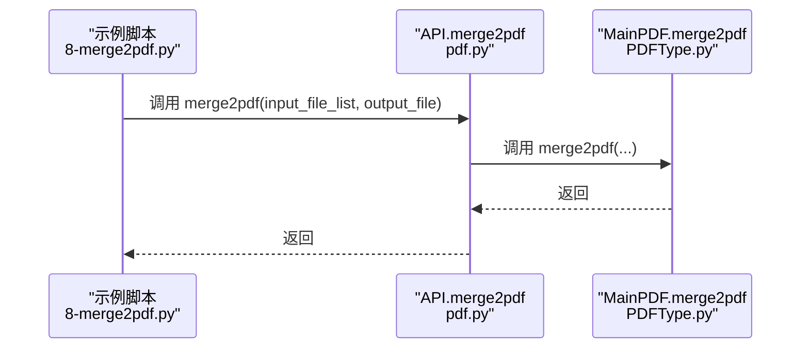
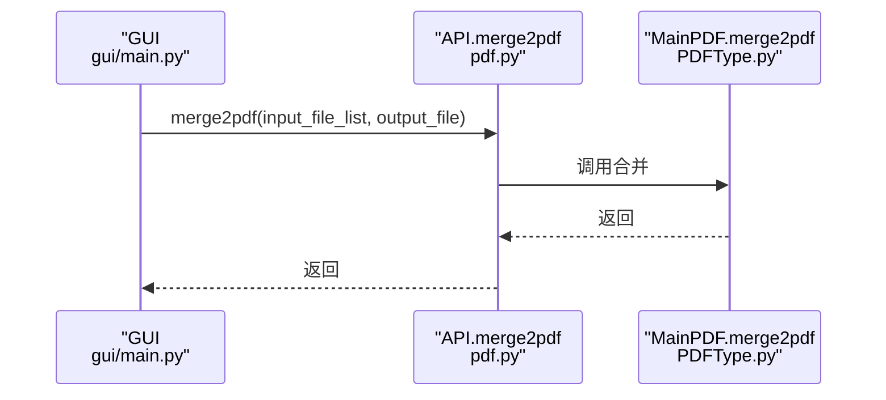
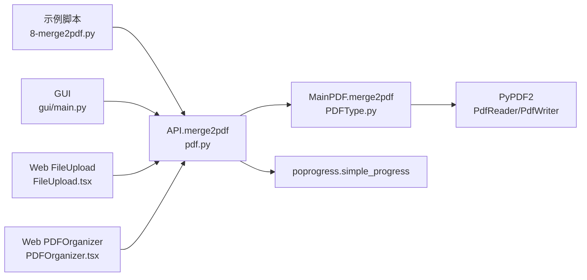

# PDF合并

<cite>
**本文引用的文件**
- [PDFType.py](file://popdf/core/PDFType.py)
- [pdf.py](file://popdf/api/pdf.py)
- [8-merge2pdf.py](file://examples/course/code/8-merge2pdf.py)
- [Batch_PDFType.py](file://popdf/core/Batch_PDFType.py)
- [uv.lock](file://uv.lock)
- [main.py](file://gui/main.py)
- [FileUpload.tsx](file://web/src/components/FileUpload.tsx)
- [PDFOrganizer.tsx](file://web/src/components/PDFOrganizer.tsx)
</cite>

## 目录
1. [简介](#简介)
2. [项目结构](#项目结构)
3. [核心组件](#核心组件)
4. [架构总览](#架构总览)
5. [详细组件分析](#详细组件分析)
6. [依赖关系分析](#依赖关系分析)
7. [性能考量](#性能考量)
8. [故障排查指南](#故障排查指南)
9. [结论](#结论)
10. [附录](#附录)

## 简介
本文件围绕 popdf 库中的 PDF 合并功能展开，重点剖析主类 MainPDF 中的 merge2pdf 方法，基于 PyPDF2 的 PdfReader 和 PdfWriter 实现多文件合并。文档将系统说明：
- input_file_list 参数的传入方式与路径处理（相对路径与绝对路径）
- 页面逐个添加的迭代机制与 simple_progress 进度条集成
- 合并过程中的元数据（metadata）与书签（toc）继承策略
- 链接（links）对象的保留与过滤逻辑
- 典型调用示例与最佳实践
- 性能瓶颈与优化建议（流式写入、内存缓冲控制等）
- 批量处理场景下的文件遍历与异常捕获
- Web 上传合并与 GUI 拖拽操作的实际应用模式

## 项目结构
popdf 的合并能力由以下模块协同实现：
- 核心类 MainPDF：提供 merge2pdf 主流程
- API 层 pdf.py：对外暴露 merge2pdf 函数入口
- 示例脚本 examples/course/code/8-merge2pdf.py：演示合并调用
- 批处理类 Batch_PDFType：展示批量处理与进度条的通用模式
- GUI 与 Web：演示在桌面端与前端中的实际应用

图表来源
- [PDFType.py](file://popdf/core/PDFType.py#L130-L148)
- [pdf.py](file://popdf/api/pdf.py#L175-L181)
- [8-merge2pdf.py](file://examples/course/code/8-merge2pdf.py#L13-L16)
- [Batch_PDFType.py](file://popdf/core/Batch_PDFType.py#L68-L79)
- [main.py](file://gui/main.py#L889-L923)
- [FileUpload.tsx](file://web/src/components/FileUpload.tsx#L1-L146)
- [PDFOrganizer.tsx](file://web/src/components/PDFOrganizer.tsx#L44-L232)

章节来源
- [PDFType.py](file://popdf/core/PDFType.py#L130-L148)
- [pdf.py](file://popdf/api/pdf.py#L175-L181)
- [8-merge2pdf.py](file://examples/course/code/8-merge2pdf.py#L13-L16)
- [Batch_PDFType.py](file://popdf/core/Batch_PDFType.py#L68-L79)
- [main.py](file://gui/main.py#L889-L923)
- [FileUpload.tsx](file://web/src/components/FileUpload.tsx#L1-L146)
- [PDFOrganizer.tsx](file://web/src/components/PDFOrganizer.tsx#L44-L232)

## 核心组件
- MainPDF.merge2pdf：使用 PyPDF2 的 PdfReader 逐页读取，PdfWriter 逐页写入，最终一次性落盘输出。
- API 层 pdf.merge2pdf：对 MainPDF.merge2pdf 的轻封装，作为对外统一入口。
- 示例脚本：演示 input_file_list 传入绝对路径与相对路径的方式。
- 批处理类 Batch_PDFType：展示 simple_progress 在批量任务中的使用模式，便于理解进度条集成思路。
- GUI/Web：演示在桌面端与前端中收集文件列表与输出路径，并调用 API 完成合并。

章节来源
- [PDFType.py](file://popdf/core/PDFType.py#L130-L148)
- [pdf.py](file://popdf/api/pdf.py#L175-L181)
- [8-merge2pdf.py](file://examples/course/code/8-merge2pdf.py#L13-L16)
- [Batch_PDFType.py](file://popdf/core/Batch_PDFType.py#L68-L79)
- [main.py](file://gui/main.py#L889-L923)

## 架构总览
下面的序列图展示了从调用到落盘的关键流程，映射到实际源码：

图表来源
- [pdf.py](file://popdf/api/pdf.py#L175-L181)
- [PDFType.py](file://popdf/core/PDFType.py#L130-L148)

## 详细组件分析

### merge2pdf 方法实现与流程
- 参数与职责
  - input_file_list：字符串列表，包含多个 PDF 文件路径（支持相对路径与绝对路径）
  - output_file：合并后的输出 PDF 文件路径
- 处理步骤
  - 初始化 PdfWriter
  - 遍历 input_file_list，对每个文件使用 PdfReader 读取
  - 对每个文件的页索引使用 simple_progress 包裹，实现逐页进度反馈
  - 将每页通过 PdfWriter.add_page 追加到输出流
  - 以二进制写入模式打开 output_file，调用 PdfWriter.write 完成落盘
- 路径处理
  - 代码未显式做路径规范化，因此 input_file_list 中的路径应确保可被 PdfReader 正确解析；建议传入绝对路径以避免工作目录差异导致的问题
- 进度条集成
  - 使用 poprogress.simple_progress 对页索引 range 进行包装，从而在 CLI 或 GUI 中显示进度

图表来源
- [PDFType.py](file://popdf/core/PDFType.py#L130-L148)

章节来源
- [PDFType.py](file://popdf/core/PDFType.py#L130-L148)

### 元数据（metadata）与书签（toc）继承策略
- 当前 merge2pdf 仅逐页复制页面内容，未显式设置输出 PDF 的元数据与书签
- 若需继承元数据与书签，可在初始化 PdfWriter 后，从第一个输入文件读取元数据与书签，并在写入前设置到 PdfWriter 上；随后在写入完成后保存
- 注意：PyPDF2 的 PdfWriter 并不直接提供 set_toc/set_metadata 接口，通常需要在写入前通过 PdfReader 读取并传递给 PdfWriter，或在写入后使用其他库（如 PyMuPDF）进行二次处理

章节来源
- [PDFType.py](file://popdf/core/PDFType.py#L130-L148)

### 链接（links）对象的保留与过滤逻辑
- merge2pdf 未对链接进行任何处理，属于“透传”行为
- 若需保留链接，应在 add_page 前后检查并复制链接属性；若需过滤，可对特定类型的链接进行跳过
- 由于当前实现未涉及链接处理，建议在业务需求明确后再扩展

章节来源
- [PDFType.py](file://popdf/core/PDFType.py#L130-L148)

### API 与示例调用
- API 入口：pdf.merge2pdf 将调用转发至 MainPDF.merge2pdf
- 示例脚本：演示了绝对路径与相对路径混合传入 input_file_list 的方式

图表来源
- [8-merge2pdf.py](file://examples/course/code/8-merge2pdf.py#L13-L16)
- [pdf.py](file://popdf/api/pdf.py#L175-L181)
- [PDFType.py](file://popdf/core/PDFType.py#L130-L148)

章节来源
- [8-merge2pdf.py](file://examples/course/code/8-merge2pdf.py#L13-L16)
- [pdf.py](file://popdf/api/pdf.py#L175-L181)

### GUI 与 Web 应用模式
- GUI（桌面端）
  - 用户通过文件选择控件添加多个 PDF，选择输出路径
  - 点击“开始合并”按钮后，将文件列表与输出路径传入 API.merge2pdf
- Web（前端）
  - 文件上传组件支持单个/批量上传与拖拽
  - PDFOrganizer 组件维护合并文件的选择与顺序，点击处理后生成合并结果

图表来源
- [main.py](file://gui/main.py#L889-L923)
- [pdf.py](file://popdf/api/pdf.py#L175-L181)
- [PDFType.py](file://popdf/core/PDFType.py#L130-L148)

章节来源
- [main.py](file://gui/main.py#L889-L923)
- [FileUpload.tsx](file://web/src/components/FileUpload.tsx#L1-L146)
- [PDFOrganizer.tsx](file://web/src/components/PDFOrganizer.tsx#L44-L232)

## 依赖关系分析
- 外部库
  - PyPDF2：提供 PdfReader/PdfWriter，用于读取与写入 PDF
  - poprogress：提供 simple_progress，用于进度条显示
- 内部模块
  - API 层 pdf.py 依赖 MainPDF
  - 示例脚本依赖 API 层
  - GUI/Web 依赖 API 层

图表来源
- [PDFType.py](file://popdf/core/PDFType.py#L130-L148)
- [pdf.py](file://popdf/api/pdf.py#L175-L181)
- [8-merge2pdf.py](file://examples/course/code/8-merge2pdf.py#L13-L16)
- [main.py](file://gui/main.py#L889-L923)
- [FileUpload.tsx](file://web/src/components/FileUpload.tsx#L1-L146)
- [PDFOrganizer.tsx](file://web/src/components/PDFOrganizer.tsx#L44-L232)

章节来源
- [uv.lock](file://uv.lock#L1486-L1518)
- [PDFType.py](file://popdf/core/PDFType.py#L130-L148)
- [pdf.py](file://popdf/api/pdf.py#L175-L181)

## 性能考量
- 当前实现采用“先读取再写入”的方式，所有页均加载到内存中，再一次性写入输出文件
- 性能瓶颈
  - 大文件合并时内存占用高，可能导致 OOM
  - 逐页写入会带来多次磁盘 IO，影响吞吐
- 优化建议
  - 流式写入：在写入阶段采用分块写入策略，减少峰值内存占用
  - 分页缓存：限制同时在内存中的页数量，超过阈值则提前 flush
  - 并行读取：对不同文件的页读取可并行（受 GIL 影响有限），但写入仍需串行
  - 预估总页数：结合 simple_progress 显示总体进度，改善用户体验
  - 压缩与去重：根据业务需要启用压缩参数，避免重复页的冗余写入

[本节为通用性能指导，无需具体文件引用]

## 故障排查指南
- 常见问题
  - 输入路径无效：确认 input_file_list 中路径存在且可访问
  - 权限不足：确保输出路径具备写权限
  - 大文件内存溢出：考虑分批合并或优化内存策略
- 建议的健壮性措施
  - 文件遍历与异常捕获：在批量处理场景中，对每个文件进行 try-except 包裹，记录失败项并继续处理其他文件
  - 路径规范化：建议在调用前将路径转换为绝对路径，避免相对路径导致的解析差异
  - 进度与日志：结合 simple_progress 与日志记录，定位耗时环节

[本节为通用排查建议，无需具体文件引用]

## 结论
popdf 的 PDF 合并功能以简洁高效为核心：通过 PyPDF2 的 PdfReader/PdfWriter 实现多文件逐页合并，并借助 poprogress 提升大文件处理体验。当前实现未对元数据、书签与链接进行特殊处理，适合基础合并场景；若需更丰富的 PDF 元信息管理，可在现有基础上扩展。GUI 与 Web 场景提供了良好的用户交互入口，便于在桌面端与前端中完成批量合并任务。

[本节为总结性内容，无需具体文件引用]

## 附录

### 典型调用示例（路径处理）
- 绝对路径与相对路径混合传入 input_file_list
- 输出路径 output_file 建议使用绝对路径，避免工作目录差异

章节来源
- [8-merge2pdf.py](file://examples/course/code/8-merge2pdf.py#L13-L16)

### 批量处理与进度条参考
- 批处理类 Batch_PDFType 展示了 simple_progress 在批量任务中的使用模式，可作为合并流程进度条集成的参考

章节来源
- [Batch_PDFType.py](file://popdf/core/Batch_PDFType.py#L68-L79)