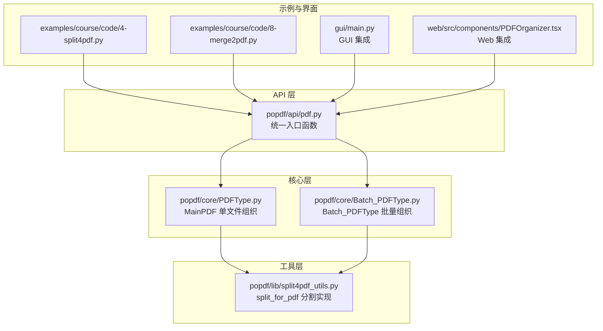
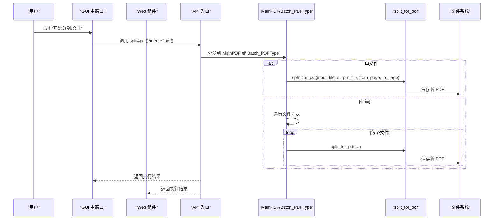
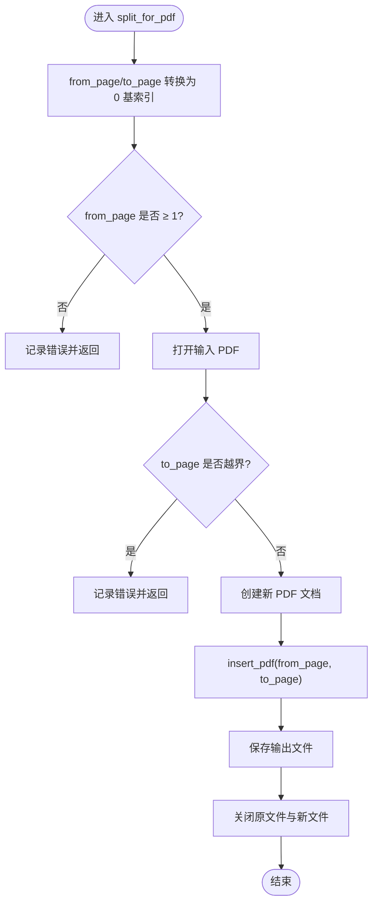
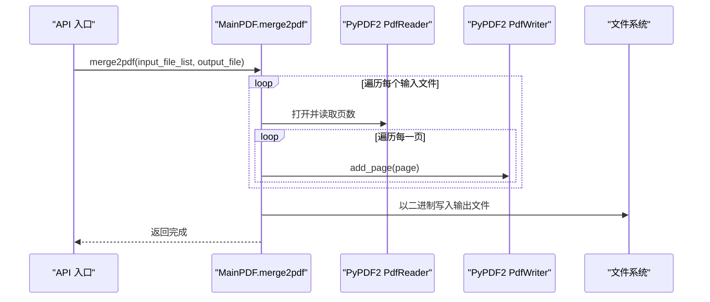
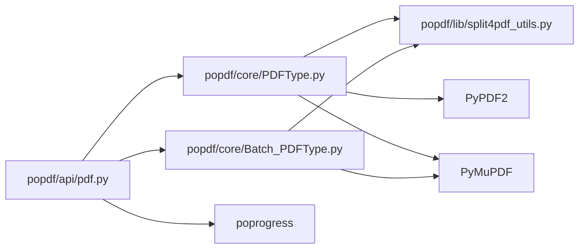

# PDF组织

<cite>
**本文引用的文件**
- [popdf/lib/split4pdf_utils.py](file://popdf/lib/split4pdf_utils.py)
- [popdf/core/PDFType.py](file://popdf/core/PDFType.py)
- [popdf/core/Batch_PDFType.py](file://popdf/core/Batch_PDFType.py)
- [popdf/api/pdf.py](file://popdf/api/pdf.py)
- [examples/course/code/4-split4pdf.py](file://examples/course/code/4-split4pdf.py)
- [examples/course/code/8-merge2pdf.py](file://examples/course/code/8-merge2pdf.py)
- [gui/main.py](file://gui/main.py)
- [web/src/components/PDFOrganizer.tsx](file://web/src/components/PDFOrganizer.tsx)
- [popdf/lib/pdf_exceptions.py](file://popdf/lib/pdf_exceptions.py)
- [uv.lock](file://uv.lock)
</cite>

## 目录
1. [简介](#简介)
2. [项目结构](#项目结构)
3. [核心组件](#核心组件)
4. [架构总览](#架构总览)
5. [详细组件分析](#详细组件分析)
6. [依赖关系分析](#依赖关系分析)
7. [性能与内存优化](#性能与内存优化)
8. [故障排查指南](#故障排查指南)
9. [结论](#结论)
10. [附录](#附录)

## 简介
本文件围绕 popdf 库的“PDF组织”能力，系统讲解分割与合并两大核心功能。基于 split4pdf_utils.py 中的 split_for_pdf 方法与 PDFType.py 中的 split4pdf、merge2pdf 方法，深入剖析：
- 分割时的页码范围处理与边界条件判断
- 合并时的页面顺序控制与元数据继承策略
- 大文件处理的性能优化与内存管理
- 批量处理场景下的高效组织方案
- 错误处理机制、进度反馈实现与 GUI/Web 集成方式

## 项目结构
popdf 的组织能力由以下层次构成：
- API 层：对外暴露统一入口函数，负责参数校验与分发
- 核心层：MainPDF 提供单文件组织能力；Batch_PDFType 提供批量组织能力
- 工具层：split_for_pdf 实现底层分割逻辑；merge2pdf 使用 PyPDF2 写入
- 示例与界面：examples 提供使用示例；GUI/Web 提供交互入口

图表来源
- [popdf/api/pdf.py](file://popdf/api/pdf.py#L93-L115)
- [popdf/core/PDFType.py](file://popdf/core/PDFType.py#L81-L98)
- [popdf/core/Batch_PDFType.py](file://popdf/core/Batch_PDFType.py#L32-L52)
- [popdf/lib/split4pdf_utils.py](file://popdf/lib/split4pdf_utils.py#L8-L38)
- [examples/course/code/4-split4pdf.py](file://examples/course/code/4-split4pdf.py#L1-L54)
- [examples/course/code/8-merge2pdf.py](file://examples/course/code/8-merge2pdf.py#L1-L30)
- [gui/main.py](file://gui/main.py#L834-L844)
- [web/src/components/PDFOrganizer.tsx](file://web/src/components/PDFOrganizer.tsx#L1-L200)

章节来源
- [popdf/api/pdf.py](file://popdf/api/pdf.py#L93-L115)
- [popdf/core/PDFType.py](file://popdf/core/PDFType.py#L81-L98)
- [popdf/core/Batch_PDFType.py](file://popdf/core/Batch_PDFType.py#L32-L52)
- [popdf/lib/split4pdf_utils.py](file://popdf/lib/split4pdf_utils.py#L8-L38)
- [examples/course/code/4-split4pdf.py](file://examples/course/code/4-split4pdf.py#L1-L54)
- [examples/course/code/8-merge2pdf.py](file://examples/course/code/8-merge2pdf.py#L1-L30)
- [gui/main.py](file://gui/main.py#L834-L844)
- [web/src/components/PDFOrganizer.tsx](file://web/src/components/PDFOrganizer.tsx#L1-L200)

## 核心组件
- split4pdf（单文件分割）
  - 入口：API 层 split4pdf 函数根据是否传入单文件或路径进行分发
  - 实现：MainPDF.split4pdf 调用 split_for_pdf 完成分割
  - 关键点：页码从 1 开始，内部转换为 0 基索引；边界检查 from_page ≥ 1、to_page ≤ 总页数；异常日志记录
- merge2pdf（多文件合并）
  - 入口：API 层 merge2pdf 函数直接调用 MainPDF.merge2pdf
  - 实现：遍历 input_file_list，逐页追加到 PdfWriter；最终写入输出文件
  - 关键点：页面顺序严格遵循输入列表顺序；未对元数据做额外处理（见下节）

章节来源
- [popdf/api/pdf.py](file://popdf/api/pdf.py#L93-L115)
- [popdf/core/PDFType.py](file://popdf/core/PDFType.py#L81-L98)
- [popdf/core/PDFType.py](file://popdf/core/PDFType.py#L129-L148)
- [popdf/lib/split4pdf_utils.py](file://popdf/lib/split4pdf_utils.py#L8-L38)

## 架构总览
下面的序列图展示了“分割”和“合并”的典型调用链路，以及 GUI/Web 如何触发这些流程。

图表来源
- [gui/main.py](file://gui/main.py#L834-L844)
- [web/src/components/PDFOrganizer.tsx](file://web/src/components/PDFOrganizer.tsx#L1-L200)
- [popdf/api/pdf.py](file://popdf/api/pdf.py#L93-L115)
- [popdf/core/PDFType.py](file://popdf/core/PDFType.py#L81-L98)
- [popdf/core/Batch_PDFType.py](file://popdf/core/Batch_PDFType.py#L32-L52)
- [popdf/lib/split4pdf_utils.py](file://popdf/lib/split4pdf_utils.py#L8-L38)

## 详细组件分析

### 分割：split_for_pdf 与 MainPDF.split4pdf
- 页码范围处理
  - 输入页码从 1 开始，内部转换为 0 基索引（from_page、to_page 各自减 1）
  - 特殊值 to_page=-1 表示“直到末尾”，在内部仍需转换为 0 基索引再与总页数比较
- 边界条件判断
  - from_page < 1：非法，记录错误并返回
  - to_page + 1 > 总页数：越界，记录错误并返回
- 文件处理
  - 打开输入 PDF，创建新 PDF，使用 insert_pdf 进行范围复制
  - 保存并关闭原文件与新文件
- 批量分割
  - Batch_PDFType.split4pdfs 会扫描输入目录，逐个调用 split_for_pdf 并生成输出文件

图表来源
- [popdf/lib/split4pdf_utils.py](file://popdf/lib/split4pdf_utils.py#L8-L38)

章节来源
- [popdf/lib/split4pdf_utils.py](file://popdf/lib/split4pdf_utils.py#L8-L38)
- [popdf/core/PDFType.py](file://popdf/core/PDFType.py#L81-L98)
- [popdf/core/Batch_PDFType.py](file://popdf/core/Batch_PDFType.py#L32-L52)

### 合并：MainPDF.merge2pdf
- 页面顺序控制
  - 严格遵循 input_file_list 的顺序：先处理列表中第一个文件的所有页，再处理第二个，依此类推
- 元数据继承策略
  - 代码中未对元数据进行显式处理或继承；合并结果的元数据取决于底层写入器的默认行为
- 性能与进度
  - 使用 poprogress.simple_progress 包装循环，提供进度反馈
  - 写入采用二进制模式一次性写出，避免频繁 IO

图表来源
- [popdf/core/PDFType.py](file://popdf/core/PDFType.py#L129-L148)

章节来源
- [popdf/core/PDFType.py](file://popdf/core/PDFType.py#L129-L148)

### 批量处理与示例
- 单文件示例
  - examples/course/code/4-split4pdf.py 展示了单文件分割与批量分割两种用法
  - examples/course/code/8-merge2pdf.py 展示了多文件合并的简单用法
- 批量组织
  - Batch_PDFType.split4pdfs 会扫描目录，逐个分割并输出到目标目录
  - API 层 split4pdf 支持 input_path/output_path 与 input_file/output_file 双通道

章节来源
- [examples/course/code/4-split4pdf.py](file://examples/course/code/4-split4pdf.py#L1-L54)
- [examples/course/code/8-merge2pdf.py](file://examples/course/code/8-merge2pdf.py#L1-L30)
- [popdf/api/pdf.py](file://popdf/api/pdf.py#L93-L115)
- [popdf/core/Batch_PDFType.py](file://popdf/core/Batch_PDFType.py#L32-L52)

### GUI/Web 集成
- GUI（PyQt）
  - execute_split4pdf 与 execute_merge2pdf 将用户输入通过 start_worker 调用对应 API
  - 输入校验：要求至少选择一个文件、提供输出路径等
- Web（React）
  - PDFOrganizer.tsx 维护分割/合并选项状态，限制起止页范围并展示当前文件页数
  - 处理流程目前为前端模拟，实际后端接口可复用上述 API

章节来源
- [gui/main.py](file://gui/main.py#L834-L844)
- [gui/main.py](file://gui/main.py#L879-L891)
- [web/src/components/PDFOrganizer.tsx](file://web/src/components/PDFOrganizer.tsx#L1-L200)

## 依赖关系分析
- 外部依赖
  - PyMuPDF：用于 PDF 打开、插入、保存与元数据读取
  - PyPDF2：用于 PDF 合并写入
  - poprogress：提供进度反馈
- 内部依赖
  - API 层聚合 MainPDF 与 Batch_PDFType
  - MainPDF 依赖 split_for_pdf 实现分割
  - Batch_PDFType 依赖 split_for_pdf 实现批量分割

图表来源
- [popdf/api/pdf.py](file://popdf/api/pdf.py#L93-L115)
- [popdf/core/PDFType.py](file://popdf/core/PDFType.py#L1-L20)
- [popdf/core/Batch_PDFType.py](file://popdf/core/Batch_PDFType.py#L1-L20)
- [popdf/lib/split4pdf_utils.py](file://popdf/lib/split4pdf_utils.py#L1-L10)
- [uv.lock](file://uv.lock#L1493-L1503)

章节来源
- [uv.lock](file://uv.lock#L1493-L1503)
- [popdf/core/PDFType.py](file://popdf/core/PDFType.py#L1-L20)
- [popdf/core/Batch_PDFType.py](file://popdf/core/Batch_PDFType.py#L1-L20)

## 性能与内存优化
- 分割性能
  - 使用 insert_pdf 直接复制页范围，避免逐页渲染，适合大文件
  - 建议：对超大文件，尽量减少不必要的中间步骤；确保及时关闭文件句柄
- 合并性能
  - 采用二进制写入，减少磁盘 IO 次数
  - 建议：合并前预估总页数，避免中途异常导致部分写入
- 内存管理
  - 始终在使用完 PDF 对象后调用 close，释放底层资源
  - 批量处理时，建议分批处理，避免同时持有过多 PDF 对象
- 进度反馈
  - 合并使用 poprogress.simple_progress 包裹页循环，提供可视化进度
  - 分割与批量分割可参考合并做法，在循环中增加进度回调

章节来源
- [popdf/lib/split4pdf_utils.py](file://popdf/lib/split4pdf_utils.py#L32-L38)
- [popdf/core/PDFType.py](file://popdf/core/PDFType.py#L129-L148)
- [popdf/core/Batch_PDFType.py](file://popdf/core/Batch_PDFType.py#L32-L52)

## 故障排查指南
- 常见错误与定位
  - 输入路径无效：API 层 split4pdf/merge2pdf 会在参数不合法时记录错误并返回 False
  - 分割页码非法：from_page < 1 或 to_page 越界会记录错误并提前返回
  - 批量无文件：Batch_PDFType.split4pdfs 会在未找到 PDF 文件时记录错误
- 日志与异常
  - 使用 loguru 记录错误信息，便于定位问题
  - 若需自定义异常类型，可参考 pdf_exceptions.py 的设计思路扩展
- 用户提示
  - GUI/Web 在执行前进行输入校验，给出明确提示
  - 建议在 API 层抛出更具体的异常，便于上层捕获与展示

章节来源
- [popdf/api/pdf.py](file://popdf/api/pdf.py#L93-L115)
- [popdf/lib/split4pdf_utils.py](file://popdf/lib/split4pdf_utils.py#L14-L24)
- [popdf/core/Batch_PDFType.py](file://popdf/core/Batch_PDFType.py#L41-L52)
- [popdf/lib/pdf_exceptions.py](file://popdf/lib/pdf_exceptions.py#L1-L25)

## 结论
popdf 的 PDF 组织能力以简洁的 API 和清晰的分层设计实现了高效的分割与合并：
- 分割：严格的页码范围与边界检查，配合 PyMuPDF 的 insert_pdf，保证大文件处理效率
- 合并：严格的顺序控制，结合 poprogress 提供进度反馈
- 批量：统一的目录扫描与分发，适配多文件组织任务
- 集成：GUI/Web 通过统一 API 调用，形成一致的用户体验

后续可在元数据继承、异常类型化与更细粒度的进度回调方面进一步增强。

## 附录
- 使用示例
  - 分割：参见 examples/course/code/4-split4pdf.py
  - 合并：参见 examples/course/code/8-merge2pdf.py
- 关键实现路径
  - 分割：split_for_pdf（工具层）、MainPDF.split4pdf（核心层）、API split4pdf（入口）
  - 合并：MainPDF.merge2pdf（核心层）、API merge2pdf（入口）
- 集成入口
  - GUI：gui/main.py 的 execute_split4pdf/execute_merge2pdf
  - Web：web/src/components/PDFOrganizer.tsx 的选项与处理流程