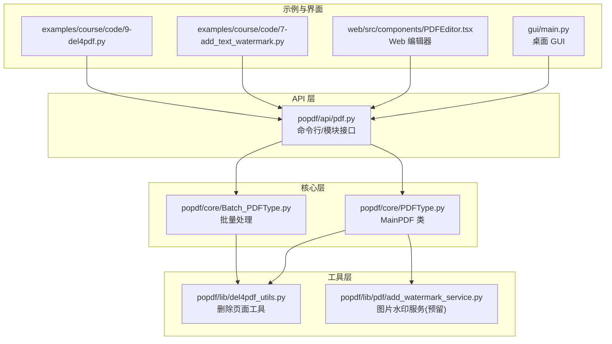
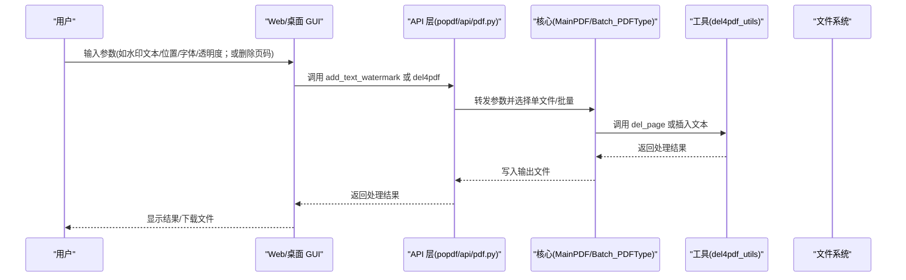
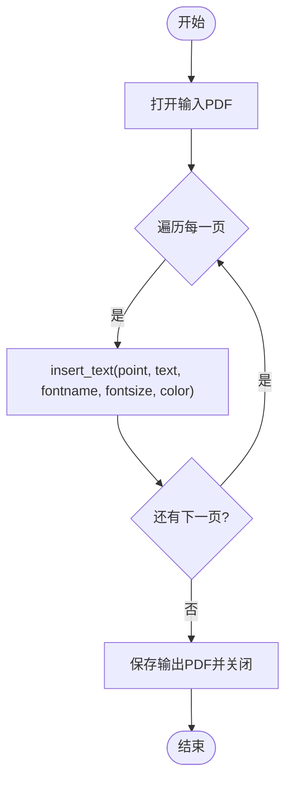
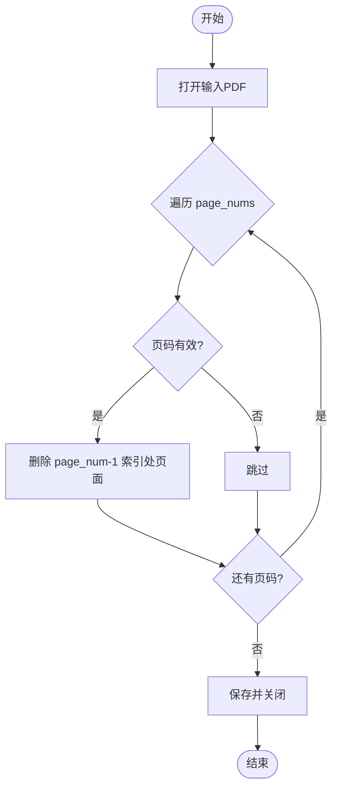
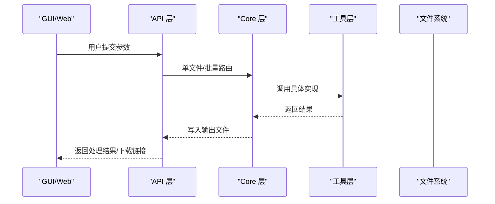
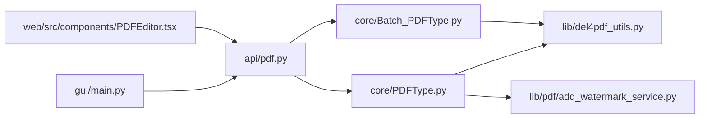

# PDF编辑

<cite>
**本文引用的文件**
- [popdf/lib/del4pdf_utils.py](file://popdf/lib/del4pdf_utils.py)
- [popdf/core/PDFType.py](file://popdf/core/PDFType.py)
- [popdf/api/pdf.py](file://popdf/api/pdf.py)
- [popdf/core/Batch_PDFType.py](file://popdf/core/Batch_PDFType.py)
- [popdf/lib/pdf/add_watermark_service.py](file://popdf/lib/pdf/add_watermark_service.py)
- [examples/course/code/7-add_text_watermark.py](file://examples/course/code/7-add_text_watermark.py)
- [examples/course/code/9-del4pdf.py](file://examples/course/code/9-del4pdf.py)
- [gui/main.py](file://gui/main.py)
- [web/src/components/PDFEditor.tsx](file://web/src/components/PDFEditor.tsx)
- [popdf/lib/pdf_exceptions.py](file://popdf/lib/pdf_exceptions.py)
- [README.md](file://README.md)
</cite>

## 目录
1. [简介](#简介)
2. [项目结构](#项目结构)
3. [核心组件](#核心组件)
4. [架构总览](#架构总览)
5. [详细组件分析](#详细组件分析)
6. [依赖关系分析](#依赖关系分析)
7. [性能考量](#性能考量)
8. [故障排查指南](#故障排查指南)
9. [结论](#结论)
10. [附录](#附录)

## 简介
本文件聚焦 popdf 库的 PDF 编辑能力，围绕“添加水印（文本与图片）”和“删除页面”两大核心功能展开，结合 del4pdf_utils.py 与 PDFType.py 中的 add_watermark、del4pdf 方法，系统阐述实现机制、参数控制、边界处理、批量操作与前后端交互衔接，并给出错误处理与日志记录的最佳实践。

## 项目结构
popdf 的编辑能力主要由以下层次构成：
- API 层：对外暴露命令行与模块化接口，封装业务入口与参数校验。
- 核心层：MainPDF 与 Batch_PDFType 提供具体 PDF 操作能力。
- 工具层：del4pdf_utils、add_watermark_service 等提供底层实现。
- 示例与界面：examples 提供使用示例；GUI 与 Web 提供用户交互。

图表来源
- [popdf/api/pdf.py](file://popdf/api/pdf.py#L1-L235)
- [popdf/core/PDFType.py](file://popdf/core/PDFType.py#L1-L180)
- [popdf/core/Batch_PDFType.py](file://popdf/core/Batch_PDFType.py#L1-L142)
- [popdf/lib/del4pdf_utils.py](file://popdf/lib/del4pdf_utils.py#L1-L20)
- [popdf/lib/pdf/add_watermark_service.py](file://popdf/lib/pdf/add_watermark_service.py#L1-L59)
- [gui/main.py](file://gui/main.py#L1-L800)
- [web/src/components/PDFEditor.tsx](file://web/src/components/PDFEditor.tsx#L1-L309)
- [examples/course/code/7-add_text_watermark.py](file://examples/course/code/7-add_text_watermark.py#L1-L26)
- [examples/course/code/9-del4pdf.py](file://examples/course/code/9-del4pdf.py#L1-L30)

章节来源
- [README.md](file://README.md#L56-L72)

## 核心组件
- MainPDF：提供 add_watermark、del4pdf、add_img_watermark 等核心编辑方法。
- Batch_PDFType：提供批量删除页面等批处理能力。
- del4pdf_utils：提供 del_page 实现，负责实际删除页面逻辑。
- add_watermark_service：图片水印服务预留实现（当前未被直接调用）。
- API 层：add_text_watermark、del4pdf 对外暴露统一接口，支持单文件与批量两种模式。
- GUI/Web：提供用户交互界面，将用户输入映射到 API 层。

章节来源
- [popdf/core/PDFType.py](file://popdf/core/PDFType.py#L126-L175)
- [popdf/core/Batch_PDFType.py](file://popdf/core/Batch_PDFType.py#L127-L142)
- [popdf/lib/del4pdf_utils.py](file://popdf/lib/del4pdf_utils.py#L1-L20)
- [popdf/lib/pdf/add_watermark_service.py](file://popdf/lib/pdf/add_watermark_service.py#L1-L59)
- [popdf/api/pdf.py](file://popdf/api/pdf.py#L154-L210)

## 架构总览
下面以“添加文本水印”和“删除页面”两条主线，展示从前端到后端的调用链路与数据流。

图表来源
- [popdf/api/pdf.py](file://popdf/api/pdf.py#L154-L210)
- [popdf/core/PDFType.py](file://popdf/core/PDFType.py#L126-L175)
- [popdf/core/Batch_PDFType.py](file://popdf/core/Batch_PDFType.py#L127-L142)
- [popdf/lib/del4pdf_utils.py](file://popdf/lib/del4pdf_utils.py#L1-L20)
- [gui/main.py](file://gui/main.py#L587-L730)
- [web/src/components/PDFEditor.tsx](file://web/src/components/PDFEditor.tsx#L1-L309)

## 详细组件分析

### 添加文本水印：add_watermark 与 add_text_watermark
- 入口与参数
  - API 层提供 add_text_watermark，接收 input_file、point、text、output_file、fontname、fontsize、color 等参数。
  - Core 层 MainPDF.add_watermark 遍历每一页，调用底层库插入文本。
- 位置控制
  - point 接受(x, y)坐标，作为插入文本的定位点。
- 字体样式与颜色
  - fontname、fontsize、color 分别控制字体族、字号与颜色（RGB 三元组）。
- 输出与保存
  - 保存到 output_file 并关闭文档句柄。
- 图片水印
  - MainPDF.add_img_watermark 通过 add_watermark_service.pdf_add_watermark 调用图片水印服务（当前实现为注释态，未启用）。

图表来源
- [popdf/core/PDFType.py](file://popdf/core/PDFType.py#L162-L174)
- [popdf/api/pdf.py](file://popdf/api/pdf.py#L154-L173)

章节来源
- [popdf/api/pdf.py](file://popdf/api/pdf.py#L154-L173)
- [popdf/core/PDFType.py](file://popdf/core/PDFType.py#L162-L174)
- [popdf/lib/pdf/add_watermark_service.py](file://popdf/lib/pdf/add_watermark_service.py#L1-L59)
- [examples/course/code/7-add_text_watermark.py](file://examples/course/code/7-add_text_watermark.py#L1-L26)

### 删除页面：del4pdf 与 del_page
- 入口与参数
  - API 层 del4pdf 支持单文件与批量两种模式，分别调用 MainPDF.del4pdf 或 Batch_PDFType.del4pdf。
  - Core 层 MainPDF.del4pdf 调用 del_page 完成删除。
- 索引处理与边界情况
  - del_page 对 page_nums 进行循环删除，内部对页码进行越界检查（小于等于0或大于总页数则跳过），避免异常。
  - 删除后立即保存并关闭文档。
- 批量处理
  - Batch_PDFType.del4pdf 遍历输入路径下所有 PDF 文件，逐个调用 del_page。

图表来源
- [popdf/lib/del4pdf_utils.py](file://popdf/lib/del4pdf_utils.py#L1-L20)
- [popdf/core/PDFType.py](file://popdf/core/PDFType.py#L149-L161)
- [popdf/core/Batch_PDFType.py](file://popdf/core/Batch_PDFType.py#L127-L142)
- [popdf/api/pdf.py](file://popdf/api/pdf.py#L183-L194)

章节来源
- [popdf/lib/del4pdf_utils.py](file://popdf/lib/del4pdf_utils.py#L1-L20)
- [popdf/core/PDFType.py](file://popdf/core/PDFType.py#L149-L161)
- [popdf/core/Batch_PDFType.py](file://popdf/core/Batch_PDFType.py#L127-L142)
- [popdf/api/pdf.py](file://popdf/api/pdf.py#L183-L194)
- [examples/course/code/9-del4pdf.py](file://examples/course/code/9-del4pdf.py#L1-L30)

### 用户交互与后端逻辑衔接
- GUI（PySide6）
  - “添加水印”标签页：输入水印文本、位置(X/Y)、字体大小，触发 WorkerThread 执行 add_text_watermark。
  - “删除页面”标签页：输入页码字符串（支持单个与范围），触发 del4pdf。
  - 采用异步线程避免阻塞 UI，通过信号传递进度与结果。
- Web（React + Tailwind）
  - PDFEditor 组件：提供水印文本、字体大小、透明度、位置、旋转角度等配置项；删除页面支持输入页码集合。
  - 预览区实时反映水印效果（透明度、旋转、位置）。
  - 处理按钮触发处理流程（当前为模拟，实际应调用后端 API）。

图表来源
- [gui/main.py](file://gui/main.py#L587-L730)
- [web/src/components/PDFEditor.tsx](file://web/src/components/PDFEditor.tsx#L1-L309)
- [popdf/api/pdf.py](file://popdf/api/pdf.py#L154-L210)

章节来源
- [gui/main.py](file://gui/main.py#L587-L730)
- [web/src/components/PDFEditor.tsx](file://web/src/components/PDFEditor.tsx#L1-L309)
- [popdf/api/pdf.py](file://popdf/api/pdf.py#L154-L210)

## 依赖关系分析
- 模块耦合
  - API 层仅依赖 Core 层 MainPDF/Batch_PDFType，Core 层再依赖工具层 del4pdf_utils。
  - add_watermark_service 当前未被 MainPDF 直接调用，保留扩展空间。
- 外部依赖
  - PyMuPDF 用于 PDF 读写与文本插入。
  - loguru 用于日志记录。
  - click 用于命令行接口。
  - GUI 使用 PySide6；Web 使用 React/Tailwind。

图表来源
- [popdf/api/pdf.py](file://popdf/api/pdf.py#L1-L235)
- [popdf/core/PDFType.py](file://popdf/core/PDFType.py#L1-L180)
- [popdf/core/Batch_PDFType.py](file://popdf/core/Batch_PDFType.py#L1-L142)
- [popdf/lib/del4pdf_utils.py](file://popdf/lib/del4pdf_utils.py#L1-L20)
- [popdf/lib/pdf/add_watermark_service.py](file://popdf/lib/pdf/add_watermark_service.py#L1-L59)
- [gui/main.py](file://gui/main.py#L1-L800)
- [web/src/components/PDFEditor.tsx](file://web/src/components/PDFEditor.tsx#L1-L309)

章节来源
- [popdf/api/pdf.py](file://popdf/api/pdf.py#L1-L235)
- [popdf/core/PDFType.py](file://popdf/core/PDFType.py#L1-L180)
- [popdf/core/Batch_PDFType.py](file://popdf/core/Batch_PDFType.py#L1-L142)
- [popdf/lib/del4pdf_utils.py](file://popdf/lib/del4pdf_utils.py#L1-L20)
- [popdf/lib/pdf/add_watermark_service.py](file://popdf/lib/pdf/add_watermark_service.py#L1-L59)
- [gui/main.py](file://gui/main.py#L1-L800)
- [web/src/components/PDFEditor.tsx](file://web/src/components/PDFEditor.tsx#L1-L309)

## 性能考量
- 文本水印
  - 遍历每一页插入文本，复杂度 O(N)（N 为页数）。建议在大文档上控制字体大小与透明度，减少渲染开销。
- 删除页面
  - 循环删除页码，每次删除涉及索引重排，整体复杂度近似 O(K·M)（K 为页数，M 为删除次数）。建议先按降序排序去重，减少重复索引调整。
- 批量处理
  - GUI/Web 采用异步线程执行，避免阻塞 UI；建议在前端显示进度与状态提示，提升用户体验。
- I/O
  - 保存输出文件时尽量使用合适的压缩参数，平衡文件体积与生成速度。

[本节为通用指导，无需列出具体文件来源]

## 故障排查指南
- 常见错误类型
  - 参数缺失或格式错误：API 层对参数进行校验并记录错误日志。
  - 文件不存在或非 PDF：工具层与转换工具对输入进行校验。
  - 异常捕获与日志
    - GUI 使用 WorkerThread 捕获异常并通过信号返回错误信息。
    - Web 编辑器在处理失败时打印错误日志。
    - 可引入自定义异常类以统一错误语义（参考 pdf_exceptions.py 的异常类设计思路）。
- 日志记录
  - 使用 loguru 记录关键事件与错误，便于定位问题。
  - 建议在 API 层与核心层的关键节点增加日志，区分 INFO/WARNING/ERROR 级别。
- 边界与健壮性
  - 删除页面时对页码进行越界检查，避免异常。
  - 批量处理时对空路径与空文件集进行保护。

章节来源
- [popdf/api/pdf.py](file://popdf/api/pdf.py#L183-L194)
- [popdf/lib/pdf2docx_utils.py](file://popdf/lib/pdf2docx_utils.py#L1-L23)
- [gui/main.py](file://gui/main.py#L212-L237)
- [web/src/components/PDFEditor.tsx](file://web/src/components/PDFEditor.tsx#L38-L63)
- [popdf/lib/pdf_exceptions.py](file://popdf/lib/pdf_exceptions.py#L1-L25)

## 结论
popdf 的 PDF 编辑能力以清晰的分层架构实现：API 层统一入口、Core 层承载核心逻辑、工具层专注底层实现。文本水印通过坐标与字体参数精确控制，删除页面具备完善的边界检查与批量支持。GUI/Web 提供直观的交互体验并与后端逻辑紧密衔接。建议在生产环境中强化异常处理与日志体系，确保稳定性与可观测性。

[本节为总结性内容，无需列出具体文件来源]

## 附录
- 使用示例
  - 文本水印：参见示例脚本。
  - 删除页面：参见示例脚本。
- 批量编辑
  - 单文件：API 层 del4pdf(page_nums, input_file, output_file)。
  - 批量：API 层 del4pdf(page_nums, input_path, output_path)，内部委托 Batch_PDFType.del4pdf。
- 高级选项（当前实现与界面支持）
  - 文本水印：位置(point)、字体(fontname)、字号(fontsize)、颜色(color)。
  - 图片水印：add_img_watermark 已预留，当前实现为注释态。
  - Web 界面额外支持透明度、位置预设、旋转角度等可视化配置。

章节来源
- [examples/course/code/7-add_text_watermark.py](file://examples/course/code/7-add_text_watermark.py#L1-L26)
- [examples/course/code/9-del4pdf.py](file://examples/course/code/9-del4pdf.py#L1-L30)
- [popdf/api/pdf.py](file://popdf/api/pdf.py#L183-L194)
- [popdf/core/Batch_PDFType.py](file://popdf/core/Batch_PDFType.py#L127-L142)
- [web/src/components/PDFEditor.tsx](file://web/src/components/PDFEditor.tsx#L1-L309)