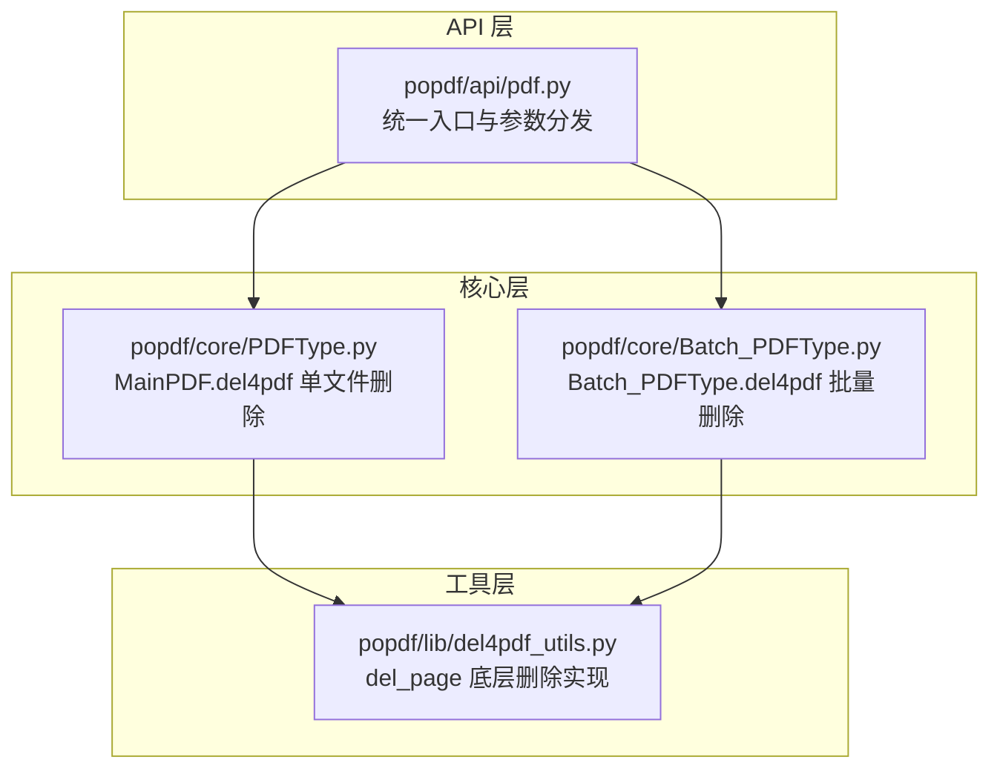
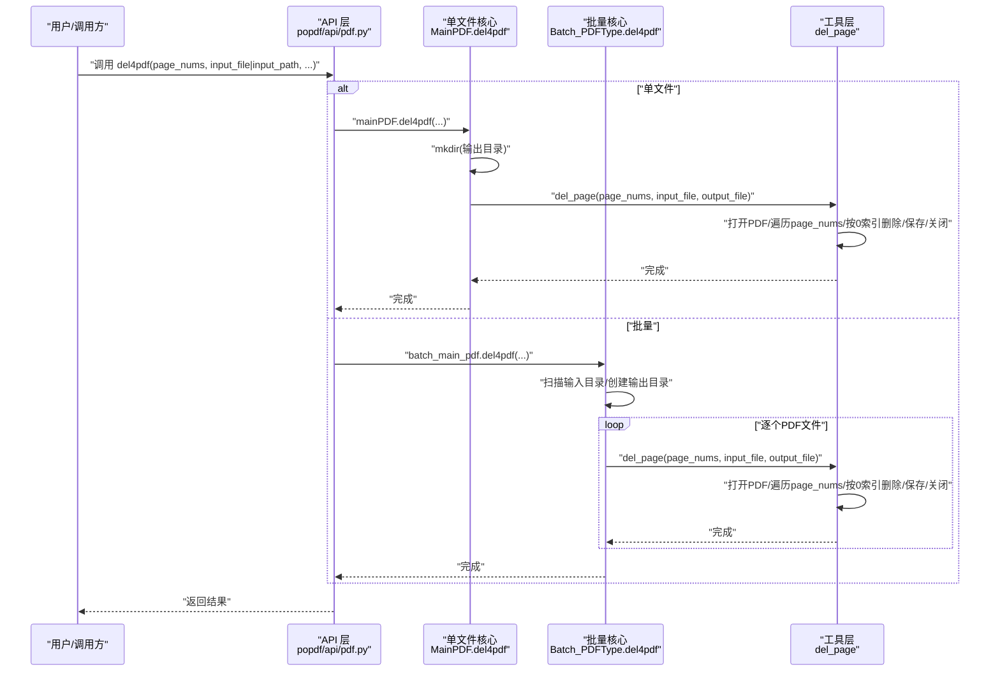
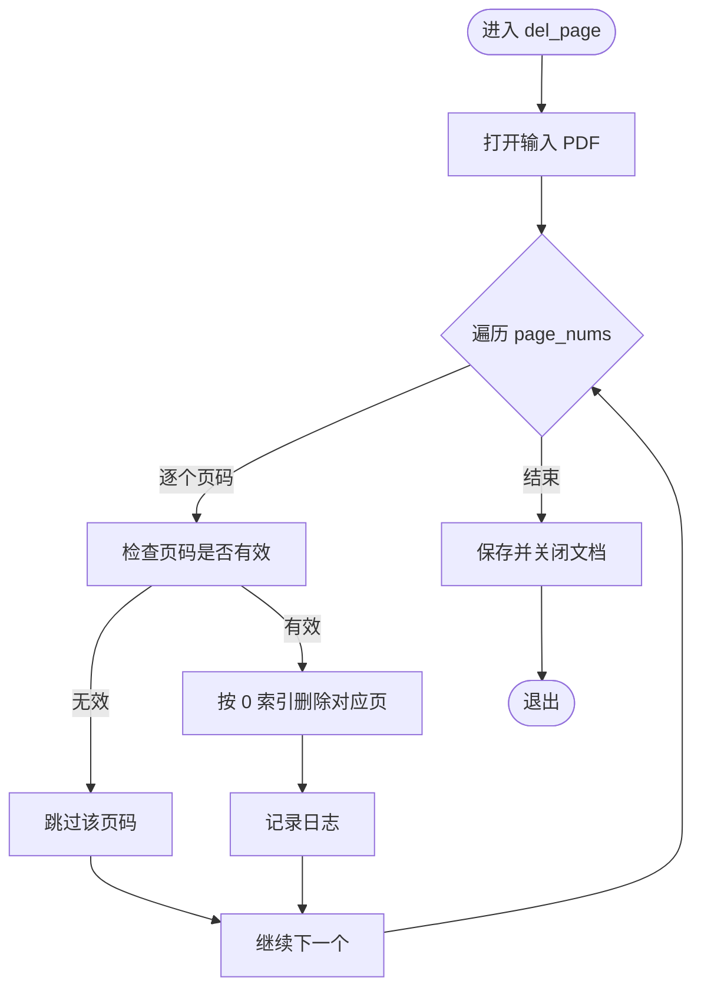
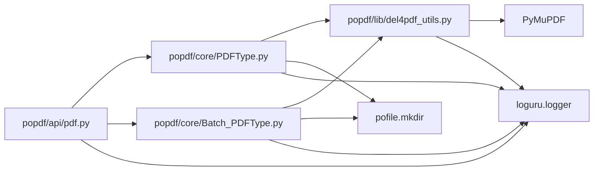

# 删除页面

<cite>
**本文引用的文件**
- [popdf/api/pdf.py](file://popdf/api/pdf.py)
- [popdf/core/PDFType.py](file://popdf/core/PDFType.py)
- [popdf/core/Batch_PDFType.py](file://popdf/core/Batch_PDFType.py)
- [popdf/lib/del4pdf_utils.py](file://popdf/lib/del4pdf_utils.py)
- [examples/course/code/9-del4pdf.py](file://examples/course/code/9-del4pdf.py)
- [tests/test_code/test_pdf.py](file://tests/test_code/test_pdf.py)
- [popdf/__init__.py](file://popdf/__init__.py)
</cite>

## 目录
1. [简介](#简介)
2. [项目结构](#项目结构)
3. [核心组件](#核心组件)
4. [架构总览](#架构总览)
5. [详细组件分析](#详细组件分析)
6. [依赖关系分析](#依赖关系分析)
7. [性能考量](#性能考量)
8. [故障排查指南](#故障排查指南)
9. [结论](#结论)
10. [附录](#附录)

## 简介
本节面向希望使用 popdf 库删除 PDF 页面的用户与开发者，系统性解析“删除页面”功能的实现路径与行为特征。重点覆盖：
- 基于 PyMuPDF 的页面删除机制
- page_nums 参数的 0 索引特性与不连续页码处理
- 输入/输出路径的自动创建机制
- 单文件与批量删除的调用方式
- 边界情况与容错策略
- 错误排查与日志最佳实践

## 项目结构
popdf 的“删除页面”能力由三层协作完成：
- API 层：对外暴露统一入口，负责参数校验与分发
- 核心层：单文件与批量操作的具体实现
- 工具层：底层 PyMuPDF 操作封装

图表来源
- [popdf/api/pdf.py](file://popdf/api/pdf.py#L183-L194)
- [popdf/core/PDFType.py](file://popdf/core/PDFType.py#L149-L161)
- [popdf/core/Batch_PDFType.py](file://popdf/core/Batch_PDFType.py#L127-L142)
- [popdf/lib/del4pdf_utils.py](file://popdf/lib/del4pdf_utils.py#L7-L20)

章节来源
- [popdf/api/pdf.py](file://popdf/api/pdf.py#L1-L235)
- [popdf/core/PDFType.py](file://popdf/core/PDFType.py#L1-L180)
- [popdf/core/Batch_PDFType.py](file://popdf/core/Batch_PDFType.py#L1-L142)
- [popdf/lib/del4pdf_utils.py](file://popdf/lib/del4pdf_utils.py#L1-L20)

## 核心组件
- API 入口：在 API 层定义统一的 del4pdf 函数，根据是否传入文件路径或路径，决定调用单文件或批量删除流程。
- 单文件删除：MainPDF.del4pdf 接收 page_nums、input_file、output_file，先确保输出目录存在，再委托工具层 del_page 完成删除。
- 批量删除：Batch_PDFType.del4pdf 枚举输入目录下所有 PDF 文件，逐个调用 del_page，输出到指定目录。
- 工具层删除：del_page 使用 PyMuPDF 打开 PDF，遍历 page_nums，按 0 索引删除对应页，最后保存并关闭文档。

章节来源
- [popdf/api/pdf.py](file://popdf/api/pdf.py#L183-L194)
- [popdf/core/PDFType.py](file://popdf/core/PDFType.py#L149-L161)
- [popdf/core/Batch_PDFType.py](file://popdf/core/Batch_PDFType.py#L127-L142)
- [popdf/lib/del4pdf_utils.py](file://popdf/lib/del4pdf_utils.py#L7-L20)

## 架构总览
下面以序列图展示“删除页面”的端到端调用链路，涵盖单文件与批量两种场景。

图表来源
- [popdf/api/pdf.py](file://popdf/api/pdf.py#L183-L194)
- [popdf/core/PDFType.py](file://popdf/core/PDFType.py#L149-L161)
- [popdf/core/Batch_PDFType.py](file://popdf/core/Batch_PDFType.py#L127-L142)
- [popdf/lib/del4pdf_utils.py](file://popdf/lib/del4pdf_utils.py#L7-L20)

## 详细组件分析

### API 层：统一入口与参数分发
- 功能职责：接收 page_nums、input_file/output_file 或 input_path/output_path，判断调用路径并记录日志。
- 参数约束：当且仅当 page_nums 存在且满足单文件或批量条件时才执行；否则输出错误日志。
- 返回值：遵循 API 层约定，便于上层统一处理。

章节来源
- [popdf/api/pdf.py](file://popdf/api/pdf.py#L183-L194)

### 单文件删除：MainPDF.del4pdf
- 路径创建：在执行删除前，确保输出目录存在。
- 参数透传：将 page_nums、input_file、output_file 传递给工具层 del_page。
- 日志记录：通过工具层内部的日志记录删除动作。

章节来源
- [popdf/core/PDFType.py](file://popdf/core/PDFType.py#L149-L161)

### 批量删除：Batch_PDFType.del4pdf
- 目录扫描：枚举输入目录下的所有 PDF 文件。
- 输出映射：将每个输入文件名映射到输出目录，保持同名输出。
- 逐个删除：对每个 PDF 文件调用 del_page，实现相同页码的批量删除。

章节来源
- [popdf/core/Batch_PDFType.py](file://popdf/core/Batch_PDFType.py#L127-L142)

### 工具层：del_page（PyMuPDF 实现）
- 打开文档：使用 PyMuPDF 打开输入 PDF。
- 遍历页码：对 page_nums 中的每个页码执行删除。
- 0 索引删除：内部按 0 索引访问与删除，因此 page_nums 中的数值应与 1 索引一致。
- 边界处理：对越界页码进行跳过处理（小于等于0或大于总页数时忽略）。
- 保存与关闭：删除完成后保存并关闭文档。

图表来源
- [popdf/lib/del4pdf_utils.py](file://popdf/lib/del4pdf_utils.py#L7-L20)

章节来源
- [popdf/lib/del4pdf_utils.py](file://popdf/lib/del4pdf_utils.py#L7-L20)

### 示例：单文件删除第一页
- 示例路径：examples/course/code/9-del4pdf.py
- 用法要点：传入 input_file、page_nums=[1]、output_file，即可删除第一页。
- 注意事项：page_nums 使用 1 索引语义，但工具层内部按 0 索引执行，因此传入 1 即可删除第一页。

章节来源
- [examples/course/code/9-del4pdf.py](file://examples/course/code/9-del4pdf.py#L1-L30)

## 依赖关系分析
- API 层依赖核心层与工具层，负责参数校验与流程分发。
- 核心层依赖工具层，完成具体删除逻辑。
- 工具层直接依赖 PyMuPDF，实现底层页面删除。
- 路径创建依赖 pofile.mkdir，确保输出目录存在。
- 日志记录依赖 loguru，贯穿各层。

图表来源
- [popdf/api/pdf.py](file://popdf/api/pdf.py#L1-L235)
- [popdf/core/PDFType.py](file://popdf/core/PDFType.py#L1-L180)
- [popdf/core/Batch_PDFType.py](file://popdf/core/Batch_PDFType.py#L1-L142)
- [popdf/lib/del4pdf_utils.py](file://popdf/lib/del4pdf_utils.py#L1-L20)

章节来源
- [popdf/api/pdf.py](file://popdf/api/pdf.py#L1-L235)
- [popdf/core/PDFType.py](file://popdf/core/PDFType.py#L1-L180)
- [popdf/core/Batch_PDFType.py](file://popdf/core/Batch_PDFType.py#L1-L142)
- [popdf/lib/del4pdf_utils.py](file://popdf/lib/del4pdf_utils.py#L1-L20)

## 性能考量
- 批量删除的性能主要受文件数量与单文件页数影响。工具层采用顺序遍历与删除，复杂度近似 O(N×M)，N 为 page_nums 长度，M 为 PDF 页数。
- PyMuPDF 的页面删除为原地修改，避免额外内存占用。
- 建议：
  - 对大文件批量删除时，尽量减少 page_nums 的长度，降低重复重排成本。
  - 批量操作时可考虑外部并发（如多进程），但需注意文件锁与输出目录写入竞争。

[本节为通用性能讨论，无需特定文件引用]

## 故障排查指南
- 文件路径错误
  - 现象：找不到输入文件或输出路径不存在导致异常。
  - 处理：确认 input_file/input_path 与 output_file/output_path 是否正确；API 层会在参数不完整时输出错误日志。
  - 参考：API 层参数校验逻辑。
  
  章节来源
  - [popdf/api/pdf.py](file://popdf/api/pdf.py#L183-L194)

- 权限问题
  - 现象：无法读取输入文件或写入输出文件。
  - 处理：检查文件权限与输出目录写权限；确保运行环境具备相应权限。
  - 参考：路径创建与保存流程均依赖文件系统访问。

  章节来源
  - [popdf/core/PDFType.py](file://popdf/core/PDFType.py#L149-L161)
  - [popdf/core/Batch_PDFType.py](file://popdf/core/Batch_PDFType.py#L127-L142)

- 加密 PDF 无法处理
  - 现象：加密 PDF 打不开或删除失败。
  - 处理：删除功能不包含解密逻辑，需先解密再删除；可使用其他模块进行解密后再调用删除。
  - 参考：删除流程直接使用 PyMuPDF 打开文件，未内置解密步骤。

  章节来源
  - [popdf/lib/del4pdf_utils.py](file://popdf/lib/del4pdf_utils.py#L7-L20)

- 无效页码（越界）
  - 现象：传入页码小于等于0或大于总页数时，工具层会跳过该页码。
  - 处理：确保 page_nums 中的页码在有效范围内；若需删除多页，请提供完整的页码列表。
  - 参考：工具层对越界页码的跳过逻辑。

  章节来源
  - [popdf/lib/del4pdf_utils.py](file://popdf/lib/del4pdf_utils.py#L7-L20)

- 日志记录与调试
  - 建议：开启 loguru 日志输出，关注 API 层与工具层的日志信息，定位参数与路径问题。
  - 参考：API 层与工具层均使用 loguru 记录关键事件。

  章节来源
  - [popdf/api/pdf.py](file://popdf/api/pdf.py#L1-L235)
  - [popdf/lib/del4pdf_utils.py](file://popdf/lib/del4pdf_utils.py#L7-L20)

- 单文件 vs 批量用法验证
  - 单文件示例：见示例脚本路径。
  - 批量示例：参考测试用例中对批量删除的调用方式。

  章节来源
  - [examples/course/code/9-del4pdf.py](file://examples/course/code/9-del4pdf.py#L1-L30)
  - [tests/test_code/test_pdf.py](file://tests/test_code/test_pdf.py#L159-L173)

## 结论
popdf 的“删除页面”功能通过清晰的分层设计实现了稳定可靠的页面删除能力：
- API 层统一入口，参数校验明确；
- 单文件与批量删除分别由核心层实现，复用同一工具层；
- 工具层基于 PyMuPDF，采用 0 索引删除，兼容不连续页码；
- 路径自动创建与日志记录提升可用性与可观测性。

在实际使用中，建议：
- 明确 page_nums 的 1 索引语义，工具层内部按 0 索引执行；
- 对批量场景提前准备输出目录，避免权限与路径问题；
- 遇到加密 PDF 时，先解密再删除；
- 利用日志快速定位参数与路径问题。

[本节为总结性内容，无需特定文件引用]

## 附录

### 参数与行为速查
- page_nums：1 索引语义，内部按 0 索引删除；支持不连续页码。
- 输入/输出路径：API 层会自动创建输出目录（若不存在）。
- 单文件删除：传入 input_file 与 output_file。
- 批量删除：传入 input_path 与 output_path，逐个文件删除相同页码。

章节来源
- [popdf/api/pdf.py](file://popdf/api/pdf.py#L183-L194)
- [popdf/core/PDFType.py](file://popdf/core/PDFType.py#L149-L161)
- [popdf/core/Batch_PDFType.py](file://popdf/core/Batch_PDFType.py#L127-L142)
- [popdf/lib/del4pdf_utils.py](file://popdf/lib/del4pdf_utils.py#L7-L20)