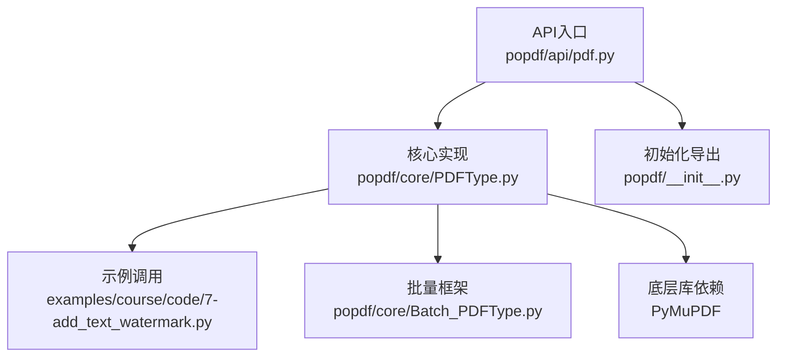
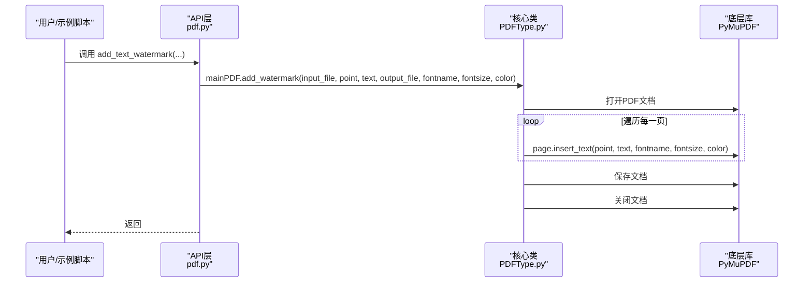
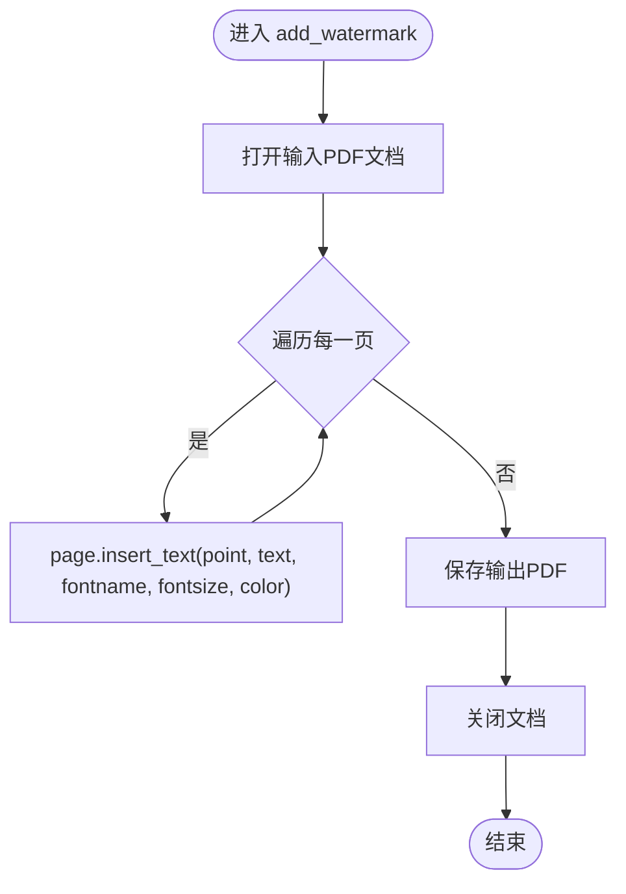
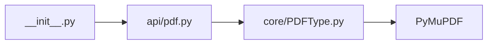

# 添加水印

<cite>
**本文引用的文件**
- [PDFType.py](file://popdf/core/PDFType.py)
- [add_watermark_service.py](file://popdf/lib/pdf/add_watermark_service.py)
- [pdf.py](file://popdf/api/pdf.py)
- [7-add_text_watermark.py](file://examples/course/code/7-add_text_watermark.py)
- [test_pdf.py](file://tests/test_code/test_pdf.py)
- [__init__.py](file://popdf/__init__.py)
</cite>

## 目录
1. [简介](#简介)
2. [项目结构](#项目结构)
3. [核心组件](#核心组件)
4. [架构总览](#架构总览)
5. [详细组件分析](#详细组件分析)
6. [依赖分析](#依赖分析)
7. [性能考虑](#性能考虑)
8. [故障排查指南](#故障排查指南)
9. [结论](#结论)
10. [附录](#附录)

## 简介
本章节面向希望在PDF中添加文本水印的用户与开发者，系统性解析popdf库中“添加水印”功能的实现机制。重点覆盖：
- PDFType.py中的add_watermark方法与参数配置
- API层pdf.py中的add_text_watermark服务入口
- 示例7-add_text_watermark.py的完整调用流程
- PyMuPDF底层技术细节（页面对象、文本插入、保存策略）
- 常见问题与解决方案（中文乱码、覆盖内容、坐标偏移等）
- 批量添加水印的扩展思路与实现建议

## 项目结构
围绕“添加水印”的关键文件组织如下：
- API入口：popdf/api/pdf.py对外暴露add_text_watermark接口
- 核心实现：popdf/core/PDFType.py提供add_watermark方法
- 示例：examples/course/code/7-add_text_watermark.py演示单文件调用
- 批量能力：popdf/core/Batch_PDFType.py提供批量处理框架
- 其他水印方案：popdf/lib/pdf/add_watermark_service.py保留了基于ReportLab的水印模板方案（注释版）

图表来源
- [pdf.py](file://popdf/api/pdf.py#L150-L173)
- [PDFType.py](file://popdf/core/PDFType.py#L162-L175)
- [7-add_text_watermark.py](file://examples/course/code/7-add_text_watermark.py#L10-L14)
- [Batch_PDFType.py](file://popdf/core/Batch_PDFType.py#L1-L142)
- [__init__.py](file://popdf/__init__.py#L1-L6)

章节来源
- [pdf.py](file://popdf/api/pdf.py#L150-L173)
- [PDFType.py](file://popdf/core/PDFType.py#L162-L175)
- [7-add_text_watermark.py](file://examples/course/code/7-add_text_watermark.py#L10-L14)
- [Batch_PDFType.py](file://popdf/core/Batch_PDFType.py#L1-L142)
- [__init__.py](file://popdf/__init__.py#L1-L6)

## 核心组件
- API层add_text_watermark：负责接收用户参数并委托给核心类执行
- 核心类MainPDF.add_watermark：使用PyMuPDF对每页插入文本水印
- 示例脚本7-add_text_watermark.py：展示单文件调用流程
- 批量框架Batch_PDFType：提供批量遍历与保存的通用模式

章节来源
- [pdf.py](file://popdf/api/pdf.py#L150-L173)
- [PDFType.py](file://popdf/core/PDFType.py#L162-L175)
- [7-add_text_watermark.py](file://examples/course/code/7-add_text_watermark.py#L10-L14)
- [Batch_PDFType.py](file://popdf/core/Batch_PDFType.py#L1-L142)

## 架构总览
下面的序列图展示了从API到核心实现再到底层库的调用链路，以及示例脚本的调用入口。

图表来源
- [pdf.py](file://popdf/api/pdf.py#L150-L173)
- [PDFType.py](file://popdf/core/PDFType.py#L162-L175)

章节来源
- [pdf.py](file://popdf/api/pdf.py#L150-L173)
- [PDFType.py](file://popdf/core/PDFType.py#L162-L175)

## 详细组件分析

### API层：add_text_watermark
- 功能：对外提供添加文本水印的便捷入口
- 参数要点：
  - input_file：输入PDF路径
  - point：水印文本的坐标点(x, y)
  - text：水印文本内容
  - output_file：输出PDF路径
  - fontname：字体名称
  - fontsize：字号
  - color：RGB颜色元组
- 实现逻辑：直接委托给MainPDF.add_watermark完成实际处理

章节来源
- [pdf.py](file://popdf/api/pdf.py#L150-L173)

### 核心类：MainPDF.add_watermark
- 功能：在PDF每一页插入文本水印
- 关键步骤：
  - 打开输入PDF文档
  - 遍历所有页面，对每页调用insert_text插入文本
  - 保存输出PDF并关闭文档
- 参数配置：
  - point：通过point参数精确控制水印位置
  - text：水印文本
  - fontname：字体名称
  - fontsize：字号
  - color：RGB颜色
- 底层依赖：PyMuPDF的文档与页面对象、insert_text方法

图表来源
- [PDFType.py](file://popdf/core/PDFType.py#L162-L175)

章节来源
- [PDFType.py](file://popdf/core/PDFType.py#L162-L175)

### 示例脚本：7-add_text_watermark.py
- 展示单文件添加水印的最小调用流程
- 关键点：传入input_file、point坐标、output_file等参数
- 可作为快速验证与集成的参考

章节来源
- [7-add_text_watermark.py](file://examples/course/code/7-add_text_watermark.py#L10-L14)

### 批量添加水印的扩展思路
- 利用Batch_PDFType的批量遍历框架，对每个PDF文件重复调用add_watermark
- 建议：
  - 统一输出目录管理
  - 控制并发与进度提示
  - 异常捕获与日志记录
- 该思路与现有批量转换、拆分等能力一致，便于复用

章节来源
- [Batch_PDFType.py](file://popdf/core/Batch_PDFType.py#L1-L142)

### 其他水印方案：add_watermark_service.py（注释版）
- 该文件保留了基于ReportLab的水印模板方案（注释），可用于生成独立水印PDF后再合并到目标PDF
- 与当前add_watermark不同：前者直接在页面上绘制文本，后者通过模板PDF合并的方式叠加水印
- 若需更复杂的布局、旋转、透明度等效果，可参考该模板方案的思路进行扩展

章节来源
- [add_watermark_service.py](file://popdf/lib/pdf/add_watermark_service.py#L1-L59)

## 依赖分析
- 外部库依赖：PyMuPDF（fitz）用于文档打开、页面遍历与文本插入
- 内部模块依赖：
  - popdf/api/pdf.py对外导出add_text_watermark
  - popdf/core/PDFType.py实现具体逻辑
  - popdf/__init__.py统一导出API

图表来源
- [__init__.py](file://popdf/__init__.py#L1-L6)
- [pdf.py](file://popdf/api/pdf.py#L150-L173)
- [PDFType.py](file://popdf/core/PDFType.py#L1-L20)

章节来源
- [__init__.py](file://popdf/__init__.py#L1-L6)
- [pdf.py](file://popdf/api/pdf.py#L150-L173)
- [PDFType.py](file://popdf/core/PDFType.py#L1-L20)

## 性能考虑
- 页面遍历：对大文档逐页插入文本，时间复杂度与页数线性相关
- 文本插入：insert_text为底层原生操作，通常较快；大量水印可能影响渲染
- 保存策略：使用默认保存策略即可；如需压缩可参考PyMuPDF文档的高级选项
- 批量处理：建议采用进度条与异常隔离，避免单个文件失败影响整体流程

## 故障排查指南
- 中文乱码
  - 现象：中文显示为方块或乱码
  - 原因：默认字体可能不包含中文字形
  - 解决：选择包含中文字形的字体名称（fontname），或在模板PDF方案中注册中文字体
  - 参考：若采用模板PDF方案，可参考注释中的字体注册方式
- 水印覆盖内容
  - 现象：水印遮挡正文
  - 原因：坐标point设置不当或透明度过低
  - 解决：调整point坐标、降低字号、增加透明度；或采用模板PDF合并方案以更好地控制层级
- 坐标偏移
  - 现象：水印不在预期位置
  - 原因：PDF坐标系与屏幕坐标系差异、页面尺寸不同
  - 解决：根据页面宽度/高度与目标位置计算point；必要时先获取页面尺寸再定位
- 文档被加密
  - 现象：无法读取或写入
  - 原因：PDF受密码保护
  - 解决：当前文本水印实现不涉及解密；如需处理加密PDF，请先解密或采用模板PDF合并方案（注释中包含解密示例思路）

章节来源
- [add_watermark_service.py](file://popdf/lib/pdf/add_watermark_service.py#L30-L59)

## 结论
popdf的文本水印功能以简洁高效为核心：API层提供易用接口，核心类直接利用PyMuPDF在每页插入文本，示例脚本给出单文件调用范式。对于更复杂的布局与多语言需求，可参考注释中的模板PDF方案。批量场景可通过Batch_PDFType框架扩展，实现统一的遍历与保存策略。

## 附录
- 测试用例参考：测试文件中包含对add_watermark_by_parameters的调用示例，便于理解参数传递与输出命名策略

章节来源
- [test_pdf.py](file://tests/test_code/test_pdf.py#L180-L186)