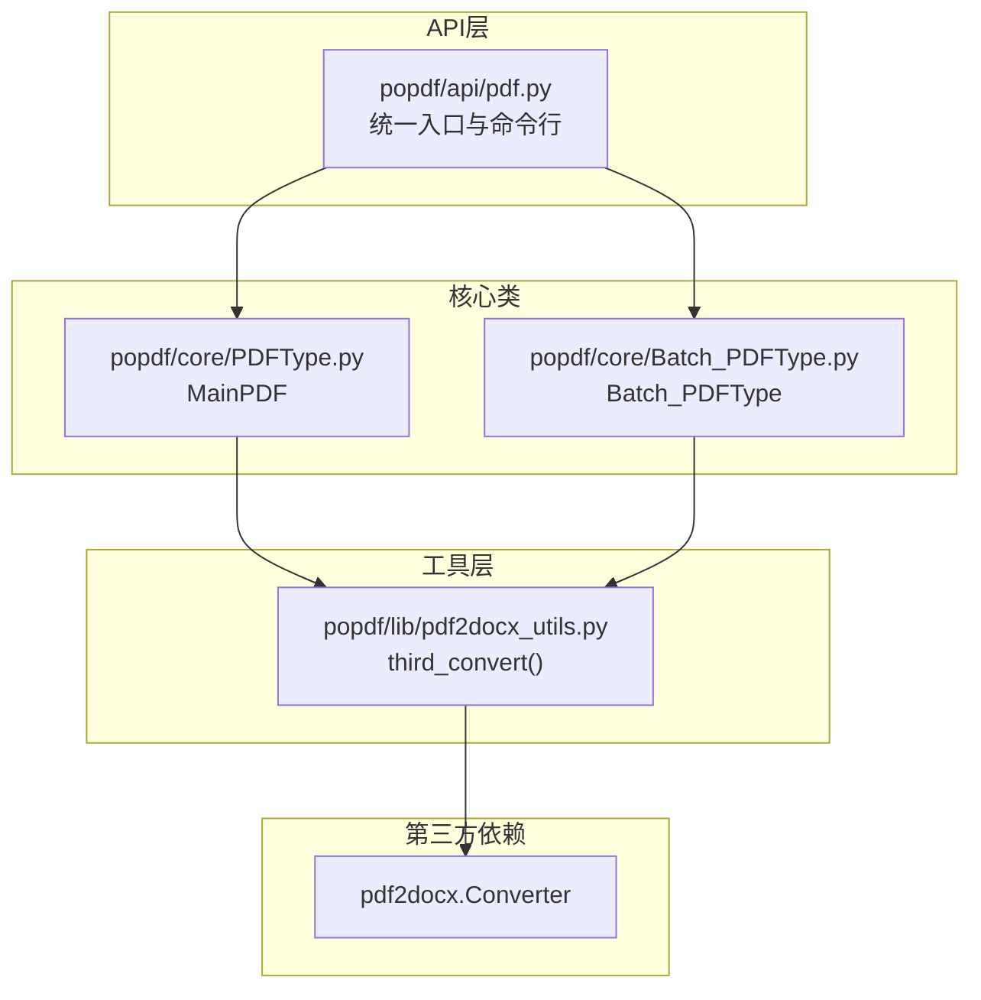
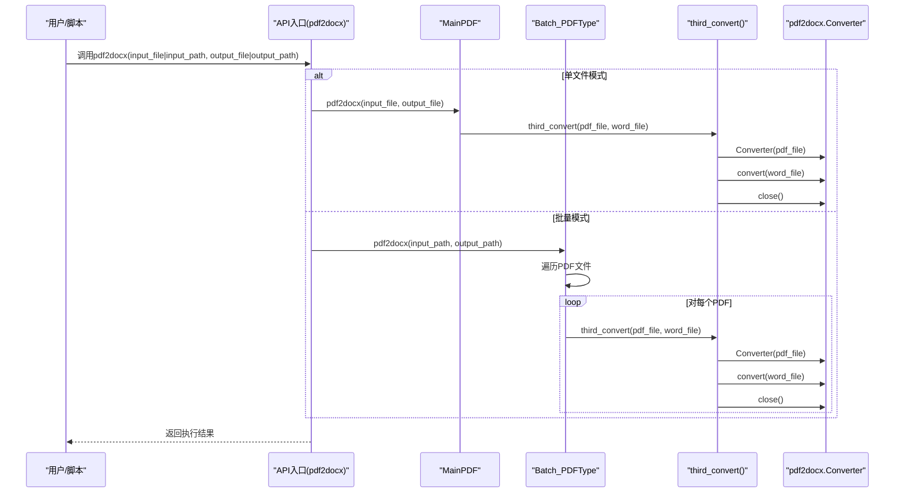
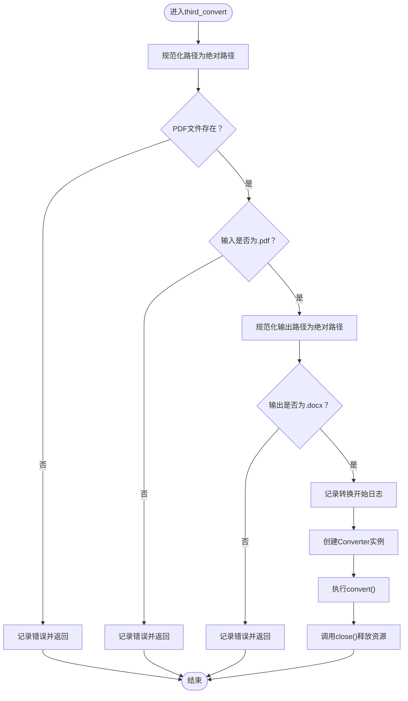
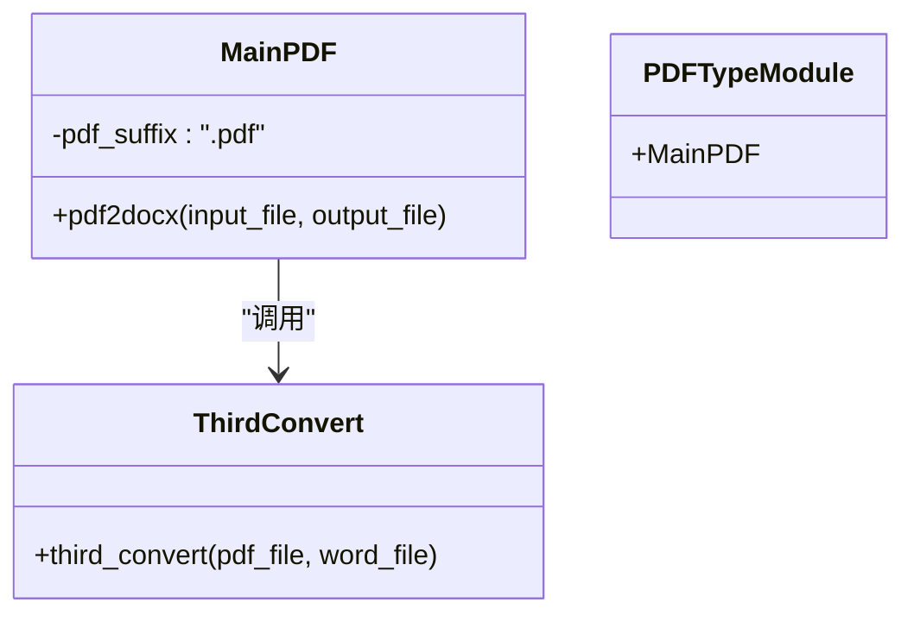
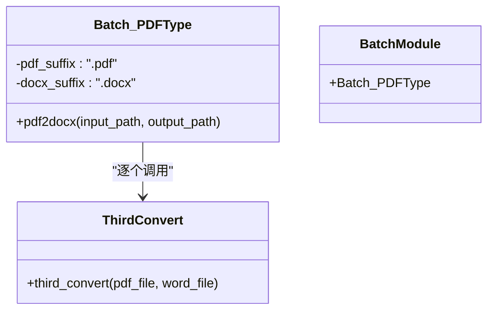
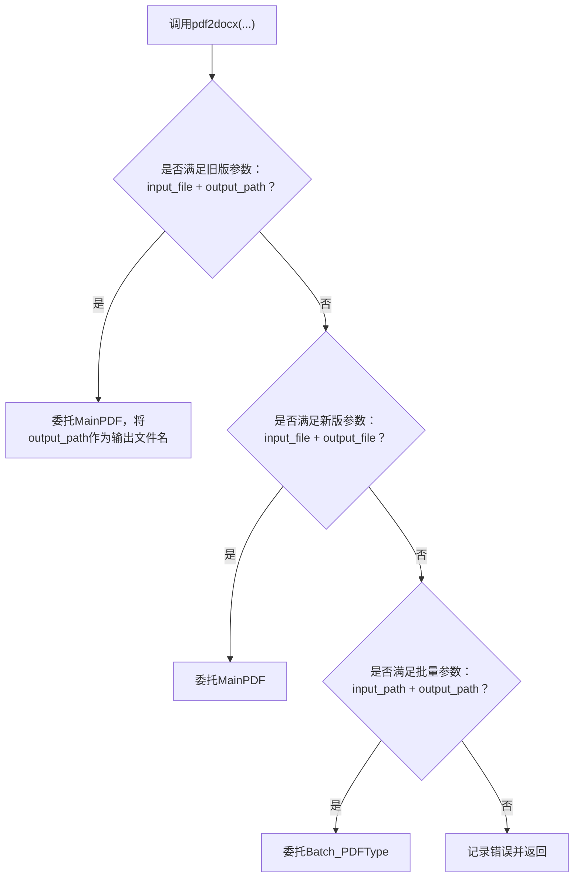
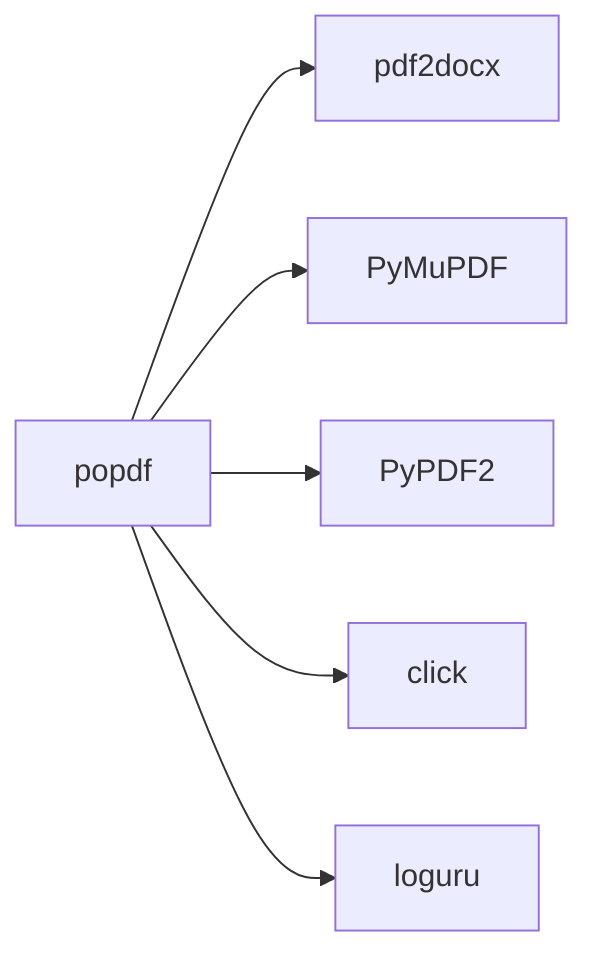

# PDF转Word

<cite>
**本文引用的文件**
- [popdf/lib/pdf2docx_utils.py](file://popdf/lib/pdf2docx_utils.py)
- [popdf/core/PDFType.py](file://popdf/core/PDFType.py)
- [popdf/core/Batch_PDFType.py](file://popdf/core/Batch_PDFType.py)
- [popdf/api/pdf.py](file://popdf/api/pdf.py)
- [examples/course/code/1-pdf2docx.py](file://examples/course/code/1-pdf2docx.py)
- [tests/test_code/test_pdf.py](file://tests/test_code/test_pdf.py)
- [pyproject.toml](file://pyproject.toml)
- [uv.lock](file://uv.lock)
- [popdf/__init__.py](file://popdf/__init__.py)
</cite>

## 目录
1. [简介](#简介)
2. [项目结构](#项目结构)
3. [核心组件](#核心组件)
4. [架构总览](#架构总览)
5. [组件详解](#组件详解)
6. [依赖关系分析](#依赖关系分析)
7. [性能与大文件处理建议](#性能与大文件处理建议)
8. [故障排查指南](#故障排查指南)
9. [结论](#结论)
10. [附录](#附录)

## 简介
本章节聚焦popdf库中“PDF转Word”的技术实现，围绕第三方库pdf2docx的集成方式展开，系统阐述：
- 单文件转换接口pdf2docx()与批量转换batch_main_pdf.pdf2docx()的实现差异与调用路径
- MainPDF类与Batch_PDFType类在转换流程中的职责划分
- third_convert()工具函数如何封装pdf2docx.Converter进行转换，包括文件存在性验证、格式校验与资源释放（close）
- API调用示例与命令行使用方法，覆盖参数兼容性（支持1.0.1版本旧参数）
- 中文文档转换注意事项与性能优化建议（含大文件处理策略）

## 项目结构
与PDF转Word直接相关的核心文件组织如下：
- API层：对外暴露统一入口与命令行能力
- 核心类：MainPDF（单文件）、Batch_PDFType（批量）
- 工具层：third_convert()对pdf2docx.Converter进行封装与校验
- 示例与测试：演示调用与参数兼容性验证

图表来源
- [popdf/api/pdf.py](file://popdf/api/pdf.py#L1-L120)
- [popdf/core/PDFType.py](file://popdf/core/PDFType.py#L1-L60)
- [popdf/core/Batch_PDFType.py](file://popdf/core/Batch_PDFType.py#L1-L40)
- [popdf/lib/pdf2docx_utils.py](file://popdf/lib/pdf2docx_utils.py#L1-L23)

章节来源
- [popdf/api/pdf.py](file://popdf/api/pdf.py#L1-L120)
- [popdf/core/PDFType.py](file://popdf/core/PDFType.py#L1-L60)
- [popdf/core/Batch_PDFType.py](file://popdf/core/Batch_PDFType.py#L1-L40)
- [popdf/lib/pdf2docx_utils.py](file://popdf/lib/pdf2docx_utils.py#L1-L23)

## 核心组件
- API入口与参数兼容
  - 提供pdf2docx()统一入口，兼容1.0.1版本旧参数（input_file + output_path），并优先识别新参数组合（input_file + output_file）
  - 支持单文件与批量两种模式，分别委托给MainPDF与Batch_PDFType
- 单文件转换：MainPDF.pdf2docx()
  - 负责单文件转换的前置准备（创建输出目录）与调用第三方转换
- 批量转换：Batch_PDFType.pdf2docx()
  - 扫描输入目录下所有PDF，按顺序逐一调用third_convert()
- 第三方封装：third_convert()
  - 对pdf2docx.Converter进行严格校验与资源管理，确保转换安全可靠

章节来源
- [popdf/api/pdf.py](file://popdf/api/pdf.py#L17-L43)
- [popdf/core/PDFType.py](file://popdf/core/PDFType.py#L19-L35)
- [popdf/core/Batch_PDFType.py](file://popdf/core/Batch_PDFType.py#L21-L31)
- [popdf/lib/pdf2docx_utils.py](file://popdf/lib/pdf2docx_utils.py#L7-L23)

## 架构总览
下面以序列图展示从API到第三方库的完整调用链路，以及单文件与批量两条主路径。

图表来源
- [popdf/api/pdf.py](file://popdf/api/pdf.py#L17-L43)
- [popdf/core/PDFType.py](file://popdf/core/PDFType.py#L23-L27)
- [popdf/core/Batch_PDFType.py](file://popdf/core/Batch_PDFType.py#L21-L31)
- [popdf/lib/pdf2docx_utils.py](file://popdf/lib/pdf2docx_utils.py#L7-L23)

## 组件详解

### third_convert()工具函数：封装与校验
- 功能要点
  - 路径标准化：将输入路径转为绝对路径，避免相对路径导致的查找失败
  - 文件存在性校验：若PDF不存在则记录错误并返回
  - 格式校验：仅接受“.pdf”输入与“.docx”输出，防止误用
  - 转换执行：创建Converter实例，调用convert()生成目标文件
  - 资源管理：显式调用close()释放底层资源，避免句柄泄漏
- 异常处理
  - 通过日志记录错误原因（文件不存在、格式不匹配），便于定位问题
  - 返回值用于上层流程控制（例如批量循环继续/中断）
- 性能与稳定性
  - 资源及时释放，降低内存占用与进程句柄累积风险
  - 格式校验减少无效调用，提升整体吞吐

图表来源
- [popdf/lib/pdf2docx_utils.py](file://popdf/lib/pdf2docx_utils.py#L7-L23)

章节来源
- [popdf/lib/pdf2docx_utils.py](file://popdf/lib/pdf2docx_utils.py#L7-L23)

### MainPDF类：单文件转换
- 职责
  - 单文件转换入口：接收input_file与output_file，负责创建输出目录并调用third_convert()
- 与API的关系
  - API在单文件模式下调用MainPDF.pdf2docx()，实现参数兼容与调用转发
- 与Batch_PDFType的关系
  - 两者共享同一转换工具third_convert()，保持行为一致性

图表来源
- [popdf/core/PDFType.py](file://popdf/core/PDFType.py#L19-L35)
- [popdf/lib/pdf2docx_utils.py](file://popdf/lib/pdf2docx_utils.py#L7-L23)

章节来源
- [popdf/core/PDFType.py](file://popdf/core/PDFType.py#L19-L35)

### Batch_PDFType类：批量转换
- 职责
  - 扫描输入目录下所有“.pdf”文件，逐个生成对应“.docx”输出文件
  - 调用third_convert()执行转换，保证与单文件一致的校验与资源管理
- 与API的关系
  - API在批量模式下调用Batch_PDFType.pdf2docx()，实现批量处理
- 与MainPDF的关系
  - 两者均依赖third_convert()，行为一致；区别在于输入来源（单文件 vs 目录扫描）

图表来源
- [popdf/core/Batch_PDFType.py](file://popdf/core/Batch_PDFType.py#L16-L31)
- [popdf/lib/pdf2docx_utils.py](file://popdf/lib/pdf2docx_utils.py#L7-L23)

章节来源
- [popdf/core/Batch_PDFType.py](file://popdf/core/Batch_PDFType.py#L16-L31)

### API入口：pdf2docx()与参数兼容
- 参数兼容策略
  - 1.0.1版本旧参数：input_file + output_path
  - 新参数优先：input_file + output_file
  - 批量模式：input_path + output_path
- 行为分支
  - 单文件：委托MainPDF
  - 批量：委托Batch_PDFType
  - 参数不合法：记录错误并返回

图表来源
- [popdf/api/pdf.py](file://popdf/api/pdf.py#L17-L43)

章节来源
- [popdf/api/pdf.py](file://popdf/api/pdf.py#L17-L43)

### 命令行与示例
- 命令行入口
  - 通过pyproject.toml注册console_scripts，提供popdf命令
  - CLI入口位于popdf.api.pdf:cli，统一调度各功能
- Python脚本示例
  - examples/course/code/1-pdf2docx.py展示了基本调用方式
  - tests/test_code/test_pdf.py包含单文件、批量等多场景测试用例

章节来源
- [pyproject.toml](file://pyproject.toml#L31-L33)
- [examples/course/code/1-pdf2docx.py](file://examples/course/code/1-pdf2docx.py#L1-L35)
- [tests/test_code/test_pdf.py](file://tests/test_code/test_pdf.py#L10-L41)

## 依赖关系分析
- 第三方依赖
  - pdf2docx：核心转换器，popdf通过third_convert()封装其Converter
  - PyMuPDF、PyPDF2：其他PDF处理能力（非本节重点）
- 版本与安装
  - 项目声明依赖pdf2docx，uv.lock显示具体版本与子依赖
  - 安装后可通过pip安装popdf，自动获得命令行入口

图表来源
- [pyproject.toml](file://pyproject.toml#L14-L23)
- [uv.lock](file://uv.lock#L1073-L1094)

章节来源
- [pyproject.toml](file://pyproject.toml#L14-L23)
- [uv.lock](file://uv.lock#L1073-L1094)

## 性能与大文件处理建议
- 资源管理
  - third_convert()显式调用close()，避免长时间运行导致的资源泄露
- 大文件策略
  - 分批处理：将超大PDF拆分为若干较小片段再转换，降低内存峰值
  - 并发控制：批量转换时限制并发度，避免CPU/IO争用
  - 输出目录预创建：提前mkdir，减少运行期IO开销
- 日志与可观测性
  - 利用loguru记录关键节点，便于定位耗时环节与异常点
- 中文文档注意事项
  - 确保字体与编码支持良好，必要时在上游PDF生成阶段就考虑中文字体嵌入
  - 对复杂表格/图像布局，建议先进行预处理（如去噪、裁剪）以提升转换质量

[本节为通用建议，无需特定文件引用]

## 故障排查指南
- 常见问题与定位
  - 输入文件不存在：third_convert()会记录错误并返回，检查路径是否正确
  - 输入/输出格式不匹配：仅接受“.pdf”与“.docx”，请核对扩展名
  - 权限不足：确认输出目录可写
  - 第三方库版本不兼容：参考uv.lock中的pdf2docx版本与依赖，必要时升级
- 日志与调试
  - 使用loguru输出的错误信息定位问题
  - 参考单元测试用例，复现参数组合与边界条件

章节来源
- [popdf/lib/pdf2docx_utils.py](file://popdf/lib/pdf2docx_utils.py#L7-L23)
- [tests/test_code/test_pdf.py](file://tests/test_code/test_pdf.py#L10-L41)

## 结论
popdf的PDF转Word实现以清晰的分层设计与严格的第三方封装为核心：
- API层提供统一入口与参数兼容
- MainPDF与Batch_PDFType分别承担单文件与批量转换
- third_convert()对pdf2docx.Converter进行格式校验与资源管理，保障稳定性
- 通过示例与测试覆盖常见使用场景，命令行入口便于自动化集成

[本节为总结性内容，无需特定文件引用]

## 附录

### API调用示例与参数说明
- 单文件转换（新参数）
  - 调用路径：popdf.api.pdf.pdf2docx(input_file, output_file)
  - 示例参考：[examples/course/code/1-pdf2docx.py](file://examples/course/code/1-pdf2docx.py#L1-L35)
- 单文件转换（兼容1.0.1旧参数）
  - 调用路径：popdf.api.pdf.pdf2docx(input_file, output_path)
  - 测试参考：[tests/test_code/test_pdf.py](file://tests/test_code/test_pdf.py#L14-L33)
- 批量转换
  - 调用路径：popdf.api.pdf.pdf2docx(input_path, output_path)
  - 测试参考：[tests/test_code/test_pdf.py](file://tests/test_code/test_pdf.py#L34-L41)

章节来源
- [examples/course/code/1-pdf2docx.py](file://examples/course/code/1-pdf2docx.py#L1-L35)
- [tests/test_code/test_pdf.py](file://tests/test_code/test_pdf.py#L10-L41)
- [popdf/api/pdf.py](file://popdf/api/pdf.py#L17-L43)

### 命令行使用
- 注册入口：pyproject.toml中定义console_scripts
- 入口函数：popdf.api.pdf:cli
- 使用方式：popdf --help 查看可用命令与参数

章节来源
- [pyproject.toml](file://pyproject.toml#L31-L33)
- [popdf/api/pdf.py](file://popdf/api/pdf.py#L12-L16)