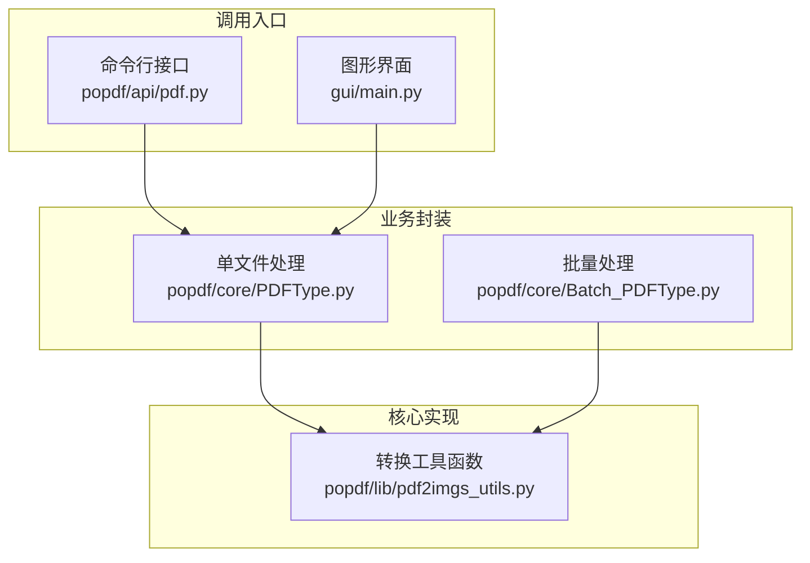
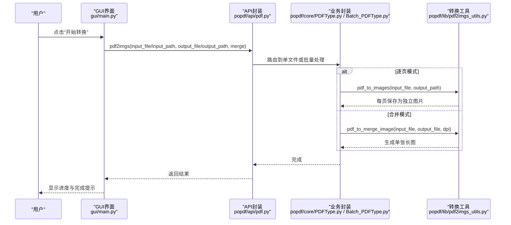
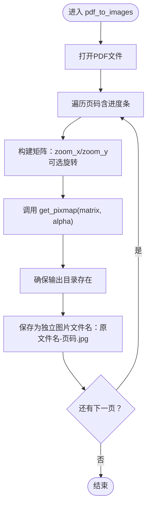
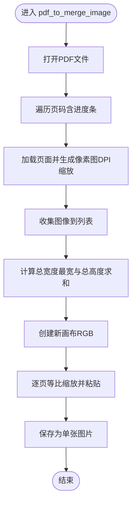
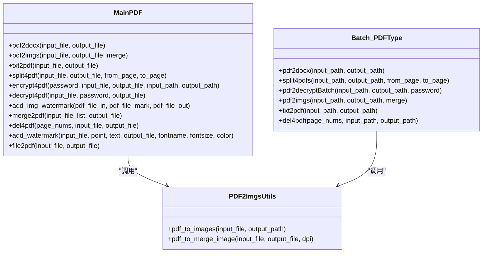
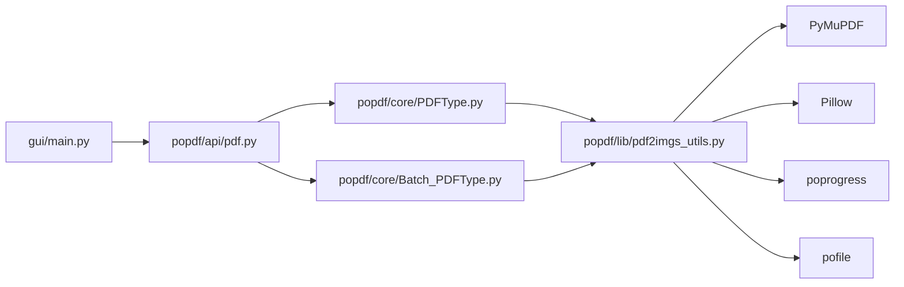

# PDF转图片

<cite>
**本文引用的文件**
- [popdf/lib/pdf2imgs_utils.py](file://popdf/lib/pdf2imgs_utils.py)
- [popdf/api/pdf.py](file://popdf/api/pdf.py)
- [popdf/core/PDFType.py](file://popdf/core/PDFType.py)
- [popdf/core/Batch_PDFType.py](file://popdf/core/Batch_PDFType.py)
- [gui/main.py](file://gui/main.py)
- [examples/course/code/2-pdf2imgs.py](file://examples/course/code/2-pdf2imgs.py)
- [examples/dev/pdf2imgs.py](file://examples/dev/pdf2imgs.py)
</cite>

## 目录
1. [简介](#简介)
2. [项目结构](#项目结构)
3. [核心组件](#核心组件)
4. [架构总览](#架构总览)
5. [详细组件分析](#详细组件分析)
6. [依赖关系分析](#依赖关系分析)
7. [性能与质量优化](#性能与质量优化)
8. [故障排查指南](#故障排查指南)
9. [结论](#结论)
10. [附录](#附录)

## 简介
本文件围绕“PDF转图片”功能，系统性解析两种模式：
- 逐页转图片：将PDF每一页导出为独立图片文件，适合多图管理与后续编辑。
- 合并为单张图片：将PDF所有页面垂直拼接为一张长图，适合预览、分享或OCR整体处理。

技术实现基于PyMuPDF（pymupdf）与Pillow（PIL）。重点说明：
- get_pixmap()的矩阵变换（Matrix）如何控制图像分辨率；
- DPI参数对输出质量的影响；
- 单文件与批量处理的流程控制（输出目录创建、文件命名规则、进度条显示）；
- 图像质量优化建议（zoom_x/zoom_y缩放系数）与内存管理注意事项；
- 中文路径与特殊字符处理的实际示例路径。

## 项目结构
围绕PDF转图片的核心模块分布如下：
- 库函数层：提供具体转换逻辑（逐页/合并），位于 [popdf/lib/pdf2imgs_utils.py](file://popdf/lib/pdf2imgs_utils.py)
- API封装层：对外暴露统一接口（CLI与GUI），位于 [popdf/api/pdf.py](file://popdf/api/pdf.py)
- 业务封装层：单文件与批量处理的入口，位于 [popdf/core/PDFType.py](file://popdf/core/PDFType.py) 与 [popdf/core/Batch_PDFType.py](file://popdf/core/Batch_PDFType.py)
- GUI集成：Qt界面触发转换流程，位于 [gui/main.py](file://gui/main.py)
- 示例与对比：课程示例与开发示例，位于 [examples/course/code/2-pdf2imgs.py](file://examples/course/code/2-pdf2imgs.py) 与 [examples/dev/pdf2imgs.py](file://examples/dev/pdf2imgs.py)

图表来源
- [popdf/api/pdf.py](file://popdf/api/pdf.py#L45-L70)
- [popdf/core/PDFType.py](file://popdf/core/PDFType.py#L28-L34)
- [popdf/core/Batch_PDFType.py](file://popdf/core/Batch_PDFType.py#L68-L79)
- [popdf/lib/pdf2imgs_utils.py](file://popdf/lib/pdf2imgs_utils.py#L10-L26)

章节来源
- [popdf/api/pdf.py](file://popdf/api/pdf.py#L45-L70)
- [popdf/core/PDFType.py](file://popdf/core/PDFType.py#L28-L34)
- [popdf/core/Batch_PDFType.py](file://popdf/core/Batch_PDFType.py#L68-L79)
- [popdf/lib/pdf2imgs_utils.py](file://popdf/lib/pdf2imgs_utils.py#L10-L26)

## 核心组件
- 逐页转图片：将PDF每页渲染为独立图片，使用矩阵缩放与旋转，输出到指定目录，文件名为“原文件名-页码.后缀”。见 [pdf_to_images](file://popdf/lib/pdf2imgs_utils.py#L10-L26)。
- 合并为单张图片：遍历PDF各页，按DPI生成高分辨率位图，垂直拼接为一张长图，输出单一文件。见 [pdf_to_merge_image](file://popdf/lib/pdf2imgs_utils.py#L28-L61)。
- 单文件处理入口：根据merge参数决定调用逐页或合并函数，负责输出目录创建与路径规范化。见 [MainPDF.pdf2imgs](file://popdf/core/PDFType.py#L28-L34)。
- 批量处理入口：扫描输入目录下所有PDF，按merge参数分别调用对应函数，自动创建输出目录。见 [Batch_PDFType.pdf2imgs](file://popdf/core/Batch_PDFType.py#L68-L79)。
- GUI触发：根据用户勾选“合并为单张图片”，将merge参数传入API。见 [PDFConverterGUI.execute_pdf2imgs](file://gui/main.py#L816-L823)。

章节来源
- [popdf/lib/pdf2imgs_utils.py](file://popdf/lib/pdf2imgs_utils.py#L10-L61)
- [popdf/core/PDFType.py](file://popdf/core/PDFType.py#L28-L34)
- [popdf/core/Batch_PDFType.py](file://popdf/core/Batch_PDFType.py#L68-L79)
- [gui/main.py](file://gui/main.py#L816-L823)

## 架构总览
下面的序列图展示了从GUI到核心实现的调用链路，以及两种模式的关键差异点。

图表来源
- [gui/main.py](file://gui/main.py#L816-L823)
- [popdf/api/pdf.py](file://popdf/api/pdf.py#L45-L70)
- [popdf/core/PDFType.py](file://popdf/core/PDFType.py#L28-L34)
- [popdf/core/Batch_PDFType.py](file://popdf/core/Batch_PDFType.py#L68-L79)
- [popdf/lib/pdf2imgs_utils.py](file://popdf/lib/pdf2imgs_utils.py#L10-L61)

## 详细组件分析

### 逐页转图片（pdf_to_images）
- 功能要点
  - 打开PDF并遍历页码，使用进度条显示处理进度。
  - 通过矩阵缩放（zoom_x/zoom_y）提升分辨率；默认缩放约1.33倍，等效DPI约128（96×1.33）。
  - 生成像素图后保存为JPEG，文件名为“原文件名-页码.jpg”，输出目录自动创建。
- 关键实现路径
  - [pdf_to_images](file://popdf/lib/pdf2imgs_utils.py#L10-L26)
  - [MainPDF.pdf2imgs](file://popdf/core/PDFType.py#L28-L34)
  - [Batch_PDFType.pdf2imgs](file://popdf/core/Batch_PDFType.py#L76-L79)

图表来源
- [popdf/lib/pdf2imgs_utils.py](file://popdf/lib/pdf2imgs_utils.py#L10-L26)
- [popdf/core/PDFType.py](file://popdf/core/PDFType.py#L28-L34)
- [popdf/core/Batch_PDFType.py](file://popdf/core/Batch_PDFType.py#L76-L79)

章节来源
- [popdf/lib/pdf2imgs_utils.py](file://popdf/lib/pdf2imgs_utils.py#L10-L26)
- [popdf/core/PDFType.py](file://popdf/core/PDFType.py#L28-L34)
- [popdf/core/Batch_PDFType.py](file://popdf/core/Batch_PDFType.py#L76-L79)

### 合并为单张图片（pdf_to_merge_image）
- 功能要点
  - 遍历PDF每页，按DPI生成高分辨率位图（默认300DPI）。
  - 收集所有页的图像，计算总高度与最宽宽度，创建新画布并垂直拼接。
  - 为保持比例，按画布宽度等比缩放每页图像，再粘贴到新图。
  - 最终保存为单一图片文件。
- 关键实现路径
  - [pdf_to_merge_image](file://popdf/lib/pdf2imgs_utils.py#L28-L61)
  - [MainPDF.pdf2imgs](file://popdf/core/PDFType.py#L28-L34)
  - [Batch_PDFType.pdf2imgs](file://popdf/core/Batch_PDFType.py#L72-L75)

图表来源
- [popdf/lib/pdf2imgs_utils.py](file://popdf/lib/pdf2imgs_utils.py#L28-L61)
- [popdf/core/PDFType.py](file://popdf/core/PDFType.py#L28-L34)
- [popdf/core/Batch_PDFType.py](file://popdf/core/Batch_PDFType.py#L72-L75)

章节来源
- [popdf/lib/pdf2imgs_utils.py](file://popdf/lib/pdf2imgs_utils.py#L28-L61)
- [popdf/core/PDFType.py](file://popdf/core/PDFType.py#L28-L34)
- [popdf/core/Batch_PDFType.py](file://popdf/core/Batch_PDFType.py#L72-L75)

### API与GUI集成
- API封装：统一入口接收input_file/input_path与output_file/output_path，并根据merge参数路由到不同模式。见 [pdf2imgs](file://popdf/api/pdf.py#L45-L70)。
- 单文件处理：MainPDF根据merge参数调用对应函数，并确保输出目录存在。见 [MainPDF.pdf2imgs](file://popdf/core/PDFType.py#L28-L34)。
- 批量处理：Batch_PDFType扫描目录，按merge参数逐个转换，自动创建输出目录。见 [Batch_PDFType.pdf2imgs](file://popdf/core/Batch_PDFType.py#L68-L79)。
- GUI触发：根据用户勾选“合并为单张图片”，将merge=True传入API。见 [PDFConverterGUI.execute_pdf2imgs](file://gui/main.py#L816-L823)。

章节来源
- [popdf/api/pdf.py](file://popdf/api/pdf.py#L45-L70)
- [popdf/core/PDFType.py](file://popdf/core/PDFType.py#L28-L34)
- [popdf/core/Batch_PDFType.py](file://popdf/core/Batch_PDFType.py#L68-L79)
- [gui/main.py](file://gui/main.py#L816-L823)

### 类关系图（与转换相关的类）

图表来源
- [popdf/core/PDFType.py](file://popdf/core/PDFType.py#L19-L179)
- [popdf/core/Batch_PDFType.py](file://popdf/core/Batch_PDFType.py#L16-L142)
- [popdf/lib/pdf2imgs_utils.py](file://popdf/lib/pdf2imgs_utils.py#L10-L61)

## 依赖关系分析
- 外部库依赖
  - PyMuPDF：用于打开PDF、加载页面、生成像素图（get_pixmap）、矩阵变换（Matrix）。
  - Pillow（PIL）：用于将像素数据转为图像对象、调整尺寸、保存图片。
  - poprogress：提供简单进度条包装迭代器。
  - pofile：提供mkdir等文件操作辅助。
- 内部依赖关系
  - API层（pdf.py）调用业务封装（PDFType.py、Batch_PDFType.py）。
  - 业务封装调用工具函数（pdf2imgs_utils.py）。
  - GUI层（main.py）通过API触发转换流程。

图表来源
- [gui/main.py](file://gui/main.py#L17-L21)
- [popdf/api/pdf.py](file://popdf/api/pdf.py#L1-L20)
- [popdf/core/PDFType.py](file://popdf/core/PDFType.py#L1-L18)
- [popdf/core/Batch_PDFType.py](file://popdf/core/Batch_PDFType.py#L1-L15)
- [popdf/lib/pdf2imgs_utils.py](file://popdf/lib/pdf2imgs_utils.py#L1-L8)

章节来源
- [gui/main.py](file://gui/main.py#L17-L21)
- [popdf/api/pdf.py](file://popdf/api/pdf.py#L1-L20)
- [popdf/core/PDFType.py](file://popdf/core/PDFType.py#L1-L18)
- [popdf/core/Batch_PDFType.py](file://popdf/core/Batch_PDFType.py#L1-L15)
- [popdf/lib/pdf2imgs_utils.py](file://popdf/lib/pdf2imgs_utils.py#L1-L8)

## 性能与质量优化
- 矩阵变换与分辨率控制
  - get_pixmap()的matrix参数用于控制渲染分辨率。zoom_x与zoom_y分别控制横向与纵向缩放，从而改变输出像素尺寸与DPI。
  - 默认缩放约1.33，等效DPI约128（96×1.33）；若需更高清晰度，可增大zoom_x/zoom_y。
  - 合并模式默认使用较高DPI（如300），以保证长图清晰度。
  - 参考实现路径：
    - [pdf_to_images矩阵构建与调用](file://popdf/lib/pdf2imgs_utils.py#L16-L22)
    - [pdf_to_merge_image DPI缩放](file://popdf/lib/pdf2imgs_utils.py#L38-L40)
- DPI与质量的关系
  - DPI越高，像素密度越大，图像越清晰，但文件体积与内存占用也越大。
  - 合并模式建议使用较高DPI（如300），逐页模式可根据用途选择适中DPI（如150-200）。
- 内存管理建议
  - 合并模式会将所有页的图像加载到内存，PDF页数较多时可能占用较大内存。建议：
    - 控制PDF页数或分批处理；
    - 适当降低DPI；
    - 处理完成后及时释放中间变量（如images_list）。
- 缩放系数设置建议
  - zoom_x/zoom_y与DPI换算关系：DPI ≈ 原始DPI × 缩放系数。默认1.33≈128DPI，2.0≈192DPI。
  - 若追求打印级质量，可考虑2.0以上，但需评估性能与存储成本。
- 输出目录与命名
  - 单文件模式：输出目录自动创建；逐页模式：输出目录为“输出路径/原文件名”；合并模式：输出文件为“原文件名.jpg”。
  - 参考实现路径：
    - [MainPDF.pdf2imgs目录与路径处理](file://popdf/core/PDFType.py#L28-L34)
    - [Batch_PDFType.pdf2imgs批量目录与命名](file://popdf/core/Batch_PDFType.py#L68-L79)
    - [pdf_to_images文件命名规则](file://popdf/lib/pdf2imgs_utils.py#L23-L25)

章节来源
- [popdf/lib/pdf2imgs_utils.py](file://popdf/lib/pdf2imgs_utils.py#L16-L22)
- [popdf/lib/pdf2imgs_utils.py](file://popdf/lib/pdf2imgs_utils.py#L38-L40)
- [popdf/core/PDFType.py](file://popdf/core/PDFType.py#L28-L34)
- [popdf/core/Batch_PDFType.py](file://popdf/core/Batch_PDFType.py#L68-L79)

## 故障排查指南
- 常见问题与定位
  - 中文路径/特殊字符：确保输入路径使用字符串类型且正确传递至pymupdf.open()与PIL保存接口。仓库中多处使用pathlib.Path处理路径，可避免编码问题。
    - 参考路径处理示例：
      - [pdf_to_images路径处理](file://popdf/lib/pdf2imgs_utils.py#L23-L25)
      - [Batch_PDFType批量路径处理](file://popdf/core/Batch_PDFType.py#L70-L79)
  - 权限不足：输出目录不存在或无写权限会导致保存失败。确保输出目录存在且具备写权限。
  - PDF加密/密码保护：若PDF受密码保护，需先解密再转换。GUI层提供解密功能入口。
    - 参考解密入口： [decrypt4pdf](file://popdf/api/pdf.py#L126-L151)
  - 进度条显示：GUI通过WorkerThread与progress_signal更新进度条，若未显示，请检查是否正确连接信号槽。
    - 参考进度条实现： [PDFConverterGUI.update_progress](file://gui/main.py#L788-L799)
- 日志与错误
  - API层在参数错误时记录日志，便于定位问题。
    - 参考参数校验与日志： [pdf2imgs参数分支](file://popdf/api/pdf.py#L45-L70)

章节来源
- [popdf/lib/pdf2imgs_utils.py](file://popdf/lib/pdf2imgs_utils.py#L23-L25)
- [popdf/core/Batch_PDFType.py](file://popdf/core/Batch_PDFType.py#L68-L79)
- [popdf/api/pdf.py](file://popdf/api/pdf.py#L126-L151)
- [gui/main.py](file://gui/main.py#L788-L799)

## 结论
- 逐页转图片适合精细化管理与二次编辑，可通过zoom_x/zoom_y灵活控制分辨率，兼顾清晰度与体积。
- 合并为单张图片适合整体预览与OCR场景，建议使用较高DPI并注意内存占用。
- 项目提供了完善的单文件与批量处理流程，配合GUI与API，满足不同使用场景。
- 实践中应结合PDF页数、目标用途与硬件资源，合理设置DPI与缩放系数，并关注中文路径与权限问题。

## 附录
- 实际代码示例路径（不含具体代码内容）
  - 逐页转图片示例（课程）： [examples/course/code/2-pdf2imgs.py](file://examples/course/code/2-pdf2imgs.py#L1-L27)
  - 提取PDF内嵌图片（开发示例）： [examples/dev/pdf2imgs.py](file://examples/dev/pdf2imgs.py#L1-L61)
- 关键实现路径汇总
  - [pdf_to_images](file://popdf/lib/pdf2imgs_utils.py#L10-L26)
  - [pdf_to_merge_image](file://popdf/lib/pdf2imgs_utils.py#L28-L61)
  - [MainPDF.pdf2imgs](file://popdf/core/PDFType.py#L28-L34)
  - [Batch_PDFType.pdf2imgs](file://popdf/core/Batch_PDFType.py#L68-L79)
  - [PDFConverterGUI.execute_pdf2imgs](file://gui/main.py#L816-L823)