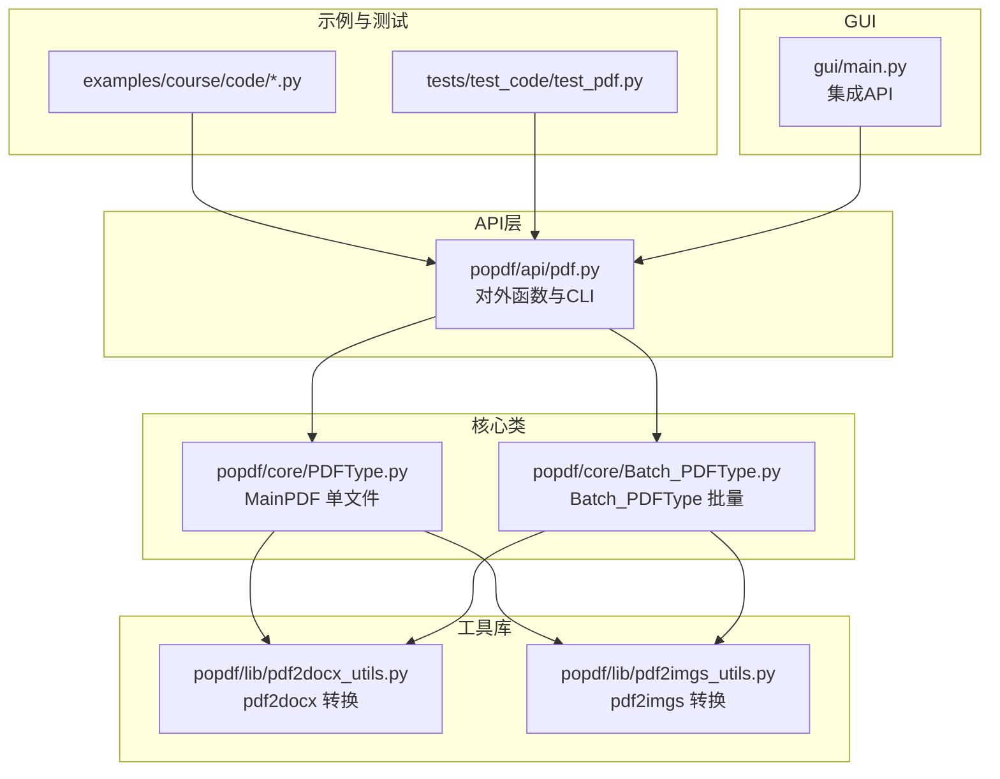
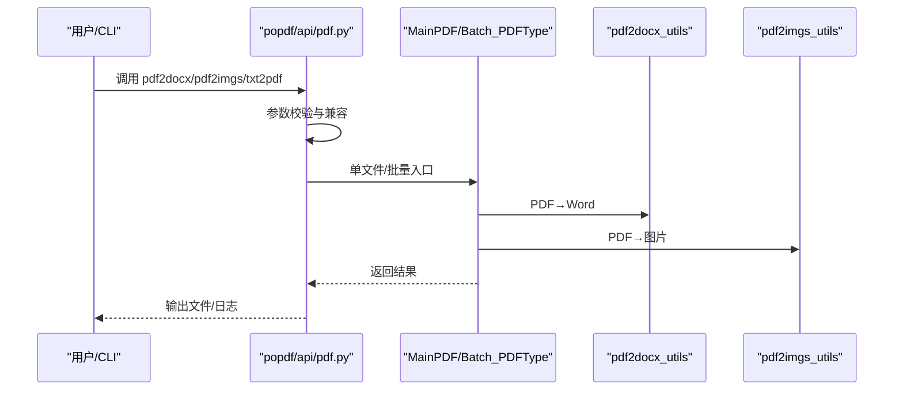
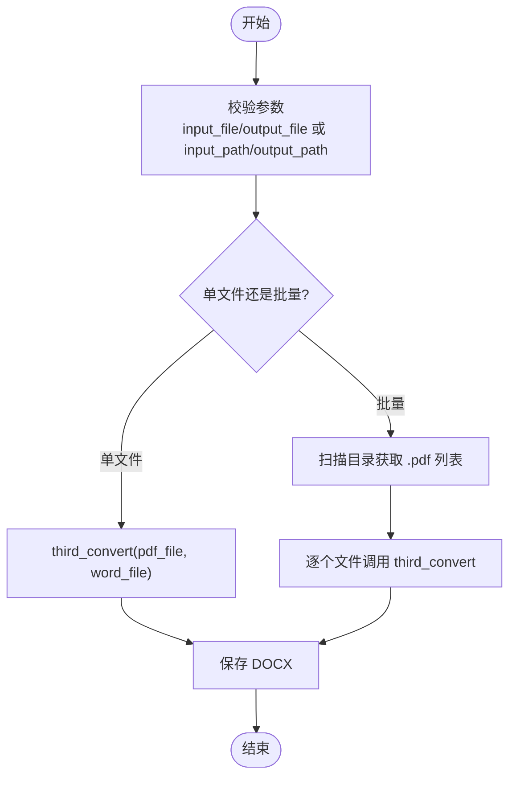
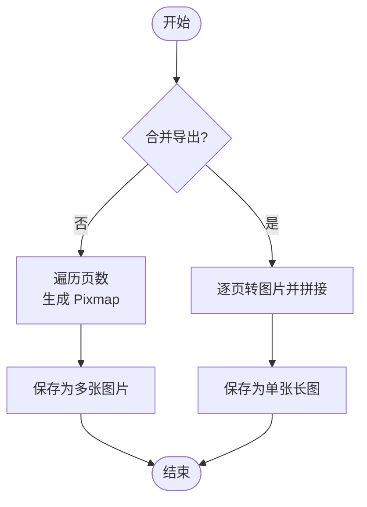
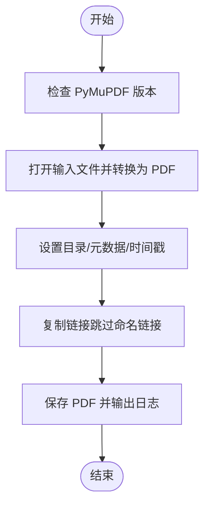
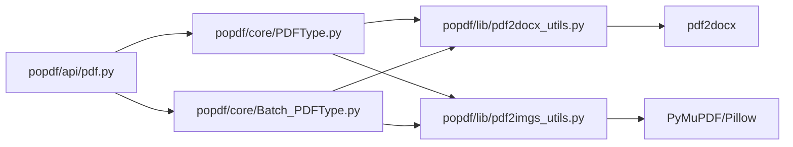

# PDF转换

<cite>
**本文引用的文件**
- [PDFType.py](file://popdf/core/PDFType.py)
- [Batch_PDFType.py](file://popdf/core/Batch_PDFType.py)
- [pdf2docx_utils.py](file://popdf/lib/pdf2docx_utils.py)
- [pdf2imgs_utils.py](file://popdf/lib/pdf2imgs_utils.py)
- [pdf.py](file://popdf/api/pdf.py)
- [1-pdf2docx.py](file://examples/course/code/1-pdf2docx.py)
- [2-pdf2imgs.py](file://examples/course/code/2-pdf2imgs.py)
- [3-txt2pdf.py](file://examples/course/code/3-txt2pdf.py)
- [test_pdf.py](file://tests/test_code/test_pdf.py)
- [README.md](file://README.md)
- [__init__.py](file://popdf/__init__.py)
- [main.py](file://gui/main.py)
</cite>

## 目录
1. [简介](#简介)
2. [项目结构](#项目结构)
3. [核心组件](#核心组件)
4. [架构总览](#架构总览)
5. [详细组件分析](#详细组件分析)
6. [依赖关系分析](#依赖关系分析)
7. [性能考量](#性能考量)
8. [故障排查指南](#故障排查指南)
9. [结论](#结论)
10. [附录](#附录)

## 简介
本文件系统性梳理 popdf 库中的 PDF 转换能力，覆盖：
- PDF 转 Word（基于 pdf2docx）
- PDF 转图片（基于 PyMuPDF）
- TXT 转 PDF（基于 PyMuPDF）

文档从架构、实现原理、单文件与批量处理差异、参数配置、性能优化、常见问题与解决方案，以及从 API 到命令行的完整使用示例进行说明，帮助开发者快速落地与优化 PDF 转换任务。

## 项目结构
popdf 的转换相关代码主要分布在以下模块：
- 核心类：单文件与批量转换入口
- 工具库：具体转换实现
- API 层：对外暴露的函数与 CLI
- 示例与测试：使用样例与回归验证
- GUI：图形界面集成

图表来源
- [pdf.py](file://popdf/api/pdf.py#L1-L235)
- [PDFType.py](file://popdf/core/PDFType.py#L1-L180)
- [Batch_PDFType.py](file://popdf/core/Batch_PDFType.py#L1-L142)
- [pdf2docx_utils.py](file://popdf/lib/pdf2docx_utils.py#L1-L23)
- [pdf2imgs_utils.py](file://popdf/lib/pdf2imgs_utils.py#L1-L62)
- [1-pdf2docx.py](file://examples/course/code/1-pdf2docx.py#L1-L35)
- [2-pdf2imgs.py](file://examples/course/code/2-pdf2imgs.py#L1-L27)
- [3-txt2pdf.py](file://examples/course/code/3-txt2pdf.py#L1-L27)
- [test_pdf.py](file://tests/test_code/test_pdf.py#L1-L242)
- [main.py](file://gui/main.py#L1-L200)

章节来源
- [README.md](file://README.md#L56-L72)
- [__init__.py](file://popdf/__init__.py#L1-L6)

## 核心组件
- MainPDF：封装单文件转换能力，包括 PDF→Word、PDF→图片、TXT→PDF、拆分、加密、解密、合并、删除页面、水印等。
- Batch_PDFType：封装批量转换能力，对同一目录下所有 PDF/TXT 文件进行统一处理。
- 工具库：
  - pdf2docx_utils：调用 pdf2docx 完成 PDF→Word。
  - pdf2imgs_utils：调用 PyMuPDF 完成 PDF→图片（单页/合并）。

章节来源
- [PDFType.py](file://popdf/core/PDFType.py#L19-L179)
- [Batch_PDFType.py](file://popdf/core/Batch_PDFType.py#L16-L142)
- [pdf2docx_utils.py](file://popdf/lib/pdf2docx_utils.py#L1-L23)
- [pdf2imgs_utils.py](file://popdf/lib/pdf2imgs_utils.py#L1-L62)

## 架构总览
从调用链看，API 层根据参数选择单文件或批量路径，再委托给核心类；核心类内部调用工具库完成具体转换。

图表来源
- [pdf.py](file://popdf/api/pdf.py#L17-L91)
- [PDFType.py](file://popdf/core/PDFType.py#L23-L35)
- [Batch_PDFType.py](file://popdf/core/Batch_PDFType.py#L21-L31)
- [pdf2docx_utils.py](file://popdf/lib/pdf2docx_utils.py#L7-L23)
- [pdf2imgs_utils.py](file://popdf/lib/pdf2imgs_utils.py#L10-L27)

## 详细组件分析

### PDF 转 Word（PDF→DOCX）
- 实现原理
  - 使用 pdf2docx.Converter 对 PDF 进行解析与转换，输出 DOCX。
  - 支持单文件与批量两种模式，批量通过遍历目录自动匹配 PDF 文件。
- 关键流程
  - 参数校验：确保输入/输出类型正确。
  - 转换执行：创建 Converter 并调用 convert/close。
  - 输出管理：自动创建输出目录，避免路径不存在导致失败。
- 单文件 vs 批量差异
  - 单文件：直接传入 input_file 与 output_file。
  - 批量：传入 input_path 与 output_path，内部扫描 .pdf 文件并逐一转换。
- 性能与质量
  - 转换质量取决于 pdf2docx 的解析能力，复杂排版可能需要人工微调。
  - 批量转换时建议串行或受控并发，避免资源竞争。
- 常见问题与建议
  - 格式丢失：复杂表格/图片排版可能变形，建议先预览再批量处理。
  - 中文编码：pdf2docx 通常能较好处理中文，若出现乱码，检查源 PDF 编码与字体嵌入情况。
  - 输出路径：确保输出目录存在，必要时显式创建。

图表来源
- [pdf.py](file://popdf/api/pdf.py#L17-L43)
- [PDFType.py](file://popdf/core/PDFType.py#L23-L27)
- [Batch_PDFType.py](file://popdf/core/Batch_PDFType.py#L21-L31)
- [pdf2docx_utils.py](file://popdf/lib/pdf2docx_utils.py#L7-L23)

章节来源
- [pdf2docx_utils.py](file://popdf/lib/pdf2docx_utils.py#L1-L23)
- [PDFType.py](file://popdf/core/PDFType.py#L23-L27)
- [Batch_PDFType.py](file://popdf/core/Batch_PDFType.py#L21-L31)
- [pdf.py](file://popdf/api/pdf.py#L17-L43)
- [1-pdf2docx.py](file://examples/course/code/1-pdf2docx.py#L1-L35)
- [test_pdf.py](file://tests/test_code/test_pdf.py#L10-L21)

### PDF 转图片（PDF→JPG/PNG）
- 实现原理
  - 使用 PyMuPDF 打开 PDF，逐页渲染为像素图（Pixmap），再保存为图片。
  - 支持两种模式：
    - 单页导出：每页保存为独立图片（命名规则包含页码）。
    - 合并导出：将所有页拼接为一张长图，适合截图/预览。
- 关键流程
  - 单页导出：遍历页数，设置缩放矩阵，保存为多张图片。
  - 合并导出：加载每页为图片，计算总高度与最大宽度，逐页粘贴并保存。
- 单文件 vs 批量差异
  - 单文件：传入 input_file 与 output_file（合并）或 output_path（单页）。
  - 批量：传入 input_path 与 output_path，内部扫描 .pdf 并分别处理。
- 性能与质量
  - 图片质量可通过缩放系数/分辨率控制；默认缩放系数已提升清晰度。
  - 合并导出时注意内存占用，大文档可能占用较多内存。
- 常见问题与建议
  - 图片质量：增大缩放系数或 DPI 可提升清晰度，但会增加文件体积与处理时间。
  - 中文显示：确保系统字体可用，必要时在 PDF 中嵌入相应字体。
  - 输出命名：单页导出按“文件名-页码”命名，避免覆盖。

图表来源
- [PDFType.py](file://popdf/core/PDFType.py#L28-L35)
- [Batch_PDFType.py](file://popdf/core/Batch_PDFType.py#L68-L79)
- [pdf2imgs_utils.py](file://popdf/lib/pdf2imgs_utils.py#L10-L27)
- [pdf2imgs_utils.py](file://popdf/lib/pdf2imgs_utils.py#L28-L62)

章节来源
- [pdf2imgs_utils.py](file://popdf/lib/pdf2imgs_utils.py#L1-L62)
- [PDFType.py](file://popdf/core/PDFType.py#L28-L35)
- [Batch_PDFType.py](file://popdf/core/Batch_PDFType.py#L68-L79)
- [2-pdf2imgs.py](file://examples/course/code/2-pdf2imgs.py#L1-L27)
- [test_pdf.py](file://tests/test_code/test_pdf.py#L43-L65)

### TXT 转 PDF（TXT→PDF）
- 实现原理
  - 使用 PyMuPDF 的 convert_to_pdf 将任意文档（含 TXT）转换为 PDF。
  - 保留目录与元数据，处理链接插入，跳过命名链接并记录统计。
- 关键流程
  - 版本检查：确保 PyMuPDF 版本满足最低要求。
  - 打开输入文档并转换为 PDF 内存对象。
  - 设置目录、元数据、修改/创建时间，复制链接。
  - 保存 PDF 并输出日志。
- 单文件 vs 批量差异
  - 单文件：传入 input_file 与 output_file。
  - 批量：传入 input_path 与 output_path，内部扫描 .txt 并逐一转换。
- 性能与质量
  - 转换速度较快，适合大量文本文件批处理。
  - 若 TXT 包含特殊字符或编码，建议统一编码（如 UTF-8）。
- 常见问题与建议
  - 格式丢失：纯文本转换为 PDF 仅保留基本排版，复杂格式需预处理。
  - 中文编码：确保源 TXT 使用 UTF-8，避免乱码。
  - 链接处理：命名链接会被跳过，非命名链接会保留。

图表来源
- [PDFType.py](file://popdf/core/PDFType.py#L36-L80)
- [Batch_PDFType.py](file://popdf/core/Batch_PDFType.py#L80-L126)
- [pdf.py](file://popdf/api/pdf.py#L72-L91)

章节来源
- [PDFType.py](file://popdf/core/PDFType.py#L36-L80)
- [Batch_PDFType.py](file://popdf/core/Batch_PDFType.py#L80-L126)
- [3-txt2pdf.py](file://examples/course/code/3-txt2pdf.py#L1-L27)
- [test_pdf.py](file://tests/test_code/test_pdf.py#L66-L79)

## 依赖关系分析
- API 层依赖核心类与工具库，负责参数适配与兼容旧版本参数风格。
- 核心类依赖工具库完成具体转换逻辑。
- 工具库依赖第三方库：
  - pdf2docx：PDF→Word
  - PyMuPDF：PDF 渲染、图片导出、TXT→PDF
  - Pillow：图片拼接与保存
- 示例与测试文件验证各转换路径的正确性与边界条件。

图表来源
- [pdf.py](file://popdf/api/pdf.py#L1-L235)
- [PDFType.py](file://popdf/core/PDFType.py#L1-L180)
- [Batch_PDFType.py](file://popdf/core/Batch_PDFType.py#L1-L142)
- [pdf2docx_utils.py](file://popdf/lib/pdf2docx_utils.py#L1-L23)
- [pdf2imgs_utils.py](file://popdf/lib/pdf2imgs_utils.py#L1-L62)

章节来源
- [pdf.py](file://popdf/api/pdf.py#L1-L235)
- [PDFType.py](file://popdf/core/PDFType.py#L1-L180)
- [Batch_PDFType.py](file://popdf/core/Batch_PDFType.py#L1-L142)
- [pdf2docx_utils.py](file://popdf/lib/pdf2docx_utils.py#L1-L23)
- [pdf2imgs_utils.py](file://popdf/lib/pdf2imgs_utils.py#L1-L62)

## 性能考量
- 单文件转换
  - 适合交互式或小规模任务，无需额外并发控制。
- 批量转换
  - 建议串行处理，避免 CPU/内存争用；如需加速，可限制并发度并分批执行。
- 图片导出
  - 合并导出会占用更多内存，建议对超大文档分批或降低 DPI。
- 文档质量
  - 复杂排版（表格、图片、多语言）建议先预处理或人工校对。
- I/O 与磁盘
  - 批量导出图片时，注意磁盘空间与写入速度；建议提前清理临时目录。

## 故障排查指南
- 常见问题与解决
  - 格式丢失
    - PDF→Word：复杂表格/图片排版可能变形，建议预览后再批量处理。
    - TXT→PDF：纯文本仅保留基本排版，复杂格式需预处理。
  - 图片质量
    - 提升缩放系数或 DPI；注意文件体积与内存占用。
  - 中文编码
    - 确保源文件使用 UTF-8；必要时在 PDF 中嵌入对应字体。
  - 参数错误
    - API 层会打印错误提示，检查 input_file/input_path 与 output_file/output_path 是否匹配。
  - 版本不兼容
    - TXT→PDF 需满足最低 PyMuPDF 版本要求，否则抛出退出。
- 日志与调试
  - 使用日志输出定位问题；GUI 与 CLI 均提供进度与状态提示。
- 回归验证
  - 测试用例覆盖单文件与批量转换路径，便于验证修复与回归。

章节来源
- [pdf.py](file://popdf/api/pdf.py#L34-L43)
- [PDFType.py](file://popdf/core/PDFType.py#L36-L80)
- [Batch_PDFType.py](file://popdf/core/Batch_PDFType.py#L80-L126)
- [test_pdf.py](file://tests/test_code/test_pdf.py#L1-L242)

## 结论
popdf 通过清晰的分层设计与工具库封装，提供了稳定可靠的 PDF 转换能力。单文件与批量模式互补，既满足日常交互需求，也能高效处理大批量任务。配合 GUI 与 CLI，用户可灵活选择使用方式。针对复杂排版与多语言场景，建议结合预处理与人工校对，以获得更佳的转换效果。

## 附录

### 使用示例（API 调用）
- PDF→Word（单文件）
  - 参考：[1-pdf2docx.py](file://examples/course/code/1-pdf2docx.py#L1-L35)
- PDF→图片（单文件）
  - 参考：[2-pdf2imgs.py](file://examples/course/code/2-pdf2imgs.py#L1-L27)
- TXT→PDF（单文件）
  - 参考：[3-txt2pdf.py](file://examples/course/code/3-txt2pdf.py#L1-L27)
- 批量转换
  - 参考：测试用例覆盖批量路径
    - [test_pdf.py](file://tests/test_code/test_pdf.py#L34-L41)
    - [test_pdf.py](file://tests/test_code/test_pdf.py#L54-L65)
    - [test_pdf.py](file://tests/test_code/test_pdf.py#L73-L79)

章节来源
- [1-pdf2docx.py](file://examples/course/code/1-pdf2docx.py#L1-L35)
- [2-pdf2imgs.py](file://examples/course/code/2-pdf2imgs.py#L1-L27)
- [3-txt2pdf.py](file://examples/course/code/3-txt2pdf.py#L1-L27)
- [test_pdf.py](file://tests/test_code/test_pdf.py#L34-L41)
- [test_pdf.py](file://tests/test_code/test_pdf.py#L54-L65)
- [test_pdf.py](file://tests/test_code/test_pdf.py#L73-L79)

### 使用示例（命令行）
- 安装与运行
  - 参考：[README.md](file://README.md#L32-L53)
- 常用命令
  - PDF→Word：pdf2docx
  - PDF→图片：pdf2imgs
  - TXT→PDF：txt2pdf
  - 更多命令与参数说明参见 API 层注释与测试用例
    - [pdf.py](file://popdf/api/pdf.py#L17-L91)
    - [test_pdf.py](file://tests/test_code/test_pdf.py#L1-L242)

章节来源
- [README.md](file://README.md#L32-L53)
- [pdf.py](file://popdf/api/pdf.py#L17-L91)
- [test_pdf.py](file://tests/test_code/test_pdf.py#L1-L242)

### GUI 集成
- GUI 将常用转换功能可视化，支持单文件与批量路径选择、进度反馈与错误提示。
- 参考：[main.py](file://gui/main.py#L1-L200)

章节来源
- [main.py](file://gui/main.py#L1-L200)