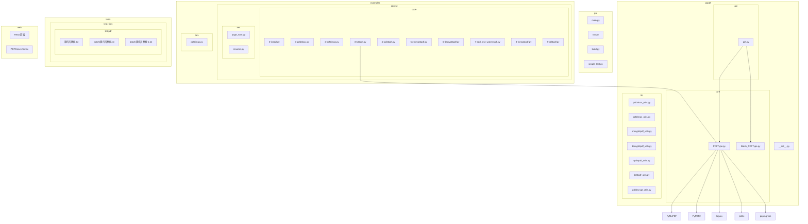
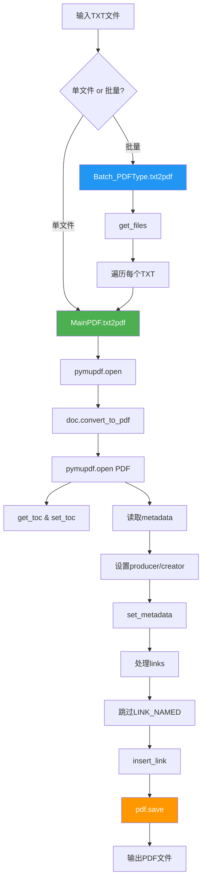
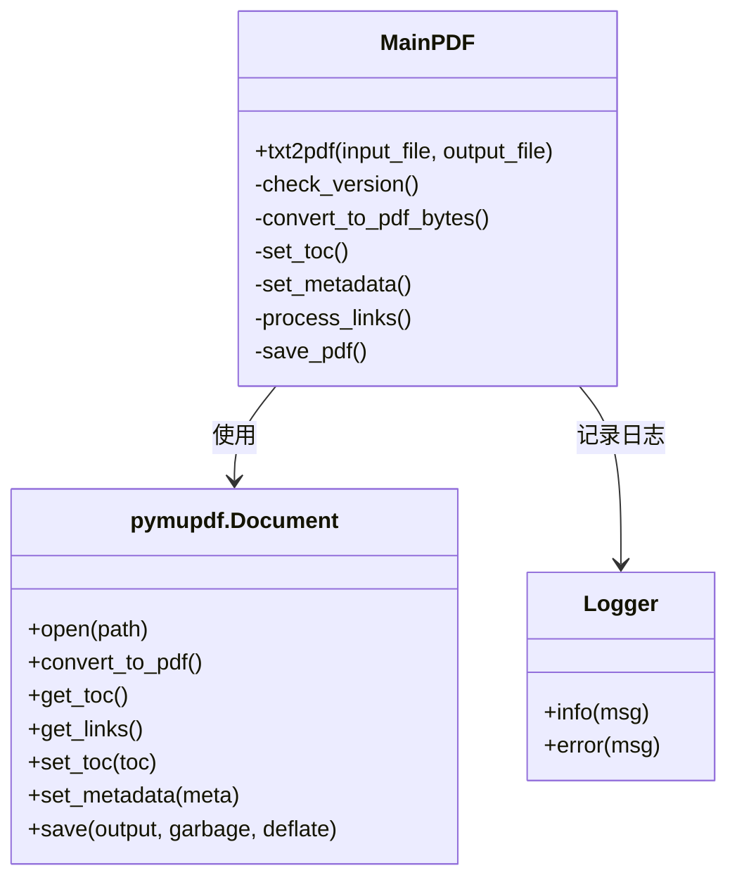
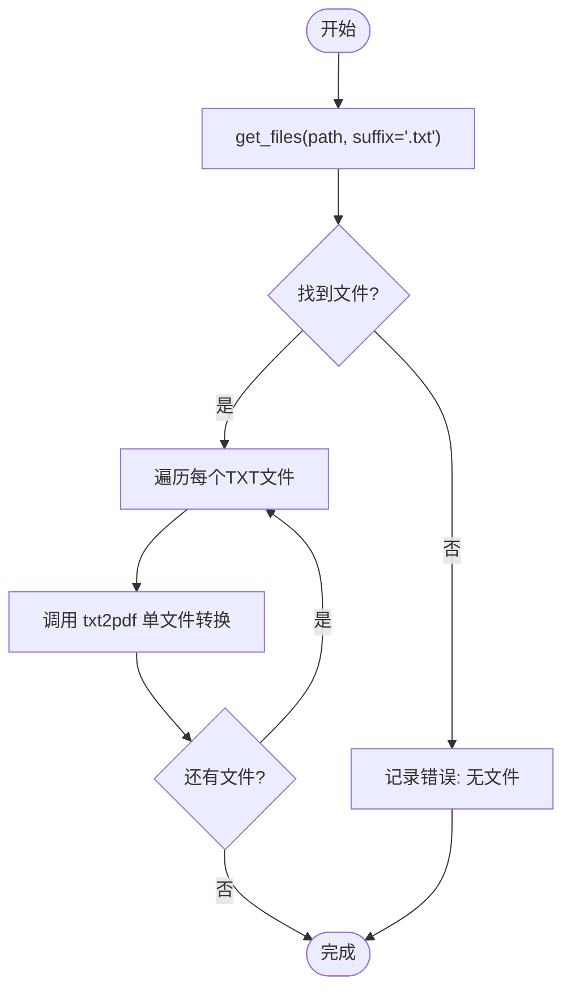
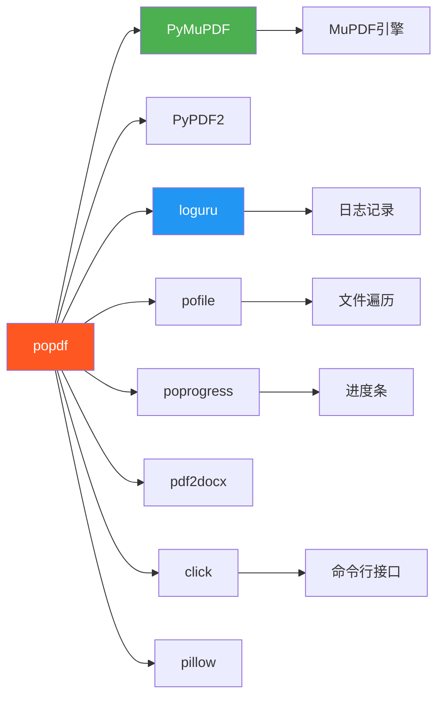

# TXT转PDF

<cite>
**本文档中引用的文件**   
- [3-txt2pdf.py](file://examples/course/code/3-txt2pdf.py)
- [PDFType.py](file://popdf/core/PDFType.py)
- [Batch_PDFType.py](file://popdf/core/Batch_PDFType.py)
- [pdf.py](file://popdf/api/pdf.py)
- [pdf2docx_utils.py](file://popdf/lib/pdf2docx_utils.py)
- [程序员晚枫.txt](file://tests/test_files/txt2pdf/程序员晚枫.txt)
</cite>

## 目录
1. [简介](#简介)
2. [项目结构](#项目结构)
3. [核心组件](#核心组件)
4. [架构概述](#架构概述)
5. [详细组件分析](#详细组件分析)
6. [依赖分析](#依赖分析)
7. [性能考虑](#性能考虑)
8. [故障排除指南](#故障排除指南)
9. [结论](#结论)

## 简介
本项目 `popdf` 是一个功能丰富的 PDF 处理工具包，支持多种文档格式转换与操作。其核心功能之一是将文本文件（TXT）转换为 PDF 格式，利用 PyMuPDF 库实现高质量的文档转换。该功能不仅支持单个文件转换，还提供批量处理能力，适用于自动化办公场景。系统设计注重元数据保留、目录结构继承和链接处理，并通过日志记录确保操作可追溯。此外，项目兼容中文内容处理，确保在多语言环境下稳定运行。

## 项目结构

**图示来源**
- [3-txt2pdf.py](file://examples/course/code/3-txt2pdf.py)
- [PDFType.py](file://popdf/core/PDFType.py)
- [Batch_PDFType.py](file://popdf/core/Batch_PDFType.py)
- [pdf.py](file://popdf/api/pdf.py)

**本节来源**
- [3-txt2pdf.py](file://examples/course/code/3-txt2pdf.py)
- [PDFType.py](file://popdf/core/PDFType.py)
- [Batch_PDFType.py](file://popdf/core/Batch_PDFType.py)

## 核心组件

`popdf` 的 TXT 转 PDF 功能主要由 `PDFType.py` 中的 `MainPDF.txt2pdf` 方法实现，支持单文件转换；而批量处理则由 `Batch_PDFType.py` 中的 `Batch_PDFType.txt2pdf` 方法完成。API 层通过 `pdf.py` 提供统一入口，用户可通过函数调用或命令行方式使用。整个流程基于 PyMuPDF 引擎进行文档解析与转换，确保输出 PDF 的兼容性与质量。系统自动处理元数据、目录结构（TOC）和链接信息，并跳过不支持的命名链接（named links），同时通过 `pofile.get_files` 实现高效的文件遍历。

**本节来源**
- [PDFType.py](file://popdf/core/PDFType.py#L36-L80)
- [Batch_PDFType.py](file://popdf/core/Batch_PDFType.py#L80-L126)
- [pdf.py](file://popdf/api/pdf.py#L72-L91)

## 架构概述

**图示来源**
- [PDFType.py](file://popdf/core/PDFType.py#L36-L80)
- [Batch_PDFType.py](file://popdf/core/Batch_PDFType.py#L80-L126)

## 详细组件分析

### 单文件转换分析

`MainPDF.txt2pdf` 方法负责将单个文本文件转换为 PDF。首先检查 PyMuPDF 版本是否满足最低要求（v1.14.0+），然后使用 `pymupdf.open` 打开输入文件。调用 `convert_to_pdf()` 方法将文档内容转换为 PDF 字节流，再通过 `pymupdf.open("pdf", b)` 创建 PDF 文档对象。系统会继承原始文档的目录结构（TOC）和元数据（metadata），并自动补充缺失的生产者（producer）和创建者（creator）信息。最后，保存时启用垃圾回收（garbage=4）和压缩（deflate=True）以优化文件大小。

#### 转换流程类图

**图示来源**
- [PDFType.py](file://popdf/core/PDFType.py#L36-L80)

**本节来源**
- [PDFType.py](file://popdf/core/PDFType.py#L36-L80)

### 批量转换分析

`Batch_PDFType.txt2pdf` 方法实现批量 TXT 转 PDF 功能。它依赖 `pofile.get_files` 函数递归查找指定目录下所有 `.txt` 后缀的文件。对每个找到的文本文件，调用 `MainPDF.txt2pdf` 进行转换，并根据输入文件名自动生成对应的 PDF 输出路径。此过程包含日志记录和异常处理机制，确保批量操作的稳定性。输出目录若不存在，系统会自动创建。

#### 批量处理流程图

**图示来源**
- [Batch_PDFType.py](file://popdf/core/Batch_PDFType.py#L80-L126)

**本节来源**
- [Batch_PDFType.py](file://popdf/core/Batch_PDFType.py#L80-L126)

### 元数据与目录处理

系统在转换过程中完整保留原始文档的元数据（metadata）和目录结构（TOC）。通过 `doc.get_toc()` 获取输入文档的目录信息，并使用 `pdf.set_toc(toc)` 将其应用到输出 PDF 中。对于元数据，系统读取 `doc.metadata` 并进行补充：若 `producer` 或 `creator` 字段为空，则分别设置为 `"PyMuPDF v{version}"` 和 `"PyMuPDF PDF converter"`。同时更新修改日期（modDate）和创建日期（creationDate）为当前时间，确保元数据的时效性。

**本节来源**
- [PDFType.py](file://popdf/core/PDFType.py#L49-L59)
- [Batch_PDFType.py](file://popdf/core/Batch_PDFType.py#L95-L105)

### 链接处理策略

转换过程中，系统会遍历每一页的链接信息（`pinput.get_links()`），并根据链接类型进行处理。目前实现中，所有 `LINK_NAMED` 类型的命名链接都会被跳过，并在日志中记录相关信息。其他类型的链接（如外部 URL 链接）则通过 `pout.insert_link(l)` 直接插入到输出 PDF 页面中。这一策略确保了基本链接功能的保留，同时避免了对复杂命名链接的支持问题。

**本节来源**
- [PDFType.py](file://popdf/core/PDFType.py#L61-L74)
- [Batch_PDFType.py](file://popdf/core/Batch_PDFType.py#L107-L119)

### 文本编码与中文支持

项目通过 PyMuPDF 内部机制自动处理文本编码问题。PyMuPDF 支持 UTF-8 编码的文本文件，包括带 BOM 的 UTF-8 文件。测试文件 `程序员晚枫.txt` 包含中文内容（如“小红书：程序员晚枫”），验证了系统对中文字符的正确显示能力。由于 PyMuPDF 底层使用 MuPDF 引擎，其对 Unicode 的良好支持确保了中文、日文、韩文等多语言文本在转换后的 PDF 中能够正常渲染。

**本节来源**
- [程序员晚枫.txt](file://tests/test_files/txt2pdf/程序员晚枫.txt)
- [PDFType.py](file://popdf/core/PDFType.py#L44)

## 依赖分析

**图示来源**
- [pyproject.toml](file://pyproject.toml)
- [PDFType.py](file://popdf/core/PDFType.py)
- [Batch_PDFType.py](file://popdf/core/Batch_PDFType.py)

**本节来源**
- [pyproject.toml](file://pyproject.toml)
- [setup.py](file://setup.py)

## 性能考虑

转换性能受多个因素影响。关键参数包括 `garbage` 和 `deflate`。`garbage=4` 启用最高级别的垃圾回收，可显著减小输出文件体积，但会增加处理时间。`deflate=True` 启用流压缩，进一步优化文件大小。对于大文件或批量处理，建议权衡文件大小与处理速度。此外，PyMuPDF 的版本要求（v1.14.0+）确保了对现代文档格式的支持和性能优化。使用 `simple_progress` 提供的进度条可提升用户体验，尤其在处理大量文件时。

**本节来源**
- [PDFType.py](file://popdf/core/PDFType.py#L76)
- [Batch_PDFType.py](file://popdf/core/Batch_PDFType.py#L122)

## 故障排除指南

常见问题包括：PyMuPDF 版本过低导致转换失败、输入路径无效、输出目录不可写等。系统通过日志（loguru）记录详细信息，便于排查。若遇到中文乱码，应确认文本文件为 UTF-8 编码。命名链接被跳过属于正常行为，无需处理。批量转换时若无反应，请检查 `get_files` 是否能正确识别 `.txt` 文件。建议使用示例文件进行测试验证。

**本节来源**
- [PDFType.py](file://popdf/core/PDFType.py#L39-L40)
- [pdf.py](file://popdf/api/pdf.py#L89-L90)

## 结论

`popdf` 的 TXT 转 PDF 功能基于 PyMuPDF 实现，具备完整的元数据保留、目录继承和链接处理能力。系统支持单文件与批量转换，通过清晰的 API 设计和良好的错误处理机制，为用户提供稳定可靠的文档转换服务。对中文内容的良好支持使其适用于中文办公环境。未来可扩展命名链接处理、自定义字体嵌入等功能，进一步提升实用性。