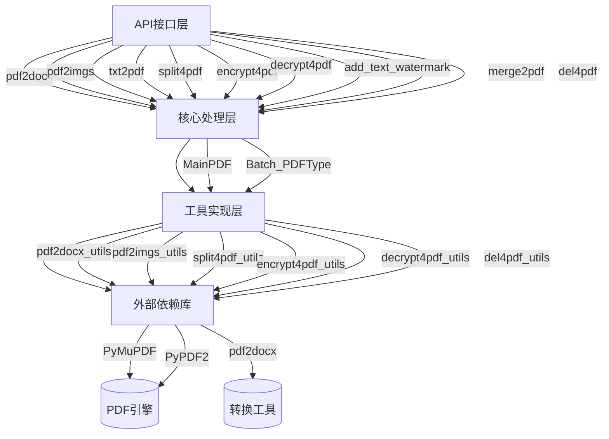
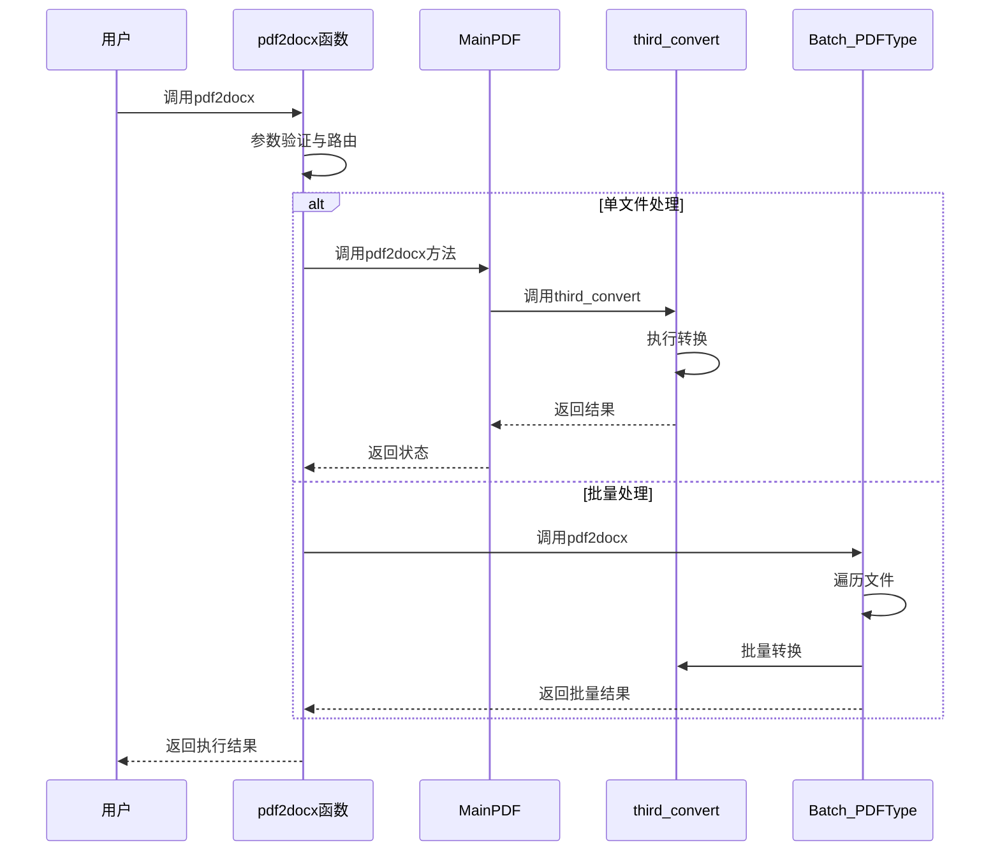
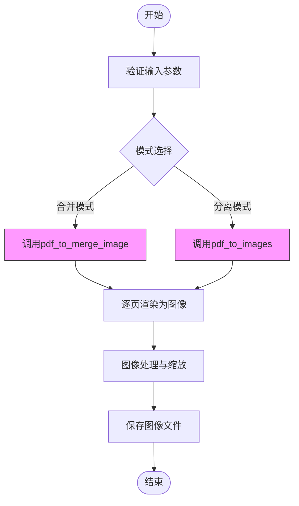
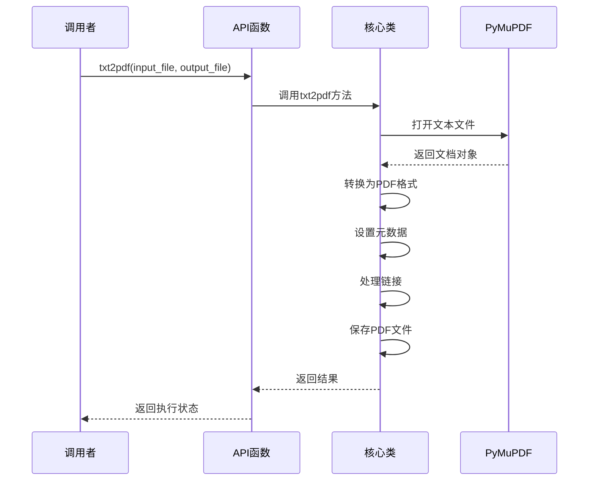
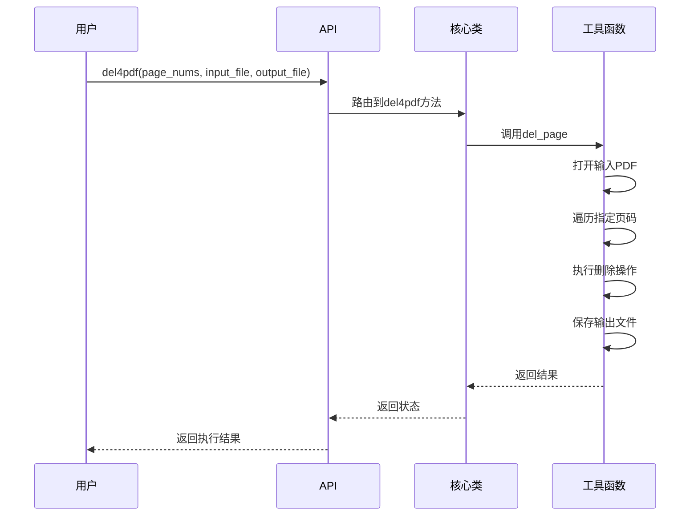
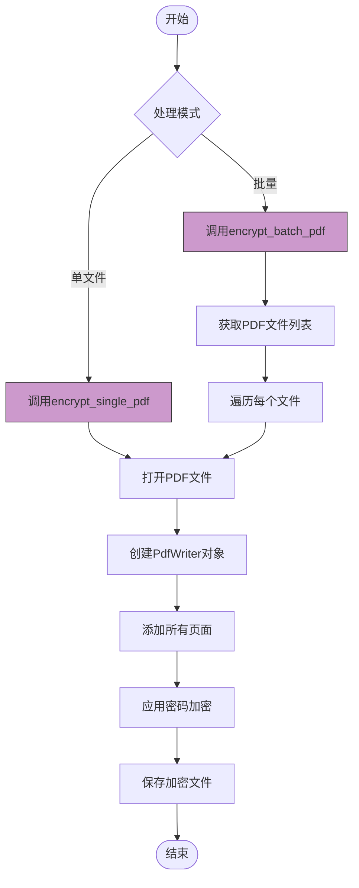
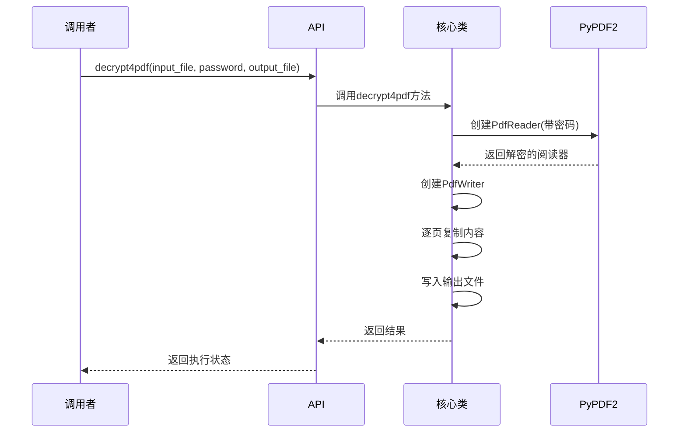
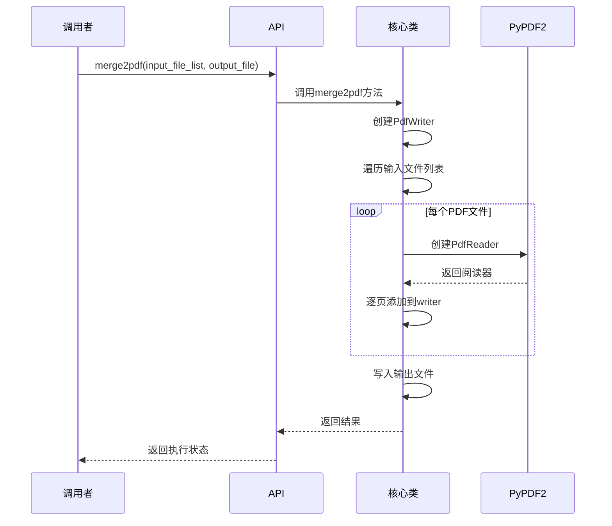

# 核心功能详解

<cite>
**本文档中引用的文件**  
- [pdf.py](file://popdf/api/pdf.py)
- [PDFType.py](file://popdf/core/PDFType.py)
- [Batch_PDFType.py](file://popdf/core/Batch_PDFType.py)
- [pdf2docx_utils.py](file://popdf/lib/pdf2docx_utils.py)
- [pdf2imgs_utils.py](file://popdf/lib/pdf2imgs_utils.py)
- [split4pdf_utils.py](file://popdf/lib/split4pdf_utils.py)
- [encrypt4pdf_utils.py](file://popdf/lib/encrypt4pdf_utils.py)
- [decrypt4pdf_utils.py](file://popdf/lib/decrypt4pdf_utils.py)
- [del4pdf_utils.py](file://popdf/lib/del4pdf_utils.py)
- [add_watermark_service.py](file://popdf/lib/pdf/add_watermark_service.py)
- [1-pdf2docx.py](file://examples/course/code/1-pdf2docx.py)
- [2-pdf2imgs.py](file://examples/course/code/2-pdf2imgs.py)
- [3-txt2pdf.py](file://examples/course/code/3-txt2pdf.py)
- [4-split4pdf.py](file://examples/course/code/4-split4pdf.py)
- [5-encrypt4pdf.py](file://examples/course/code/5-encrypt4pdf.py)
- [6-decrypt4pdf.py](file://examples/course/code/6-decrypt4pdf.py)
- [7-add_text_watermark.py](file://examples/course/code/7-add_text_watermark.py)
- [8-merge2pdf.py](file://examples/course/code/8-merge2pdf.py)
- [9-del4pdf.py](file://examples/course/code/9-del4pdf.py)
</cite>

## 目录
1. [简介](#简介)
2. [功能架构](#功能架构)
3. [PDF转换功能](#pdf转换功能)
   - [PDF转Word](#pdf转word)
   - [PDF转图片](#pdf转图片)
   - [TXT转PDF](#txt转pdf)
4. [PDF编辑功能](#pdf编辑功能)
   - [添加文本水印](#添加文本水印)
   - [删除页面](#删除页面)
5. [PDF安全功能](#pdf安全功能)
   - [PDF加密](#pdf加密)
   - [PDF解密](#pdf解密)
6. [PDF组织功能](#pdf组织功能)
   - [PDF分割](#pdf分割)
   - [PDF合并](#pdf合并)
7. [单文件与批量处理机制](#单文件与批量处理机制)
8. [使用示例与参数配置](#使用示例与参数配置)
9. [最佳实践建议](#最佳实践建议)

## 简介

popdf 是一个专为Python自动化办公设计的PDF操作库，提供全面的PDF处理功能。该库基于PyMuPDF和PyPDF2等成熟技术构建，支持从基础转换到高级编辑的多种操作。通过简洁的API设计，用户可以轻松实现PDF文件的各种自动化处理任务。

**Section sources**
- [README.md](file://README.md#L25-L28)

## 功能架构

popdf库采用分层架构设计，将功能分为API层、核心逻辑层和工具层。API层提供用户友好的函数接口，核心逻辑层管理单文件和批量处理的协调，工具层则封装具体的技术实现。



**Diagram sources**
- [pdf.py](file://popdf/api/pdf.py#L5-L9)
- [PDFType.py](file://popdf/core/PDFType.py#L19)
- [Batch_PDFType.py](file://popdf/core/Batch_PDFType.py#L16)

## PDF转换功能

### PDF转Word

PDF转Word功能基于pdf2docx库实现，能够将PDF文档准确转换为可编辑的Word文档。该功能适用于需要编辑PDF内容或将其集成到Word文档中的场景。

技术实现上，系统首先验证输入输出文件路径和格式，然后调用第三方转换器完成转换过程。支持单文件转换和批量转换两种模式。



**Diagram sources**
- [pdf.py](file://popdf/api/pdf.py#L17-L43)
- [PDFType.py](file://popdf/core/PDFType.py#L23-L27)
- [pdf2docx_utils.py](file://popdf/lib/pdf2docx_utils.py#L7-L23)

**Section sources**
- [pdf.py](file://popdf/api/pdf.py#L17-L43)
- [1-pdf2docx.py](file://examples/course/code/1-pdf2docx.py#L13-L16)

### PDF转图片

PDF转图片功能支持将PDF页面转换为高质量的JPEG图像。提供两种模式：单页分离模式和合并模式。分离模式将每页保存为独立图像，合并模式则将所有页面垂直拼接为单张长图。

技术实现使用PyMuPDF进行PDF渲染，通过矩阵缩放控制输出分辨率。默认缩放系数为1.333，可生成高分辨率图像。



**Diagram sources**
- [pdf.py](file://popdf/api/pdf.py#L45-L69)
- [pdf2imgs_utils.py](file://popdf/lib/pdf2imgs_utils.py#L10-L62)

**Section sources**
- [pdf.py](file://popdf/api/pdf.py#L45-L69)
- [2-pdf2imgs.py](file://examples/course/code/2-pdf2imgs.py#L12-L14)

### TXT转PDF

TXT转PDF功能利用PyMuPDF的强大文档转换能力，将纯文本文件转换为标准PDF格式。转换过程中保留原始文档的元数据和目录结构，确保输出质量。

该功能特别适用于将程序日志、配置文件或其他文本内容归档为PDF格式，便于分享和打印。



**Diagram sources**
- [pdf.py](file://popdf/api/pdf.py#L72-L90)
- [PDFType.py](file://popdf/core/PDFType.py#L36-L78)

**Section sources**
- [pdf.py](file://popdf/api/pdf.py#L72-L90)
- [3-txt2pdf.py](file://examples/course/code/3-txt2pdf.py#L12)

## PDF编辑功能

### 添加文本水印

添加文本水印功能允许用户在PDF文档的指定位置添加自定义文本水印。支持设置字体、字号、颜色等样式参数，满足不同场景的水印需求。

技术实现基于PyMuPDF的文本插入功能，遍历PDF每一页并在指定坐标位置插入水印文本。该功能常用于文档版权保护和状态标识。


**Diagram sources**
- [pdf.py](file://popdf/api/pdf.py#L154-L173)
- [PDFType.py](file://popdf/core/PDFType.py#L162-L174)

**Section sources**
- [pdf.py](file://popdf/api/pdf.py#L154-L173)
- [7-add_text_watermark.py](file://examples/course/code/7-add_text_watermark.py)

### 删除页面

删除页面功能支持从PDF文档中移除指定页码的页面。基于PyMuPDF实现，通过索引操作直接修改文档结构，效率高且保持文档完整性。

该功能适用于清理不需要的页面、创建文档摘要或准备演示文稿等场景。



**Diagram sources**
- [pdf.py](file://popdf/api/pdf.py#L183-L193)
- [del4pdf_utils.py](file://popdf/lib/del4pdf_utils.py#L7-L20)

**Section sources**
- [pdf.py](file://popdf/api/pdf.py#L183-L193)
- [9-del4pdf.py](file://examples/course/code/9-del4pdf.py)

## PDF安全功能

### PDF加密

PDF加密功能提供对PDF文档的密码保护，防止未授权访问。支持单文件加密和批量加密两种模式，使用PyPDF2库实现AES加密算法。

加密后的PDF需要输入正确密码才能打开，适用于保护敏感文档、商业合同等重要文件。



**Diagram sources**
- [pdf.py](file://popdf/api/pdf.py#L117-L123)
- [encrypt4pdf_utils.py](file://popdf/lib/encrypt4pdf_utils.py#L54-L83)

**Section sources**
- [pdf.py](file://popdf/api/pdf.py#L117-L123)
- [5-encrypt4pdf.py](file://examples/course/code/5-encrypt4pdf.py)

### PDF解密

PDF解密功能用于移除PDF文档的密码保护，将加密PDF转换为无密码的普通PDF文件。需要提供正确的解密密码才能成功执行。

该功能适用于需要共享加密文档或进行自动化处理的场景，确保文档可被后续流程正常使用。



**Diagram sources**
- [pdf.py](file://popdf/api/pdf.py#L126-L152)
- [PDFType.py](file://popdf/core/PDFType.py#L110-L125)

**Section sources**
- [pdf.py](file://popdf/api/pdf.py#L126-L152)
- [6-decrypt4pdf.py](file://examples/course/code/6-decrypt4pdf.py)

## PDF组织功能

### PDF分割

PDF分割功能允许用户从原始PDF中提取指定页码范围的内容，创建新的PDF文件。支持精确的页码控制，from_page和to_page参数定义了提取范围。

该功能常用于从长文档中提取章节、创建文档摘要或准备特定页面的副本。

```mermaid
flowchart LR
A[输入PDF] --> B[验证页码范围]
B --> C[调整索引(从0开始)]
C --> D[打开源文档]
D --> E[创建新文档]
E --> F[插入指定页面]
F --> G[保存新PDF]
G --> H[关闭文件流]
style B fill:#66ccff,stroke:#333
style C fill:#66ccff,stroke:#333
```

**Diagram sources**
- [pdf.py](file://popdf/api/pdf.py#L93-L114)
- [split4pdf_utils.py](file://popdf/lib/split4pdf_utils.py#L8-L38)

**Section sources**
- [pdf.py](file://popdf/api/pdf.py#L93-L114)
- [4-split4pdf.py](file://examples/course/code/4-split4pdf.py)

### PDF合并

PDF合并功能将多个PDF文件按指定顺序合并为单个PDF文档。使用PyPDF2库实现，逐页读取源文件并写入目标文件，保持页面顺序和内容完整性。

该功能适用于整合多个文档、创建综合报告或整理分散的PDF文件。



**Diagram sources**
- [pdf.py](file://popdf/api/pdf.py#L175-L181)
- [PDFType.py](file://popdf/core/PDFType.py#L130-L148)

**Section sources**
- [pdf.py](file://popdf/api/pdf.py#L175-L181)
- [8-merge2pdf.py](file://examples/course/code/8-merge2pdf.py)

## 单文件与批量处理机制

popdf库通过MainPDF和Batch_PDFType两个核心类实现了单文件与批量处理的分离。这种设计模式提高了代码的可维护性和扩展性。

```mermaid
classDiagram
class MainPDF {
+pdf_suffix : str
+pdf2docx(input_file, output_file)
+pdf2imgs(input_file, output_file, merge)
+txt2pdf(input_file, output_file)
+split4pdf(input_file, output_file, from_page, to_page)
+encrypt4pdf(password, input_file, output_file)
+decrypt4pdf(input_file, password, output_file)
+add_watermark(input_file, point, text, output_file, fontname, fontsize, color)
+merge2pdf(input_file_list, output_file)
+del4pdf(page_nums, input_file, output_file)
}
class Batch_PDFType {
+pdf_suffix : str
+docx_suffix : str
+pdf2docx(input_path, output_path)
+pdf2imgs(input_path, output_path, merge)
+txt2pdf(input_path, output_path)
+split4pdfs(input_path, output_path, from_page, to_page)
+pdf2decryptBatch(input_path, output_path, password)
+del4pdf(page_nums, input_path, output_path)
}
MainPDF <|-- Batch_PDFType : 继承
MainPDF : 单文件处理
Batch_PDFType : 批量处理
note right of MainPDF
负责单个PDF文件的处理
提供具体的功能实现
end note
note left of Batch_PDFType
负责批量PDF文件的处理
复用单文件处理逻辑
通过文件遍历实现批量操作
end note
```

**Diagram sources**
- [PDFType.py](file://popdf/core/PDFType.py#L19-179)
- [Batch_PDFType.py](file://popdf/core/Batch_PDFType.py#L16-142)

**Section sources**
- [PDFType.py](file://popdf/core/PDFType.py#L19-179)
- [Batch_PDFType.py](file://popdf/core/Batch_PDFType.py#L16-142)

## 使用示例与参数配置

popdf库提供了清晰的参数配置方案，通过统一的参数命名规则简化使用。主要参数包括：

| 参数名称 | 说明 | 使用场景 |
|--------|------|--------|
| input_file | 单个输入文件路径 | 单文件处理 |
| output_file | 单个输出文件路径 | 单文件处理 |
| input_path | 输入目录路径 | 批量处理 |
| output_path | 输出目录路径 | 批量处理 |
| page_nums | 页面编号列表 | 删除页面 |
| from_page | 起始页码 | 分割PDF |
| to_page | 结束页码 | 分割PDF |
| password | 密码 | 加密/解密 |
| merge | 合并模式开关 | PDF转图片 |

使用时需注意参数的互斥性：单文件参数(input_file/output_file)与批量参数(input_path/output_path)不能同时使用。

**Section sources**
- [pdf.py](file://popdf/api/pdf.py#L17-L194)

## 最佳实践建议

1. **路径处理**：始终使用绝对路径或确保相对路径正确，避免文件找不到的错误
2. **错误处理**：检查函数返回值，及时处理异常情况
3. **资源管理**：大文件处理时注意内存使用，及时释放资源
4. **版本兼容**：确保PyMuPDF版本满足最低要求(v1.14.0+)
5. **批量处理**：批量操作时合理设置输出目录，避免文件覆盖
6. **安全性**：加密功能使用强密码，妥善保管解密密码
7. **性能优化**：大量文件处理时考虑并行化或分批处理

**Section sources**
- [README.md](file://README.md#L56-L72)
- [PDFType.py](file://popdf/core/PDFType.py#L39-L40)