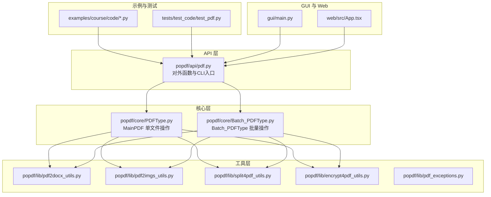
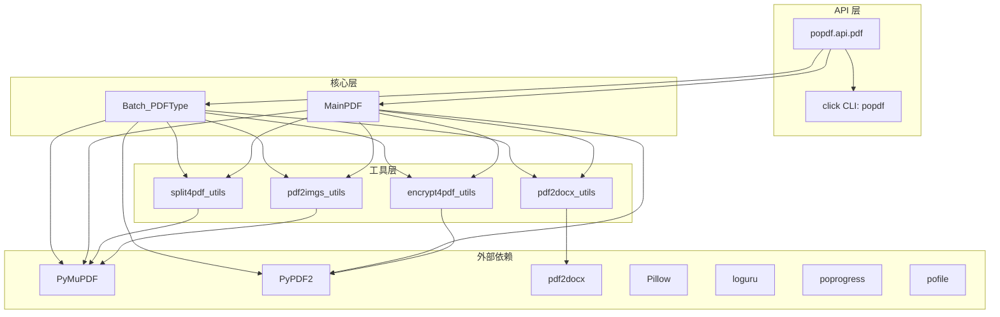
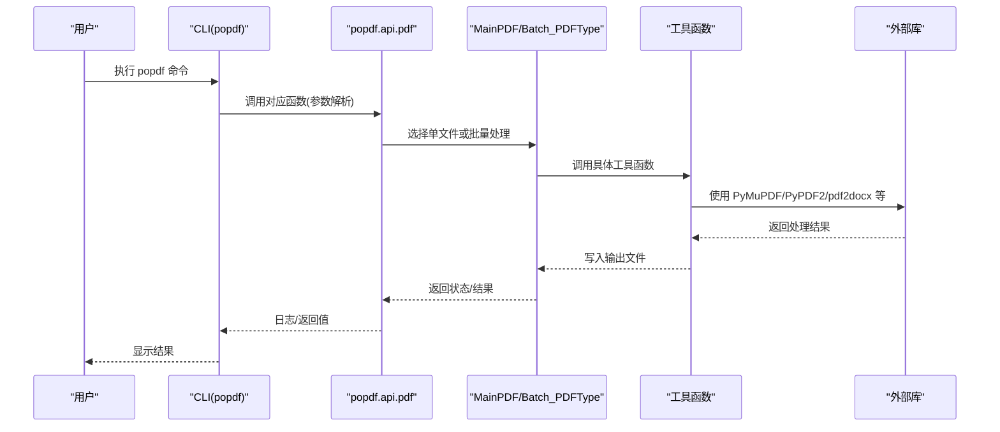
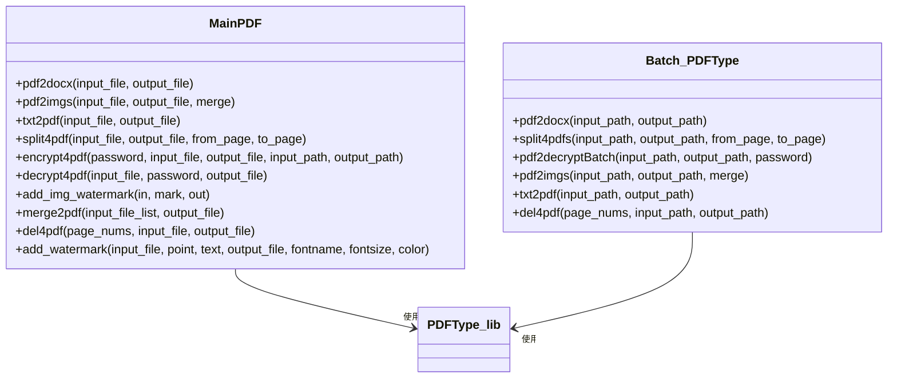
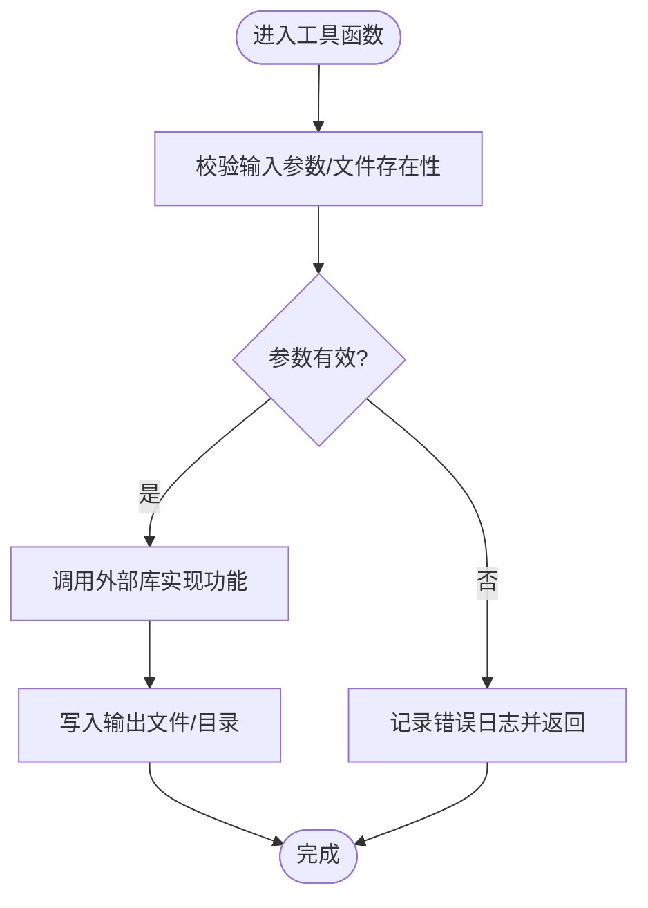
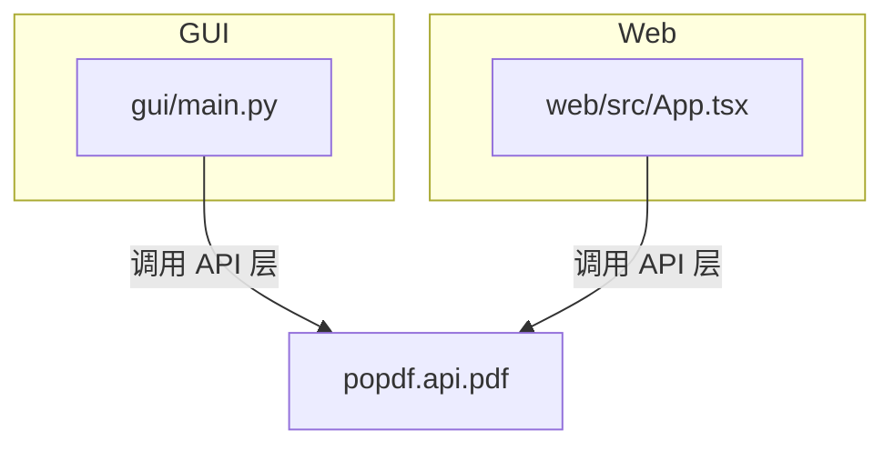
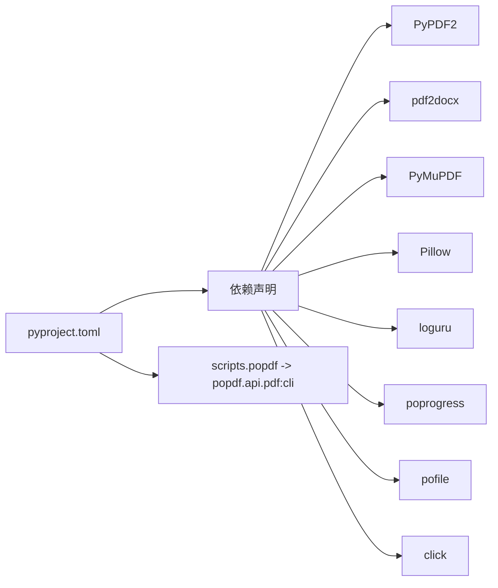

# 项目概述

<cite>
**本文引用的文件**
- [README.md](file://README.md)
- [pyproject.toml](file://pyproject.toml)
- [setup.py](file://setup.py)
- [popdf/__init__.py](file://popdf/__init__.py)
- [popdf/api/pdf.py](file://popdf/api/pdf.py)
- [popdf/core/PDFType.py](file://popdf/core/PDFType.py)
- [popdf/core/Batch_PDFType.py](file://popdf/core/Batch_PDFType.py)
- [popdf/lib/pdf2docx_utils.py](file://popdf/lib/pdf2docx_utils.py)
- [popdf/lib/pdf2imgs_utils.py](file://popdf/lib/pdf2imgs_utils.py)
- [popdf/lib/split4pdf_utils.py](file://popdf/lib/split4pdf_utils.py)
- [popdf/lib/encrypt4pdf_utils.py](file://popdf/lib/encrypt4pdf_utils.py)
- [popdf/lib/pdf_exceptions.py](file://popdf/lib/pdf_exceptions.py)
- [gui/main.py](file://gui/main.py)
- [web/src/App.tsx](file://web/src/App.tsx)
- [examples/course/code/1-pdf2docx.py](file://examples/course/code/1-pdf2docx.py)
- [examples/course/code/2-pdf2imgs.py](file://examples/course/code/2-pdf2imgs.py)
- [tests/test_code/test_pdf.py](file://tests/test_code/test_pdf.py)
</cite>

## 目录
1. [简介](#简介)
2. [项目结构](#项目结构)
3. [核心组件](#核心组件)
4. [架构总览](#架构总览)
5. [详细组件分析](#详细组件分析)
6. [依赖关系分析](#依赖关系分析)
7. [性能与可用性考量](#性能与可用性考量)
8. [故障排查指南](#故障排查指南)
9. [结论](#结论)
10. [附录](#附录)

## 简介
popdf 是面向 Python 自动化办公场景的 PDF 处理第三方库，专注于提供易用、稳定的 PDF 转换与编辑能力。项目围绕“API 层—核心层—工具层”的分层设计，结合 PyMuPDF、PyPDF2、pdf2docx 等关键依赖，覆盖 PDF 转 Word、PDF 转图片、TXT 转 PDF、按页切割、加密/解密、添加水印、合并、删除页面等常用办公自动化任务。项目同时提供命令行工具、桌面 GUI 和 Web 前端，满足不同用户群体的使用需求。

- 官方网站与课程资源：[项目官网](https://www.python-office.com/)
- 社区与交流群：README 中提供了官方交流群二维码与多平台链接
- 生态与参考：README 提供了 PyMuPDF、click、pdf2docx 等参考文档链接

**章节来源**
- file://README.md#L1-L124

## 项目结构
项目采用模块化分层组织：
- API 层：对外暴露统一的函数接口与命令行入口，负责参数校验与流程编排
- 核心层：封装单文件与批处理两类 PDF 操作类，协调底层工具实现具体功能
- 工具层：封装各功能的底层实现（如转换、切割、加密、水印等），复用公共逻辑
- 示例与测试：examples 提供教学与使用示例；tests 提供单元测试
- GUI 与 Web：提供桌面 GUI 与前端界面，便于非技术用户使用
- 构建与发布：pyproject.toml 定义依赖与脚本入口，setup.py 作为构建入口

**图表来源**
- [popdf/api/pdf.py](file://popdf/api/pdf.py#L1-L235)
- [popdf/core/PDFType.py](file://popdf/core/PDFType.py#L1-L180)
- [popdf/core/Batch_PDFType.py](file://popdf/core/Batch_PDFType.py#L1-L142)
- [popdf/lib/pdf2docx_utils.py](file://popdf/lib/pdf2docx_utils.py#L1-L23)
- [popdf/lib/pdf2imgs_utils.py](file://popdf/lib/pdf2imgs_utils.py#L1-L62)
- [popdf/lib/split4pdf_utils.py](file://popdf/lib/split4pdf_utils.py#L1-L38)
- [popdf/lib/encrypt4pdf_utils.py](file://popdf/lib/encrypt4pdf_utils.py#L1-L83)
- [gui/main.py](file://gui/main.py#L1-L800)
- [web/src/App.tsx](file://web/src/App.tsx#L1-L47)

**章节来源**
- file://README.md#L56-L124
- file://pyproject.toml#L1-L35

## 核心组件
- API 层函数：提供统一的 pdf2docx、pdf2imgs、txt2pdf、split4pdf、encrypt4pdf、decrypt4pdf、add_text_watermark、merge2pdf、del4pdf 等接口，兼容单文件与批量两种调用方式
- CLI 入口：通过 click 注册 popdf 命令，便于命令行快速执行
- 核心类：
  - MainPDF：封装单文件 PDF 操作，如转换、切割、加密/解密、合并、删除页面、添加文本水印等
  - Batch_PDFType：封装批量 PDF 操作，遍历目录并调用对应工具函数
- 工具函数：
  - pdf2docx_utils：调用 pdf2docx 实现 PDF 到 Word 的转换
  - pdf2imgs_utils：基于 PyMuPDF 将 PDF 转为图片或合并为单张图片
  - split4pdf_utils：基于 PyMuPDF 实现按页范围切割 PDF
  - encrypt4pdf_utils：基于 PyPDF2 实现 PDF 加密/解密
  - pdf_exceptions：集中定义 PDF 相关异常类型

**章节来源**
- file://popdf/api/pdf.py#L1-L235
- file://popdf/core/PDFType.py#L1-L180
- file://popdf/core/Batch_PDFType.py#L1-L142
- file://popdf/lib/pdf2docx_utils.py#L1-L23
- file://popdf/lib/pdf2imgs_utils.py#L1-L62
- file://popdf/lib/split4pdf_utils.py#L1-L38
- file://popdf/lib/encrypt4pdf_utils.py#L1-L83
- file://popdf/lib/pdf_exceptions.py

## 架构总览
popdf 的整体架构遵循“API 层—核心层—工具层”的分层设计：
- API 层负责对外接口与 CLI，统一参数校验与流程编排
- 核心层将单文件与批量两类操作抽象为 MainPDF 与 Batch_PDFType，降低重复逻辑
- 工具层将具体功能下沉为独立模块，便于维护与扩展
- GUI 与 Web 通过调用 API 层实现可视化操作，测试与示例验证功能正确性

**图表来源**
- [popdf/api/pdf.py](file://popdf/api/pdf.py#L1-L235)
- [popdf/core/PDFType.py](file://popdf/core/PDFType.py#L1-L180)
- [popdf/core/Batch_PDFType.py](file://popdf/core/Batch_PDFType.py#L1-L142)
- [popdf/lib/pdf2docx_utils.py](file://popdf/lib/pdf2docx_utils.py#L1-L23)
- [popdf/lib/pdf2imgs_utils.py](file://popdf/lib/pdf2imgs_utils.py#L1-L62)
- [popdf/lib/split4pdf_utils.py](file://popdf/lib/split4pdf_utils.py#L1-L38)
- [popdf/lib/encrypt4pdf_utils.py](file://popdf/lib/encrypt4pdf_utils.py#L1-L83)
- [pyproject.toml](file://pyproject.toml#L14-L23)

## 详细组件分析

### API 层：对外接口与 CLI
- 统一函数：pdf2docx、pdf2imgs、txt2pdf、split4pdf、encrypt4pdf、decrypt4pdf、add_text_watermark、merge2pdf、del4pdf
- 参数兼容：支持 input_file/input_path 与 output_file/output_path 的组合，兼容历史版本参数命名
- CLI：注册 popdf 命令，便于命令行快速执行

**图表来源**
- [popdf/api/pdf.py](file://popdf/api/pdf.py#L1-L235)
- [popdf/core/PDFType.py](file://popdf/core/PDFType.py#L1-L180)
- [popdf/core/Batch_PDFType.py](file://popdf/core/Batch_PDFType.py#L1-L142)
- [popdf/lib/pdf2docx_utils.py](file://popdf/lib/pdf2docx_utils.py#L1-L23)
- [popdf/lib/pdf2imgs_utils.py](file://popdf/lib/pdf2imgs_utils.py#L1-L62)
- [popdf/lib/split4pdf_utils.py](file://popdf/lib/split4pdf_utils.py#L1-L38)
- [popdf/lib/encrypt4pdf_utils.py](file://popdf/lib/encrypt4pdf_utils.py#L1-L83)

**章节来源**
- file://popdf/api/pdf.py#L1-L235
- file://pyproject.toml#L31-L33

### 核心层：MainPDF 与 Batch_PDFType
- MainPDF：单文件操作的统一入口，封装转换、切割、加密/解密、合并、删除页面、添加文本水印等
- Batch_PDFType：批量操作的统一入口，遍历目录并调用对应工具函数，支持进度与日志

**图表来源**
- [popdf/core/PDFType.py](file://popdf/core/PDFType.py#L1-L180)
- [popdf/core/Batch_PDFType.py](file://popdf/core/Batch_PDFType.py#L1-L142)

**章节来源**
- file://popdf/core/PDFType.py#L1-L180
- file://popdf/core/Batch_PDFType.py#L1-L142

### 工具层：功能实现模块
- pdf2docx_utils：调用 pdf2docx 实现 PDF 到 Word 的转换，含输入/输出校验与日志
- pdf2imgs_utils：基于 PyMuPDF 将 PDF 转为图片或合并为单张图片，支持 DPI 控制与进度提示
- split4pdf_utils：基于 PyMuPDF 实现按页范围切割 PDF，含边界检查与输出目录创建
- encrypt4pdf_utils：基于 PyPDF2 实现单文件与批量加密/解密，含输出目录创建与错误处理
- pdf_exceptions：集中定义 PDF 异常类型，便于统一捕获与处理

**图表来源**
- [popdf/lib/pdf2docx_utils.py](file://popdf/lib/pdf2docx_utils.py#L1-L23)
- [popdf/lib/pdf2imgs_utils.py](file://popdf/lib/pdf2imgs_utils.py#L1-L62)
- [popdf/lib/split4pdf_utils.py](file://popdf/lib/split4pdf_utils.py#L1-L38)
- [popdf/lib/encrypt4pdf_utils.py](file://popdf/lib/encrypt4pdf_utils.py#L1-L83)
- [popdf/lib/pdf_exceptions.py]

**章节来源**
- file://popdf/lib/pdf2docx_utils.py#L1-L23
- file://popdf/lib/pdf2imgs_utils.py#L1-L62
- file://popdf/lib/split4pdf_utils.py#L1-L38
- file://popdf/lib/encrypt4pdf_utils.py#L1-L83
- file://popdf/lib/pdf_exceptions.py

### GUI 与 Web：可视化入口
- GUI：基于 PySide6 的桌面应用，提供 PDF 转 Word、转图片、TXT 转 PDF、分割、加密/解密、添加水印、合并、删除页面等功能的图形界面
- Web：React 前端应用，提供文件上下文管理与主内容区域，便于在浏览器中进行 PDF 处理

**图表来源**
- [gui/main.py](file://gui/main.py#L1-L800)
- [web/src/App.tsx](file://web/src/App.tsx#L1-L47)
- [popdf/api/pdf.py](file://popdf/api/pdf.py#L1-L235)

**章节来源**
- file://gui/main.py#L1-L800
- file://web/src/App.tsx#L1-L47

### 示例与测试：使用与验证
- 示例：examples/course/code 下提供 PDF 转 Word、PDF 转图片等使用示例
- 测试：tests/test_code/test_pdf.py 覆盖多种操作的单测与批量测试，确保功能稳定

**章节来源**
- file://examples/course/code/1-pdf2docx.py#L1-L35
- file://examples/course/code/2-pdf2imgs.py#L1-L27
- file://tests/test_code/test_pdf.py#L1-L242

## 依赖关系分析
- 构建与运行依赖：PyPDF2、pdf2docx、PyMuPDF、Pillow、loguru、poprogress、pofile、click
- CLI 入口：pyproject.toml 中定义 popdf 脚本入口，指向 popdf.api.pdf:cli
- 版本与元信息：pyproject.toml 定义版本、许可证、作者与主页链接

**图表来源**
- [pyproject.toml](file://pyproject.toml#L14-L33)

**章节来源**
- file://pyproject.toml#L1-L35
- file://setup.py#L1-L14

## 性能与可用性考量
- 图片导出质量：pdf2imgs_utils 支持 DPI 调整与合并为单张图片，兼顾清晰度与体积
- 批处理效率：Batch_PDFType 使用进度提示与目录遍历，提升批量处理体验
- 外部库选择：PyMuPDF 用于高质量渲染与页面级操作，PyPDF2 用于加密/解密与页级读写，pdf2docx 用于高保真转换
- 错误处理：工具层与核心层均包含日志记录与错误返回，便于定位问题
- 可靠性：README 提供安装与使用说明，示例与测试保障基本功能稳定

[本节为通用指导，无需特定文件来源]

## 故障排查指南
- 参数错误：API 层对参数进行校验并记录错误日志，检查 input_file/input_path 与 output_file/output_path 是否匹配
- 版本依赖：确认 PyMuPDF 版本满足最低要求（如 txt2pdf 需要 v1.14.0+）
- 权限与路径：确保输入文件存在且输出目录可写
- 加密/解密：确认密码正确，PyPDF2 会根据密码读取受保护 PDF
- GUI/Web：若界面无响应，检查日志输出与网络连接（Web 前端）

**章节来源**
- file://popdf/api/pdf.py#L1-L235
- file://popdf/core/PDFType.py#L1-L180
- file://popdf/lib/pdf2docx_utils.py#L1-L23
- file://popdf/lib/pdf2imgs_utils.py#L1-L62
- file://popdf/lib/split4pdf_utils.py#L1-L38
- file://popdf/lib/encrypt4pdf_utils.py#L1-L83

## 结论
popdf 以清晰的分层架构与完善的工具模块，为 Python 自动化办公提供了稳定、易用的 PDF 处理能力。通过统一的 API 接口、CLI、GUI 与 Web 前端，popdf 覆盖了从转换到编辑的常见办公场景，适合初学者快速上手与高级用户深度定制。建议在生产环境中关注依赖版本、日志与错误处理，并结合示例与测试逐步扩展业务逻辑。

[本节为总结性内容，无需特定文件来源]

## 附录
- 安装与使用：README 提供 pip 安装与源码安装说明
- 功能清单：README 列举了 PDF 转 Word、转图片、TXT 转 PDF、按页切割、加密/解密、加水印、合并、删除页面等
- 社区与贡献：README 提供 issue 与 PR 流程说明，欢迎参与开源贡献

**章节来源**
- file://README.md#L32-L124